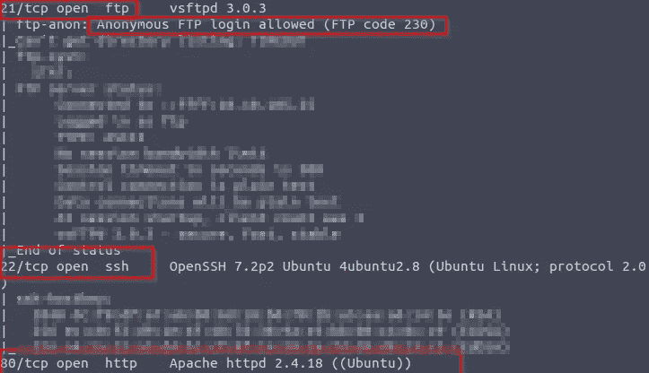
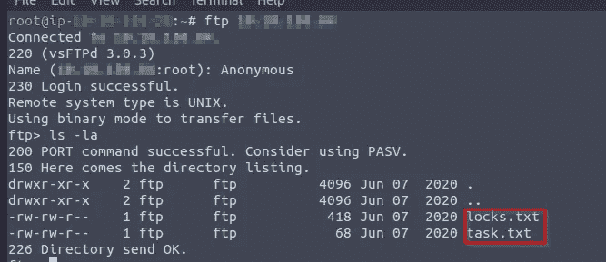
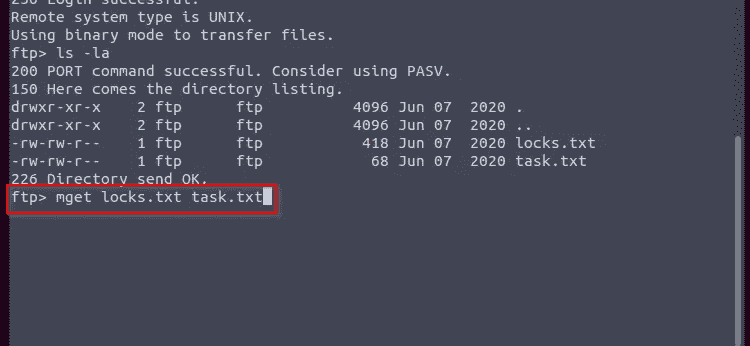
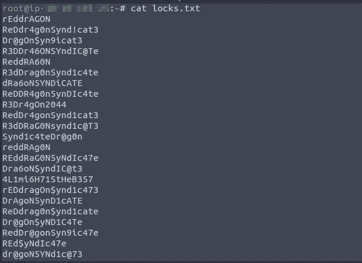
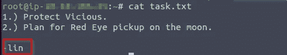
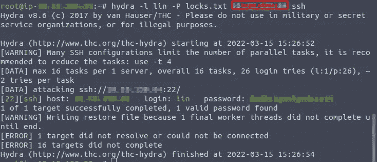
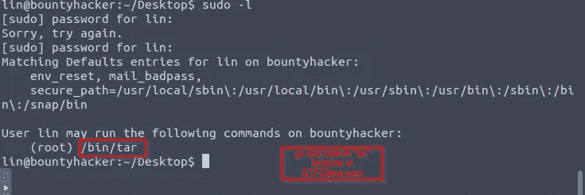
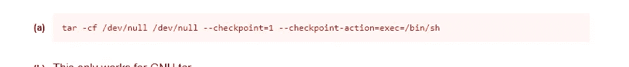
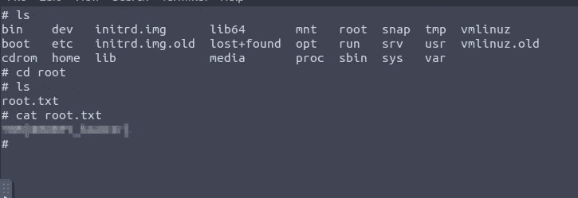

# 赏金黑客 Tryhackme

> 原文：<https://infosecwriteups.com/bounty-hacker-tryhackme-97a02bb16e93?source=collection_archive---------1----------------------->

## CTF 报道

欢迎回来，了不起的黑客们我在 TryHackme 上又想到了一篇 CTF 的文章。

照片由 [Unsplash](https://unsplash.com?utm_source=medium&utm_medium=referral) 上的[静止不动](https://unsplash.com/@stillnes_in_motion?utm_source=medium&utm_medium=referral)

首先，我开始扫描目标，看是否有任何感兴趣的服务和端口被暴露以进入系统。

我发现三个端口打开了。

22，21，80 被打开

于是我开始用“FTP target-IP”进入 FTP。

进入 FTP 后，我发现两个文本文件是“locks.txt”和“task.txt”。

我查看了 **locks.txt** 和 **task.txt.** 中的内容

从这两个文本文件中，我找到了受 ssh 保护的用户“lin ”,因此我决定使用“locks.txt”进行暴力破解。我找到了“lin”用户的密码。

> 通过 **ssh 以**林**的身份登录后，我发现了 **user.txt** 。**对于 **root** 登录权限，我使用“sudo -l”

> 以获得 root 登录的任何帮助或提示。

我输入焦油二进制 GTFObins.com 绕过 **sudo** 根登录。我找到了一个命令。

我希望你有一些知识来完成这篇文章。以后请关注我更多的文章。