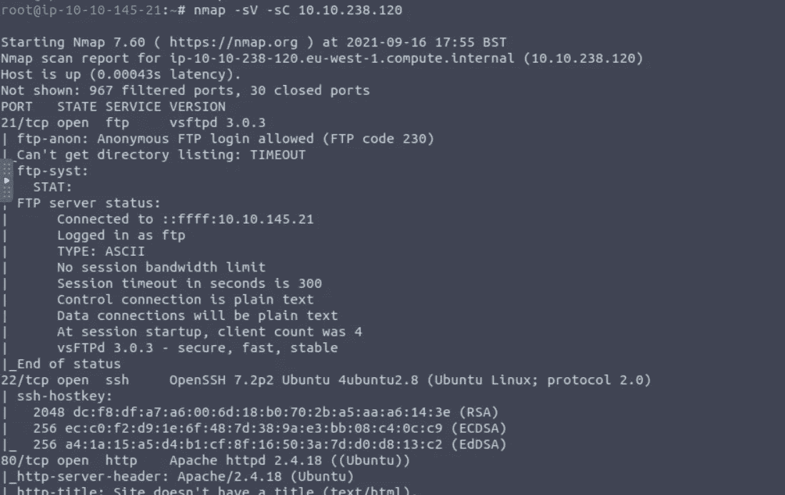
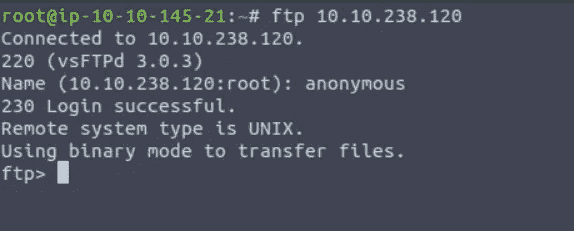
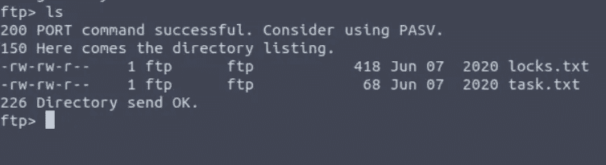
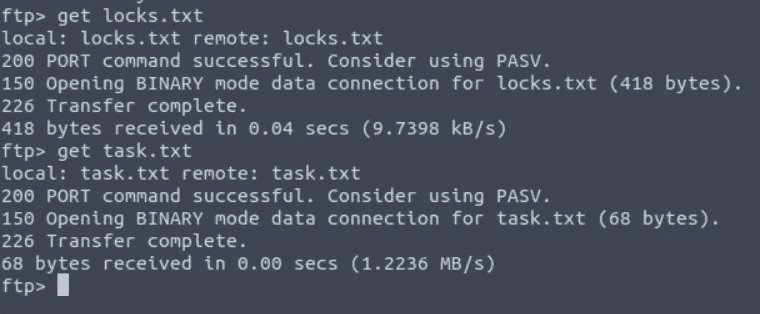
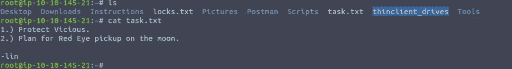
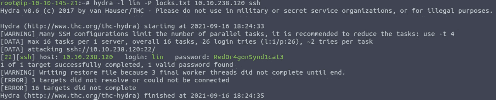
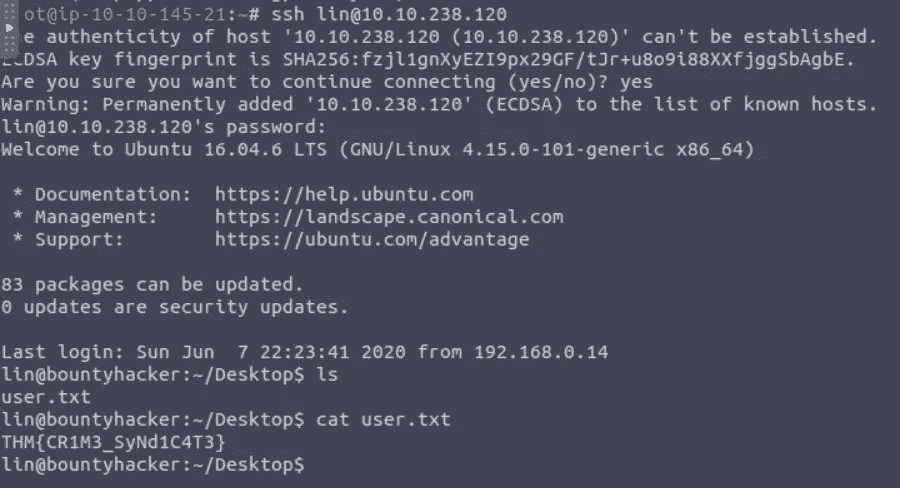
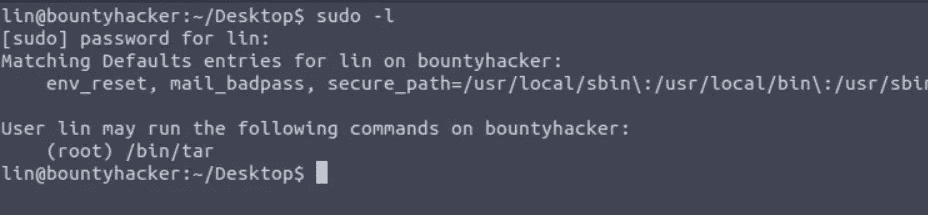
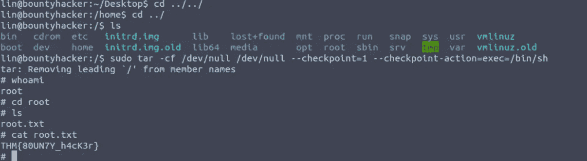

# 赏金黑客 Tryhackme 演练

> 原文：<https://infosecwriteups.com/bounty-hacker-tryhackme-walkthrough-8f8e0c65827d?source=collection_archive---------3----------------------->

大家好，欢迎回来，Ayush 这边，今天我们将谈论 tryhackme 房间中的一个“赏金黑客”，这是一个非常简单的房间，在这里您将了解 ftp、hydra 工具以及如何在 tar 命令的帮助下进行权限提升。所以，不浪费时间，让我们开始吧。


## **找到机器上打开的端口。**

首先，我们需要在我们的目标机器上找到开放的端口，但是如果你是初学者，你会想到什么是端口或端口号，对于他们来说，这里有一个关于端口号的小解释。

> **端口:**端口是唯一的号码，分配给运行在您系统上的许多服务，以便在网络上识别它们。例如，您的 firefox 浏览器运行在端口 5543 上。
> 
> 要检查哪些端口正在 windows 系统上运行，只需以管理员身份运行 cmd 并运行以下命令:
> 
> **netstat -b**

现在来看问题，找到开放端口，为此我们将使用 nmap 工具，该工具用于端口扫描，帮助我们找到所有开放端口，让我们看看我们的目标上有哪些开放端口。

nmap -sV -sT -sU -A 目标 ip

*   sV:这个标志/选项用于版本检测。
*   -sT: TCP 端口扫描
*   -sU: UDP 端口扫描
*   -答:操作系统检测

但是这里-sV 足以找到需要升级的开放端口和服务，所以让我们这样做:

nmap -sV -sC 目标 ip



在这里，您可以看到 21、22、80 端口处于打开状态，那么为什么不使用 ftp 连接目标计算机呢？因为允许匿名登录，这意味着任何人都可以使用 ftp 连接服务器，所以让我们开始吧。

> 注意:FTP 是一种运行在端口 21 上的文件传输协议，用于通过端口 21 在网络中的客户端和服务器之间传输计算机文件。



在这里你可以看到我们已经访问了 ftp 服务器，让我们看看有哪些文件，只需输入 ls 命令。



在这里你可以我们有两个文件，要在你的系统上获取这个文件只需输入**获取文件名。**



现在输入 exit 命令，让我们读取这两个文件，以获得是谁编写了任务列表的答案。



这里你可以看到作者的名字是林

**Q2 谁写的任务单？**

**安林**

**Q3 您可以使用找到的文本文件强制执行什么服务？**

嘘

**Q4 用户密码是什么？**

为此，我们将借助 lock.txt 单词表和 hydra 工具强制用户输入密码。



现在我们有了密码，是时候用 ssh 连接到目标了。

**user.txt**



现在我们有了 user.txt 标志，现在我们必须找到 root.txt，为此，我们首先检查我们有什么权限，我们可以作为 root 执行什么操作。

为此只需输入 **sudo -l**



**root.txt**

在这里您可以看到，我们拥有 tar 命令的 root 权限。

在那之后，我搜索了我们如何利用 tar 命令，然后我从 gtfobins 得到了这个。

```
sudo tar -cf /dev/null /dev/null --checkpoint=1 --checkpoint-action=exec=/bin/sh
```

现在我输入了 whoami，然后 bang 获得了 root 权限。



祝贺你，我们终于解决了实验室，非常感谢你的时间，如果你喜欢这篇文章，你觉得是他；pful 那么请分享给你的朋友并鼓掌！！！

你可以在推特上关注我:[https://twitter.com/3xabyt3_](https://twitter.com/3xabyt3_)

insta gram:【https://instagram.com/_3xabyt3_ 

所以，我们会在下一篇文章中见面，直到现在再见，祝黑客快乐！