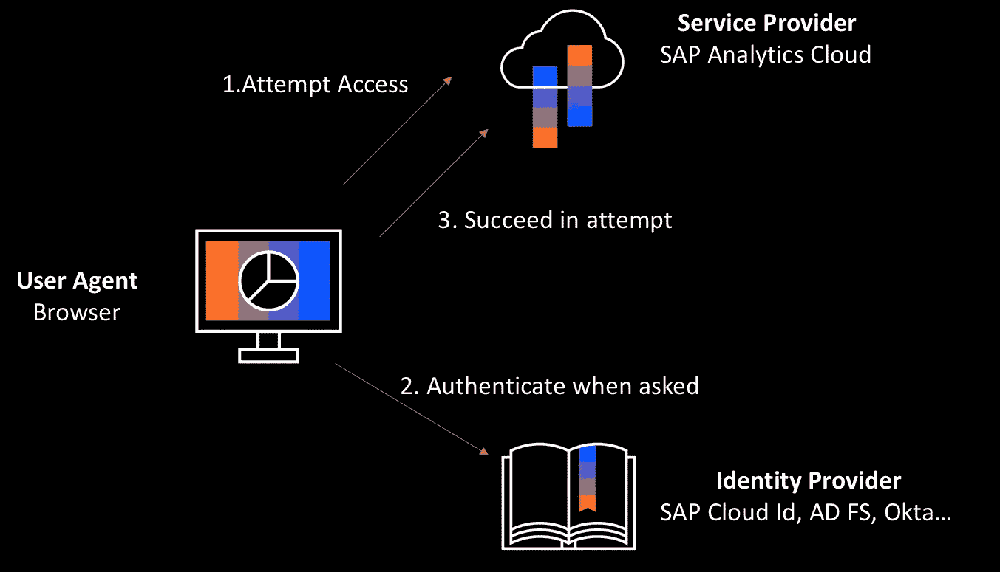

# 赏金提示:如何在 SAML 中绕过授权！

> 原文：<https://infosecwriteups.com/bounty-tip-how-to-bypass-authorization-in-saml-f7577a6541c4?source=collection_archive---------1----------------------->

安全声明标记语言(SAML)是一种基于 XML 的开放标准，用于在流程各方之间交换身份验证和授权数据。漏洞受各种 SSO 提供者和多个使用 SAML SSO(单点登录)的库的决策的影响。



(安全断言标记语言)SAML

> 使用 SAML 协议，用户只需一个用户名和密码就可以访问许多云应用程序。单点登录(SSO)是一种常见的技术，它允许您通过“第三方”作为第三方 web 应用程序登录到 web 应用程序。在这个实现中，存在一个错误，它允许攻击者在用户名字段中放置注释，唯一的条件是存在一个有效的用户名。


问题在于 XML 标记中的注释处理方法。当您在用户名字段中放置注释代码时，会出现换行符。在处理用户名时，预处理器“切断”注释字段后的值，并且在检查时不考虑该值:

```
import xml.etree.ElementTree as et
doc = "<NameID>test<!-- comment -->user</NameID>"
data = et.fromstring(payload)
return data.text # returns 'testuser'
```

*   预期值是“testuser”，但在“break”之后，将只返回“test”的值。
*   例如，在 SP 处理过程中，拥有 user@user.com.evil.com 账户**权限的用户可以更改 SAML，将 NameID 替换为 user@user.com**的**账户:**

```
<SAMLResponse>
    <Issuer>https://idp.com/</Issuer>
    <Assertion ID="_id1234">
        <Subject>
            <NameID>user@user.com<!---->.evil.com</NameID>
        </Subject>
    </Assertion>
    <Signature>
        <SignedInfo>
            <CanonicalizationMethod Algorithm="xml-c14n11"/>
            <Reference URI="#_id1234"/>
        </SignedInfo>
        <SignatureValue>
            some base64 data that represents the signature of the assertion
        </SignatureValue>
    </Signature>
</SAMLResponse>
```

**以下解决方案易受此攻击:**

*   OneLogin-python-SAML-CVE-2017–11427
*   OneLogin-ruby-SAML-CVE-2017–11428
*   聪明-Sam L2-js-CVE-2017–11429
*   omni auth-SAML-CVE-2017–11430
*   CVE 希博勒斯-2018–0489
*   双网络网关-CVE-2018–7340

值得注意的是，该攻击对受双因素认证保护的账户不起作用(根据谷歌的统计，这包括在约 10%的用户中)。

*要防止此类攻击，需要更新使用的库，禁用重要网络中用户账号的公开注册，或者放弃不跳过评论的规范化算法。*

#快乐狩猎#错误提示