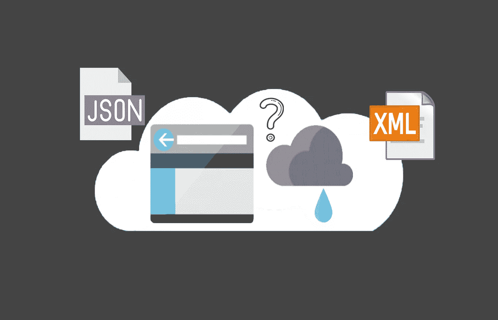
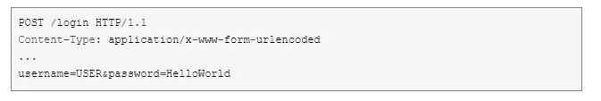
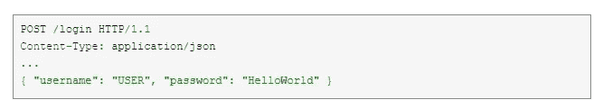
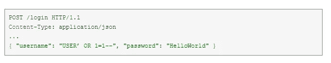

# Bounty 技巧:如何通过 API 的 JSON/XML 存根推动注入

> 原文：<https://infosecwriteups.com/bounty-tip-how-to-push-injection-through-json-xml-stubs-for-api-699f4959fc5?source=collection_archive---------0----------------------->

> **如何在还没有人发现的地方发现漏洞？**

例如，尝试将 POST 请求转换成 **JSON** 或 **XML** 格式。这个想法是，开发人员通常会留下各种身份验证方法，通常供第三方应用程序以后使用。由于这种功能是不可见的，因此通常不会受到**注射**的保护。如果 XML 开始发挥作用——几乎可以保证读取服务器上的任意文件！

*   **看，网站有一个标准入口:**

*   **现在我们将把所有参数转换成 JSON 格式**

*   **如果认证已经发生，尝试从这里注入，例如:**

> *别忘了这是 JSON，为了不违反它的结构，视图向量* `*" OR "a"="a*` *必须用转义引号-* `*\" OR \"a\"=\"a*` *发送。*

*   也试着翻译成 XML，最重要的是不要忘记内容类型，如果没有它，许多 web 应用程序都不想解析 XML！

一切顺利吗？尝试 XML 外部实体( **XXE** )注入——也许你已经在服务器上读取了任意文件。很酷，对吧？

# KeepHunting # BugBountyTips 提示

 [## 沙尔亚·夏尔马

### Shaurya Sharma 的最新推文(@ShauryaSharma05)。信息安全分析师|游戏玩家| cyber verse 的作者…

twitter.com](https://twitter.com/ShauryaSharma05) 

*关注* [*Infosec 报道*](https://medium.com/bugbountywriteup) *获取更多此类精彩报道。*

 [## 信息安全报道

### 收集了世界上最好的黑客的文章，主题从 bug 奖金和 CTF 到 vulnhub…

medium.com](https://medium.com/bugbountywriteup)