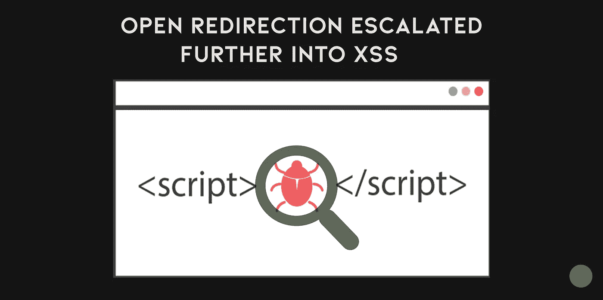

# 赏金猎人提示——打开重定向进一步升级为 XSS！！

> 原文：<https://infosecwriteups.com/bounty-tip-open-redirection-escalated-further-into-an-xss-edec8e3abe78?source=collection_archive---------0----------------------->

## 什么是开放重定向？

> 开放重定向是指 web 应用程序或服务器使用用户提交的无效链接将用户重定向到给定的网站或页面。尽管让用户决定他想被重定向到哪个页面似乎是无害的行为。

## 什么是 XSS？

> 跨站点脚本是 web 应用程序中常见的一种计算机安全漏洞。XSS 攻击使得攻击者能够将客户端脚本插入到其他用户查看的网页中。

**我最近玩了两个漏洞，下面是实验的反应:-**

1.  访问目标网站:【https://xyz.com/ 

现在，当我搜索目标网站时，我发现了一个独特的模式，无论何时我发出命令？Return = "页面形成一个模式重定向到下一页。

*然后我突然想到，一个开放的重定向可以进一步升级为 XSS*

2.然后，我试图结合 XSS +开放重定向有效载荷

有效负载:*JavaScript://% 250 alert(document . location = document . cookie)*

[目标是:*https://xyz.com/?return = JavaScript://% 250 alert(document . location = document . cookie)*](https://xyz.com/?return=javascript://%250Alert(document.location=document.cookie))

3.执行该链接，可以看到触发的 XSS 弹出

#快乐狩猎#错误提示

*关注* [*Infosec 报道*](https://medium.com/bugbountywriteup) *获取更多此类精彩报道。*

 [## 信息安全报道

### 收集了世界上最好的黑客的文章，主题从 bug 奖金和 CTF 到 vulnhub…

medium.com](https://medium.com/bugbountywriteup)