# BountyCon 2020 CTF——反什么

> 原文：<https://infosecwriteups.com/bountycon-2020-ctf-anti-what-5961293ab934?source=collection_archive---------1----------------------->

嘿大家，这是我第一次写文章。希望对你有用。我想感谢信息安全社区分享他们宝贵的知识，最终帮助我了解 CTF 和所有其他信息安全的东西。让我们开始吧。

BountyCon 是脸书每年在新加坡为亚太地区的 BugBounty 社区举办的仅限受邀者参加的应用安全会议，BountyCon2020 是他们的第二届会议。

更多信息请点击 [**这里**](https://www.facebook.com/whitehat/ctf/bountycon2020/)

不幸的是，我没有收到邀请，但对于像我这样的新手来说，这仍然是一次很好的学习经历:)

二进制反转挑战之一“反什么”是比较容易的一个。挑战说“你说已经连接了调试器是什么意思？这意味着下载二进制文件后，可能会有反调试代码。我很快启动了 IDA 反汇编器来拆解它。然后我注意到**主**函数有 ptrace 调用，表示反调试。

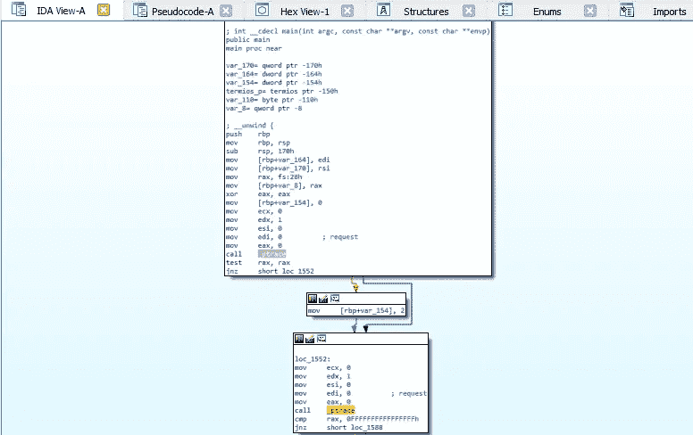

主要功能

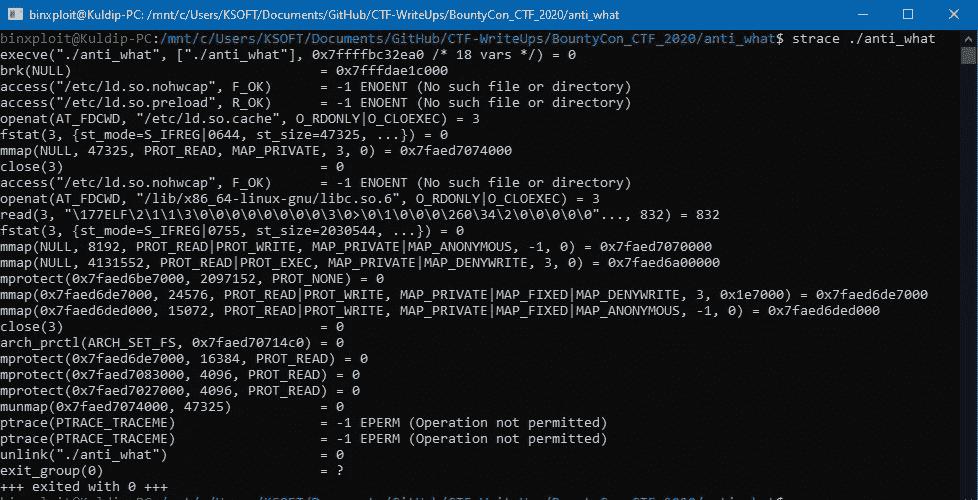

Strace 输出

因此，当我们试图调试这个二进制文件时，它只是关闭并删除(取消链接)自己。现在我们必须绕过它，最简单的方法是打补丁或修改二进制。
所以我们将从 first _ptrace 调用到 jmp 之前的函数 **RC4_set_key** 替换为 NOP(无操作)也就是 0x90。我将使用 HxD 编辑器来修改它。

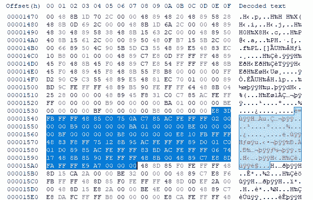

修补前

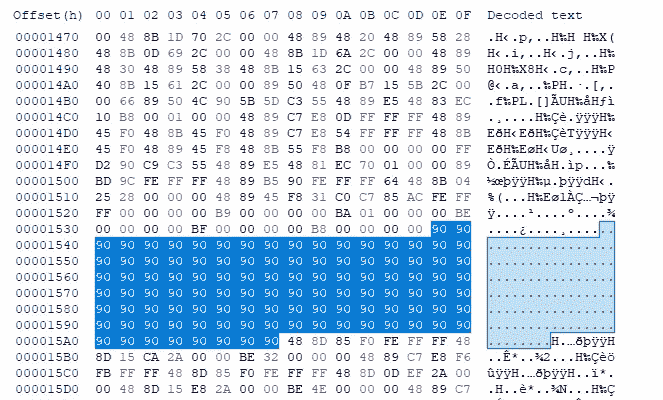

修补后

现在我们可以毫无问题地调试它，如果我们检查它。它创建了一个很好的 NOP 幻灯片。

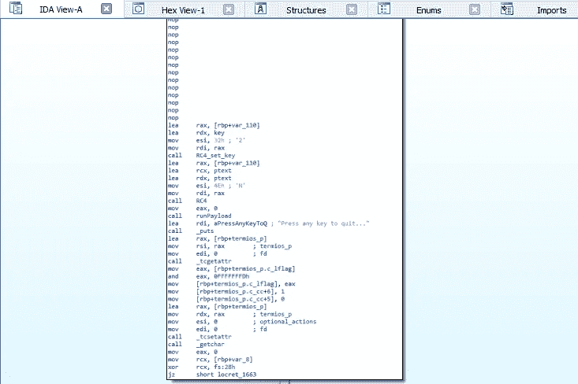

带 NOP 幻灯片的路径二进制文件

有一个函数 **RC4 设置键**以一个全局变量**键**为参数。它是一个字节数组。然后，它从第一个参数开始写入内存位置[rbp+0x110]，看起来像一个 c++对象。现在，在函数**之后，RC4** 使用相同的对象指针和全局变量 **ptext** 作为参数调用，并将输出写入 ptext 的位置，因此用解密的文本替换加密的文本。到目前为止，执行流程看起来很正常。

然后调用 **runPayload** 函数，通过查看该函数，我们可以看到它通过 mmap syscall 周围名为 **rwxmalloc 的自定义包装函数将内存位置动态分配到一个堆中。**然后再调用一个函数 **unpackPayload** ，将明文 **ptext** 的字节与其他位置的字节混在一起，并将结果写入新分配的内存地址。然后它从那个内存地址调用。

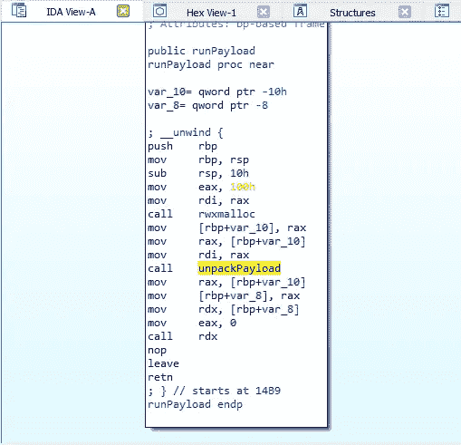

因此，很明显，我们必须使用调试器来查看动态分配的内存地址，以找出标志。所以我在二进制上开了 gdb。并在函数 **rwxmalloc** 后设置第一个断点，在 **unpackPayload** 后设置第二个断点。

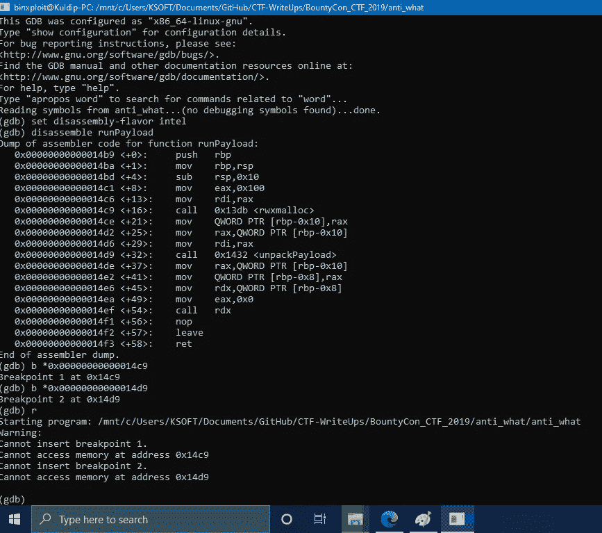

不对不对😬，如果发生这种情况，首先在 main 函数上设置一个断点，然后运行 binary。这将在主函数处停止执行，现在我们可以为其他指令设置一个断点。

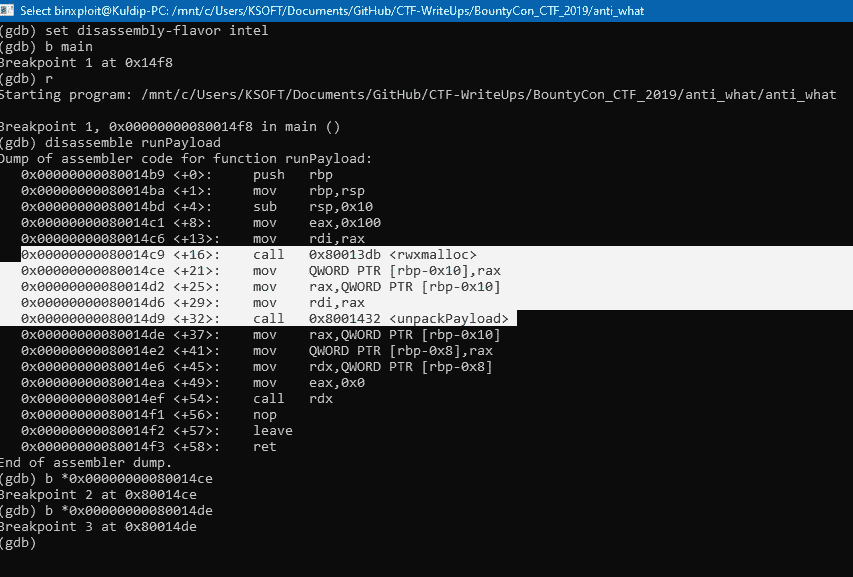

断点集

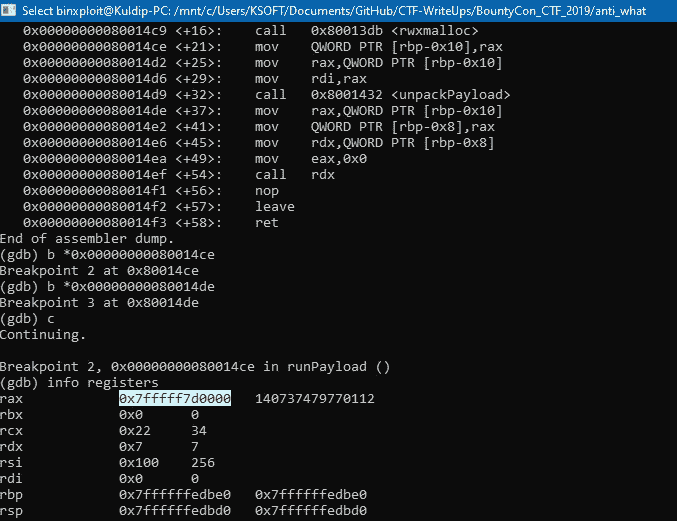

rwxmalloc 返回的已分配内存地址

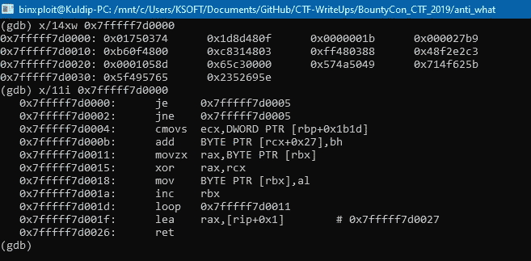

未包装的机器说明

😮它解包原始机器指令，调用指令将程序计数器传送到那个地址。这些指令执行 xor 运算来解密数据。因此，我们现在可以在 **ret** 指令上快速设置一个断点，并查看返回的地址，我们已经成功地找到了标志😃

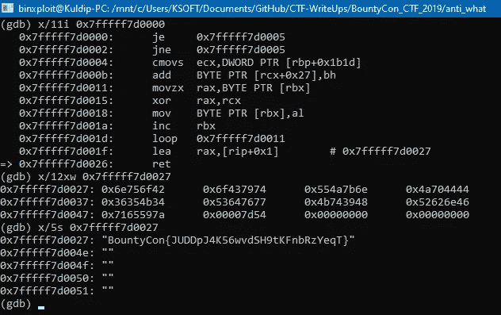

返回地址显示的标志

我希望你能从中学到一些东西。感谢阅读我的文章！干杯！🍺

在 [Twitter](https://twitter.com/BinXploit) 、 [Github](https://github.com/kp7742/) 上关注我，或者在 [LinkedIn](https://www.linkedin.com/in/kp7742/) 上联系我。

*关注* [*Infosec 报道*](https://medium.com/bugbountywriteup) *获取更多此类精彩报道。*

 [## 信息安全报道

### 收集了世界上最好的黑客的文章，主题从 bug 奖金和 CTF 到 vulnhub…

medium.com](https://medium.com/bugbountywriteup)