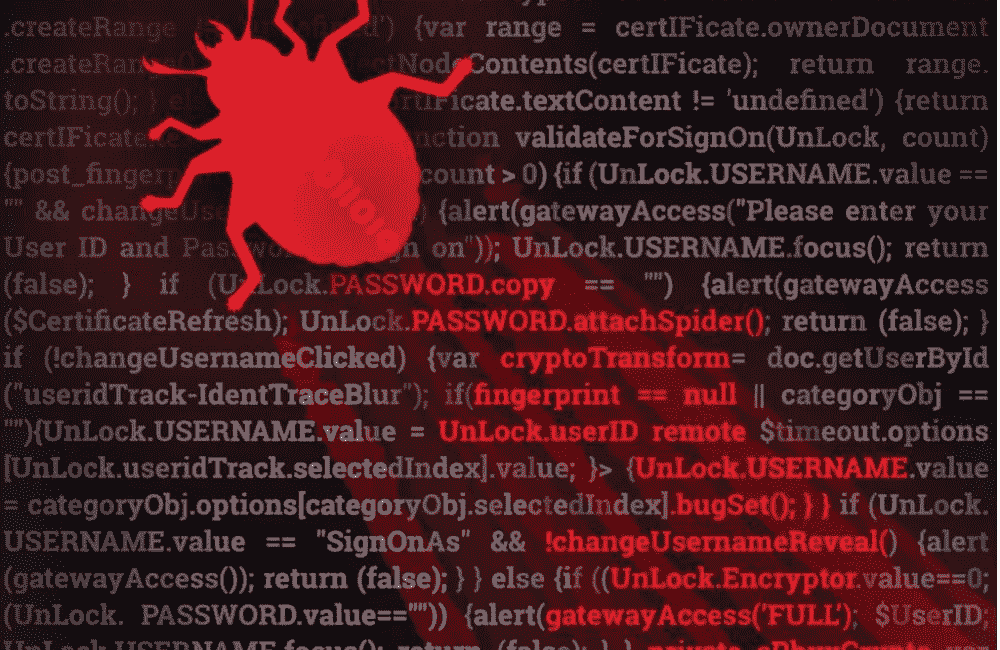
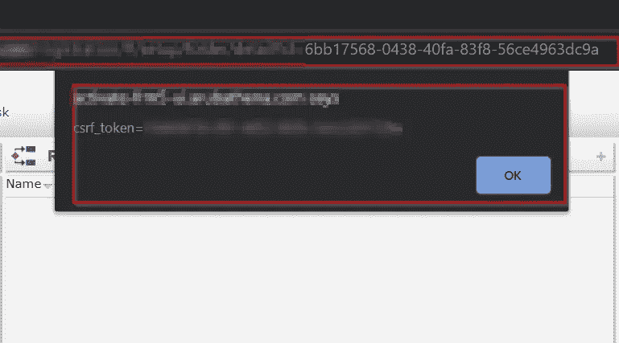

# 吹牛的权利:让我们回到臭虫桶

> 原文：<https://infosecwriteups.com/bragging-rights-lets-head-back-to-bug-bucket-88c94730b6fa?source=collection_archive---------1----------------------->

欢迎回来我的黑客兄弟们！我希望你们都做得很好，像我一样！每天都有很多东西要学，新的资源不断涌现。不断提升自己:)我在这里又读了一遍**吹牛的权利**系列，在这里我将讨论一堆我最近发现的 bug。它包括一些带旁路的 XSS、IDORs 和一个 2FA 旁路。我们还在等什么？开始吧！

到目前为止，西纳克对我来说一直很棒，没有任何复杂的情绪。只有快乐和学习。最近我在寻找一个程序，它有多种功能。我没有找到一个好的程序，因为在这之前的几周，我的许多 bug 都被拒绝了(可能有 12 个？)因为傻逼的原因。我们不在这里讨论它，我得到了这个程序，它有两个用户角色，一个管理员和一个特权较少的普通用户。我们有一个长周末，我花了 3 天时间。这确实需要时间，但输出是可怕的，因为我得到了 2 XSS，2 IDORs 和 1 2FA 旁路。

让我们先讨论一下 XSS 旁路。程序有一个功能，我们可以添加医生服务的评论，如果有人去那里，他可以阅读张贴的评论。场景很简单？是的，但是剥削部分并不容易。我试图把一些有效载荷，甚至尝试了正常的旁路像">，/>，%00 和其他，但它不工作。我的有效负载被接受为正常评论。我回到了他网站上的[蛮逻辑](https://medium.com/u/a90d4c9f2c62?source=post_page-----88c94730b6fa--------------------------------)方法，即[T5 这个 T8。最后，我用这个有效载荷绕过了它:](https://brutelogic.com.br/blog/)

**' ` "><><div/onmouseover = ' alert(document . cookie)'>style = " x:">**

所以，现在无论谁访问这个评论，你都知道会发生什么

**外卖**:把时间从代码中绕过过滤器。尝试开发人员工具来理解代码，并投入精力:)

**第二个** XSS 很简单，是一个反思者。一旦我知道它过滤的是什么，我只需在 URL 中应用正确的有效载荷，就会得到一个弹出窗口。有效载荷很简单，只是在那之前增加了一些旁路:

**' ` "><\ x00 script>JavaScript:alert(1)</script>**

IDORs 非常通用，所以我们不会在这里讨论。简单的数字转换器从 URL 编码的数据，我们可以看到一个特定病人的细节。一个是收件人页面上的 IDOR，另一个是用户预约的次数。最后一个严重性较低。如果这还不够，我得到了这个的一个副本:(

然而，我也有一个 **2FA 旁路**，我想我可以在这里讨论一下。应用程序有一个 2FA 的功能，你可以登录到你的联系号码上收到的 6 位数字代码的应用程序。我最近在读关于 2FA 旁路的文章，其中一种方法对我有帮助。在身份验证期间，如果您输入了错误的代码，它会给出如下 JSON 错误响应:

{

“状态”:“假”，

"错误":"提供了不正确的代码"

}

现在，如果我们用不正确的 2FA 代码捕获请求，并像这样更改响应，您可以成功登录到应用程序:

{

“状态”:“真”，

}

我们还需要将响应状态代码从 401 未授权更改为 200 正常。这是一个很酷的旁路，不是吗？不难，只是智力游戏和应用。

**外卖**:查遍各种破应用。尽你所能侵入。申请都是你的！

XSS:441 美元

伊多尔:300 美元

2FA 旁路:410 美元

**注意:没有放太多截图，因为最近我在别人的 LinkedIn 帖子 xD 上看到了我的截图**

在我看来，要找到好的 bug，主要的应用程序可能更容易受到攻击。我们只是没有投入足够的时间。具有大作用域的好的旧应用程序仍然有缺陷。所需要的只是时间，有时人们会在几分钟内发现错误，但那是一些罕见的情况。有几次我们也缺乏技能，我多次感觉到这一点。我在新目标上找不到窃听器，别人在一小时内就找到了。不是我们的错，我们能做的就是不断学习！

我希望这篇文章对你有所帮助。如果你觉得它有帮助，表现出一些爱心，鼓掌图标在下面:)如果你从中学到了什么，帮助其他需要它的人:)继续帮助，继续前进。我们有一个很棒的社区:)另外，你可以在 twitter 上用这个用户名关注我: [**@manasH4rsh**](http://twitter.com/manasH4rsh) **。**

再见:)保重，黑客快乐！

Adios❤