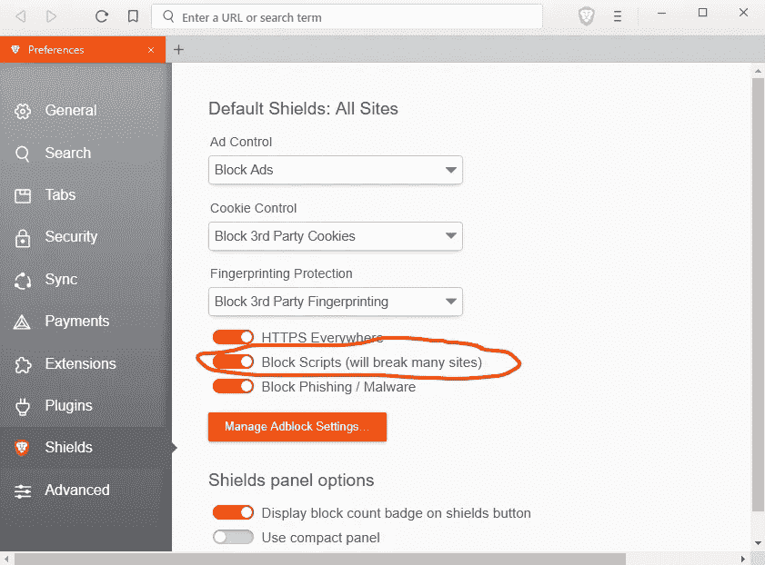
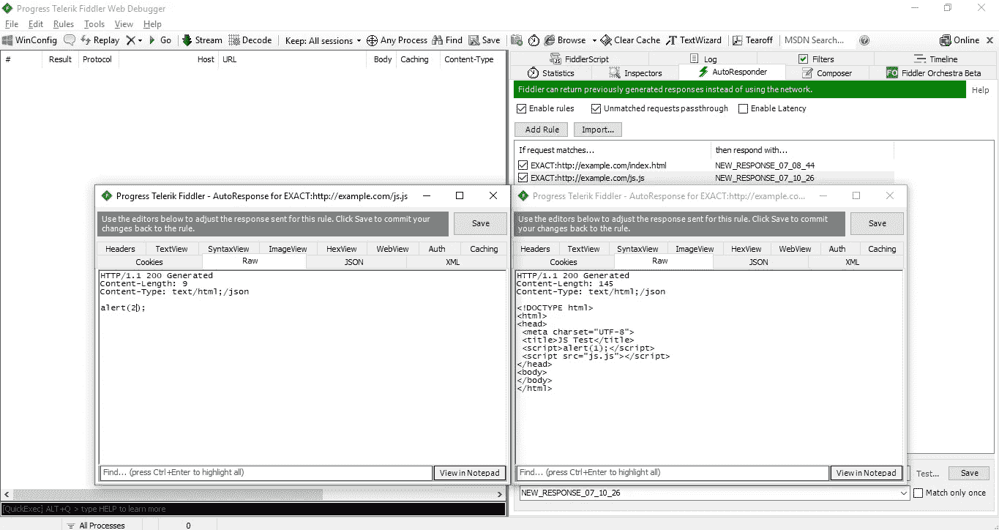
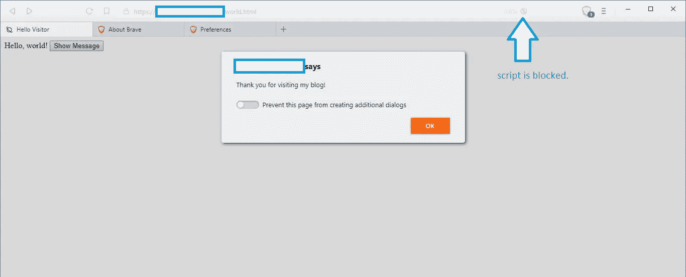

# 勇敢的浏览器脚本拦截器绕过漏洞

> 原文：<https://infosecwriteups.com/brave-browser-script-blocker-bypass-vulnerability-fffd659c5a7?source=collection_archive---------0----------------------->

在这篇文章中，我想分享我几天前发现的[勇敢浏览器](https://brave.com)中的一个漏洞。勇敢浏览器是一个开源浏览器，具有广告拦截和跟踪保护功能。它包括一个内置的 JavaScript 拦截器，允许用户选择性地阻止用户指定域上的 JavaScript。我找到了绕过阻断器的方法。

我发现的这个 bug 是受最近披露的 Tor 浏览器 NoScript bypass 漏洞的启发，[CVE-2018–16983](https://cve.mitre.org/cgi-bin/cvename.cgi?name=CVE-2018-16983)[1]。NoScript 的问题是:如果你将一个网页的`Content-Type`设置为`text/html;/json`，那么这个页面就可以执行 JavaScript，即使用户在 Tor 中将安全级别设置为“最安全”。NoScript 是一个 Firefox 插件，而 Brave 是基于 [muon](https://github.com/brave/muon) ，一个从 [Electron](https://electronjs.org/) 修改而来的框架，所以 Brave 的内置脚本拦截器不太可能遭受同样的漏洞。尽管如此，我还是决定在 Brave 上测试一下。

我写了一个非常简单的 PoC:

为了设置`Content-Type`，我用 Fiddler AutoResponder 钩了一个 URL，比如`http://example.com/index.html`:

原来``被执行了，但是``被封杀了。然后我把`Content-Type`换成了正常的`text/html`。结果是一样的。所以很明显`Content-Type`是不相关的。外部 JavaScript 文件被正确阻止，但内联 JavaScript 被错误地允许，即使脚本被设置为禁用。

演示:

我在 2018 年 9 月 26 日向 HackerOne 上的 [Brave Software 报告了这个漏洞。很快](https://hackerone.com/brave)[三分](https://github.com/brave/browser-laptop/issues/15232)和[固定](https://github.com/brave/muon/pull/651)。固定版本于 10 月 8 日在[版本 0.25.2](https://github.com/brave/browser-laptop/releases/tag/v0.25.2dev) 发布。这个漏洞也是 David Albert 独立发现的。

**参考文献**

[1][https://www . zdnet . com/article/exploit-vendor-drops-tor-browser-zero-day-on-Twitter/](https://www.zdnet.com/article/exploit-vendor-drops-tor-browser-zero-day-on-twitter/)