# 打破逻辑:单页中的 5 个不同视角(€1500)

> 原文：<https://infosecwriteups.com/break-the-logic-5-different-perspectives-in-single-page-1500-5aa09da0fe7a?source=collection_archive---------0----------------------->

大家好。今天我将谈论我在一个页面上发现的五个不同的漏洞。这些漏洞中的三个被接受，另外两个作为重复被关闭。公司还奖励了我 1500€。

像往常一样，我不能提供公司的信息，因为他们有一个私人的 bug 赏金计划。所以，让我们称它们为“修订的”。

在我们开始之前，让我给你一些关于应用程序的信息。这基本上是一个学校/学生的 app。它有三种不同的用户模型:教师、学生和家长。家长只能在学生档案上编辑自己的信息。所以我们作为父用户的权限有限。所有报告都将在单个联系人页面中从这个角度进行。

**一、用户即使没有访问权限也可以更改学生的主地址**

当我作为家长用户访问学生的个人资料时，我发现了一个我们无权编辑的地址部分。“编辑”按钮是活动的，但是当我单击它时，所有字段都被禁用。

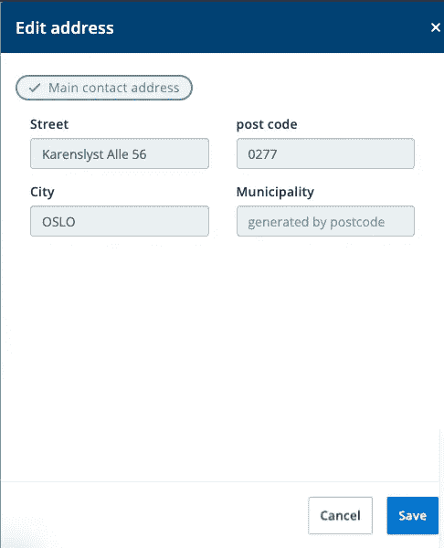

但是，您仍然可以看到“保存”按钮处于活动状态。因此，作为一个相当简单的方法，我从字段中删除了 disabled 属性。

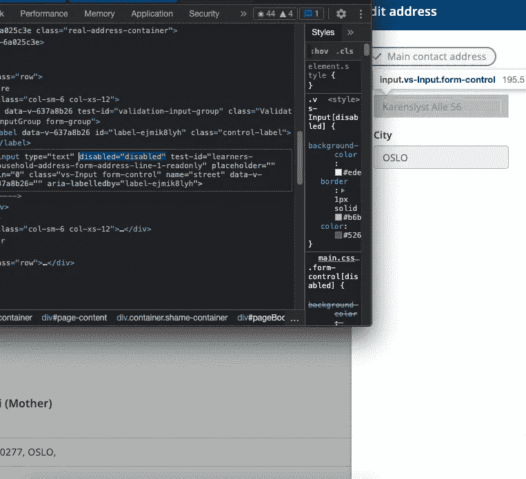

我在字段中填入了自己的信息，发送请求非常容易，因为保存按钮仍然处于活动状态。

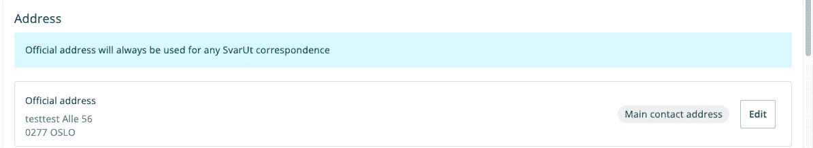

我发送了请求，看到目标信息确实发生了变化。保护只是在应用程序的前端。类似地，这些信息可以使用 Burp Suite 进行更改。

> **二世。即使没有访问权限，用户也可以编辑他们的所有部分**

家长用户在学生的个人资料中有一些联系信息。但是，他们不能编辑所有这些信息。所以，他们只有编辑某些字段的权利。

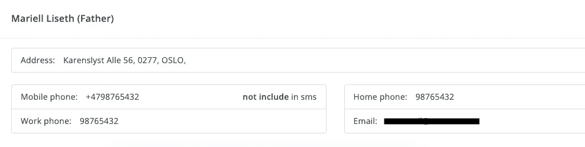

例如，还有姓名和地址等信息，但是当我们单击编辑按钮时，只能更改联系人字段。

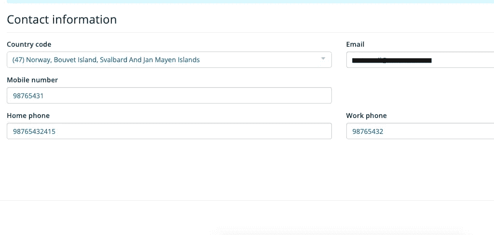

当我以这种方式发送请求时，我遇到了下面的 PUT 请求。如您所见，还有其他不能更改的字段，如姓名、地址等。

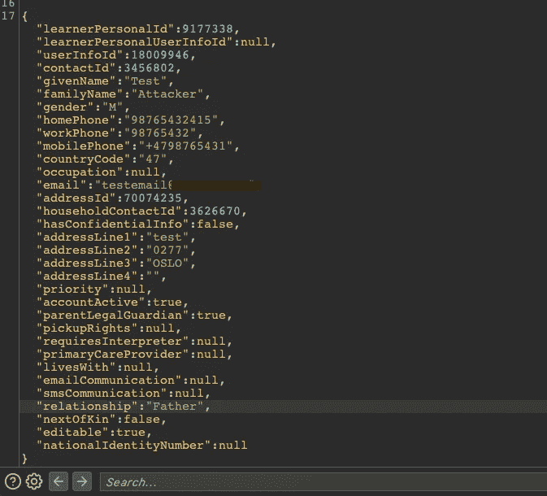

我更改了一些信息，如姓名、地址、关系，并发送了请求。

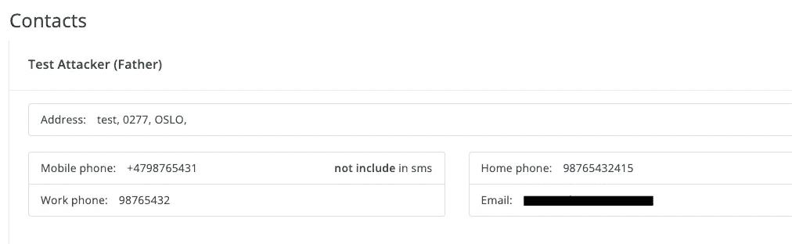

信息已成功更改并显示在页面上。

> **三世。即使没有访问权限，用户也可以创建新的家长联系人字段**

如您所知，家长用户只能编辑自己的信息。他们不能添加新的父联系人字段。

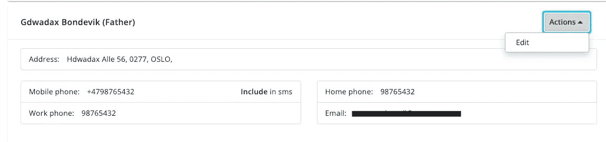

但是，当我发送编辑联系人表的请求时，我更改了参数中的所有 ID 值，并且能够创建一个新的联系人表。

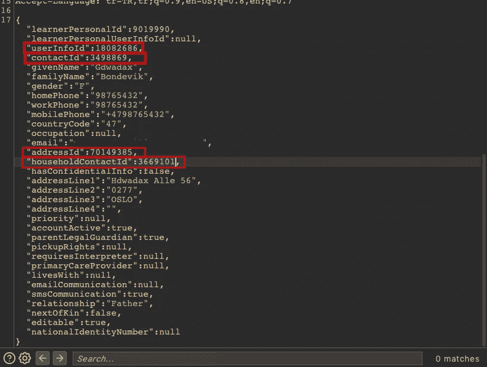

图中的请求与第二个报告中的 PUT 请求相同。如您所见，请求有许多不同的 ID 值。我用随机值替换了所有 ID 值的最后一位数。(learnerPersonalid 除外，因为它位于每个请求的开头，不是特定于页面的。)

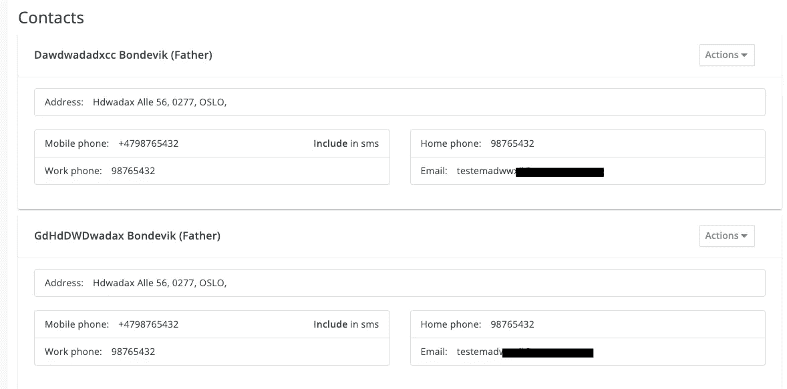

实际上，我想知道应用程序会如何响应这个动作。我可能会期待 500 或 403 个答案，但这款应用为我创建了一个新的联系人字段。

> **四。用户甚至可以在没有访问权限的情况下更改地址类型**

用户不能更改学生的已定义地址类型。例如，在下图中，有两个为学生和家长用户定义的地址不能更改它们的类型。

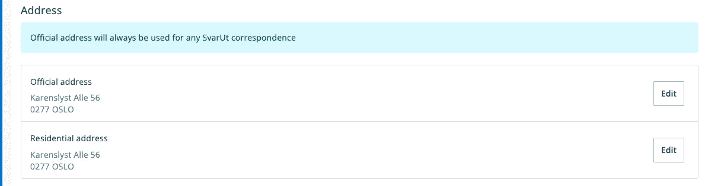

当我们试图将居住地址更改为官方地址时，应用程序会抛出一个错误，我们的请求不会被完成。

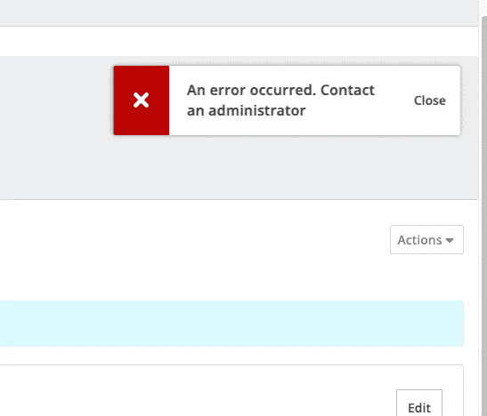

我记得第一份报告中的保存按钮对于地址仍然有效。于是，我编辑了一个居住地址，发了过去，看到了下面的请求。

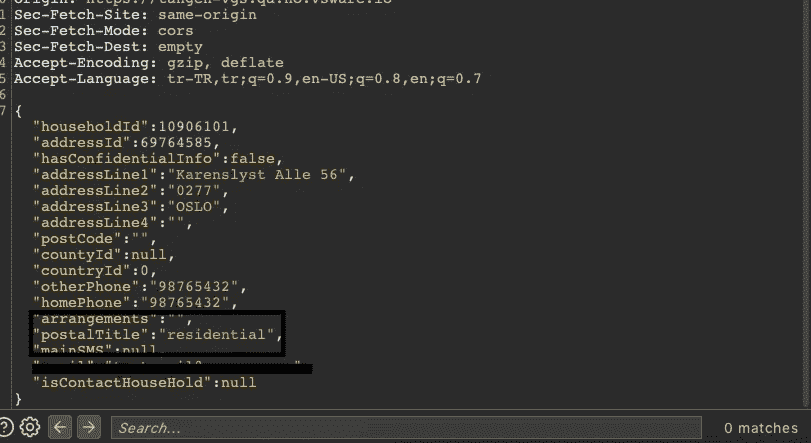

我把“postalTitle”参数改成了官方的。(同样，我也可以把它改成官方地址的住宅区。)

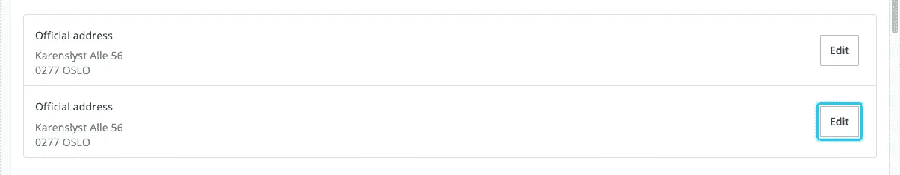

在应用程序中，只有一个地址可以是官方地址，但你可以看到两个地址都已更改为主要地址。

> **五、用户无需访问即可删除学生官方地址(基础 IDOR)**

在检查地址类型时，我发现了一个不同之处。住宅地址的删除按钮处于活动状态，但官方地址没有删除按钮。

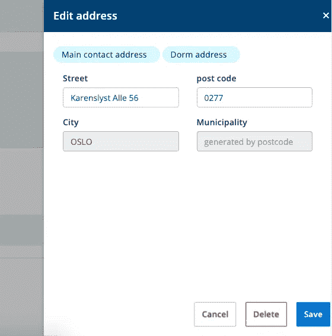

住宅地址示例

请注意，虽然住宅地址的“删除”按钮是活动的，但官方地址没有此类按钮。

官方地址示例

于是，我点击了学生官方地址编辑按钮。我运行了 Burp Suite 并点击了保存按钮。然后，我又碰到了下面的请求，复制了“住户”值。

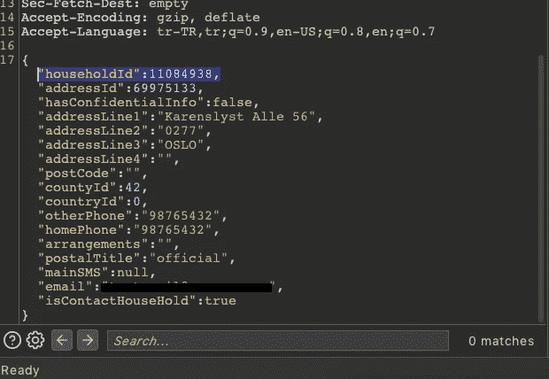

然后，我回到住宅地址，点击删除按钮，得到请求，并用官方地址 ID 替换“家庭:”值。

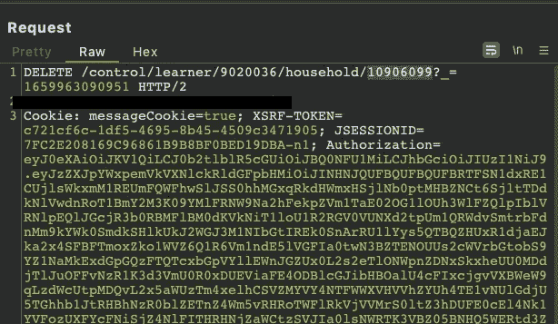

因此，即使无法访问，我也可以删除官方地址。

目前就这些。感谢你读到这里，希望你喜欢！

你可以在推特上关注我:【https://twitter.com/canmustdie T5

*来自 Infosec 的报道:Infosec 上每天都会出现很多难以跟上的内容。* [***加入我们的每周简讯***](https://weekly.infosecwriteups.com/) *以 5 篇文章、4 个线程、3 个视频、2 个 Github Repos 和工具以及 1 个工作提醒的形式免费获取所有最新的 Infosec 趋势！*