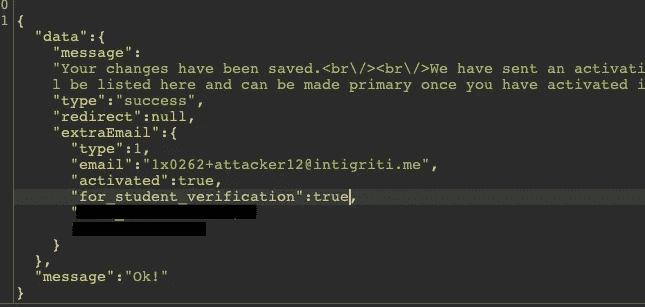
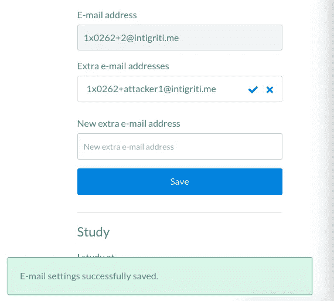
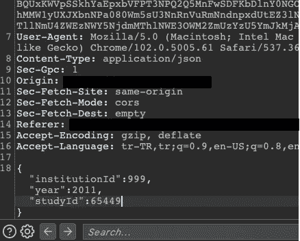
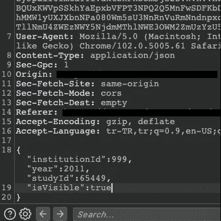
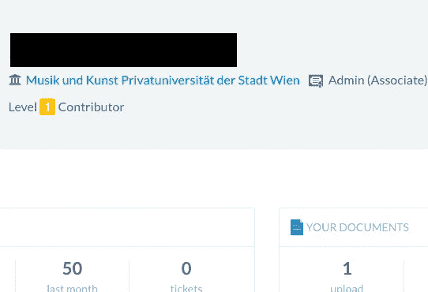

# 打破逻辑:不安全的参数(€300)

> 原文：<https://infosecwriteups.com/break-the-logic-insecure-parameters-300-e655cc4fcc42?source=collection_archive---------0----------------------->

大家好。今天，我要谈谈我在同一个程序中发现的基于不安全参数的两个小漏洞。这将是一个简短的故事，我会称之为“编校. com ”,因为该公司运行一个私人项目。那么，我们开始吧。

> **I .使用不安全参数绕过邮件验证**

redacted.com 有两种邮件功能，主要邮件和额外邮件。拥有主邮件的用户可以添加额外的邮件。然而，要使额外的邮件成为主邮件，应用程序需要向额外的邮件发送验证码。
因此，未经确认，额外邮件不能转换为主邮件。

首先，我们来分析一下这个过程在正常情况下是如何发生的。

1-我在额外邮件部分输入了一封邮件，发现该邮件需要验证。

(如图所示，它发送了一封确认邮件，我们在该字段旁边的两个选项是“重新发送”或“删除”邮件。)

2-我运行打嗝套件，回到页面。我再次输入电子邮件，得到了请求。

3-两个不安全的参数“activated”和“for student verification”将返回 false，我将这两个参数都改为 true 并提交请求。

4-我回到 redacted.com，看到电子邮件栏旁边有一个勾号按钮。我点击了勾选按钮，刷新了页面。

最后，额外邮件被移到主邮件部分，旧的主邮件变成了额外邮件。

> **二。使用隐藏的不安全参数绕过研究验证**

在 redacted.com，用户可以添加定制的“研究”信息。但是，为此，研究信息必须首先经过管理层的核实和批准。
我的意思是，当用户添加他们的自定义学习信息时，有一个验证过程。验证由 redacted.com 管理层直接完成。

但是，一个隐藏的不安全参数可以使用户的自定义研究信息看起来像他们已经被批准，并最终实际上获得批准。

我们来分析一下。

1-如我所说，在“我学习”字段，我们可以添加自己的特殊学习信息。例如，让我们键入“admin”并发送请求。

2-我运行了 Burp Suite，并通过键入“admin”再次发送了请求。

3-请求如上。我没有看到任何感兴趣的东西，所以我提交了请求并查看了响应。作为响应，我看到一个参数“isVisible:”被设置为 false。

4-我重新提交了请求，并在请求的末尾添加了参数“isVisible:true”。

我刷新页面，看到我添加的信息直接出现在我的个人资料上。

这样，攻击者就可以绕过验证，添加他们想要的任何信息。

错误已经被修复，公司因为这两个小错误奖励了我 300€。

目前就这些。感谢阅读。下次再见了！

你可以在推特上关注我:[https://twitter.com/canmustdie](https://twitter.com/canmustdie)

*来自 Infosec 的报道:Infosec 上每天都有很多事情发生，很难跟上。* [***加入我们的每周简讯***](https://weekly.infosecwriteups.com/) *以 5 篇文章、4 个线程、3 个视频、2 个 Github Repos 和工具以及 1 个工作提醒的形式免费获取所有最新的 Infosec 趋势！*