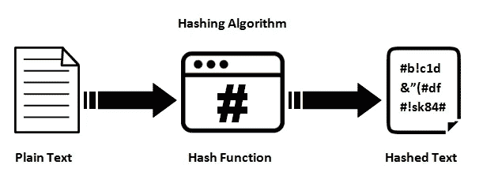
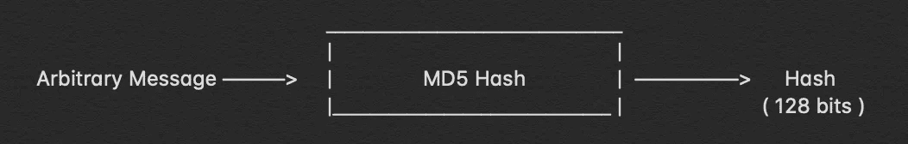
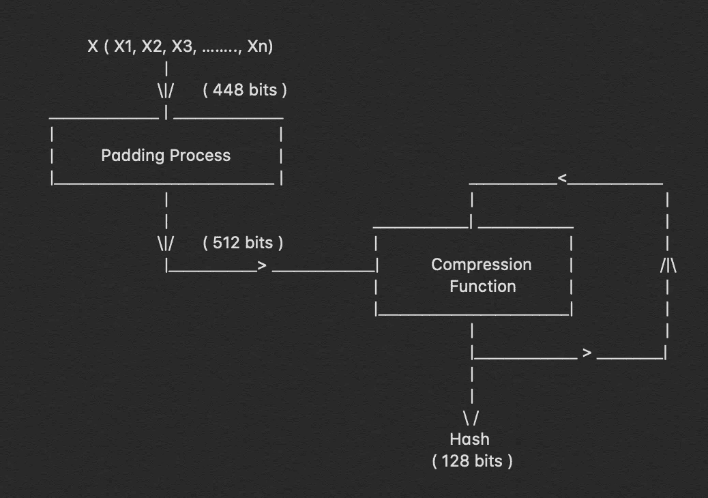
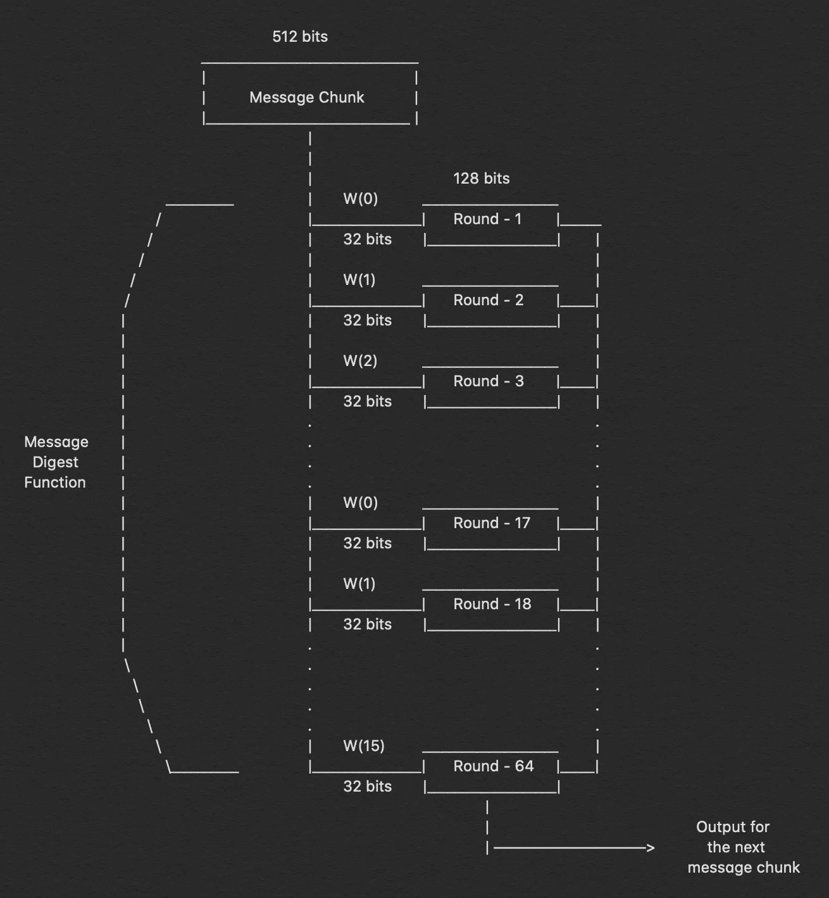
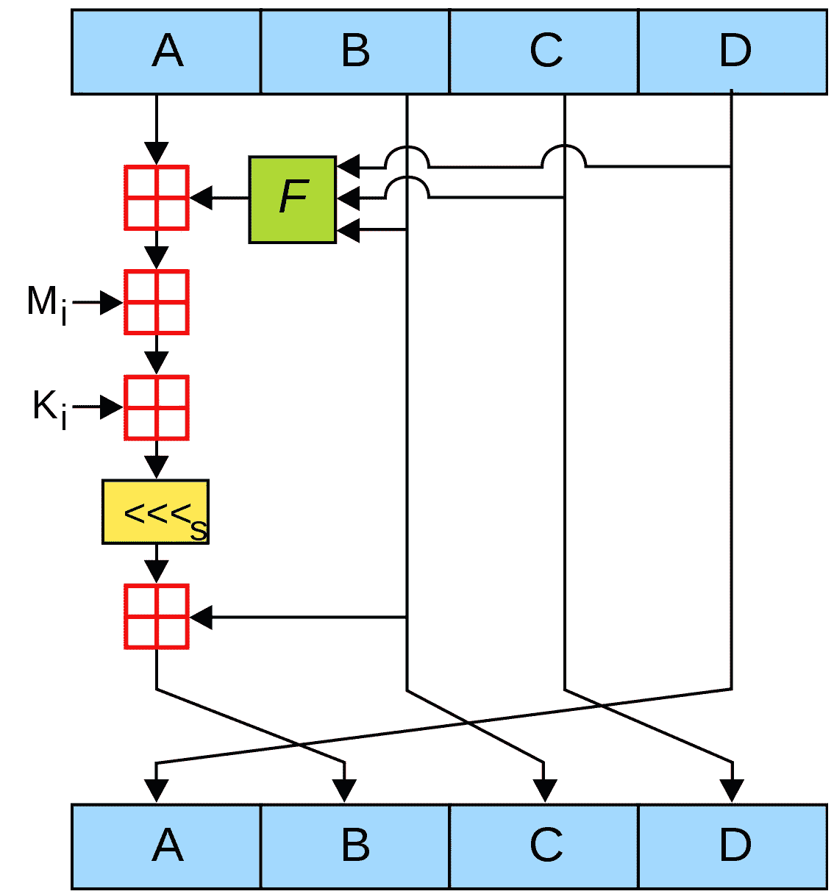

# 分解:MD5 算法

> 原文：<https://infosecwriteups.com/breaking-down-md5-algorithm-92803c485d25?source=collection_archive---------0----------------------->



## 看看引擎盖下面，了解它是如何工作的？

我写的上一篇文章是关于[崩溃:SHA-1 算法](https://medium.com/bugbountywriteup/breaking-down-sha-1-algorithm-c152ed353de2)。我已经在那里解释了散列的用途和目的，看看吧。写完之后，我计划为什么不写一个完整的系列文章来解释不同的散列算法，也许之后还会写一些加密算法和它们的功能。网络安全社区中的一个主要问题是，随着我们对安全的深入了解，我们逐渐失去了对这些算法实际工作方式的了解，最终只能下载和使用这些库，而不会考虑其功能。



这篇文章对我来说是一个尝试，向那些刚入门或者想再次复习基础知识的人解释这种散列算法的功能。哈希是网络安全领域中最常用的术语之一，对于校验和、文件集成验证、密码验证等各种任务非常有用。

这里是整个哈希算法的鸟瞰图。



# 我们开始吧！

MD5 散列技术是 SHA 1 技术的来源，因此这两者非常相似。我在那里提到了更多的细节，这将使你更容易理解整个功能，所以你也可以阅读- [分解:SHA-1 算法](https://medium.com/bugbountywriteup/breaking-down-sha-1-algorithm-c152ed353de2)

好了，现在你已经读过了，让我们从头到尾看一遍，理解 MD5 散列的功能。

## 1.追加填充位

让我们给消息增加少量的比特，这样它就相当于小于 512 的倍数的 64 比特。添加填充位的工作方式是，我们将 1 附加到消息的末尾，然后需要添加的其余位为 0。

## 2.附加长度位

在这一步中，我们将剩余的 64 位添加到消息中，这样消息的长度就正好是 512 的倍数。我们在这里添加的位取决于消息的长度(没有填充的原始位),如果消息的长度是 8，那么我们在前 8 位中添加 1，对于接下来的 56 位，我们添加 0，如果长度是 64，那么所有 64 位都是 1，如果长度大于 64，那么我们计算模数并附加那么多的 1，剩余的 64 位将是 0

## 3.初始化 MD 缓冲区

这是最重要的步骤之一，我们有四个不同的缓冲器(A、B、C & D ),每个缓冲器都是 32 位长。

它们的初始默认值(小端):

```
**A** = 0x67452301
**B** = 0xefcdab89
**C** = 0x98badcfe
**D** = 0x10325476
```

## 4.处理每个 512 位块

现在，让我们回到最初的讨论，我们看到我们对 512 位数据块中的每一个执行了总共 64 次操作。我们执行的这些操作分为 4 轮，每轮 16 个操作。下图为我们展示了整个压缩功能，即全部 64 次操作。



每一轮的特点是，每一轮都有下面描述的独特功能

```
F(B,C,D) = (B AND D) OR ((NOT B) AND D)
G(B,C,D) = (B AND D) OR (C AND (NOT D))
H(B,C,D) = B XOR C XOR D
I(B,C,D) = C XOR (B OR (NOT D))
```

对于包含 16 个操作的第一轮，我们将使用 F(B，C，D)，然后我们将使用 G(B，C，D)，然后是 H(B，C，D)，最后一轮是 I(B，C，D)。

512 比特的消息块 id 被进一步分成 16 个部分，每个部分是 32 比特，我们称它们为 M(1)、M(2)等等。我们有一个固定值 K(i ),它对于每个操作都是唯一的，即有 64 K(i ),如下所述(小端)。

```
K[ 0.. 3] := { 0xd76aa478, 0xe8c7b756, 0x242070db, 0xc1bdceee }
K[ 4.. 7] := { 0xf57c0faf, 0x4787c62a, 0xa8304613, 0xfd469501 }
K[ 8..11] := { 0x698098d8, 0x8b44f7af, 0xffff5bb1, 0x895cd7be }
K[12..15] := { 0x6b901122, 0xfd987193, 0xa679438e, 0x49b40821 }
K[16..19] := { 0xf61e2562, 0xc040b340, 0x265e5a51, 0xe9b6c7aa }
K[20..23] := { 0xd62f105d, 0x02441453, 0xd8a1e681, 0xe7d3fbc8 }
K[24..27] := { 0x21e1cde6, 0xc33707d6, 0xf4d50d87, 0x455a14ed }
K[28..31] := { 0xa9e3e905, 0xfcefa3f8, 0x676f02d9, 0x8d2a4c8a }
K[32..35] := { 0xfffa3942, 0x8771f681, 0x6d9d6122, 0xfde5380c }
K[36..39] := { 0xa4beea44, 0x4bdecfa9, 0xf6bb4b60, 0xbebfbc70 }
K[40..43] := { 0x289b7ec6, 0xeaa127fa, 0xd4ef3085, 0x04881d05 }
K[44..47] := { 0xd9d4d039, 0xe6db99e5, 0x1fa27cf8, 0xc4ac5665 }
K[48..51] := { 0xf4292244, 0x432aff97, 0xab9423a7, 0xfc93a039 }
K[52..55] := { 0x655b59c3, 0x8f0ccc92, 0xffeff47d, 0x85845dd1 }
K[56..59] := { 0x6fa87e4f, 0xfe2ce6e0, 0xa3014314, 0x4e0811a1 }
K[60..63] := { 0xf7537e82, 0xbd3af235, 0x2ad7d2bb, 0xeb86d391 }
```

我们还在每个操作中执行左位旋转，并且它们是为每个函数的每个操作设置的量。我们需要向左旋转的位用“s”表示。每个操作的 s 值如下所述。

```
s[ 0..15] := { 7,12,17,22,7,12,17,22,7,12,17,22,7,12,17,22 }
s[16..31] := { 5,9,14,20,5,9,14,20,5,9,14,20,5,9,14,20 }
s[32..47] := { 4,11,16,23,4,11,16,23,4,11,16,23, 4,11,16,23 }
s[48..63] := { 6,10,15,21,6,10,15,21,6,10,15,21,6,10,15,21 }
```

现在，我们有了执行每个操作所需的值，我们可以专注于每一轮操作以及它们是如何运行的。

## 5.输出消息摘要

这里的图像显示了每个操作是如何发生的。在每一个操作中，都有一组被执行的功能，这些功能为我们提供输出，而输出又作为下一个操作的输入。



每个操作的描述

我们一遍又一遍地执行这些操作，直到我们到达 512 位消息的最后一个块，因此在处理完最后一个块之后，我们获得的输出是实际的 MD5 散列，其 id 为 128 位，因为每个 A、B、C & D 都是 32 位，它们组合在一起形成总共 128 位。

# 结论

MD5 哈希算法已经被破解，基本上不应该在任何地方使用，比如银行和电子商务网站。看看 MD5 哈希算法的整个工作过程，让我们再看一遍。

> 需要散列的消息首先被分解成 448 位的片段，对于最后一个片段，我们进行填充。额外的 64 位被附加到它上面，使总位数为 512 位，这作为一个消息块继续前进。这个 512 比特的消息块被分成 16 个部分，每个部分 32 比特。然后作为我们在下一步中执行的操作的输入。现在让我们进入哈希算法的主要部分，总共有 64 个操作在 512 位消息块上执行。这些操作以我上面提到的默认值(A，B，C & D)开始。这些操作中的每一个都执行一组函数，这些函数和它将要使用的值都已经定义好了。我们执行的 64 个操作也分为 4 个不同的循环，每个循环都有不同的函数集，我们分解的消息的 32 位部分充当输入(如上图所示),还有 K(i)的预定义值，如上所述，下一步是执行向左旋转函数，程序向左旋转的位数也已定义。当整个操作完成后，它会将其值传递给下一个操作。在对第一个 512 位消息块执行 64 次这样的操作之后，输出接着被传递，以便对下一个 512 位执行下一个操作，直到到达最后一个消息块。我们从对最后一个消息块执行的操作中得到的输出是 128 位原始消息的散列。

这就是 MD5 算法全部功能的简短版本。

如果你喜欢，请鼓掌让我们合作吧。获取、设置、破解！

**网站**:[aditya12anand.com](https://www.aditya12anand.com/)|**捐款**:[paypal.me/aditya12anand](https://paypal.me/aditya12anand)
**电报**:[https://t.me/aditya12anand](https://t.me/aditya12anand)
**推特**:[twitter.com/aditya12anand](https://twitter.com/aditya12anand?source=post_page---------------------------)
**LinkedIn**:[linkedin.com/in/aditya12anand/](https://www.linkedin.com/in/aditya12anand/?source=post_page---------------------------)
**电子邮件**:aditya12anand@protonmail.com

*关注* [*Infosec 报道*](https://medium.com/bugbountywriteup) *获取更多此类精彩报道。*

[](https://medium.com/bugbountywriteup) [## 信息安全报道

### 收集了世界上最好的黑客的文章，主题从 bug 奖金和 CTF 到 vulnhub…

medium.com](https://medium.com/bugbountywriteup)