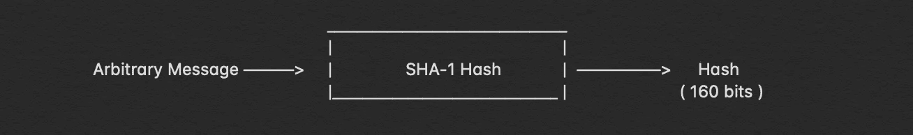
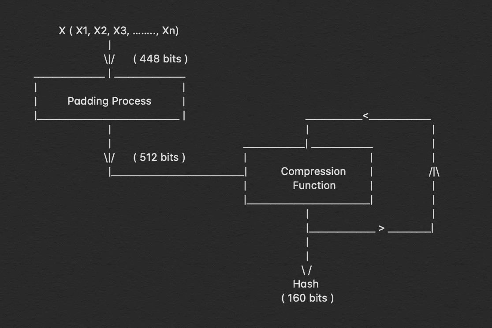
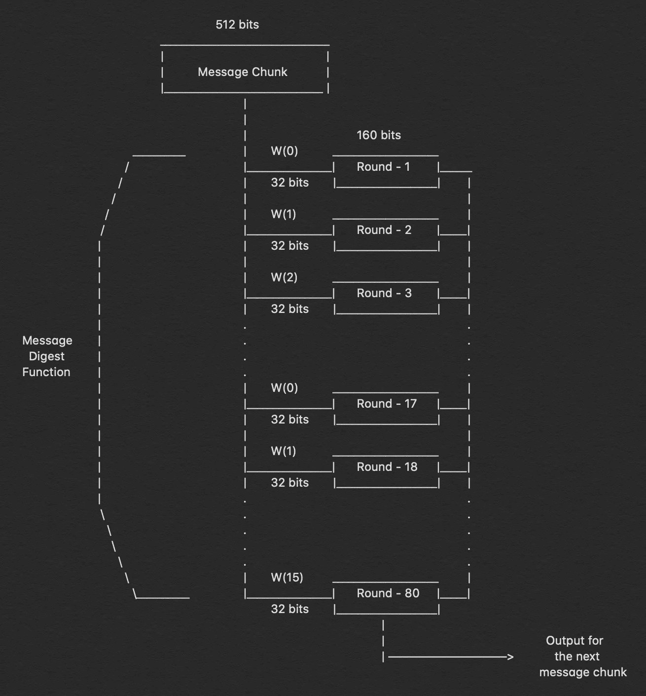
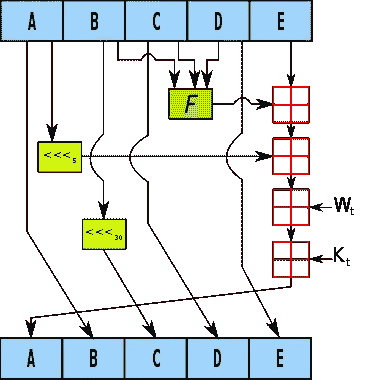

# 分解:SHA-1 算法

> 原文：<https://infosecwriteups.com/breaking-down-sha-1-algorithm-c152ed353de2?source=collection_archive---------0----------------------->


## 看看引擎盖下面，了解它是如何工作的？

我已经有一个多月没有写博客了，说实话，原因是我完全没有内容。你可以说我只是没有汽油了，所以我休息了一段时间，日复一日地回到基础学习中。它涉及很多东西，安全编码、云安全、docker 和 docker 安全、哈希和密码学。现在，我已经关注了这些事情，您可以期待关于这些主题的文章。如果有什么事情，特别是你想让我写下来并详细解释给你听的话，你绝对可以找我。

让我们回到我们在这里的目的，安全哈希算法，又名 SHA，是一种哈希技术，它已经被用于各种技术，从校验和，文件集成验证，密码验证等。现有的所有散列技术都具有这两个突出的特征，即这些散列函数的输出将是固定长度的，它可以根据散列函数的不同而不同，但是对于特定的散列函数，散列的长度永远不会改变。哈希函数也是压缩函数，因此其输出通常被称为摘要。

我写这篇文章的原因是，尽管大多数安全社区都知道这些算法，并将它们作为它们导入的库的一部分，但他们中的大多数人实际上并不知道 hash 究竟是如何不可逆的，以及为什么它不能被逆向工程。深入了解哈希技术的工作原理以及为什么一种哈希算法比另一种更好在网络安全领域非常有帮助，并且让您了解应该使用哪些算法，而不仅仅是下载库并在我们的程序中运行它们。

# 我们开始吧！

在我们深入了解 SHA-1 及其算法之前。首先，我们需要知道每个哈希算法必须遵循和遵守的规则或属性。有两个这样的规则，第一，原始消息不应该从生成的消息摘要中导出，第二，两个不同的消息不应该具有相同的消息摘要。只要我们理解了这些，我们就能在接下来的步骤中理解为什么在散列算法中使用如此复杂和不可逆的过程。

首先，让我们来鸟瞰一下哈希算法是怎么回事。



图像最左边的部分是我们想要散列的消息，然后我们对我们的消息执行散列函数，以接收散列，在这种特定情况下，它是 160 位。



让我们更深入地看看左边的图像。首先，我们将我们的消息分成“n”个部分，我们将其描述为 X，每个部分的大小为 448 位，然后我们为每个部分添加 64 位填充，从而将它们的总长度转换为 512 位。然后，这 512 位与压缩输出的 160 位一起被放入压缩函数中，第一次执行时，我们为 160 位值提供了一个预定义的值。

这个过程一次又一次地持续‘n’次，直到产生消息的最后 160 位，这就是描述为 H(x)的散列

# 压缩功能

现在让我们更深入地看看上图中的压缩函数。压缩函数本身总共有 80 个循环，请记住，这 80 个循环发生在图像的每个部分，当填充时，每个部分总计为 512 位。



现在，下一部分是这 512 位被进一步分成 16 个部分，每个部分 32 位，这些被标记为从 M1 到 M16。

因此，目前，我们还有 80 轮计算要执行，512 位消息被分成 16 部分，每部分 32 位。

问题是，我们只有 16 个不同的信息部分和 80 轮计算，因此我们按照它们在 M1 到 M16 中的确切顺序一遍又一遍地重复这 16 个部分五次。

开始时，我们有 160 位输入，我们将其分成 5 部分，命名为 A、B、C、D & e。A、B、C、D & E 的初始值如下

```
A = 0x67452301
B = 0xEFCDAB89
C = 0x98BADCFE
D = 0x10325476
E = 0xC3D2E1F0
```

一旦我们把它们分解成这 5 个部分，我们又有了一套复杂的程序，我们在每一轮中都要执行。这是 SHA-1 算法复杂的基本核心和原因。



单个回合的深入视图

可以看到我已经提到了 F(t)，W(t) & K(t)。我们已经知道 W(t)，这是 32 位的集合，是 512 位消息的一部分，但我们仍然不知道 F(t)和 K(t)。这些是用于计算散列的唯一的一组函数和值，并且它们每 20 轮保持不变，即在 80 轮计算发生时它们改变 4 次。对于每 20 轮，F(t)和 K(t)是常数，它们具有一组预定义的值和函数描述，这些值和描述在下面描述。

```
Rounds 1-20
f(1) = (B **and** C) **or** ((**not** B) **and** D)
k(1) = 0x5A827999Rounds 21-40
f(2) = B **xor** C **xor** D
k(2) = 0x6ED9EBA1Rounds 41-60
f(3) = (B **and** C) **or** (B **and** D) **or** (C **and** ) 
k(3) = 0x8F1BBCDCRounds 61-80
f(4) = B **xor** C **xor** D
k(4) = 0xCA62C1D6
```

# 结论

毫无疑问，SHA-1 算法是复杂的，更大的新闻是，它不再被使用，因为它已经被破解，被认为不再安全。因此，为了对整个事情有一个总体的了解，让我用通俗的语言在一个段落中再解释一遍。

> 需要被散列的消息被分解成 448 比特的片段，并且另外 64 比特被填充到该片段中，作为继续前进的消息块。然后，该消息块再次被分解成 16 个部分，每个部分 32 位，然后被传递给压缩函数。压缩函数包括 80 轮计算。消息块的这 16 个部分被馈送到这些轮中，并且在每 16 轮之后以顺序方式重复。同样进入压缩功能的 160 比特被分解成 5 个部分(A、B、C、D & E ),其中再次执行一组指令，其中我们对 B、C & D 应用 F(t ),并且用消息块然后用密钥对 K(t)执行模数运算。有 4 个不同的 F(t)和 K(t ),它们是为 SHA-1 算法预定义的，并且在 20 轮计算中保持不变。在 80 个这样的循环之后，160 比特的输出再次被倒回到压缩函数中，但是这一次是消息的第二个 448 比特，并且它继续直到原始消息的最后比特被计算，因此我们得到 160 比特的输出，这是我们传递的原始消息的散列。

这就是 SHA-1 算法全部功能的简短版本。

## 学分:

1.  [https://www.youtube.com/watch?v=plxMklEvlCU](https://www.youtube.com/watch?v=plxMklEvlCU)—我参考了这个视频对 SHA-1 有了基本的了解
2.  https://en.wikipedia.org/wiki/SHA-1[——维基百科关于 SHA-1 的文章](https://en.wikipedia.org/wiki/SHA-1)

**如果你喜欢，请鼓掌让我们合作吧。获取、设置、破解！**

**网站**:[aditya12anand.com](https://www.aditya12anand.com/)|捐赠:[paypal.me/aditya12anand](https://paypal.me/aditya12anand)
**电报**:[https://t.me/aditya12anand](https://t.me/aditya12anand)
**推特**:[twitter.com/aditya12anand](https://twitter.com/aditya12anand?source=post_page---------------------------)
**LinkedIn**:[linkedin.com/in/aditya12anand/](https://www.linkedin.com/in/aditya12anand/?source=post_page---------------------------)
**电子邮件**:aditya12anand@protonmail.com

*关注* [*Infosec 报道*](https://medium.com/bugbountywriteup) *获取更多此类精彩报道。*

[](https://medium.com/bugbountywriteup) [## 信息安全报道

### 收集了世界上最好的黑客的文章，主题从 bug 奖金和 CTF 到 vulnhub…

medium.com](https://medium.com/bugbountywriteup)