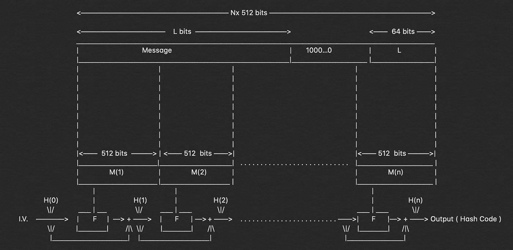
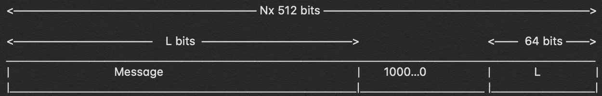
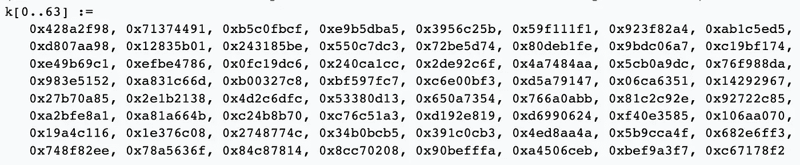
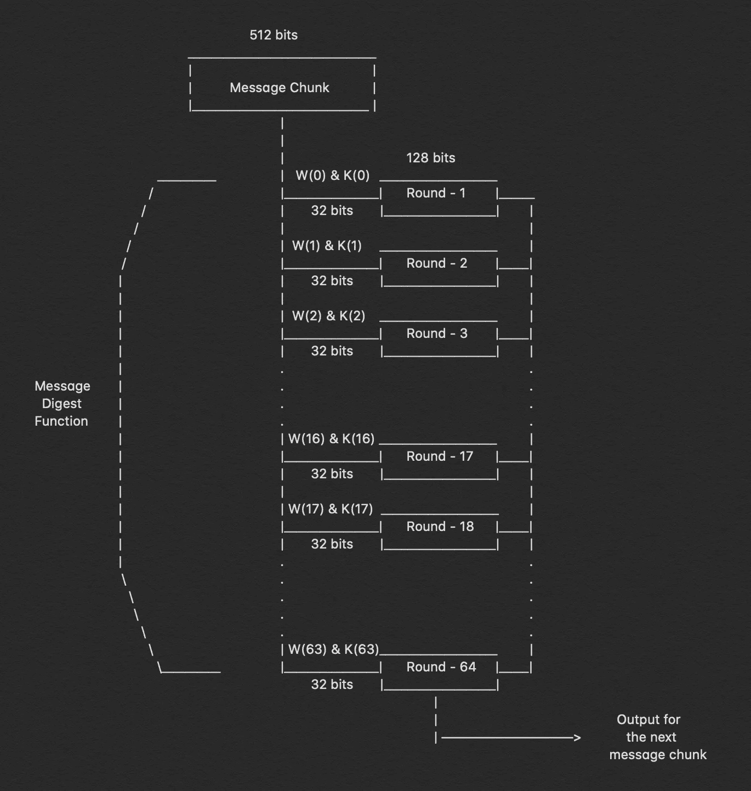
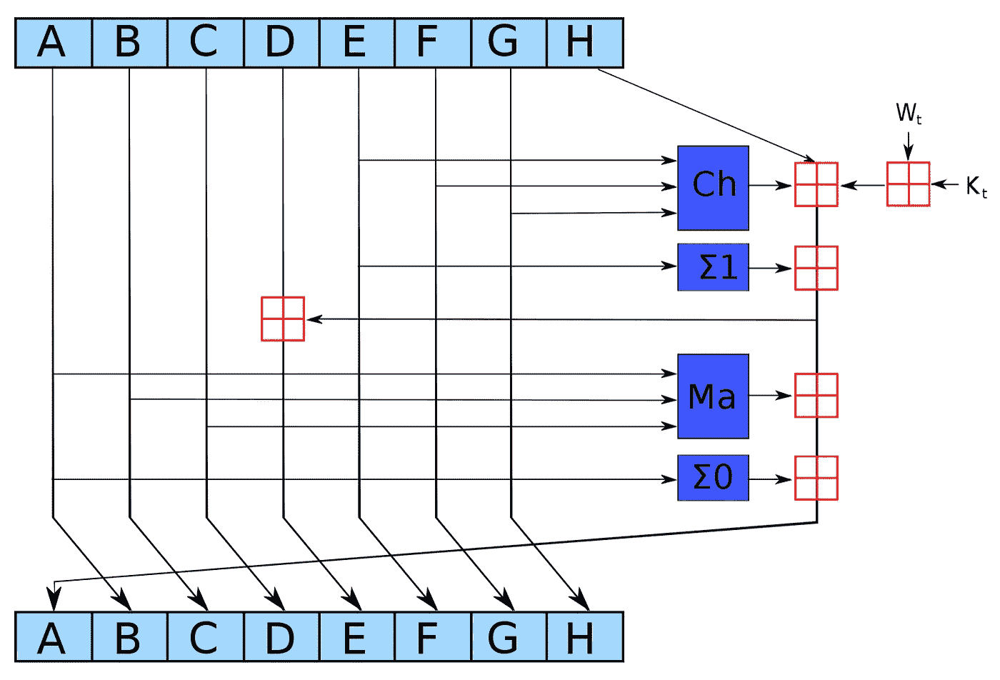

# 分解:SHA-256 算法

> 原文：<https://infosecwriteups.com/breaking-down-sha-256-algorithm-2ce61d86f7a3?source=collection_archive---------0----------------------->



## 看看引擎盖下面，了解它是如何工作的？

好消息，朋友们，我写的关于[崩溃:SHA-1 算法](https://medium.com/bugbountywriteup/breaking-down-sha-1-algorithm-c152ed353de2)的文章已经发表在 PenTest 杂志的[博客](https://pentestmag.com/breaking-down-sha-1-algorithm/)上。看到你的工作得到认可和赞赏总是令人高兴的。我把我的文章免费提供给大家阅读，因为我相信“知识应该是免费的”这句格言。好吧，让我们不要纠缠于此，开始新的文章。

因此，你们中可能已经关注我一段时间的人一定知道，这个月我专门写了一些文章，这些文章纯粹专注于对最著名的哈希算法如何工作以及是什么使一种算法比另一种算法更复杂进行复杂的分析。到目前为止，我在这个系列中写的文章如下。

> ***分解:系列***
> 
> [1。分解:MD5 算法](https://medium.com/bugbountywriteup/breaking-down-md5-algorithm-92803c485d25)
> 
> [2。分解:SHA-1 算法](https://medium.com/bugbountywriteup/breaking-down-sha-1-algorithm-c152ed353de2)
> 
> [3。分解:SHA-512 算法](https://medium.com/@aditya12anand/breaking-down-sha-512-algorithm-1fdb9cc9413a)

这是系列的第四部分，在这里我将分解 SHA-256 算法。如果你已经知道了 SHA-512 算法，那么理解 SHA-256 算法将会非常容易，因为整个过程是相同的，只是比特长度有所不同。如果你愿意，你可以在这里看一下我详细解释 SHA-512 的文章。


# 我们开始吧！

因此，让我们首先从分离和定义我们需要一个接一个执行的计算部分开始。为了便于理解，我个人更喜欢把它分成五个部分。

## 1.追加:填充位

我们的散列函数的第一步从将比特附加到我们的原始消息开始，因此它的长度将与散列函数所需的标准长度相同。为了做到这一点，我们在现有的信息上增加几个比特。我们添加的位数是这样计算的，因此在添加这些位之后，消息的长度应该正好是 64 位，小于 512 的倍数。为了更好的理解，让我用数学术语描述给你听。

```
M + P + 64 = n x 512i.e M = length of original message
    P = padded bits
```

我们附加到消息中的比特应该以“1”开始，随后的比特必须是“0 ”,直到我们正好比 512 的倍数少 64 比特。



## 2.追加:长度位

既然我们已经将填充位附加到原始消息中，我们可以进一步将长度位(相当于 64 位)附加到整个消息中，使整个消息正好是 512 的倍数。

我们知道我们需要增加 64 位，计算这 64 位的方法是计算原始消息的模，即没有填充的消息，用 2。我们获得的消息将这些长度附加到填充的比特上，我们得到整个消息块，它必须是 512 的倍数。

## 3.初始化缓冲区

我们有我们的消息块，我们将在其上开始执行我们的计算，以找出最终的散列。在我们开始之前，我应该告诉你，我们需要为将要执行的步骤初始化某些默认值。

```
a = 0x6a09e667
b = 0xbb67ae85
c = 0x3c6ef372
d = 0xa54ff53a
e = 0x510e527f
f = 0x9b05688c
g = 0x1f83d9ab
h = 0x5be0cd19
```

暂时把这些价值观记在心里，下一步你就会明白所有的事情了。还有 64 个值需要记住，它们将作为键，用单词“k”表示。



礼貌- SHA-2 维基百科

现在让我们进入利用这些值来计算散列的部分。

## 4.压缩功能

所以，哈希算法的主要部分就在于这一步。我们具有“n×512”位长的整个消息块被分成“n”个 512 位的块，然后这 512 位中的每一个经过 64 轮运算，并且所获得的输出被馈送作为下一轮运算的输入。



在上图中，我们可以清楚地看到对 512 位消息执行的 64 轮操作。我们可以观察到，我们发送的两个输入是 W(i)和 K(i)，对于前 16 轮，我们进一步将 512 位消息分解为 16 个部分，每个部分 32 位，但之后我们需要在每一步计算 W(i)的值。

```
**W(i) = Wⁱ⁻¹⁶ + σ⁰ + Wⁱ⁻⁷ + σ¹****where, 
 σ⁰ =** (Wⁱ⁻¹⁵ ROTR⁷(x)) XOR (Wⁱ⁻¹⁵ ROTR¹⁸(x)) XOR (Wⁱ⁻¹⁵ SHR³(x)) **σ¹ =** (Wⁱ⁻² ROTR¹⁷(x)) XOR (Wⁱ⁻² ROTR¹⁹(x)) XOR (Wⁱ⁻² SHR¹⁰(x))
 **ROTRⁿ(x)** = Circular right rotation of 'x' by 'n' bits
 **SHRⁿ(x)**  = Circular right shift of 'x' by 'n' bits
```

现在我们已经有了一个很好的方法来创建 64 轮中任何一轮的 W(i ),让我们深入了解每一轮都发生了什么。



单个“回合”的描绘

在上图中，我们可以确切地看到每一轮发生了什么，现在我们已经有了每个函数的值和公式，我们可以执行整个哈希过程。

```
Ch(E, F, G) = (E AND F) XOR ((NOT E) AND G)
Ma(A, B, C) = (A AND B) XOR (A AND C) XOR (B AND C)
    ∑(A)    = (A >>> 2) XOR (A >>> 13) XOR (A >>> 22)
    ∑(E)    = (E >>> 6) XOR (E >>> 11) XOR (E >>> 25)
     +      = addition modulo 2³²
```

这些是在 64 轮中的每一轮中执行的功能，它们被重复执行“n”次

# 5.输出

每一轮的输出充当下一轮的输入，并且该过程继续进行，直到消息的最后比特剩余，并且消息块的 nᵗʰ部分的上一轮的结果将给出结果，即整个消息的散列。输出的长度为 256 位。

# 结论

SHA-256 哈希算法是目前使用最广泛的哈希算法之一，因为它尚未被破解，而且与 SHA-512 等其他安全哈希相比，哈希计算速度很快。它已经非常成熟，但该行业正试图慢慢转向更安全的 SHA-512，因为专家声称 SHA-256 可能很快就会变得脆弱。

那么，让我们再看一下 SHA-256 算法的整个功能，让我用一个长段落来解释整个事情。

> 我们计算需要散列的消息的长度，然后我们给消息附加几个比特，从“1”开始，其余的是“0”，直到消息长度正好比 512 的倍数小 64 比特。我们通过用 2 计算原始消息的模来添加剩余的 64 位。一旦我们添加了剩余的比特，整个消息块可以表示为‘n×512’比特。现在，我们将这 512 位中的每一位传递给压缩函数，即 64 轮运算的集合，其中我们进一步将它们分成 16 个部分，每个部分 32 位。这 16 个部分，每部分 32 位，作为前 16 轮的每轮运算的输入，对于其余的 48 轮，我们有方法计算 W(i)。我们也有缓冲区的默认值和所有 64 轮的“k”值。我们现在可以开始计算哈希值了，因为我们已经有了所有需要的值和公式。然后，散列过程反复进行 64 轮，然后 I 轮的输出作为 i+1 轮的输入。因此，nᵗʰ回合的 64ᵗʰ运算的输出将为我们呈现输出，即整个消息的散列。

这就是发生在 SHA-256 算法中的整个运算的简短版本。

如果你喜欢，请鼓掌让我们合作吧。获取、设置、破解！

**网站**:[aditya12anand.com](https://www.aditya12anand.com/)|**捐款**:[paypal.me/aditya12anand](https://paypal.me/aditya12anand)
**电报**:[https://t.me/aditya12anand](https://t.me/aditya12anand)
**推特**:[twitter.com/aditya12anand](https://twitter.com/aditya12anand?source=post_page---------------------------)
**LinkedIn**:[linkedin.com/in/aditya12anand/](https://www.linkedin.com/in/aditya12anand/?source=post_page---------------------------)
**电子邮件**:aditya12anand@protonmail.com

*关注* [*Infosec 报道*](https://medium.com/bugbountywriteup) *获取更多此类精彩报道。*

[](https://medium.com/bugbountywriteup) [## 信息安全报道

### 收集了世界上最好的黑客的文章，主题从 bug 奖金和 CTF 到 vulnhub…

medium.com](https://medium.com/bugbountywriteup)