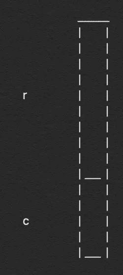
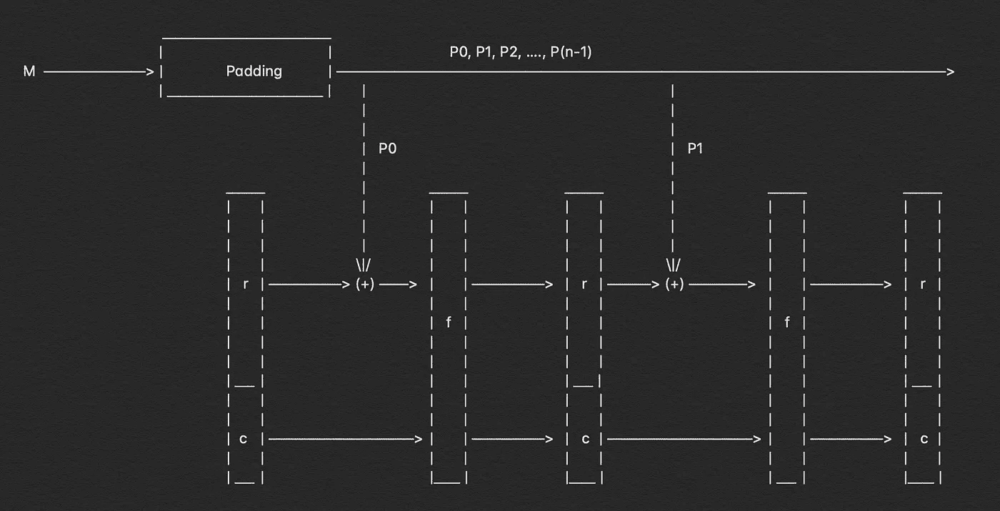

# 分解:SHA-3 算法

> 原文：<https://infosecwriteups.com/breaking-down-sha-3-algorithm-70fe25e125b6?source=collection_archive---------0----------------------->


SHA-3 算法概述

## 看看引擎盖下面，了解它是如何工作的？

在过去的一个月里，我一直在写关于哈希算法的文章，这是“崩溃”系列的一个结尾。在我们当前场景中，有许多著名的散列算法。尤其是那些上来就争 SHA-3 头衔的。所以，为了让大家更好地了解最新最棒的哈希算法 SHA-3，让我回到过去，向大家解释一下它为什么会出现。


# 历史

大约在 21ˢᵗ世纪初，SHA-2 算法出现，SHA-1 算法已经受到理论上的挑战。很明显，在容易发现碰撞之前，这种情况不会持续很长时间。因此，在这一切之中，NIST 开始了一场寻找 SHA-2 更好继任者的竞赛，尽管它是安全的，现在也是。

寻找最佳和最有效的哈希算法的比赛开始了，从 64 份提交的申请中，[ *根据维基百科，51 份]。Keccak 通过了所有轮次，最终在 2015 年被选为 SHA-3 算法。它是由吉多·贝尔托尼、琼·代蒙、迈克尔·彼得斯和 T4 的吉勒·范·阿舍设计的。你应该读一读它的历史和它是如何形成的，这很有趣。

# 我们开始吧！

所以，那些不经常阅读我的文章的人，这篇文章是我的系列文章的继续，在我的系列文章中，我描述了散列算法以及它们是如何工作的。你可以看看我的其他文章，我在下面已经提到了。

> **分解:系列**
> 
> [*1。分解:MD5 算法*](https://medium.com/bugbountywriteup/breaking-down-md5-algorithm-92803c485d25)
> 
> [②*。分解:SHA-1 算法*](https://medium.com/bugbountywriteup/breaking-down-sha-1-algorithm-c152ed353de2)
> 
> [*3。分解:SHA-512 算法*](https://medium.com/@aditya12anand/breaking-down-sha-512-algorithm-1fdb9cc9413a)
> 
> [*4。分解:SHA-256 算法*](https://medium.com/bugbountywriteup/breaking-down-sha-256-algorithm-2ce61d86f7a3)

现在我们知道了为什么需要 SHA-3 以及它的历史。让我们看看它是如何工作的。

首先，我需要声明，Keccak 与之前的算法完全不同，所以我们需要以开放的态度来看待它，否则它可能会被证明有点难以理解。向上滚动，看看文章开头的图像，这将有助于我们了解整个算法的流程及其工作原理。

## 1.填料

这是一个与之前的哈希算法类似的过程。在我们开始散列我们的消息之前，我们需要确保它们是标准长度，为此我们执行填充过程。

在我们继续之前，我们需要知道我们需要满足的标准大小是什么，为此我们将看看 Keccak 如何计算状态大小。

```
b = 25 x 2ˡ ; b = state sizevalue of l = {0, 1, 2, 3, 4, 5, 6}
value of b = {25, 50, 100, 200, 400, 800, 1600}
```

对于 SHA-3，“l”的值被确定为 6。国家规模越大，它提供的安全性就越好。现在，基于‘l’的值，我们还决定对于填充消息的每个部分需要执行多少轮计算。

```
rounds = 12 + 2 x l
       = 12 + 12    ; as l = 6
       = 24         ; 24 rounds in total
```

现在，我们知道对于 SHA-3，我们将具有 1600 比特的状态大小，并且计算的回合数将是 24。

回到填充，我们需要根据我们要计算的散列长度将位附加到消息中。这些值应该是我将在下面提到的数字的倍数。现在只要记住这些值，我稍后会解释它们。

```
 Type        Output Length     Rate (r)         Capacity (c)
SHA3-224           224            1152              448
SHA3-256           256            1088              512
SHA3-384           384             832              768
SHA3-512           512             576             1024
```

填充需要以这样的方式完成，即在填充过程之后，对于相应的散列函数，填充消息的长度正好是“r”的倍数。

填充的第一个和最后一个比特将是“1 ”,而中间的所有比特将是“0”。在填充之后，它们被分成“n”个部分，例如 n 乘以 r 等于填充消息的长度。数学上它可以这样表示。

```
p = n x rp = length of message after padding
n = number of parts in which we divide 'p'
r = length of the rate
```

> **注意:**“r”和“c”的值之和总是等于 1600，即状态大小

## 2.国家规模



国家规模

我们现在知道，对于相应的散列长度，填充消息的长度正好是“r”的倍数，但是为了进一步理解，请看你左边的图像。图像中的“r”和“c”代表各自哈希算法的速率和容量。

因为填充的消息是“r”的精确倍数，并且我们需要执行模运算。所以，r 和 P₀的长度是一样的。

状态大小是“r”和“c”的总和，对于不同的哈希长度，它们具有不同的值。

## 3.吸收功能



吸收功能

SHA-3 算法可以大致分为两个不同的部分，吸收部分和压缩部分。吸收功能是 SHA-3 功能的两个主要步骤的第一部分。

我们称之为吸收函数的原因是，在 Keccak 算法的第一部分中，我们获取填充消息的所有值，我们已经将这些值分解为“n”个部分，并逐个消耗它们，以在最后给出输出。

我们执行此操作的方式是，在吸收函数中输入“r”长度的填充消息。我们从 P₀和“r”之间的模运算开始，“r”的初始值都是“0”位。一旦模运算完成，我们就把值传递给实际的吸收函数开始的函数。

在函数内部，我们反复执行相同的一组五个操作 24 次。一旦所有回合结束，我们就分离“r”和“c”位，然后再次执行模运算，函数再次开始。

让我们看看这五个函数的伪代码:-

***θ*(θ):伪码**

```
for x in 0…4
C[x] = A[x,0] xor A[x,1] xor A[x,2] xor A[x,3] xor A[x,4], for x in 0…4
D[x] = C[x-1] xor rot(C[x+1],1), for (x,y) in (0…4,0…4)
A[x,y] = A[x,y] xor D[x]
```

***ρ*(rho)&*π*(pi):伪码**

```
for (x,y) in (0…4,0…4)
B[y,2*x+3*y] = rot(A[x,y], r[x,y]),
```

***χ* (chi):伪码**

```
for (x,y) in (0…4,0…4)
A[x,y] = B[x,y] xor ((not B[x+1,y]) and B[x+2,y])
```

***ι* (iota):伪代码**

```
A[0,0] = A[0,0] xor RC
```

我很难用语言解释这些功能，所以我展示了 Keccak 团队的[网站](https://keccak.team/keccak_specs_summary.html)上的伪代码。阅读他们的论文以更好地理解整个概念。

这五个功能反复进行 24 次。24 轮计算结束后，我们得到 1600 位，然后根据“r”和“c”位的长度将其分离，该过程继续进行。

## 4.挤压功能

在我们到达吸收函数的末尾之后，挤压函数立即开始。我们称之为挤压函数，因为这是我们提取散列消息的步骤。我们提取它的方法非常简单，容易理解。


挤压函数

计算哈希值时，我们已经知道哈希值的输出长度，可能是 224、256、384 或 512。完成吸收功能后，我们得到一个最终的 1600 位长度的输出。我们根据“r”和“c”位的长度来分离输出，这取决于我们试图计算的哈希值，这导致了我们的输出。

# 输出

现在，我们有了“r”和“c”的值，然后我们根据哈希算法从“r”中提取前几位，因此对于 SHA3–256 算法，我们将从“r”的 1088 位中提取前 256 位，对于 SHA3–512，我们将从“r”的 576 位中提取前 512 位。从“r”的第一位提取的值是整个消息的散列。

# 结论

SHA-3 / Keccak 算法是最安全和有效的散列算法之一，一些人声称它在未来 20 - 30 年内不会被破解。量子计算世界的发展可能会缩短这个时间框架，但它仍然是我们目前得到的最好的哈希算法之一。

那么，让我们再来看一下 SHA-3 算法的整个功能，并允许我用一个很长的段落来解释整个事情。

> 像往常一样，我们的第一步是计算消息的长度，然后根据我们选择的散列长度进行填充。我们添加到消息中的填充位以“1”开始和结束，中间的所有位都是“0”。填充完成后，我们将它分成“n”个块，每个块的长度为“r ”,值“r”将再次取决于哈希长度。填充位从 P₀开始，然后是 P₁，直到 Pₙ-₁.我们从 P₀开始，首先用最初全为“0”的“r”进行模运算。一旦模运算完成，我们就开始 24 轮，每轮由这五个函数组成 **θ** 、 **ρ** 、 **π** 、 **χ** 和 **ι** 。在所有这些轮次之后，我们得到接下来的 1600 位，然后我们根据散列长度将其分成“r”和“c”位。这种 24 轮的计算在吸收函数中发生“n”次，然后我们到达挤压函数。从一开始，我们就知道执行哈希运算时输出的长度，因此我们从“r”中提取这些精确的位数，这就是我们完整的哈希值。

这就是发生在 SHA-3 算法中的整个操作的简短版本。

如果你喜欢，请鼓掌让我们合作。获取、设置、破解！

**网站**:[aditya12anand.com](https://www.aditya12anand.com/)|**捐款**:[paypal.me/aditya12anand](https://paypal.me/aditya12anand)
**电报**:[https://t.me/aditya12anand](https://t.me/aditya12anand)
**推特**:[twitter.com/aditya12anand](https://twitter.com/aditya12anand?source=post_page---------------------------)
**LinkedIn**:[linkedin.com/in/aditya12anand/](https://www.linkedin.com/in/aditya12anand/?source=post_page---------------------------)
**电子邮箱**:aditya12anand@protonmail.com

*关注* [*Infosec 报道*](https://medium.com/bugbountywriteup) *获取更多此类精彩报道。*

[](https://medium.com/bugbountywriteup) [## 信息安全报道

### 收集了世界上最好的黑客的文章，主题从 bug 奖金和 CTF 到 vulnhub…

medium.com](https://medium.com/bugbountywriteup)