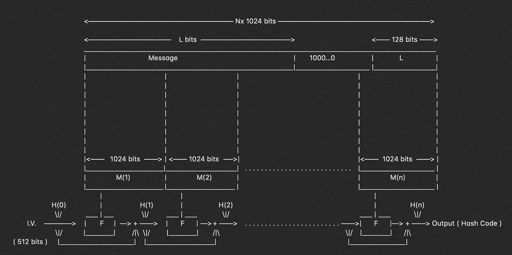
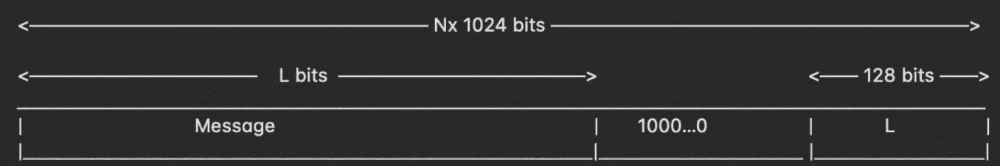
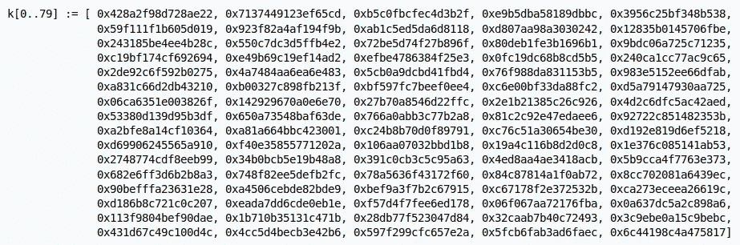
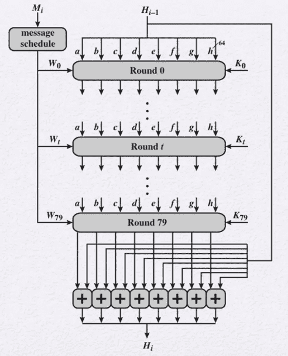
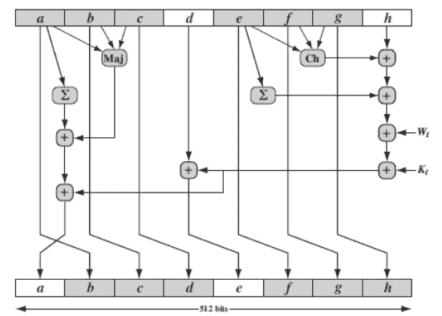

# 分解:SHA-512 算法

> 原文：<https://infosecwriteups.com/breaking-down-sha-512-algorithm-1fdb9cc9413a?source=collection_archive---------0----------------------->



SHA-512 算法

## 看看引擎盖下面，了解它是如何工作的？

在过去的几周里，我一直在撰写“*分解*”系列文章，其中我详细解释了哈希算法，以便任何阅读它的人都能理解创建哈希输出所发生的每一点操作。

> **分解:系列**
> 
> [1。分解:MD5 算法](https://medium.com/bugbountywriteup/breaking-down-md5-algorithm-92803c485d25)
> 
> [2。分解:SHA-1 算法](https://medium.com/bugbountywriteup/breaking-down-sha-1-algorithm-c152ed353de2)

这是这个系列的第三部分，在这里我试图解释 SHA-512 算法，以及为什么它仍然无法破解，而 SHA-1 和 MD5 已经被破解。


# 我们开始吧！

所以，我将一步一步地分解算法的整个工作过程。SHA-512 的整体功能与 SHA-256 非常相似(很可能是我的下一篇文章)，所以如果你已经了解它，理解 SHA-512 算法将非常简单。

## 1.追加:填充位

第一步是执行填充函数，在该函数中，我们将一定数量的位附加到明文消息中以增加其长度，该长度应该正好比 1024 的整数倍少 128 位。

当我们在消息末尾添加这些位时，我们从“1”开始，然后继续添加“0 ”,直到到达需要在填充下添加的最后一位，并在此之后保留 128 位。



## 2.追加:长度位

现在，我们将剩余的 128 位添加到整个块中，使其正好是 1024 的倍数，这样整个事情就可以分解为“n”个 1024 消息块，我们将对其进行操作。计算其余 128 位的方法是用 2⁶⁴.计算模

完成后，我们将它附加到填充位和原始消息，使块的总长度为“n x 1024”。

## 3.初始化缓冲区

现在，我们有了需要散列的“n x 1024”长度的位消息，让我们把注意力集中在散列函数本身的各个部分。为了进行所需的散列和计算，我们需要初始化一些默认值。

```
a = 0x6a09e667f3bcc908
b = 0xbb67ae8584caa73b
c = 0x3c6ef372fe94f82b
d = 0xa54ff53a5f1d36f1
e = 0x510e527fade682d1
f = 0x9b05688c2b3e6c1f
g = 0x1f83d9abfb41bd6b
h = 0x5be0cd19137e2179
```

这些是我们需要的缓冲区的值，我们还需要初始化其他的默认值。这些是我们将要用到的“k”变量的值。



在我们将要探讨的下一步中，您将会清楚地了解创建这些值的原因。

## 4.压缩功能

现在，我们需要对散列函数有一个更广泛的了解，以便我们能够理解正在发生的事情。首先，我们取 1024 比特的消息，并将完整的消息分成‘n’比特。



看一下上面的图像，你会知道我们将进行 80 轮运算，输入 W 将从 1024 位得到，这 1024 位被进一步分成 16 个部分。从 0 到 15 的 W 值是明文中的消息，但是从 16 到 79 的 W 值是根据前面的 16 个块计算的，我们有下面提到的公式。

```
**W(t) = σ¹(Wᵗ⁻²) + Wᵗ⁻⁷ +** **σ⁰(Wᵗ⁻¹⁵) + Wᵗ⁻¹⁶**
where,
 **σ⁰(x)**    = ROTR¹(x) ϕ ROTR⁸(x) ϕ SHR⁷(x)
 **σ¹(x)**    = ROTR¹⁹(x) ϕ ROTR⁶¹(x) ϕ SHR⁶(x)
 **ROTRⁿ(x)** = Circular right rotation of 'x' by 'n' bits
 **SHRⁿ(x)**  = Circular right shift of 'x' by 'n' bits
 **ϕ**        = addition modulo 2⁶⁴
```

现在我们知道了获取 0 到 79 的 W 值的方法，并且已经有了从 0 到 79 的所有轮次的 K 值，我们可以继续下去，看看我们在哪里以及如何为散列计算输入这些值。



“圆”的描绘

在上图中，我们可以确切地看到每一轮发生了什么，现在我们已经有了每个函数的值和公式，我们可以执行整个哈希过程。

```
Ch(E, F, G) = (E AND F) XOR ((NOT E) AND G)
Ma(A, B, C) = (A AND B) XOR (A AND C) XOR (B AND C)
    ∑(A)    = (A >>> 2) XOR (A >>> 13) XOR (A >>> 22)
    ∑(E)    = (E >>> 6) XOR (E >>> 11) XOR (E >>> 25)
     +      = addition modulo 2⁶⁴
```

这些功能在 80 轮中的每一轮都要重复执行 n 次。

## 5.输出

每一轮的输出充当下一轮的输入，并且该过程继续进行，直到消息的最后一位通过一轮，并且来自最后消息的最后块的输出是散列码。输出的长度为 512 位。

# 结论

在 MD5 和 SHA-1 等哈希算法被破解之后，SHA-512 哈希算法是目前最好、最安全的哈希算法之一。由于其复杂的性质，它没有被很好地接受，SHA-256 是一个通用标准，但行业正在缓慢地向这种散列算法发展。

让我们看看 SHA-512 散列算法的整个工作过程，并以简洁的方式了解它是如何工作的。

> 需要被散列的消息，我们首先附加几个比特到它，使它正好比 1024 的倍数少 128 比特。在我们用 2⁶⁴.计算原始消息的模之后，添加剩余的 128 位一旦我们这样做了，我们就把它们分成 n 个 1024 比特的块。在此之后，我们将 1024 位块一个接一个地传递到压缩函数中，即 80 轮运算的集合。这里我们进一步将它们分成 16 部分，每部分 64 位。64 位的这 16 个部分在每轮运算中以顺序方式充当输入，并且使用前 16 个部分计算 16 到 79 的 W。我们已经有了每一轮的默认值“K”。现在，我们开始一轮又一轮的操作，每一轮都需要反复执行。一轮的输出被作为下一轮的输入，并且该过程继续重复，直到最后一个消息块的第 80 轮发生。最后一个消息块最后一轮后得到的输出就是整个消息的哈希码。

这就是发生在 SHA-512 算法中的整个运算的简短版本。

如果你喜欢，请鼓掌&让我们合作吧。获取、设置、破解！

**网站**:[aditya12anand.com](https://www.aditya12anand.com/)|**捐款**:[paypal.me/aditya12anand](https://paypal.me/aditya12anand)
**电报**:[https://t.me/aditya12anand](https://t.me/aditya12anand)
**推特**:[twitter.com/aditya12anand](https://twitter.com/aditya12anand?source=post_page---------------------------)
**LinkedIn**:[linkedin.com/in/aditya12anand/](https://www.linkedin.com/in/aditya12anand/?source=post_page---------------------------)
**电子邮件**:aditya12anand@protonmail.com

*关注* [*Infosec 报道*](https://medium.com/bugbountywriteup) *获取更多此类精彩报道。*

[](https://medium.com/bugbountywriteup) [## 信息安全报道

### 收集了世界上最好的黑客的文章，主题从 bug 奖金和 CTF 到 vulnhub…

medium.com](https://medium.com/bugbountywriteup)