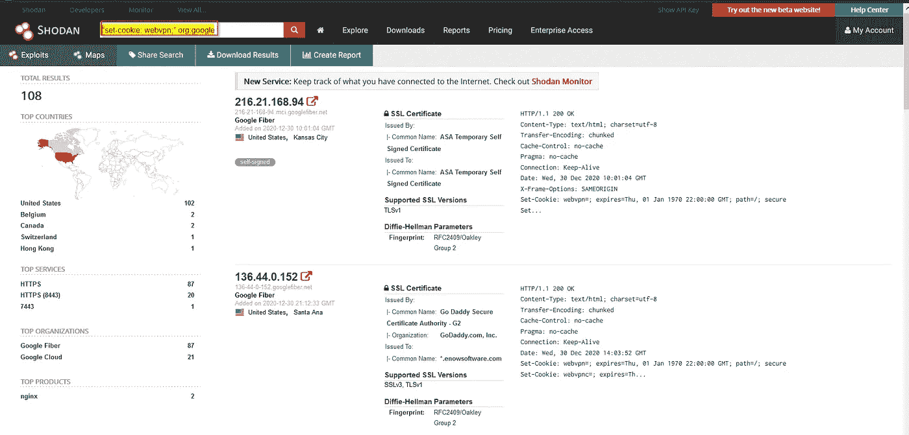
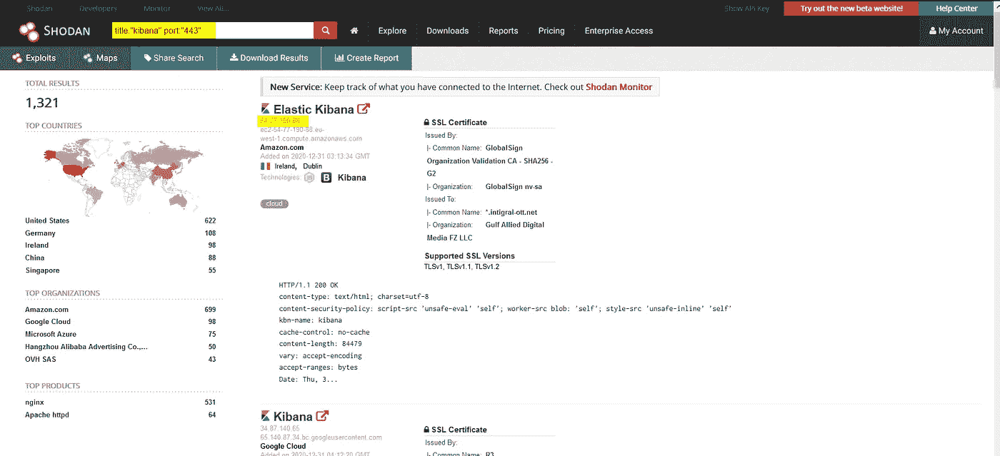

# 用 Shodan 破互联网:我们爱 P1s！

> 原文：<https://infosecwriteups.com/breaking-the-internet-with-shodan-we-love-p1s-6815a664392a?source=collection_archive---------0----------------------->

嗨，我的黑客伙伴们，我的伙伴们！欢迎来到我的新博客！我们在这里，结束了我们渴望已久的一年。**是的！！我们挺过了 2k20！！我希望你们都做得很好，并努力投入到你们正在做的事情中。我想以回馈社会来结束这一年，现在我们开始吧！带着这张纸条，让我们继续前进。**

所以，正如标题所说，这个博客将基于我的 Shodan hacks，如果你是新手的话，“ *Shodan 是一个搜索引擎，让用户使用各种过滤器*找到连接到互联网的特定类型的计算机。”根据谷歌搜索。但对我来说，它在你的奖金中占有更大的位置。你可以在他们的官方网站 [**这里**](https://www.shodan.io) 了解更多。

问题是，我们为什么以及如何使用它？嗯，tbh，我把它用于 CVE 和开放端口，但是你也可以用它做很多事情，比如服务器枚举，过滤目标等等。不多说为什么，因为这是个人选择。你可以谷歌一下，找到一些非常酷的东西。因此，我将谈论如何，这是我的工作方式。一旦你研究了事物是如何工作的，你就自动知道为什么了:)

好吧，假设你必须在你的目标上找到一个著名的 CVE，这显然是一个大组织(遗憾的是你在一个小目标上找不到太多:|)，让我们假设谷歌。所以，我们有一些 Shodan 呆子去找他们。我发现这个呆子很有用:-**“set-cookie:web VPN；”**而且我在 bugcrowd 上举报了很多 P1(戴尔除外)。然而，已经有人在寻找这个目标，而且在很多情况下，这个目标是被骗的。但这不是问题的关键，不管它是有效的还是重复的，重要的是你是否从中找到了什么。如果你做到了，GZ，你就赢了！这里有一个例子，你如何把这个呆子在 Shodan:—

这并不意味着你可以报告你在这里发现的一切。需要检查两件事:1。如果目标确实属于该组织，或者只是一个以该组织的名义使用 IP 地址的用户。2.如果你能利用它。一旦你搜索了关键词，你就会在 Twitter 上找到与之相关的漏洞，我把这个作为你的家庭作业。

另一个搜索感兴趣的东西的例子是，让我们假设我们正在搜索与 **Kibana** 相关的东西。Kibana 是一个用于 Elasticsearch 的开源数据可视化仪表板。它在 Elasticsearch 集群上索引的内容之上提供可视化功能。用户可以在大量数据的基础上创建条形图、折线图和散点图，或者饼图和地图。所以有时你会发现他们的日志实例是用这个傻瓜打开的:**标题:“基巴纳”端口:“443”。**再次检查目标是否与组织相关，然后才前进。以下是相同的截图:)

此外，确保你有一个 **Shodan 付费会员**，这确实有助于你的赏金，否则你将无法做很多事情。然而，你可以在他们的网站上了解更多。这里有一些更有趣的呆子:-

**“230 登录成功”端口:“21”**

**vsftpd 2.3.4 端口:21**

**230“匿名@”登录成功**

这些只是让你知道如何在 web 应用程序搜索中使用它的一些呆子。你总是可以从谷歌上删除很多东西。有很多傻瓜，你只需要把他们放在你能得到结果的地方。再说一次，像多金这样的事情需要很多时间，如果你想得到什么，你可能需要很多时间来投入。不管是 Google Dorking，GitHub，还是 Shodan，你都得有那个耐心。我可以向你保证，这将是 P1s 或 P2s 的所有发现，我们喜欢这样，对不对？

就这样，我想在这里结束这一年。我希望你从中有所收获，如果有，请在下面给我鼓掌。还有，你可以在 twitter 上用这个用户名关注我:- **@manasH4rsh。**

祝大家新年快乐 2k21！抓住一些令人敬畏的奖金今年，我看到你在名人堂！

狩猎愉快，保重！

再见，❤