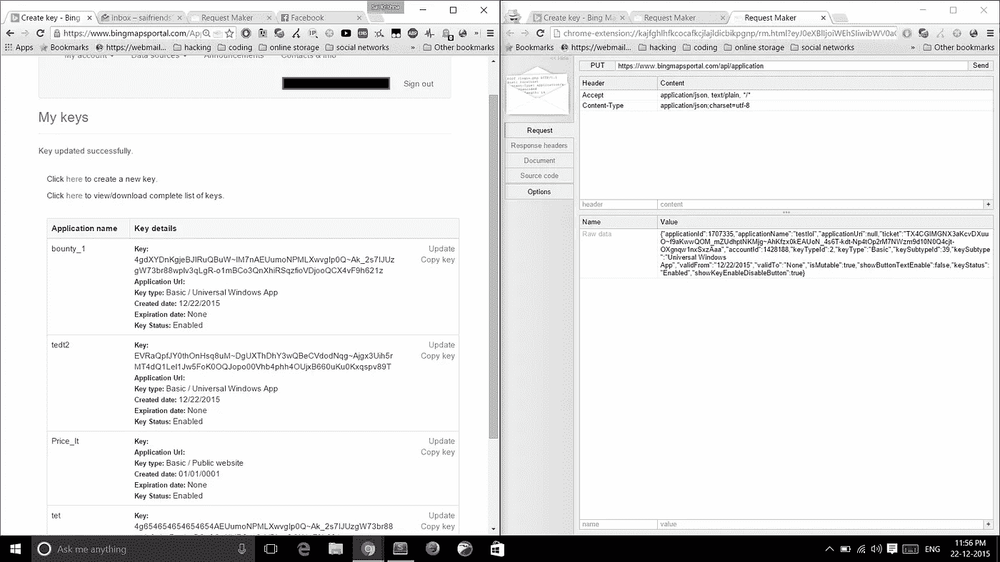
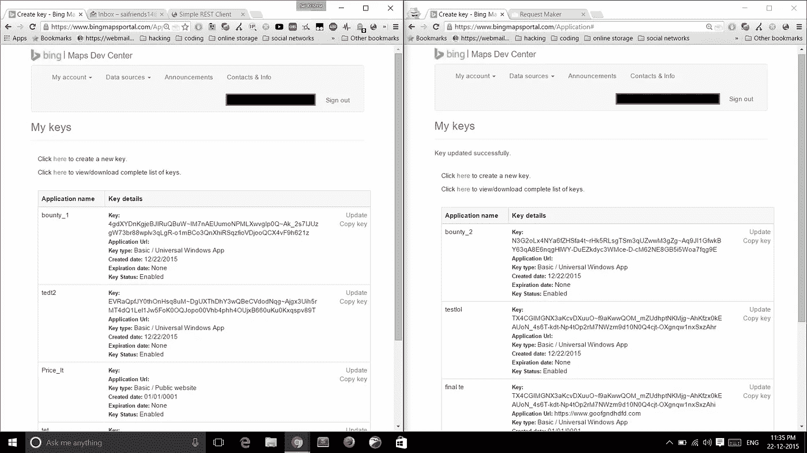
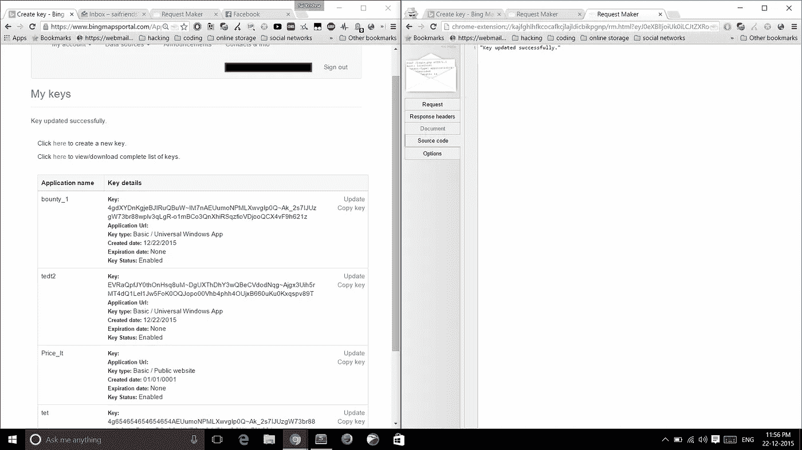
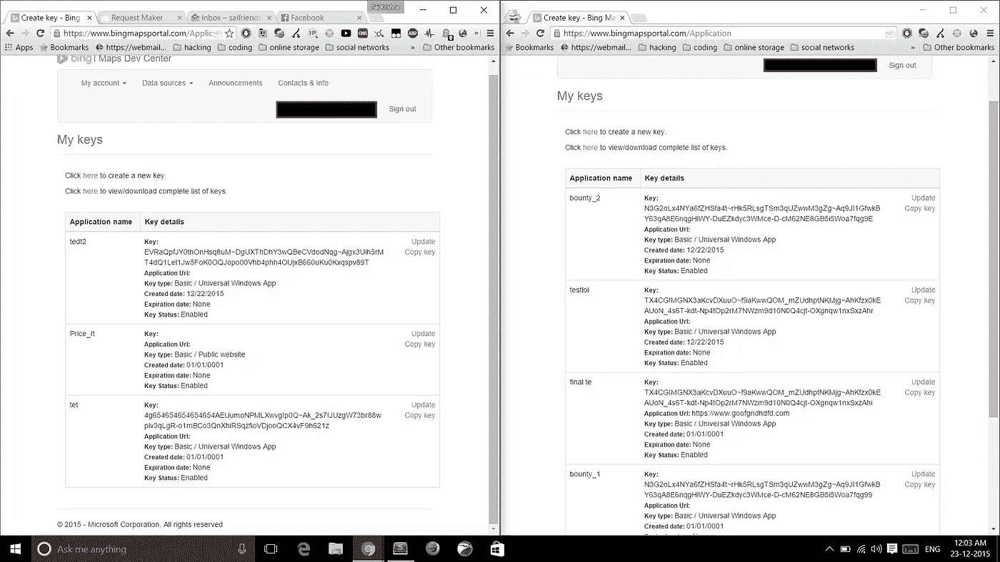

# bingmapsportal 中的中断访问控制

> 原文：<https://infosecwriteups.com/broken-access-control-in-bingmapsportal-a012bffd2c43?source=collection_archive---------2----------------------->

大家好，

这篇博文是关于我向微软报告的第三个漏洞。

你可以在 [bingmapsportal](https://www.bingmapsportal.com/) 中管理你的 Bing maps API 密钥，在更新应用程序的名称时，一些东西引起了我的注意。

**概念验证:-**

每当你改变一些东西，比如应用程序的名字等等，网站就会使用一个 **PUT** 请求来执行更新。

看起来是这样的。

屏幕上显示程序运行的图片

如您所见，它是这样发送 JSON 数据的

> `{“applicationId”:1707630,”applicationName”:”testing xml”,”applicationUri”:null,”ticket”:”bjc7REBGwm6NNTL3Ot5R~INcJpFU5r-KxjNtDZK2Nkg~ApWBovtZEhj4-Uodq6qTluDURLTLmTpJVOTl_V-4l8f6fnFO1KQlIlmLAijCJgXL”,”accountId”:1418767,”keyTypeId”: 2,“keyType”:”Basic”,”keySubtypeId”:39,”keySubtype”:”Universal Windows App”,”validFrom”:”12/23/2015″,”validTo”:”None”,”isMutable”:true,” showButtonTextEnable”:false,”keyStatus”:”Enabled”,”showKeyEnableDisableButton”:true}`

**PUT** 和 **POST** 请求的区别在于，PUT 会覆盖之前存在的内容。

引起我注意的是***application id****和***account id****。*如果我更改应用程序 ID 会怎么样？谁知道让我们试试。*

*所以，我让我妹妹使用她的 outlook 帐户，并用她的帐户创建了一个应用程序密钥。*

**

*我在我的账户中创建了一个名为 ***bounty_1*** 的应用，在她的账户中创建了一个名为 ***bounty_2*** 的应用。*

*然后我截取了一个**用我姐姐的账号放**的请求，把***Application Id***从 ***bounty_2 的*** 应用 ID 改为 ***bounty_1 的*** 应用 ID*

**

*而回应是“`*Key updated successfully*`”。*

*我就像什么！！！！还刷新了我的账号。*

**

*令我惊讶的是，申请从我的账户转到了我姐姐的账户。*

*后端不会验证攻击者是否拥有该应用程序。*

*我向微软报告了这个问题，现在已经打了补丁。*

***时间线:-***

*2015 年 12 月 23 日—发送初步报告。*

*在接下来的几天里做了一些后续工作*

*2016 年 5 月 1 日—询问任何更新。*

*2016 年 6 月 1 日—得到回复说没有更新。*

*2016 年 1 月 21 日—再次询问是否有任何更新*

*22-01–2016-收到回复称问题已修复*

*我将于 2016 年 1 月**月**被列入微软 [**名人堂**](https://technet.microsoft.com/en-in/security/cc308575)*

*感谢您的阅读。*

*如果你有任何疑问，请随时联系我。*

*和平:D*

**原载于 2016 年 1 月 23 日 kmskrishna.wordpress.com**的* [*。*](https://kmskrishna.wordpress.com/2016/01/23/microsoft-hall-of-fame-for-the-2nd-time/)*