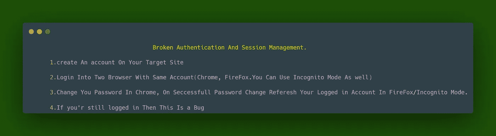
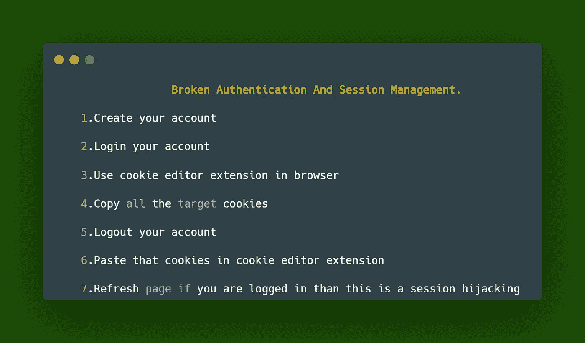
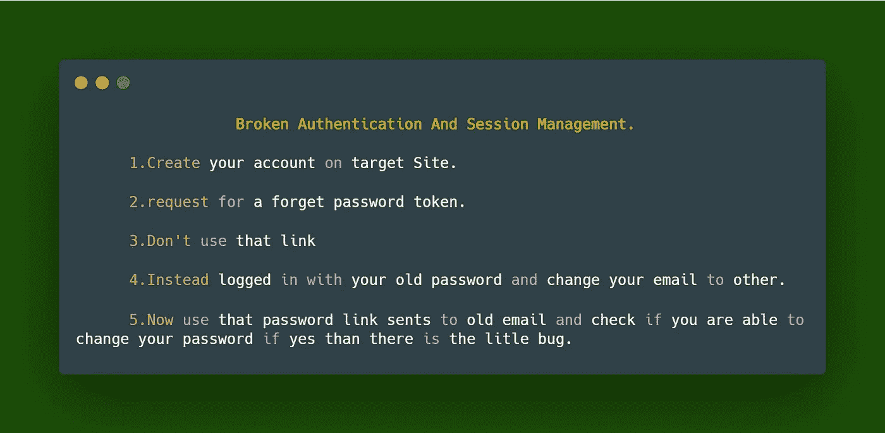
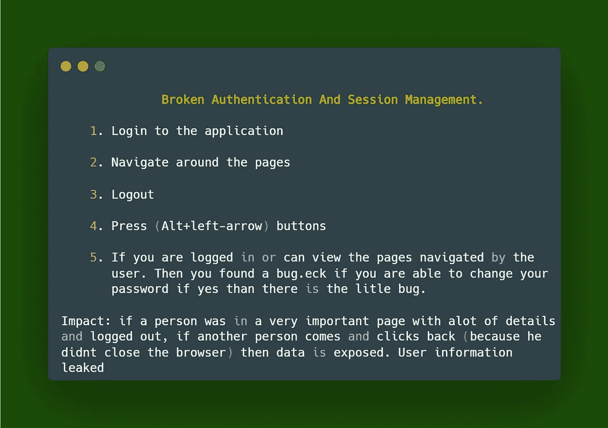
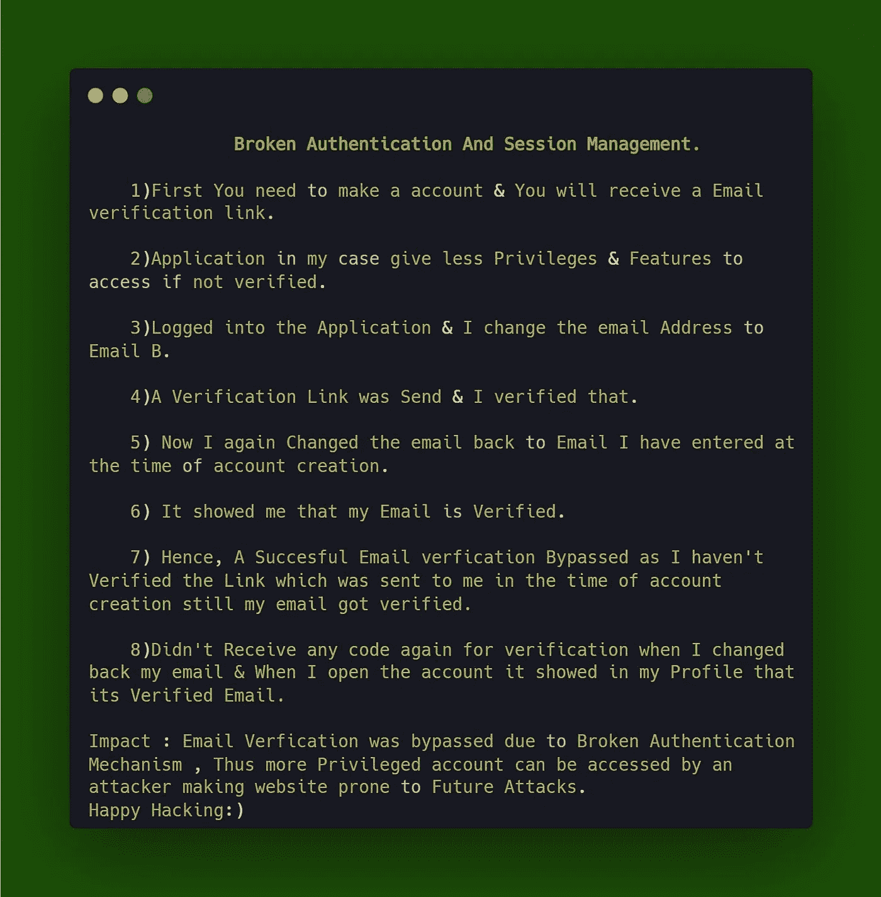
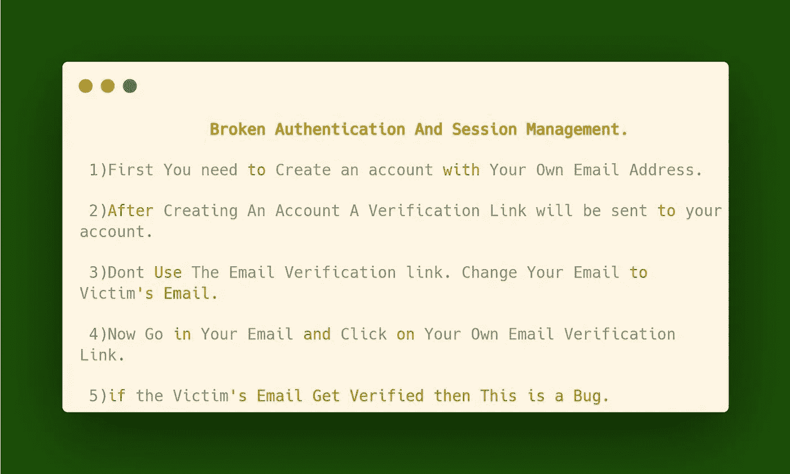
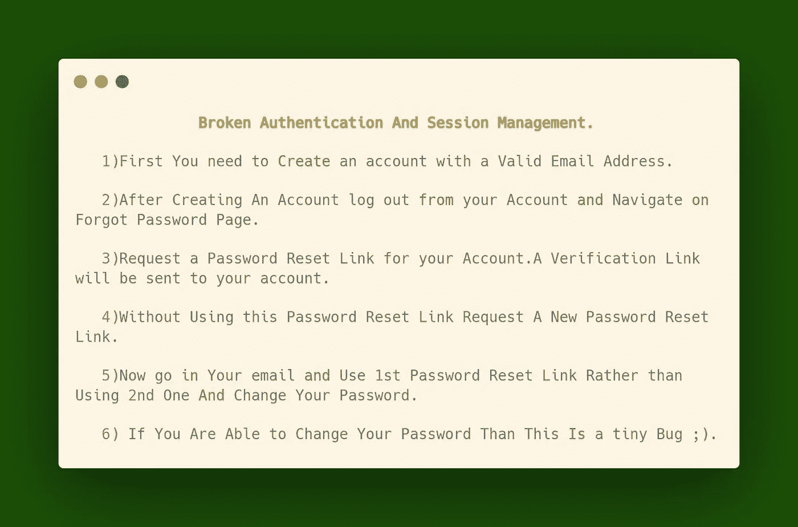
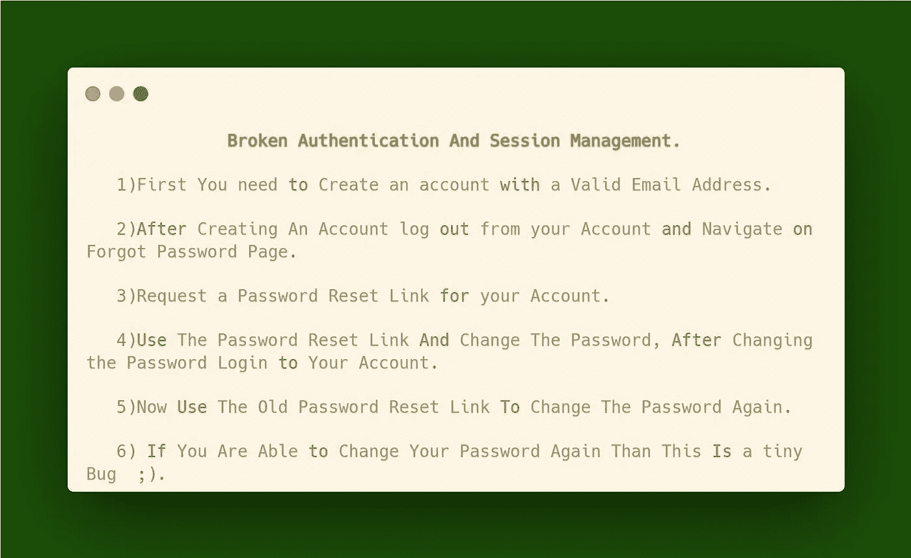

# 身份验证和会话管理中断

> 原文：<https://infosecwriteups.com/broken-authentication-and-session-management-dbd4402b9ffa?source=collection_archive---------4----------------------->

> 身份验证和会话管理中断

**逐步解释**

**第一个场景**

**📌密码更改后旧会话不会过期**

**被破坏的认证和会话管理**

**第二个场景**

**📌会话劫持(预期行为)**

**影响:**如果攻击者获得受害者的 cookies，将导致账户被接管。

**身份验证和会话管理中断**

**第三种情况**

**📌密码重置令牌不会过期(不安全配置)**

**被破坏的认证和会话管理**

**第四种情况**

**📌服务器安全错误配置**

->缺少安全标题->安全页面的缓存控制

**身份验证和会话管理中断**

**第五种情况**

**📌绕过电子邮件验证的身份验证被破坏(P4):
类别:P4** > >身份验证和会话管理被破坏> >无法在密码重置和/或更改时使会话> >无效

**身份验证和会话管理中断**

**第六个场景**

**📌绕过电子邮件验证(P3/P4)**

**影响:**绕过电子邮件验证

**被破坏的认证和会话管理**

**第七个场景**

**📌旧密码重置令牌在请求新密码时不会过期(有时是 P4)**

注意:一些公司不会接受它作为有效发行。

**被破坏的认证和会话管理**

**第八种场景**

**📌密码重置令牌在密码更改后不会过期(P4):**

**被破坏的认证和会话管理**

感谢你们阅读这篇文章——祝狩猎愉快🐞

资源:谷歌& YouTube

**作者:** [法尔汉](https://mobile.twitter.com/FaniMalikHack) &攻略

**演职员表:** [阿布舍克·米娜](https://mobile.twitter.com/Aacle_)

**跟我来:** [萨蒂亚·普拉卡什](https://mobile.twitter.com/0xKayala)