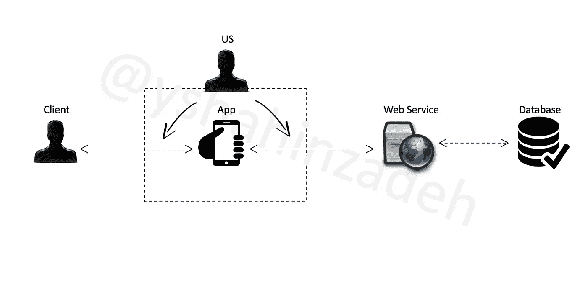
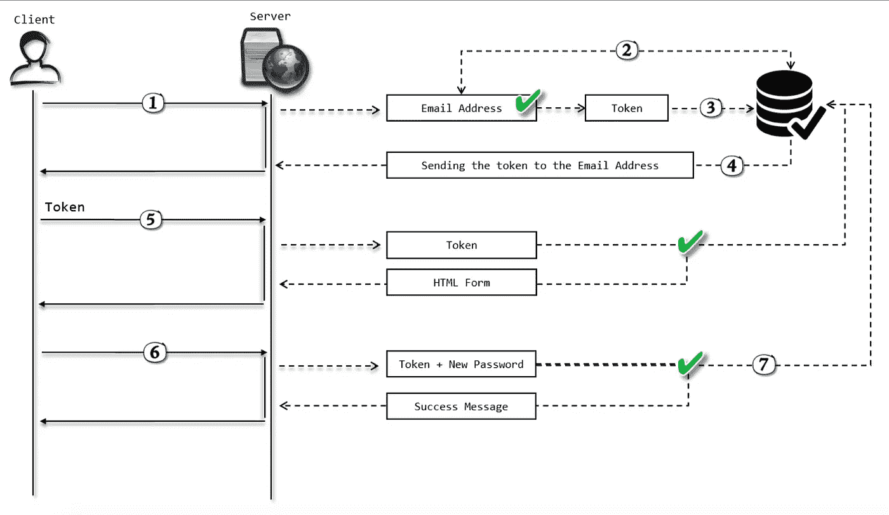
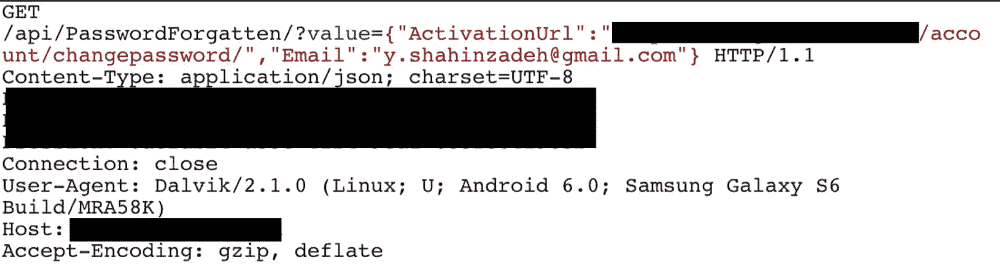
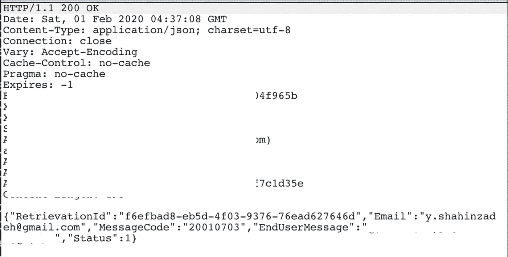

# 移动应用中的不可靠认证

> 原文：<https://infosecwriteups.com/broken-authentication-in-mobile-application-9f470513a4ab?source=collection_archive---------0----------------------->

几个月前，我有一个移动应用程序的渗透测试项目。我发现了一个有趣的漏洞，使我能够危害他们系统中的任何帐户。我在应用程序和互联网之间建立了代理，这样我就可以在 Burp 套件中拦截请求和响应:

我浏览了密码重置部分，流程图如下图所示:

1.  用户键入电子邮件地址并按回车键
2.  后端确保电子邮件地址存在
3.  后端生成一个唯一的令牌，并将其保存在数据库中
4.  后端将令牌发送到用户输入的电子邮件地址
5.  用户点击重置密码链接，后端验证令牌，如果是真的，就会显示 HTML 表单
6.  用户填写密码字段，新密码和令牌被发送到服务器
7.  后端验证令牌，然后更改密码

第四部分提出的漏洞，其中后端向用户显示了重置密码令牌:

因此，通过知道令牌，任何帐户的密码更改只有通过知道帐户的电子邮件地址才是可能的。到目前为止，我在 bug bounty 程序中看到过这种类型的缺陷。这里有一个优步 10k 的例子:

 [## 优步在 HackerOne 上披露:允许密码重置令牌泄露…

### 一个有效的优步帐户的电子邮件地址，有可能接管该帐户，因为重置令牌是…

hackerone.com](https://hackerone.com/reports/173551) 

详细信息:

 [## 优步存在一个严重的不正确身份验证漏洞，使得任何帐户都可以重置密码

### 意大利安全专家 Vincenzo C. Aka @Procode701 在 7 个月前发现了 UBER 中的一个严重漏洞…

securityaffairs.co](https://securityaffairs.co/wordpress/59210/hacking/uber-improper-authentication.html)