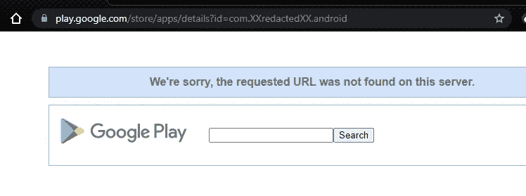
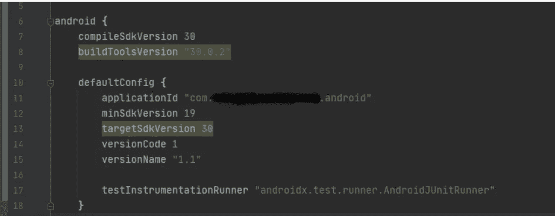
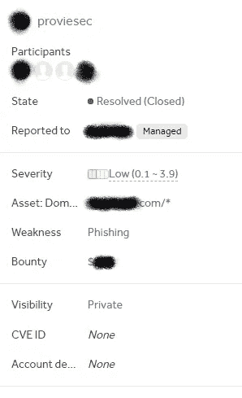

# 断链劫持——404 谷歌 Play 商店——XXX 美元赏金

> 原文：<https://infosecwriteups.com/broken-link-hijacking-404-google-play-store-xxx-bounty-96e79a8dfd71?source=collection_archive---------2----------------------->

大家好👋这是我的第一篇文章，我将告诉你我是如何因为一次简单的谷歌 Play 商店断链劫持而获得 xxx 美元赏金的。

# 什么是断链劫持？

只要目标链接到过期的域或页面，就会出现断链劫持(BLH)。断链劫持有两种形式，反射和存储。这个问题已经在野外被利用了无数次，但令人惊讶的是，很少有研究人员积极地在 bug bounty 程序中寻找断开的链接。

下面是我的故事:

我在一家大公司的网站上启动了我的“断链劫持”扫描器(你可以在文章的最后找到工具)。有了这个，我找到了几个链接，但有一个链接引起了我的兴趣。这是一个指向谷歌 Play 商店的状态 404(未找到)链接。由于我自己已经开发了应用程序，我知道 Play Store 链接是唯一的，并且对应于应用程序的包名。所以我仔细看了一下，能够采纳这个链接。我接手链接后，报告了 bug，甚至还因此获得了奖励。

# 复制步骤:

1.  我访问 https://redacted.com/about(redacted.com)的主页，因为我不被允许提及真实的公司名称。)
2.  点击“Android 手机应用”
3.  然后这个链接指向了一个状态 404 页面(没有找到——见下图):【https://play.google.com/store/apps/details? id=com。XXredactedXX.android
4.  由于应用程序名称不在应用程序商店中，有人可以简单地接管这个名称。

我检查了名字(com。android)仍然是免费的，因为它是免费的，所以我注册了它。下面是一个在谷歌 Play 商店注册名字的好指南:[https://support . Google . com/Google play/Android-developer/answer/9859152？hl=en](https://support.google.com/googleplay/android-developer/answer/9859152?hl=en)

# 我为什么要链接呢？

“包名”是一个 ID 参数，位于您的应用程序在 Play Store 上的网页 URL 中。它只是来自您或您的开发人员将在 Google Play 控制台中输入的字段。“=”符号后面的字母是应用程序的包名。(例如，以粗体显示的脸书 Lite 包名称:https://play.google.com/store/apps/details?id=**com . Facebook . Lite**HL = en&GL = US)

applocationId 名称是软件包名称。

# 影响

受害者可以通过链接转发、搜索引擎或网络钓鱼邮件等方式访问该页面。如果他现在想下载应用程序，攻击者可以将损坏的应用程序加载到应用程序商店。这可能会损害公司的声誉或窃取登录数据。

**时间线:**

提交日期:2021 年 8 月 5 日

*接受*:2021 年 8 月 10 日

*审判日*:2021 年 8 月 19 日

*已解决*:2021 年 10 月 7 日

# 工具/报告

你如何找到断开的链接？

 [## Provies Bug Bounty Dorking 网站

### 断链提示 provie.github.io](https://provie.github.io/Provies-Bug-Bounty-Dorking-Site-PBBDS/#Link%20Check)  [## GitHub-stevenvachon/broken-link-checker:在你的 HTML 中查找断开的链接、丢失的图片等。

### 在你的 HTML 中查找断开的链接，丢失的图片等。✅完整版:Unicode，重定向，压缩，基本…

github.com](https://github.com/stevenvachon/broken-link-checker) 

## 类似报告:

[https://hackerone.com/reports/1117079](https://hackerone.com/reports/1117079)https://hackerone.com/reports/1205604T2[https://hackerone.com/reports/1188629](https://hackerone.com/reports/1188629)https://hackerone.com/reports/1338457

# 摘要

还要在网站上寻找断开的链接。这种漏洞也能让你赚到一大笔钱，但却常常被忽视，还可能给公司带来致命的后果。

因为这是我的第一份报告，请随时问我，并建议我下次应该考虑的任何修改。不管怎样，谢谢你的阅读。👋