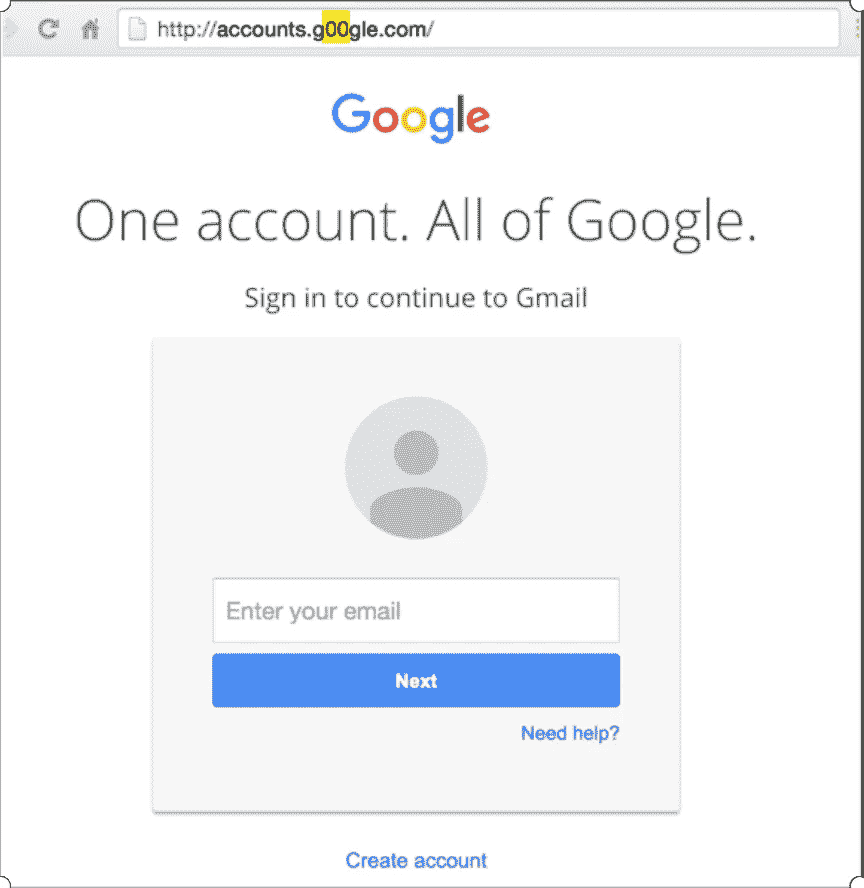
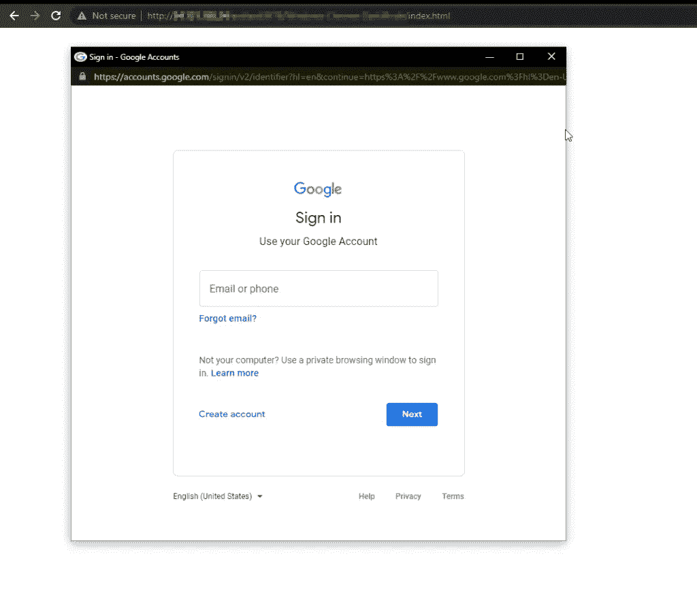
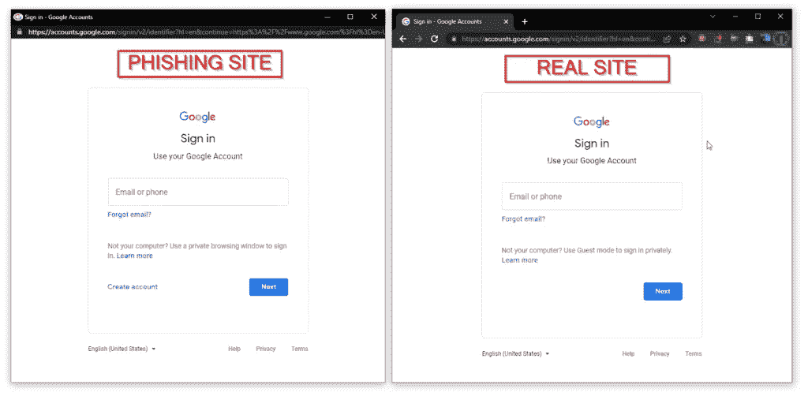

# 浏览器中的浏览器(BITB) —一种新生的网络钓鱼方法

> 原文：<https://infosecwriteups.com/browser-in-the-browser-bitb-a-new-born-phishing-methodology-81687c586f1b?source=collection_archive---------1----------------------->

# 介绍

在这个数字时代，没有我们可以信任的人！在过去十年中，网络钓鱼已经成为一种普遍的攻击，攻击者使用虚假的登录屏幕来获取用户的凭据。一种称为浏览器中浏览器(Browser-in-the-Browser，BITB)的新型网络钓鱼技术利用嵌入在网站上的第三方单点登录( [SSO](https://en.wikipedia.org/wiki/Single_sign-on) )选项，这些网站会发出用于身份验证的弹出窗口，如“使用谷歌、脸书、苹果或微软登录”。

# 传统网络钓鱼技术

[图片-1:旧的网络钓鱼方法]

在上图中，我们可以看到域名为 https://accounts.google.com/[的钓鱼页面。在这种形式的网络钓鱼攻击中，安全研究人员可以使用他们的域名或虚假的 URL 来定位网络钓鱼页面。](https://accounts.google.com/)

*   真实页面:【https://accounts.google.com/ 
*   钓鱼网页:[https://accounts.g00gle.com/](https://accounts.g00gle.com/)(零代替“o”)

因此，使用 URL 检测网络钓鱼页面相当简单。

# 现代网络钓鱼技术:浏览器中浏览器(BITB)攻击

一名安全研究人员[mr.d0x]发现了一种方法，黑客可以利用这种方法来获取用户凭证，从而使网络钓鱼企图更难被检测到。在这种形式的网络钓鱼攻击中，攻击者使用浏览器的弹出功能发起网络钓鱼攻击。任何人都可以在基本脚本的帮助下制作看起来像合法登录页面的虚假网站页面。他们构建了一个看起来像真实页面的 CSS+HTML 代码，因为新的弹出窗口没有 URL。

[图片-2:浏览器中的浏览器]

[图片 3:真实网站和网络钓鱼网站没有区别]

由于“悬停”JavaScript 功能，当用户将鼠标指针悬停在合法网站链接上时，会出现一个新的钓鱼窗口。

## 浏览器中的浏览器演示:

 [## BITM.mp4

### 浏览器中的浏览器演示

drive.google.com](https://drive.google.com/file/d/1YqTEGs5d6SNjrUtNvO0zgII3c-ACucVW/view?usp=sharing) 

因为这两张照片之间没有明显的区别，所以确定真正的现场进行验证是极具挑战性的。此外，一些 web 应用程序使用 windows 弹出功能进行身份验证，因此用户应该会在浏览器中看到弹出窗口。

*   真实页面:[https://accounts.google.com/signin/v2/identifierhl=en&continue = https % 3A % 2F % 2fwww . Google . com % 3F](https://accounts.google.com/signin/v2/identifier?hl=en&continue=https%3A%2F%2Fwww.google.com%3F)
*   钓鱼页面:[https://accounts.google.com/signin/v2/identifierhl=en&continue = https % 3A % 2F % 2fwww . Google . com % 3F](https://accounts.google.com/signin/v2/identifier?hl=en&continue=https%3A%2F%2Fwww.google.com%3F)(网址无差异)

在这种类型的攻击中，该网站的外观和 URL 将与真实网站相同。因此，找出差异将会很困难。

**请注意**:目前，Mac OS Chrome 和 Windows Chrome 浏览器都有公开漏洞。

# 结论

防范这种现代网络钓鱼攻击的唯一方法是提高警惕。确保安排“员工安全意识计划”