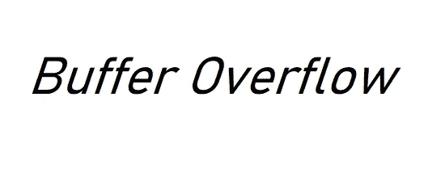

# 缓冲区溢出/溢出:Web 应用程序安全性

> 原文：<https://infosecwriteups.com/buffer-overflow-overrun-web-app-security-a7787080bc40?source=collection_archive---------3----------------------->

让我们从基础开始…

**什么是缓冲？**

缓冲区是在数据从一个地方传输到另一个地方时临时保存数据的内存存储区域。

**什么是缓冲区溢出/溢出？**

> B 缓冲区溢出是一个安全问题，当数据量超过内存缓冲区的存储容量，超出的数据可能会破坏内存中的邻近空间或改变其他数据时，就会出现这种情况。

**举例:**

username 的缓冲区设计为除了 15 个字节的输入之外，但是如果输入是 18 个字节，应用程序可能会将额外的 3 个字节的数据写入缓冲区边界之外，或者程序可能无法为缓冲区分配足够的空间，这可能会导致程序行为不可预测并生成不正确的结果、内存访问错误或崩溃。

**受缓冲区溢出影响的少数产品:**

*   NVIDIA Shield TV([CVE 2019-5699](https://nvd.nist.gov/vuln/detail/CVE-2019-5699))
*   马科斯·卡特琳娜([CVE-2019–8745](https://nvd.nist.gov/vuln/detail/CVE-2019-8745)
*   中国进出口银行([CVE-2019–16928](https://nvd.nist.gov/vuln/detail/CVE-2019-16928)
*   whatsapp([CVE-2019–3568](https://nvd.nist.gov/vuln/detail/CVE-2019-3568))
*   脉冲 VPN([CVE-2019–11542](https://nvd.nist.gov/vuln/detail/CVE-2019-11542)

**类型:**

*   **堆栈缓冲区溢出**:堆栈上的数据以‘后进先出’的方式存储和检索，堆栈分配由操作系统管理，对堆栈的访问速度很快。更常见的是利用只在函数执行期间存在的堆栈内存。
*   **堆缓冲区溢出**:需要保留的内存量在运行时决定，由程序管理，而不是操作系统。这种方法更难实现，并且会使分配给程序的内存空间溢出，超出当前运行时操作所使用的内存。

**更容易受到攻击的语言:**

C 和 C++是两种非常容易受到缓冲区溢出攻击的语言。这些是依赖于开发者分配内存的低级语言，它们没有内置的保护措施来防止覆盖或访问内存中的数据。Mac OSX、Windows 和 Linux 都使用 C 和 C++编写的代码。

PERL、Java、JavaScript 和 C#等语言使用内置的安全机制，将缓冲区溢出的可能性降至最低。然而，它们并不完全安全。其中一些允许直接的内存操作，它们经常使用用 C/C++编写的核心函数。

**预防:**

*   不要相信用户的输入。
*   使用任何功能前，请检查输入长度。
*   静态代码扫描。
*   避免不安全的功能。
*   使用缓冲区溢出保护机制，如 [ASLR](https://en.wikipedia.org/wiki/Address_space_layout_randomization) 。
*   使用最新版本的组件。

**参考**:

 [## 什么是缓冲区溢出| Acunetix

### 当您向程序提供过多数据时，就会出现缓冲区溢出漏洞。过多的数据会破坏附近的空间…

www.acunetix.com](https://www.acunetix.com/blog/web-security-zone/what-is-buffer-overflow/)  [## 缓冲区溢出

### 请参阅 OWASP 关于缓冲区溢出攻击的文章。请参阅 OWASP 开发指南文章，了解如何避免缓冲区…

owasp.org](https://owasp.org/www-community/vulnerabilities/Buffer_Overflow)  [## 什么是缓冲区溢出|攻击类型和防范方法| Imperva

### 攻击者利用缓冲区溢出问题来改变执行路径，从而触发可能破坏…

www.imperva.com](https://www.imperva.com/learn/application-security/buffer-overflow/)