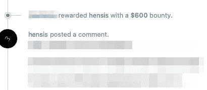

# 【Bug 赏金】600$信息泄露:获取任何用户的备份数据

> 原文：<https://infosecwriteups.com/bug-bounty-600-info-disclosure-a-token-is-not-the-same-on-all-endpoints-febf5b7ea745?source=collection_archive---------0----------------------->

## [朋友链接]通过备份端点中处理不当的令牌获取任何用户的备份数据

照片由[金奎大·穆伊吉](https://unsplash.com/@daanmooij?utm_source=medium&utm_medium=referral)在 [Unsplash](https://unsplash.com?utm_source=medium&utm_medium=referral) 上拍摄

没有中等付费订阅的朋友链接:[https://medium.com/@tdpdev/febf5b7ea745?source=friends_link&sk = 7994 ed 9 c 8 EAD 5b 580054463 f 37 CCA 804](https://medium.com/@tdpdev/febf5b7ea745?source=friends_link&sk=7994ed9c8ead5b580054463f37cca804)

大家好，我已经很久没有写东西了，因为我更关注奖金。我想和你分享我在 H1 的一个公共项目中发现的一个漏洞。然而，他们没有公开披露，所以我会编辑目标。

此外，这给出了一个重要的提示，我们稍后会看到。

所以，接近目标。每次我登录该应用程序时，都会有一个呼叫发送到备份端点。返回用户的备份数据。没有使用 cookies，只有 POST 数据中的一个令牌。看起来是这样的:`1234-randomletters.`

我没有想到任何有趣的攻击面，我尝试了另一个令牌，同样的长度，等等。跳过端点，直接使用应用程序。值得注意的是，我刚刚决定开始搜索那个程序，在我的过程中，我没有直接利用它，所以我没有花时间试图劫持令牌，或者使用任何其他技术来绕过它。

在使用该应用程序一段时间并通过 Burp 的目标窗口观察流程后，我注意到令牌用于执行任何操作，这是唯一需要的身份验证。但是，这毫无意义。所以我决定创建另一个帐户，看看有什么变化。

首先看到的是令牌长这样:`2323-randomletters`。而我之前用过的另一个用户是这样的:`2323-otherrandomletters`。注意到什么了吗？那个`2323`也是一样，看起来很有趣。为什么会一样？

我所做的是向中继器发送请求，然后在令牌中，我只放了`2323`，令我惊讶的是，我能够在没有令牌的情况下获得两个用户的备份数据，只有一个随机数。

然而，那不是一个 4 位数，而是一个 6 位数。这意味着暴力是一种选择，但并不实际。因此，为了产生更大的影响，我需要了解那是什么以及如何获得它。幸运的是，我有 burp pro:)，它使我能够在 HTTP 流量历史中搜索一个特定的单词，所以我搜索了`2323`它，发现它出现在一个 get 请求的响应中，该请求要求给定帐户的`machineID`。它返回了我用来泄露任何用户备份数据的数字。

然后，我想我可以使用它作为应用程序范围的认证旁路，因为所有的端点都使用该令牌。那应该是 P1。不幸的是，对我来说，唯一易受攻击的端点只有这一个。所以我以 P3 的名义提交了报告，报告在 16 个小时内得到了审核+奖励+解决。

我真的很想公开这个程序的名字，因为如果能提到那些高效且真正关心其安全性的程序就更好了。

## 时间表

11 月 8 日报道

11 月 9 日审判和奖励

11 月 9 日解决

# 外卖食品

如果您在许多不同的端点上看到一个参数，测试其中一个并发现该参数不容易受到攻击，也测试其他端点，您永远不知道一个端点是否由另一个开发人员编码，或者存在最小的语法问题，等等。一定要全部测试！

感谢阅读，如果你发现这有帮助，请与其他猎人分享。我最近开了一个推特账号:【https://twitter.com/_hensis_[，让我们连线吧！](https://twitter.com/_hensis_)