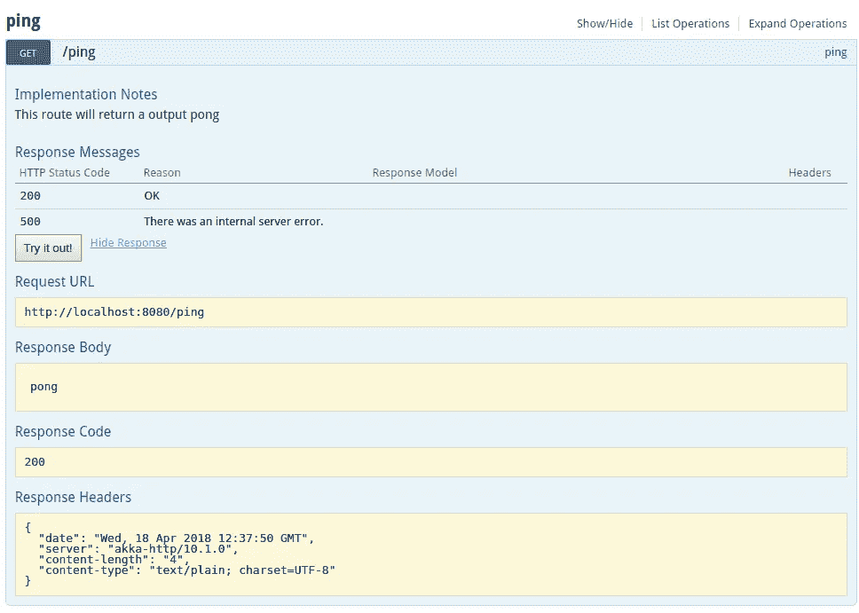
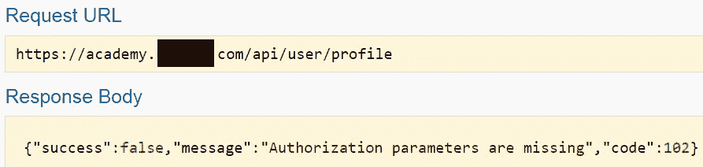
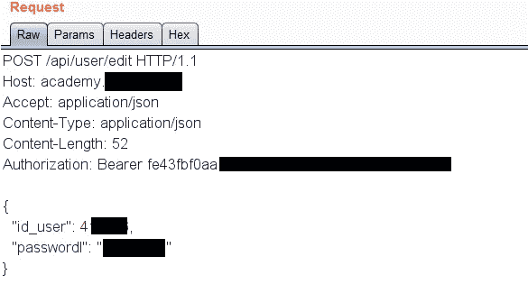
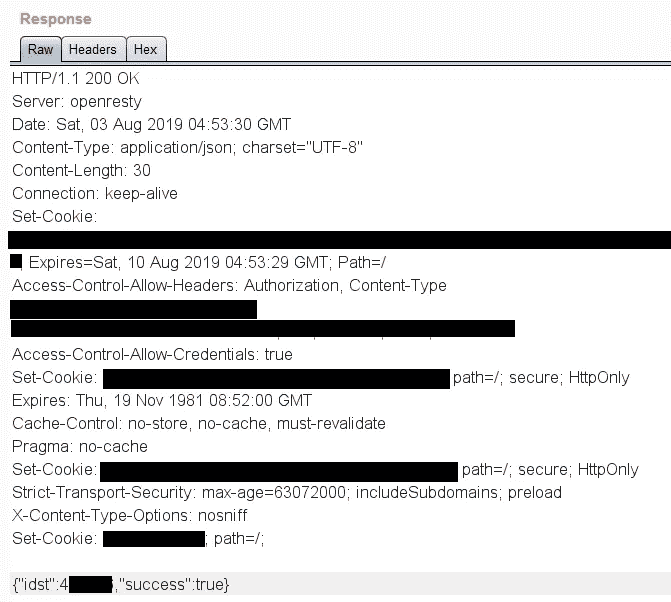

# Bug 赏金:API 授权被破坏

> 原文：<https://infosecwriteups.com/bug-bounty-broken-api-authorization-d30c940ccb42?source=collection_archive---------0----------------------->

大家好，我想分享一下我是如何在一个私人程序中发现一个简单的 API 授权漏洞的，它影响了数千个子域，并允许我在没有用户交互的情况下利用过多的未受保护的功能，从帐户删除到接管和泄露有限的信息(全名、电子邮件 id 和雇主)。

**Tl；dr:** 服务器没有检查授权承载令牌是属于普通用户还是超级用户。

这是一个私人项目，所以有些信息会被编辑，我会把这个网站称为“target.com”。

我在浏览 academy.target.com 的
**时，在后台运行了一个 *dirsearch* 扫描，以获得网站功能的概览。
我注意到一个有趣的端点，比如:**academy.target.com/api/docs**
像这样的端点是一座金矿，因为它们有 API 文档，并指定请求和响应的结构。**

**在浏览到端点时，我发现这个页面与 Swagger UI 极其相似(尽管这个站点没有使用 Swagger)。它还有一个简单的名为“认证”的按钮，点击它会导航到一个登录页面，但如果我尝试登录，它会显示“帐户未授权”的消息。**

**有一些有趣的端点，比如:
**/power user/add
/power user/delete
/user/delete
/user/create
/user/user _ logged _ in
/user/profile****

****

**页面看起来有点像这样。**

**这让我措手不及，因为这些端点似乎应该只留给内部/高级用户使用。
在没有任何 API 令牌或授权头的情况下直接调用端点导致:**

****

**意料之中的令人失望的反应**

**该网站似乎没有提供任何 API，我也找不到任何生成 API 令牌的方法，所以我决定以后再去看看。在广泛搜索了站点之后，我仍然无法在请求或响应中找到一个 API 令牌。
然而，我注意到许多请求都有一个授权持有人令牌。**

**我决定简单地复制这个头，并把它包含在对我找到的 API 端点的调用中。
我创建了另一个账户，并试图更改其密码，向 **api/user/edit** 发出 **POST** 请求。**

****

**更改另一个用户密码的 HTTP 请求，这一次是使用不记名令牌的**。****

****

**成功回复 lol。**

**瞧啊。它非常有效。除了将我的帐户升级为超级用户之外，我还可以成功地调用几乎所有其他 API 端点。文档详细列出了我删除/接管/创建新账户以及做其他一些坏事所需的参数。**

**我决定直接向供应商报告这个漏洞，结果发现他们有一个私人的漏洞奖励计划，并奖励了我 440 美元。**

**感谢阅读！**

***关注* [*Infosec 报道*](https://medium.com/bugbountywriteup) *获取更多此类精彩报道。***

** [## 信息安全报道

### 收集了世界上最好的黑客的文章，主题从 bug 奖金和 CTF 到 vulnhub…

medium.com](https://medium.com/bugbountywriteup)**