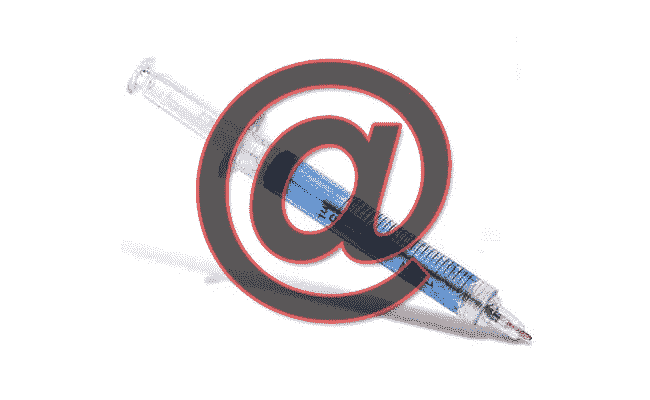

# [Bug Bounty]邮件内容注入

> 原文：<https://infosecwriteups.com/bug-bounty-email-content-injection-544196d59e91?source=collection_archive---------1----------------------->

这篇文章是关于我在一个私人程序中发现的一个安全漏洞。顾名思义，它是将包含链接的内容注入到目标网站发送给用户的电子邮件中。阅读这篇文章，了解我是在哪里以及如何找到它的。

一张图只是为了故事预告😅

# 功能/流程

这个网站有他们出售产品的商店部分。你可以访问产品页面，然后将该产品添加到你的购物车中，或者可以购买该产品(像在电子商务网站上一样)，但如果该产品缺货，则可以使用“通知我”按钮。因此，当用户点击此按钮时，一封自动生成的电子邮件将发送到他/她的电子邮件中，告诉他/她您已经订阅了这款脱销产品，一旦该产品重新上市，您将会收到通知。

# 上述功能的问题

上面提到的这个按钮上面还有两个输入框，分别包含用户名和电子邮件。所以，当这个按钮被点击时，它会生成 POST HTTP 请求，其中包含了主体参数'用户名'，'电子邮件'等。首先，我尝试将这个“电子邮件”值更改为其他电子邮件地址，以检查是否有限制。并成功地能够在不同电子邮件地址上接收电子邮件。现在，最好的部分，当用户名参数的值改变为一些内容，也包含链接，相应的电子邮件开始亲爱的“注入内容”.....还有链接“而不是亲爱的“用户名”。

所以，我注入了类似“客户，这是一封重要的电子邮件。废话！废话！做到这一点，这是链接…。”用于概念验证。

## 因此，有效的网络钓鱼可以利用这个安全漏洞/问题来完成。

# 奖励/赏金

这已报告给安全团队，他们删除了用户名参数以缓解这一问题。

我期待着这个 bug 的好价钱，但是他们只付了 25 美元。

# 拿走

如果您正在进行渗透测试，那么请查看生成/发送电子邮件给用户的每个 HTTP 请求，看它是否包含可用于在电子邮件中注入内容的参数。

> 谢谢！看了这个。欢迎评论和反馈。

*关注* [*Infosec 报道*](https://medium.com/bugbountywriteup) *获取更多此类精彩报道。*

 [## 信息安全报道

### 收集了世界上最好的黑客的文章，主题从 bug 奖金和 CTF 到 vulnhub…

medium.com](https://medium.com/bugbountywriteup)