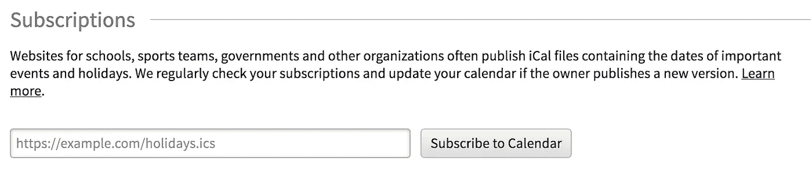
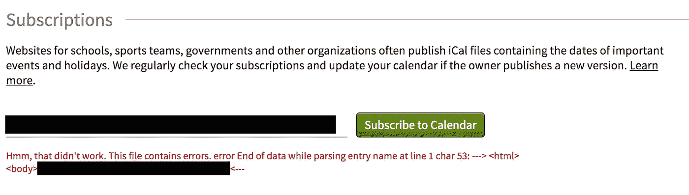
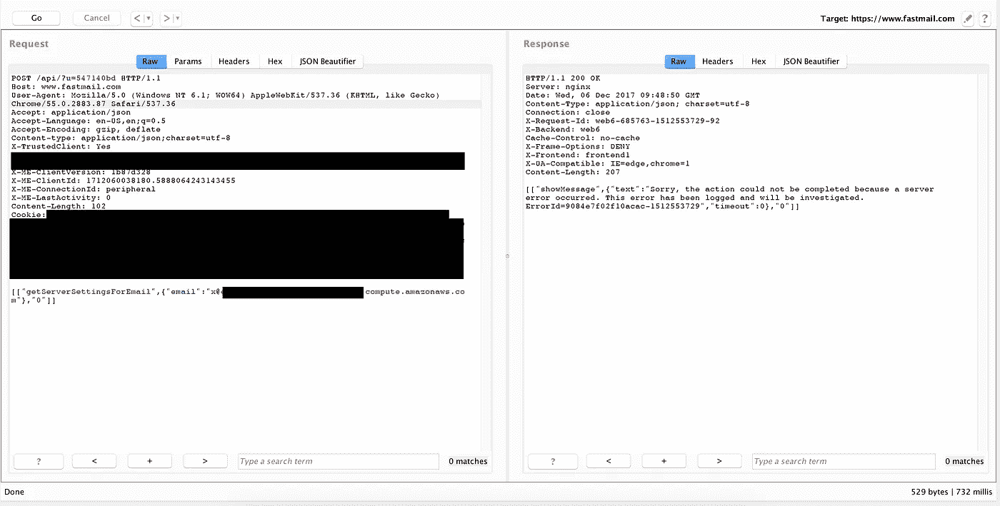
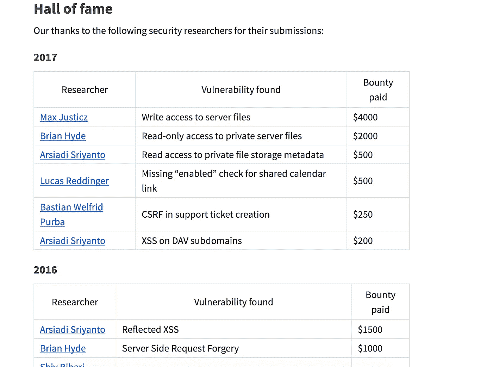

# 臭虫赏金:快速邮件

> 原文：<https://infosecwriteups.com/bug-bounty-fastmail-feeda67905f5?source=collection_archive---------2----------------------->

我首先想说的是，Fastmail 有一个很棒的 bug bounty 计划，他们真的非常关心他们的服务和客户的安全。几个月前，我第一次开始研究他们的 bug bounty 计划，在浏览 web 应用程序后不久，我发现了以下特征:

我发现使用这个特性，我可以使用任何端口向任何网站发出 HTTP 请求，包括内部 IP 地址。如果您向一个不包含有效 iCal 文件的服务器发出请求，它将返回一个包含响应正文部分内容的错误，这很容易表明这是一个有效的安全问题。我注意到的第二件事是，如果您在 URL 路径中包含\r\n 您可以添加自定义标头，因此理论上这可能被用作协议走私的一种方式。不幸的是，我找不到任何可以用来远程执行代码的内部服务。然而，在查看他们网站的源代码时，我能够找到一个运行 web 服务器的内部 IP 地址的引用，并且能够提取他们内部 web 应用程序的部分内容。

我向他们的安全团队报告了这个漏洞，并因我的发现获得了 1000 美元的奖励。

我发现的第二个漏洞是盲 SSRF +盲 XXE。我发现这个漏洞是因为我的 Amazon EC2 实例的主机名在网站的一个请求电子邮件地址的区域运行 web 服务器。

在看到来自 Fastmail 的对我的 VPS 的 web 服务器的 HTTP 请求后，我立即知道我发现了一个盲 SSRF 漏洞，因为响应不包含被请求文件的任何内容。然而，我无法指定端口号或自定义文件路径，但我很快发现这个 SSRF 遵循 Location 头中指定的重定向。我首先尝试使用 gopher://来创建定制请求，试图创建对内部服务的定制请求，试图与 HTTP 和 HTTPS 之外的协议进行交互，不幸的是，这并不成功，因为唯一成功的请求都被重定向到 HTTP 或 HTTPS。不久之后，我查看了 VPS 上的访问日志，发现最初的请求是请求一个 XML 文件。接下来，我将一个盲 XXE 有效负载放在他们的服务器所请求的文件路径上，结果成功了。

第一个请求是服务器最初请求的文件。然后，我使用的 XXE 有效负载试图请求 success.txt，但是由于该文件不存在，我的 web 服务器被重定向到根目录。在根目录中有一个 php 文件，它使用 Location 头重定向到/example-test-redirect.txt。然后我向 Fastmail 报告了这个漏洞，并因我的发现获得了 2000 美元的奖励。

在我使用 Fastmail 的 bug bounty 程序的经验中，我发现他们的安全团队总是反应迅速，他们总是在我报告后的 24 小时内推出补丁。我强烈建议任何安全研究人员使用这个程序。除了奖金之外，我也加入了他们的名人堂。

