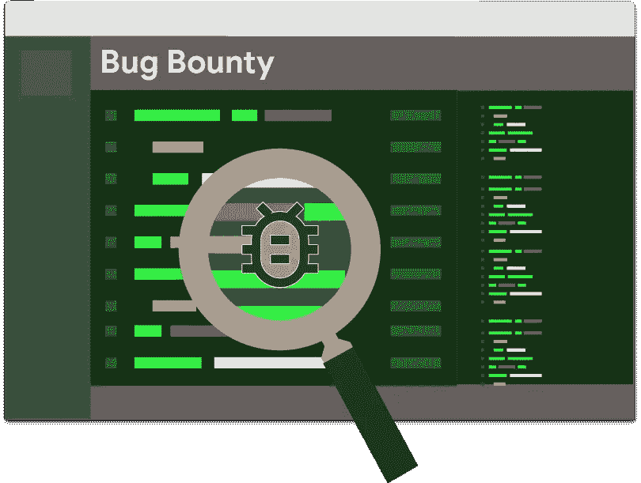

# Bug-Bounty 入门&一些提示

> 原文：<https://infosecwriteups.com/bug-bounty-getting-started-some-tips-600866c4d790?source=collection_archive---------0----------------------->

大家好，我又是亚瑟(又名内罗利)，

我知道很多人在 LinkedIn 上向我寻求帮助，我真的很忙，所以我试着在这里回答你所有的问题。

# **进入 bug-bounty**

在你想黑进去之前，你需要知道它是如何工作的，所以你需要了解一些 web 开发语言。

# 发展第一

**PHP:**
by《忍者网》:[https://www.youtube.com/watch?v=pWG7ajC_OVo&list = pl 4 cuxegkcc 9 gksox3kd 9 kpo-o 68 NCT 05 o](https://www.youtube.com/watch?v=pWG7ajC_OVo&list=PL4cUxeGkcC9gksOX3Kd9KPo-O68ncT05o)

by " [编程知识](https://www.youtube.com/channel/UCs6nmQViDpUw0nuIx9c_WvA)":[https://www.youtube.com/watch?v=yMclPkD4sQg&list = pls 1 qulwo 1 rizc4 GM _ e 04 hcped _ xpcaQgg](https://www.youtube.com/watch?v=yMclPkD4sQg&list=PLS1QulWo1RIZc4GM_E04HCPEd_xpcaQgg)

推荐:[https://letmegooglethat.com/?q =学习+PHP+在线+for+免费+youtube](https://letmegooglethat.com/?q=learning+php+online+for+free+youtube)

**JavaScript:**

由「Dev Ed」:[https://www.youtube.com/watch?v=2nZiB1JItbY&list = pldyqo 7g 0 _ nsx 8 _ gzab 8 KD 1 ll 4j 4 halqbj](https://www.youtube.com/watch?v=2nZiB1JItbY&list=PLDyQo7g0_nsX8_gZAB8KD1lL4j4halQBJ)

由《忍者网》:[https://www.youtube.com/watch?v=qoSksQ4s_hg&list = pl 4 cuxegkcc 9i 9 AE 2d 9 ee 1 rvylh 38 dkuet](https://www.youtube.com/watch?v=qoSksQ4s_hg&list=PL4cUxeGkcC9i9Ae2D9Ee1RvylH38dKuET)

推荐:[https://letmegooglethat.com/?q =学习+javaScript+在线+免费+youtube](https://letmegooglethat.com/?q=learning+php+online+for+free+youtube)

现在重复的问题:**我必须是专业的网站开发人员吗？**

**Ans:** 不，正如我的朋友“Ibrahim Hegazy”(他很有帮助，很有才华 btw[https://twitter.com/Zigoo0](https://twitter.com/Zigoo0))所说:
你只需要创建一个简单的网站，有这些功能:

*   登录/注销
*   管理面板和用户面板
*   向数据库添加项目(仅由管理员)
*   查看项目(用户和管理员)

至此，您至少理解了从用户端到数据库的流程。

# 让我们变得邪恶

现在我们想打破我们建立的东西，做一些无意识的行为，

这叫做 web 应用渗透测试，所以首先你需要了解 Web 应用的漏洞，

**owasp top 10:**[https://www.youtube.com/watch?v=rWHvp7rUka8&list = plyqga 7 axmtppuibxp 1n 0 tdydrkwp 9h _ jD](https://www.youtube.com/watch?v=rWHvp7rUka8&list=PLyqga7AXMtPPuibxp1N0TdyDrKwP9H_jD)

**Web 应用渗透测试(作者 Ibrahim Hegazy Arabic):**[https://www.youtube.com/watch?v=BjfCWSFmIFI&list = plv 7 coghxovhxvhpzi 1 dwtbiyual 8 bahj](https://www.youtube.com/watch?v=BjfCWSFmIFI&list=PLv7cogHXoVhXvHPzIl1dWtBiYUAL8baHj)

推荐:[https://portswigger.net/web-security/all-materials](https://portswigger.net/web-security/all-materials)

现在你对一些问题有所了解了，你现在可以黑了吗？没有 XD

**心态和流程**

现在你需要知道如何使用这些知识，你需要建立一个方法论，

**发现你的第一个 bug 作者** [**凯蒂·帕克斯顿-恐惧**](https://medium.com/u/cebabe10eb46?source=post_page-----600866c4d790--------------------------------)**:[https://www.youtube.com/watch?v=RobCqW2KwGs&list = plbynctkpno 5 fzq 3 zgphj 1 bdq 7 xhwfvo 1 w](https://www.youtube.com/watch?v=RobCqW2KwGs&list=PLbyncTkpno5FZQ3ZgpHj1BdQ7XHwfvO1w)**

****臭虫猎人方法论 4.0 版——侦察版作者** [**杰森·哈德克斯**](https://medium.com/u/1dfc5adea2d4?source=post_page-----600866c4d790--------------------------------):[https://www.youtube.com/watch?v=p4JgIu1mceI](https://www.youtube.com/watch?v=p4JgIu1mceI)**

****live recon by**[**Behrouz sadegihour****:**](https://medium.com/u/9a72584d6865?source=post_page-----600866c4d790--------------------------------)**[https://www.youtube.com/watch?v=MIujSpuDtFY&list = plkaamvnxvlmakqbkzfaoxqs 3 l 66 z 2n 8 la](https://www.youtube.com/watch?v=MIujSpuDtFY&list=PLKAaMVNxvLmAkqBkzFaOxqs3L66z2n8LA)****

****我的侦察由[奥瓦亚特](https://medium.com/u/7ab3832ef76d?source=post_page-----600866c4d790--------------------------------):[https://奥瓦亚特. medium . com/my-methodology-in-recon-and-find-bugs-my-methodology-in-hunting-using-phone-CCC 9 Fe 06 DD 2d](https://orwaatyat.medium.com/my-methodology-in-recon-and-find-bugs-my-methodology-in-hunting-using-phone-ccc9fe06dd2d)****

****现在你准备好入侵了吗？是的，但是你不会发现错误:)****

****在这一点上，你有 huuuge 知识，没有实践经验，所以你不会使用这些知识，会卡住，这是正常的。****

# ****查找 bug 的一些技巧****

****注意，这只是提示，可能对你有用也可能没用，****

******阅读报道:******

****写文章是其他黑客的想法，你将有很好的知识，工具和方法来入侵网站和伟大的侦察技巧，****

****这里有一个由“Pentester Land”制作的很棒的列表:[https://pentester.land/list-of-bug-bounty-writeups.html](https://pentester.land/list-of-bug-bounty-writeups.html)****

****推特:[https://twitter.com/hashtag/bugbountywriteup?src=hashtag_click](https://twitter.com/hashtag/bugbountywriteup?src=hashtag_click) ，[https://twitter.com/hashtag/bugbountytips?src=hashtag_click](https://twitter.com/hashtag/bugbountytips?src=hashtag_click)****

****中:[https://infosecwriteups.com/](https://infosecwriteups.com/)****

******玩 CTFs** :****

****很多人不会同意这个建议，但是我认为 ctfs 给了你很好的思维方式和搜索技巧，也给了你很多关于很多技术的知识，可以引导你发现很大的 bug，同时加强你对 web 应用程序中每个 bug 的理解。****

****https://picoctf.org/****

****root me:[https://www.root-me.org/en/Challenges/Web-Client/](https://www.root-me.org/en/Challenges/Web-Client/)，[https://www.root-me.org/en/Challenges/Web-Server/](https://www.root-me.org/en/Challenges/Web-Server/)****

******解决端口切换实验室:******

****这些实验室是学习网络应用漏洞的绝佳资源:[https://portswigger.net/web-security/all-materials](https://portswigger.net/web-security/all-materials)****

******拣货目标:******

****要选择一个目标，你总是会发现许多公共程序有许多黑客在它的 HOF 上，这是否意味着你不会发现一个 bug？我的小弟弟(他只有 16 岁)在一个大型公共程序中发现了 2 个 bug，你只需要选择一个你感兴趣的目标，阅读程序功能并浏览它，****

****尝试选择具有许多访问控制策略(许多角色、许多权限、许多功能和端点，并非所有用户角色都可用)的目标，****

****也要根据你擅长的技术选择目标，例如:ASP.NET、nodejs、rubyonrails 等等。****

******如何搜索 bug:******

****许多人试图测试应用程序，甚至不知道它是做什么的，****

****了解更多关于程序的信息，并很好地理解它，这样你就可以生成场景来分解它，****

****不要随意尝试任何事情而不进行跟踪，使用清单并始终跟踪应用流程****

****以下是一些很棒的清单:****

****by“Mohammed Adam”:[https://docs . Google . com/spreadsheets/d/1 txnrvaimrs _ dmupcwjwJmXtaFk _ lpge 1 lzgxpu _ 7KqA/edit # GID = 1308919623](https://docs.google.com/spreadsheets/d/1TxNrvaIMRS_dmupcwjwJmXtaFk_lPGE1LzgxPu_7KqA/edit#gid=1308919623)****

****[马哈茂德·m·阿瓦利](https://medium.com/u/f34e220291be?source=post_page-----600866c4d790--------------------------------)在推特上发布关于每个 bug 以及如何测试的精彩幻灯片:[https://twitter.com/0xAwali](https://twitter.com/0xAwali)****

****https://github.com/shieldfy/API-Security-Checklist****

******我必须使用自动化工具吗******

****我不喜欢自动化，自动化把你变成了一个没有大脑的机器人，你只是通过配置工具来获得资金，但如果你想找到 bug，你需要聪明地工作，****

******为任何你想自动化的东西写脚本，比如 recon 和 dirsearch。******

****一些可以帮到你的伟大工具:
[https://github.com/s0md3v/XSStrike](https://github.com/s0md3v/XSStrike)
[https://tools.kali.org/web-applications/xsser](https://tools.kali.org/web-applications/xsser)
[http://xss-scanner.com/](http://xss-scanner.com/)
[https://github.com/DanMcInerney/xsscrapy](https://github.com/DanMcInerney/xsscrapy)
[https://github.com/projectdiscovery/nuclei](https://github.com/projectdiscovery/nuclei)
[https://github.com/s0md3v/Arjun](https://github.com/s0md3v/Arjun)****

****github:
[https://github.com/topics/xss-scanner](https://github.com/topics/xss-scanner)
https://github.com/topics/recon
[https://github.com/topics/api-testing](https://github.com/topics/api-testing)
[https://github.com/topics/vulnerability-detection](https://github.com/topics/vulnerability-detection)
[https://github.com/topics/vulnerability-scanner](https://github.com/topics/vulnerability-scanner)
[https://github.com/topics/cve-scanner](https://github.com/topics/cve-scanner)
[https://github.com/topics/subdomain-takeover](https://github.com/topics/subdomain-takeover)****

****空字节:[https://www.youtube.com/watch?v=PPQ8m8xQAs8](https://www.youtube.com/watch?v=PPQ8m8xQAs8)****

******源代码审查******

****许多人忽略了应用程序中的 js 文件，尽管它很容易受到攻击，会让你发现很大的问题。****

****STK 主持的这个很棒的视频可以帮上忙:[https://www.youtube.com/watch?v=FTeE3OrTNoA](https://www.youtube.com/watch?v=FTeE3OrTNoA)****

******要读的东西******

****尽管我不太喜欢书，但它会给你很多关于 web 应用程序安全性的信息。****

****Ibrahim Mosaad(脸书的安全工程师)从这个现场演讲([https://www.youtube.com/watch?v=3IEobo9ccIE](https://www.youtube.com/watch?v=3IEobo9ccIE))中需要阅读的内容:****

****纠结网:[https://www . Amazon . fr/Tangled-Web-Securing-Modern-Applications-ebook/DP/b 006 FZ 3 uni](https://www.amazon.fr/Tangled-Web-Securing-Modern-Applications-ebook/dp/B006FZ3UNI)****

****《网络应用黑客手册:[https://www . Amazon . com/we B- Application-Hackers-Handbook-exploining/DP/1118026470](https://www.amazon.com/Web-Application-Hackers-Handbook-Exploiting/dp/1118026470)****

****Sql 注入攻防:[https://www . Amazon . com/Injection-Attacks-Defense-Justin-Clarke/DP/1597499633](https://www.amazon.com/Injection-Attacks-Defense-Justin-Clarke/dp/1597499633)****

****Cure53 报道:[https://cure53.de/#publications](https://cure53.de/#publications)****

# ****我的建议****

******不要问来问去，直接问(**[https://dontasktoask.com/](https://dontasktoask.com/))请看这个****

******停止提问，开始行动**你们中的很多人向每个人寻求建议和帮助，寻求帮助是好的，但当你需要时，网上有很多资源可以帮助你搜索，所以不要问很多人，开始学习吧。****

******重复，非申请人和信息诅咒**许多人告诉我他们找不到 bug，如果他们找到的大多数都是重复的或者影响很小，这是很正常的。想象一下有多少人做你正在做的事情，同样的步骤，同样的心态，你们最终都会找到同样的 bug，而这个 bug 已经被另一个和你一样的黑客发现了，所以你所要做的就是为自己建立一个好的方法，帮助你找到更多难以发现的 bug。****

****bugbounty 没有秘密很多人问我有没有秘密工具或者秘密提示可以让你找到 bug，这不是真的，是的，我知道很多人使用脚本和自动化工具来找到很多 bug，但是这是狗屎，你不会从中学到任何东西，所以开始努力提高你的技能，不要偷懒。****

******不要墨守成规**不要不假思索地遵循你在文章中发现的每一个步骤，你们中的许多人告诉我“我发现了你发现的类似的 bug，而 poc 不起作用”，它不是那样工作的，你必须了解应用程序中发生了什么，并了解你试图利用的 bug。****

****不要让假冒的人打击你社交媒体上有很多假冒的人，他们知识很少，当他们只是脚本用户时，总是试图显示他们有多好，专注于你的技能，你会更好，高额赏金并不意味着你很好。****

# ****跟随谁****

****社交媒体上有很好的人可以帮助你:****

****[https://twitter.com/boomneroli](https://twitter.com/boomneroli)(我当然是因为我是超级黑客 XD)
[https://twitter.com/NahamSec](https://twitter.com/NahamSec)
[https://twitter.com/stokfredrik](https://twitter.com/stokfredrik)
[https://twitter.com/Jhaddix](https://twitter.com/Jhaddix)
[https://twitter.com/LiveOverflow](https://twitter.com/LiveOverflow)
[https://twitter.com/Zigoo0](https://twitter.com/Zigoo0)
[https://twitter.com/dPhoeniixx](https://twitter.com/dPhoeniixx)
[https://twitter.com/K4r1it0](https://twitter.com/K4r1it0)
[https://Twitter . com/the _ st0rm](https://twitter.com/the_st0rm)
[https://Twitter . com](https://twitter.com/Zombiehelp54)****

****每当我想起我会更新这个列表****

****现在我要离开你们了，这样你们都可以黑客和赚钱和经验，我会更新这个职位，每当我想起一些可以帮助，我希望你们会很好，发现这个职位有用。****