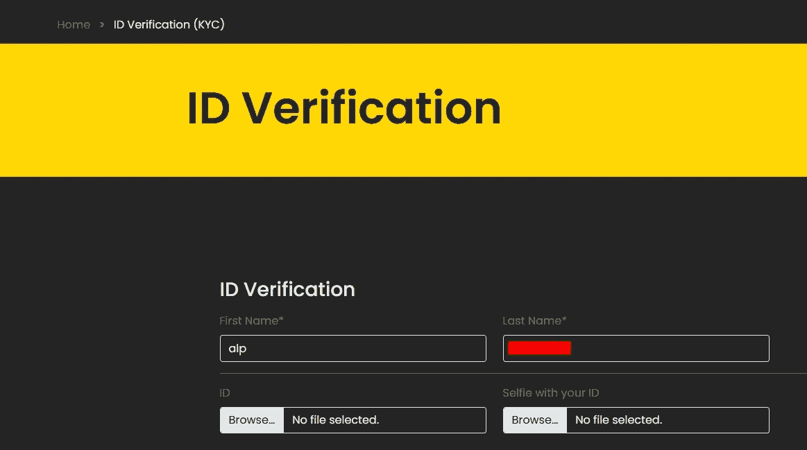
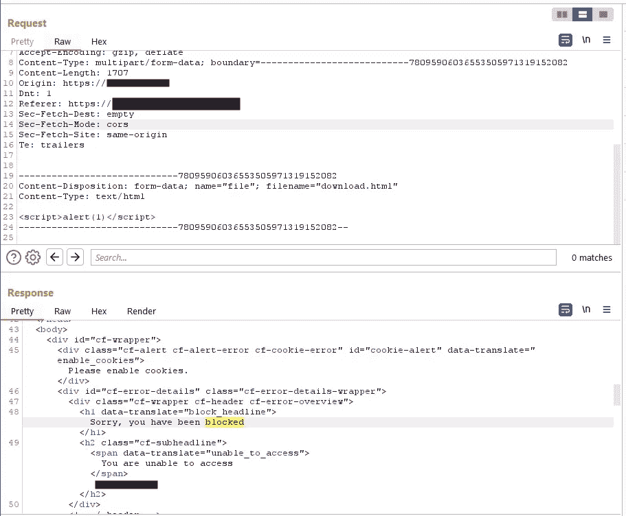
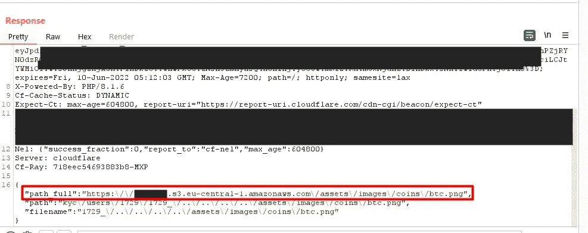
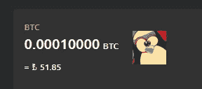

# 我如何通过文件上传功能编辑网站的 AWS 文件？

> 原文：<https://infosecwriteups.com/bug-bounty-how-i-was-able-edit-awss-files-from-file-upload-function-cb33bc3bd3a9?source=collection_archive---------1----------------------->

大家好。这是 [Alp](https://medium.com/u/d96c4a8eb315?source=post_page-----cb33bc3bd3a9--------------------------------) ！我很久没来了。我终于有时间和社区分享一篇文章了。

在这篇文章中，我将与你分享我是如何通过文件上传功能来编辑网站的 AWS 文件的。

所以，它是一个 bug bounty 平台中的外部程序，是一个与网站相关的加密程序。

首先，我已经注册，看看是否找到一些东西。然后，我面对一个 KYC(身份验证)页面。



KYC 验证

我在那里看到一个上传文件的东西。我曾尝试上传一个 XSS 文件，但不幸被 Cloudflare 阻止:/



文件上传请求被 Cloudflare WAF 阻止

如你所知，Cloudflare 对于 WAF 来说太难绕过了。所以，我没有试图绕过它，测试文件上传请求中的其他参数。然后，我意识到 URL 中有一个带有“national_id_front”值的`name`参数。

当你上传一个文件时，它在响应中给出了这个结果。

```
{"path_full":"https:\/\/target-website.s3.eu-central-1.amazonaws.com\/kyc\/users\/1729\/1729_national_id_front.jpg","path":"kyc\/users\/1729\/1729_national_id_front.jpg","filename":"1729_national_id_front.jpg"}
```

然后，我将`name`参数的值改为另一个文本，并观察响应。网络服务器正在监听`name`参数的值来给上传的文件命名。因此，这意味着您可以通过路径遍历将任何文件上传到 back paths。

这是访问资产文件夹中图像的最终有效负载:

> `/../../../../assets/images/coins/btc`



响应中的最终结果

正如您在响应中看到的，通过使用路径遍历，我们的文件作为 btc.png 上传到了`assets/images/coins/btc.png`目录。



这是我的个人资料图片，然后我不得不回到默认的比特币图标 lol。(对不起亲爱的开发者)

> **影响:**

所以最后，当用户在网站上看到受影响的图像时，他们会看到我们的文件。攻击者可以更改从 AWS 服务器获得的所有文件，并在受害者的网站上提供他们自己的文件。

> **时间线:**

**已报告** 09.06.2022

2022 年 6 月 10 日

**2022 年 6 月 10 日**解决，并根据 CVSS 计算器授予 400 美元的 P3 奖励，因为您可以编辑的文件因 WAF 和 web 文件而受到限制。

感谢阅读！欢迎在我们的 Discord 服务器或 Twitter 上与我们交流！

> **社交:**

推特:[https://twitter.com/alp0x01](https://twitter.com/alp0x01)