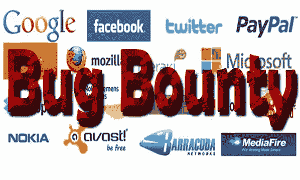

# 臭虫赏金猎人(方法论，工具包，技巧和窍门，博客)

> 原文：<https://infosecwriteups.com/bug-bounty-hunting-methodology-toolkit-tips-tricks-blogs-ef6542301c65?source=collection_archive---------0----------------------->

一个 **bug 赏金**项目是由许多网站和软件开发商提供的一项交易，根据这项交易，个人可以因报告**bug**而获得认可和补偿，尤其是那些与漏洞利用和脆弱性有关的 bug。

> **对发现计算机程序或系统中错误或漏洞的表演者的奖励。
> ‘公司通过提供 bug 赏金来提高安全性’**

bug Bounty——图片来源谷歌

> ***臭虫赏金平台***

**bug crowd** [https://www.bugcrowd.com/](https://www.bugcrowd.com/)

**哈克松** [https://www.hackerone.com/](https://www.hackerone.com/)

https://www.synack.com/
[T21](https://www.synack.com/)

**日本臭虫赏金计划**
[https://bugbounty.jp/](https://bugbounty.jp/)

**钴**
[https://cobalt.io/](https://cobalt.io/)

**零直升机** [https://zerocopter.com/](https://zerocopter.com/)

**hacken proof【https://hackenproof.com/】**

**bounty factory**
[https://bounty factory . io](https://bountyfactory.io)

**Bug 赏金程序列表**
[https://www.bugcrowd.com/bug-bounty-list/](https://www.bugcrowd.com/bug-bounty-list/)

**反黑客**
[https://www.antihack.me/](https://www.antihack.me/)

bug Bounty——图片来源谷歌

> *一些关于捕虫的书籍*

有一些关于 web 应用渗透测试方法和搜索 Web 的书籍。通过这个，你学习了渗透测试和 bug 搜索的基础和要点。由于漏洞奖金通常包括网站目标，我们将重点让你开始与网络黑客，稍后我们将分支。

> [**《网络应用黑客手册》**](https://www.amazon.com/gp/product/1118026470/ref=as_li_tl?ie=UTF8&camp=1789&creative=9325&creativeASIN=1118026470&linkCode=as2&tag=bugcrowd-20&linkId=9f9c5e3f51e50ea7092a21a04aec184f/)
> 
> [**OWASP 测试指南**](https://www.owasp.org/index.php/OWASP_Testing_Project) **bug crowd 的 Jason Haddix** 极力推荐
> 
> [**渗透检测**](http://amzn.to/2dhHTSn)
> 
> [**黑客行动手册 2:渗透测试实用指南**](http://amzn.to/2d9wYKa)
> 
> [**纠结的网络:保护网络应用的指南**](http://amzn.to/2dNOeaq)
> 
> [**jhadix Bug 狩猎方法论**](https://github.com/jhaddix/tbhm)
> 
> [**黑客攻略-3**](https://www.amazon.com/Hacker-Playbook-Practical-Penetration-Testing-ebook/dp/B07CSPFYZ2)
> 
> [**道德黑客与渗透指南**](https://www.amazon.in/Ethical-Hacking-Penetration-Testing-Guide/dp/1482231611)
> 
> [**用 Kali Linux 进行 Web 渗透测试**](https://www.flipkart.com/web-penetration-testing-kali-linux-third/p/itmf3ab4trzrmj7d?gclid=CjwKCAjw9-HZBRAwEiwAGw0QcdJvVaQ_p9NqBRuFjzvJXB5AaE5qVcjxq1tsMonq2ytN-ZZJv9__gRoCZnQQAvD_BwE&pid=9781788623377&lid=LSTBOK9781788623377QYQJWS&cmpid=content_book_8965229628_gmc_pla&tgi=sem%2C1%2CG%2C11214002%2Cg%2Csearch%2C%2C272257559753%2C1o1%2C%2C%2Cc%2C%2C%2C%2C%2C%2C%2C&s_kwcid=AL%21739%213%21272257559753%21%21%21g%21295092701166%21&ef_id=WzjD%40AAAAcB92zUR%3A20180701120720%3As)

> 对于我们的手机黑客朋友来说:

> **手机应用黑客手册**
> 
> [**iOS 应用安全**](http://amzn.to/2d9yo7m)
> 
> **Owasp 移动应用安全**

> 熟能生巧！

当你学习的时候，确保你也理解并记住你所学的东西是很重要的。在易受攻击的应用程序和系统上练习是在模拟环境中测试您的技能的好方法。这些会让你知道在现实世界中你会遇到什么。

> [**BWAPP**](http://www.itsecgames.com/)
> 
> [T5【野山羊】T6](https://github.com/WebGoat/WebGoat)
> 
> **Rootme**
> 
> [**OWASP 多汁店**](https://www.owasp.org/index.php/OWASP_Juice_Shop_Project)
> 
> [**黑客 101**](http://hacker101.com/)
> 
> [**黑客攻击**](https://www.hacksplaining.com/exercises)
> 
> [**渗透测试实践实验室**](http://www.amanhardikar.com/mindmaps/Practice.html)
> 
> [***该死的易受攻击的 iOS App (DVIA)***](http://damnvulnerableiosapp.com/)
> 
> **
> 
> **[***HackTheBox***](http://hackthebox.eu/)**
> 
> **[***SQL 注入练习***](http://www.sqlinjection.net/)**

> **阅读其他黑客的技术漏洞 POC(概念证明)和文章**

**既然您已经对如何发现和利用安全漏洞有了基本的了解，是时候开始检查其他黑客在野外发现了什么。幸运的是，安全社区非常乐于分享知识，我们已经收集了一系列文章和教程:**

> **[***Bug 赏金和 POC***](https://forum.bugcrowd.com/t/researcher-resources-bounty-bug-write-ups/1137)**
> 
> **[***牛逼虫赏金***](https://github.com/djadmin/awesome-bug-bounty)**
> 
> **[***securitybreated-BugBounty POC***](https://blog.securitybreached.org/category/bugbounty-poc/)**
> 
> **[***脸书狩猎 POC***](https://m.facebook.com/notes/phwd/facebook-bug-bounties/707217202701640/?__tn__=%2As-R)**
> 
> **[***捕虫教程***](https://forum.bugcrowd.com/t/researcher-resources-tutorials/370)**
> 
> **[**PentesterLand Bug Bounty writes**](https://pentester.land/list-of-bug-bounty-writeups.html)**
> 
> **[***Hackerone POC 报告***](http://h1.nobbd.de/)**
> 
> **[***Bug 赏金 POC***](http://www.xsses.com/)**
> 
> **[***net sec on Reddit***](https://www.reddit.com/r/netsec)**
> 
> **[***Bug 赏金世界***](https://bugbountyworld.com/)**

> **在 YouTube 上观看教程(Bug 狩猎)!**

> **[**YouTube 上的 jackk tutorials**](https://www.youtube.com/user/JackkTutorials/videos)**
> 
> **[**YouTube 上的 DEFCON 会议视频**](https://www.youtube.com/user/DEFCONConference/videos)**
> 
> **[**YouTube 上的 Hak5**](https://www.youtube.com/user/Hak5Darren/playlists)**
> 
> **[**如何拍摄 Web**](https://www.youtube.com/watch?v=-FAjxUOKbdI) **—杰森·哈德克斯，2015****
> 
> **[**Bug 赏金猎人方法论 v2**](https://www.youtube.com/watch?v=C4ZHAdI8o1w) **—杰森·哈德克斯，2017****
> 
> **[**寻找最高奖金**](https://www.youtube.com/watch?v=mQjTgDuLsp4) **—尼古拉斯·格雷瓜尔，2014****
> 
> **[**一个 Bug 赏金猎人的秘密生活**](https://www.youtube.com/watch?v=KDo68Laayh8) **— Frans Rosén，2016****
> 
> **[**用打嗝插件找 Bug&Bug 赏金 101**](https://www.youtube.com/watch?v=Q2WK5LpDbxw) **— Bugcrowd，2014****
> 
> **[**如何黑掉所有 bug 赏金的东西自动获取奖励利润**](https://www.youtube.com/watch?v=XoYF-euS-zs) **—迈克·贝克，2016****
> 
> ****
> 
> ****[**黑帽**](https://www.youtube.com/channel/UCJ6q9Ie29ajGqKApbLqfBOg)****
> 
> ****[**注射器 PCA**](https://www.youtube.com/channel/UCRFG_j0cgLWtJOG6fl_-rxQ)****
> 
> ****[**恶魔杀手**](https://www.youtube.com/channel/UCwfYw-C2xqemqrXq0IKF_Mg)****
> 
> ****[**苏勒曼马利克**](https://www.youtube.com/channel/UC59IHQcCmgNw4GIvsXeLnDQ)****
> 
> ****[**Linux 中的渗透测试**](https://www.youtube.com/channel/UC286ntgASMskhPIJQebJVvA)****

> ****Bugcrowd 方法寻找 Bug****

****好了，现在你差不多到了开始寻找奖金的时候了。但首先，让我们了解一下臭虫奖励是如何工作的，以及如何开始，只是为了确保我们最大化成功的机会。****

****[***如何接近目标***](https://forum.bugcrowd.com/t/how-do-you-approach-a-target/293)
来自其他臭虫猎人的建议将帮助你在接近臭虫赏金时获得更多成功。****

****[***如何写出一份出色的漏洞报告***](https://blog.bugcrowd.com/advice-for-writing-a-great-vulnerability-report/)
这篇文章将带你了解如何写出一份出色的漏洞报告。你的报告越好，你获得奖金的机会就越高！****

****[***如何写概念证明***](https://blog.bugcrowd.com/writing-up-a-poc-by-planet-zuda/)
概念证明向客户展示你的 bug 是如何被利用的，以及它是如何工作的。这对于成功获得奖励至关重要。****

****[***如何报告 Bug***](https://researcherdocs.bugcrowd.com/docs/reporting-a-bug)
我们通过 Bugcrowd 平台报告 Bug 的演练。****

> ****漏洞指南****

> ****[**OWASP 2017 年 10 强**](https://infosecsanyam.blogspot.in/2018/02/owasp-top-10-2017web-application.html)****
> 
> ****[**SANS TOP 25**](http://cwe.mitre.org/top25/)****
> 
> ****[**SSRF 圣经 Cheetsheet**](https://docs.google.com/document/d/1v1TkWZtrhzRLy0bYXBcdLUedXGb9njTNIJXa3u9akHM/edit)****
> 
> ****[**文件上传保存 XSS**](https://brutelogic.com.br/blog/file-upload-xss/)****
> 
> ****[**OWASP Web 应用安全测试备忘单**](https://www.owasp.org/index.php/Web_Application_Security_Testing_Cheat_Sheet)****

> ****Web 漏洞扫描器****

> ****[**Netsparker 应用安全扫描器**](https://www.netsparker.com/) **—应用安全扫描器能够自动发现安全漏洞。******
> 
> ****[**Nikto**](https://cirt.net/nikto2) **—嘈杂但快速的黑盒 web 服务器和 web 应用漏洞扫描器。******
> 
> ****[**Arachni**](http://www.arachni-scanner.com/)**—评估 web 应用安全性的可脚本化框架。******
> 
> ****[**w3af**](https://github.com/andresriancho/w3af)**—Web 应用攻击与审计框架。******
> 
> ****[**马鹿**](http://wapiti.sourceforge.net/) **—内置 fuzzer 的黑盒 web 应用漏洞扫描器。******
> 
> ****[**sec apps**](https://secapps.com/)**—浏览器内 web 应用安全测试套件。******
> 
> ****[**web reaver**](https://www.webreaver.com/)**—专为 macOS 设计的商业、图形化 web 应用漏洞扫描器。******
> 
> ****[**wps can**](https://wpscan.org/)**—黑盒 WordPress 漏洞扫描器。******
> 
> ****[**缩放**](https://github.com/UltimateHackers/Zoom) **—强大的 wordpress 用户名枚举器，具有无限扫描功能。******
> 
> ****[**CMS-explorer**](https://code.google.com/archive/p/cms-explorer/)**—揭示由内容管理系统驱动的各种网站正在运行的特定模块、插件、组件和主题。******
> 
> ****[**joomscan**](https://www.owasp.org/index.php/Category:OWASP_Joomla_Vulnerability_Scanner_Project)**—Joomla 漏洞扫描器。******
> 
> ****[**acst is**](https://github.com/tijme/angularjs-csti-scanner)**—自动客户端模板注入(沙盒转义/绕过)检测 AngularJS。******
> 
> ****[**SQLmate**](https://github.com/UltimateHackers/sqlmate)**—sqlmap 的朋友，根据给定的呆子和网站识别 sqli 漏洞(可选)。******

> ****信息安全备忘单****

1.  ****[Pentest 书签](https://github.com/kurobeats/pentest-bookmarks/blob/master/BookmarksList.md)****
2.  ****[牛逼的 OSINT 小抄](https://github.com/jivoi/awesome-osint)****
3.  ****[牛逼的 Pentest 小抄](https://github.com/enaqx/awesome-pentest)****
4.  ****[Bug 赏金备忘单](https://github.com/EdOverflow/bugbounty-cheatsheet)****
5.  ****[牛逼黑客小抄](https://github.com/Hack-with-Github/Awesome-Hacking)****
6.  ****[Awesome-Infosec 备忘单](https://github.com/onlurking/awesome-infosec)****
7.  ****[SQL 注入备忘单](http://pentestmonkey.net/blog/mssql-sql-injection-cheat-sheet/)****
8.  ****[XSS 小抄](https://gist.github.com/kurobeats/9a613c9ab68914312cbb415134795b45)****
9.  ****[XXE 有效载荷](https://gist.github.com/staaldraad/01415b990939494879b4)****

> ****Pen 测试方法****

1.  ****[***渗透测试框架***](http://www.vulnerabilityassessment.co.uk/Penetration%20Test.html)****
2.  ****[***【渗透检测执行标准】***](http://www.pentest-standard.org/index.php/Main_Page)****
3.  ****[***WASC 威胁分类***](http://projects.webappsec.org/w/page/13246978/Threat-Classification)****
4.  ****[***OWASP 十大项目***](http://www.owasp.org/index.php/Category:OWASP_Top_Ten_Project)****
5.  ****[***社会工程框架***](http://www.social-engineer.org/framework/general-discussion/)****

> ******我的小技巧&招数******

> *******Bug 赏金猎人提示# 1——永远阅读源代码*******
> 
> *******Bug 赏金狩猎技巧# 2——尝试狩猎子域*******
> 
> *******Bug 赏金猎人提示# 3——经常检查后端 CMS &后端语言(builtwith)*******
> 
> *******Bug 赏金猎人技巧# 4——谷歌呆瓜很有帮助*******
> 
> *******Bug 赏金猎人提示# 5——检查每个请求和响应*******
> 
> *******Bug 赏金猎人技巧# 6——活跃思维——跳出思维定势:)*******

> ****我寻找 Bug 的方法****

> ******先复习范围******
> 
> ******执行侦察，寻找有效目标******
> 
> ******通过各种工具 Sublist3、virus-total 等查找子域。******
> 
> ******选择一个目标，然后扫描发现的目标以收集更多信息(检查 CMS、服务器和我需要的所有其他信息)******
> 
> ****使用谷歌百科收集特定目标的信息。****
> 
> ******检查所有的服务、端口和应用程序。******
> 
> ******模糊错误和暴露漏洞******
> 
> ******攻击漏洞，构建概念验证******

****对于 Bug 赏金程序，首先我要回顾一下目标的范围。像*.facebook.com 这样的范围与小公司的单一应用程序测试环境之间存在巨大差异。****

****如果 scope 大于他们接受任何服务器的提交，我将开始使用搜索引擎，如谷歌，Shodan，Censys，ARIN 等进行侦察。发现子域、端点和服务器 IP 地址。这是谷歌入侵，扫描公司拥有的 IP 范围，服务器端口扫描等的混合体。任何能给我那家公司的服务器信息的东西。****

****当我有了服务器列表后，我开始执行 nmap 端口和横幅扫描，以查看正在运行的服务器类型。您可能会得到一些快速的发现，比如允许基于密码的认证的开放 SSH 端口。在这一点上，我倾向于远离报道那些小问题。我选择花更多的时间来寻找运行在非标准 web 端口(如 Jenkins)上的关键应用程序，这些应用程序可能具有较弱的默认配置或没有身份验证。****

****在我深入搜索网站之前，我首先快速浏览了一下网络服务器，寻找一些常用的应用程序，比如 WordPress、Drupal、joomla 等等。这是手动浏览网站或使用单词表搜索目录、查找网站地图、查看 robots.txt 等的混合。一些开源插件通常做得很差，通过一些源代码审查可以得出重要的发现。****

****然后深入网站，检查每个请求和响应并进行分析，我试图了解他们的基础架构，例如他们如何处理会话/身份验证，他们有什么类型的 CSRF 保护(如果有)。****

****有时我会使用负面测试来测试错误，这些错误信息对我找到网站的内部路径很有帮助。我花了大部分时间试图理解应用程序的流程，以便更好地了解应该寻找什么类型的漏洞。****

****一旦我完成了所有这些，根据程序的规则，我将开始研究使用脚本对单词列表进行端点强制。这可以帮助您找到新的目录或文件夹，而仅仅使用网站可能无法找到这些目录或文件夹。这往往是私人管理面板，他们忘记删除的源代码库，如/。git/ folders，或者测试/调试脚本。之后，检查网站的每一种形式，然后尝试推动客户端攻击。使用多个有效负载来绕过客户端过滤器。最好的工具是“打嗝套件”:)****

****这只是对我有用的 Bug 赏金猎人和渗透测试的方法论:)****

> ****工具，词汇表，模式，有效负载，博客****

# ******工具&操作系统:******

> ****[***Bug 赏金论坛工具列表***](https://bugbountyforum.com/tools/)****
> 
> ****[***Bug 群组工具列表***](https://forum.bugcrowd.com/t/researcher-resources-tools/167)****
> 
> *******Nmap*******
> 
> *******打嗝组曲*******
> 
> *******Wp-扫描*******
> 
> *******卡利 Linux*******
> 
> *******浏览器:)*******

> ******词汇列表:******

> ****[***【sec lists】(发现、模糊、外壳、目录搜索、CMS)***](https://github.com/danielmiessler/SecLists)****
> 
> ****[***目录词表***](https://gist.github.com/jhaddix/86a06c5dc309d08580a018c66354a056)****
> 
> ****[***便携词表***](https://github.com/berzerk0/Probable-Wordlists)****
> 
> ****[***FUZZ-DB***](https://github.com/fuzzdb-project/fuzzdb)****
> 
> ****[***Mix-word list***](https://github.com/jeanphorn/wordlist)****

> ****流行的谷歌呆子使用(寻找 Bug 赏金网站)****

1.  ******地点:。欧盟责任披露******
2.  ******inurl:index.php？id=******
3.  ******地点:。nl bug 赏金******
4.  ******【索引】inurl:wp-content/(识别 Wordpress 网站)******
5.  ******inurl:" q =用户/密码"(用于查找 drupal cms )******

> ****浏览器插件:****

*******Chrome***:[http://resources . infosecinstitute . com/19-extensions-to-turn-Google-Chrome-into-penetration-testing-tool/](http://resources.infosecinstitute.com/19-extensions-to-turn-google-chrome-into-penetration-testing-tool/)****

*******Firefox***:[http://resources . infosecinstitute . com/use-Firefox-browser-as-a-penetration-testing-tool-with-these-add-ons/](http://resources.infosecinstitute.com/use-firefox-browser-as-a-penetration-testing-tool-with-these-add-ons/)****

# ******被动侦察******

> ****[**庄丹**](https://www.shodan.io/)****
> 
> ****[**内置**](https://builtwith.com/)****
> 
> ****[**Censys**](https://censys.io/)****
> 
> ****[**Whois**](https://www.whois.net/)****
> 
> ****[**OSINT 框架**](https://github.com/DataSploit/datasploit)****

# ****狩猎的有效载荷****

****[有效载荷所有的东西](https://github.com/swisskyrepo/PayloadsAllTheThings/tree/master/XSS%20injection)****

****[XSS 有效载荷](http://www.xss-payloads.com/)****

****[XSS 有效载荷-2](https://github.com/Pgaijin66/XSS-Payloads/blob/master/payload.txt)****

****[SQL 注入负载](https://github.com/trietptm/SQL-Injection-Payloads)****

****[谷歌呆子的有效载荷](https://github.com/JohnTroony/Google-dorks/blob/master/google-dorks.txt)****

****[Google-Dorks-2 有效载荷](https://gist.github.com/clarketm/919457847cece7ce40323dc217623054)****

> ****信息安全/漏洞追踪博客****

*******“我每天的灵感都是那些突破自己极限并获得成功的人。”*******

*   ****[*fin1te: Bug 赏金参与者*](https://fin1te.net/)****
*   ****[*安全&代码博客*](https://bitquark.co.uk/blog/)****
*   ****[*Bug 人群论坛*](https://bugbountyforum.com/blogs/)****
*   ****[*阿恩·史文宁的安全博客*](https://www.arneswinnen.net/)****
*   ****[hacks 4 pancakes](http://tisiphone.net/)****
*   ****[*丹尼尔*](http://danlec.com/blog)****
*   ****[*我们黑人*](http://wehackpeople.tumblr.com/)****
*   ****[*IT-Securityguard 博客*](https://blog.it-securityguard.com/)****
*   ****[*被误解的 X-XSS-保护*](https://blog.innerht.ml/)****
*   ****[*虫餐赏金调查结果*](https://seanmelia.wordpress.com/)****
*   ****[*VYSEC*](http://vincentyiu.london/wordpress/)****
*   ****[*PWNHACK*](https://pwnhack.com/)****
*   ****[*菲利普·海尔伍德*](http://philippeharewood.com/)****
*   ****[*阿恩·斯温嫩的安全博客*](https://www.arneswinnen.net/)****
*   ****[*黑客 4Pancakes*](http://tisiphone.net/)****
*   ****【NahamSec.com】T5[T6](http://archive.nahamsec.com/)****
*   ****[*丹尼尔*](http://danlec.com/blog)****
*   ****[*被误解的 X-XSS-保护*](https://blog.innerht.ml/)****
*   ****[*虫餐赏金调查结果*](https://seanmelia.wordpress.com/)****
*   ****[*尊敬 XSS*](https://respectxss.blogspot.com/)****
*   ****[*婀娜安全！*](https://www.gracefulsecurity.com/)****
*   ****[*愚弄解释者*](http://brutelogic.com.br/blog/)****
*   ****[Klikki Oy](https://klikki.fi/)****

> ****希望你喜欢它，如果你有任何疑问…请随时通过 [*linkedin*](https://linkedin.com/in/infosecsanyam) 或 [*Twitter*](https://twitter.com/infosecsanyam) :)如果我错过了什么，请在下面发表评论，这样我会添加到 Bug Bounty- Infosec 列表中-如果你喜欢这个博客-请鼓掌并与你的朋友分享:)****

****https://infosecsanyam.wixsite.com/infosecsanyam****

****博客:-[https://infosecsanyam.blogspot.in/](https://infosecsanyam.blogspot.in/)****

****领英:[https://www.linkedin.com/in/infosecsanyam/](https://www.linkedin.com/in/infosecsanyam/)****

*******“我每天的灵感都是那些突破自己极限并获得成功的人。”*******