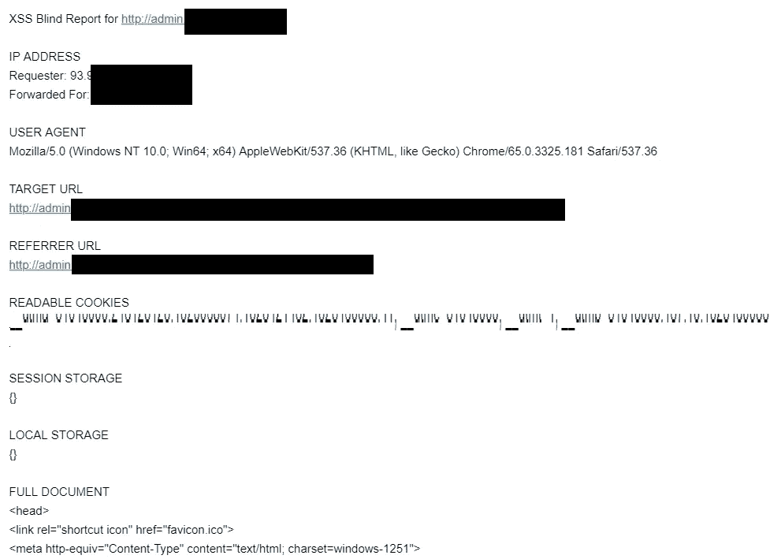
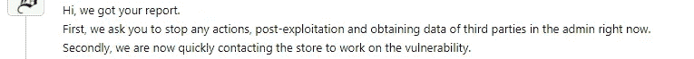
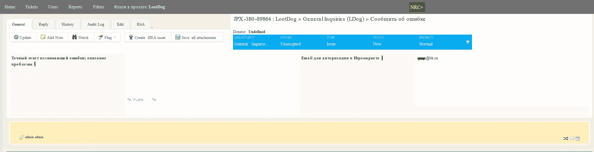

# [Bug bounty | mail.ru]访问合作伙伴网站的管理面板，泄露 200 万用户的数据

> 原文：<https://infosecwriteups.com/bug-bounty-mail-ru-234fa6f5a5a?source=collection_archive---------0----------------------->

相对而言，最近我从在随机网站上搜索漏洞转向了 Bug Bounty 网站，对于许多人来说，这种选择似乎是显而易见的——在这样的项目中，90%的情况下，研究人员不仅会获得良好的体验，还会因为有效的漏洞获得有保证的奖励，而在随机网站上，你可能会偶然发现误解和威胁。实际上，为了在最大的 Bug Bounty——hacker one 上获得声誉和“加速”,我们决定专注于寻找主要 Bug Bounty 程序之一——mail . ru 上的漏洞。

本文将处理 mail.ru 本身的几个错误，以及 mail.ru 子域中的一个漏洞，该漏洞允许访问管理面板，因此有可能查看 200 万用户的个人数据(如电子邮件地址、电话号码、家庭地址等)。)与俄罗斯 10 多家热门网上商店，以及进入他们的账户无需密码。

为了在 hackerone 上参与 [bug bounty mail.ru，对 3000 个子域名进行了逐一整理和检查。我花了一小部分时间来处理这个漏洞，在大约 3 个月的时间里，我设法发送了 45 个有效的漏洞(](https://hackerone.com/mailru) [40 个现已修复，5 个处于“已分类”状态](https://hackerone.com/w2w/thanks))。

前一段时间我开始研究子域 redched _ shop . mail . ru——这是一个品牌产品的在线商店。

大多数情况下，测试从个人账户的功能开始，这种情况也不例外。网站上的授权通过 o2.mail.ru Oauth 或输入电子邮件地址进行。如果我们考虑第二种方法，授权将如下:用户输入一个电子邮件，web app 发送给他一个代码，他通过表单发送代码并进入帐户。这里**发现了第一个漏洞——不正确的认证**:

事实是，除了需要输入到表单中的代码本身之外，还会发送一个链接到表单 redacted_shop.mail.ru/？login=hV8oUH，当您访问该帐户时，您将自动登录该帐户。这种链接通常被称为“自动登录”，这种功能存在于旧的 WAP 网站中。现在这种进账方式因为不安全，几乎不用了。

## **漏洞影响:**

*   攻击者可以进行暴力攻击，找出大量自动登录的标识符，进入别人的账号；
*   登录链接可以被搜索引擎编入索引，并进入谷歌搜索结果问题，攻击者可以解析它们。有时，即使搜索机器人在 robots.txt 中被禁止，URL 也可以在没有内容的情况下被索引。

在仔细搜索目录之后(我使用 dirb 程序和一个自定义字典来搜索目录)，我开始测试用于更改个人数据、投递地址等的表单。表格中出现了 CSRF 代币，试图绕过保护的努力没有成功。没有 XSS，也没有其他漏洞的提示(这样的结论是 fuzzing 后得出的)。

最后，我将我的数据和交付地址更改为 js 有效载荷，并制作了一个商品测试订单，在注释中输入了另一个 js 有效载荷。

在 00:10，我发现我的盲 xss 脚本在我不知道的 admin.undefined.com/index 站点的管理面板中被执行，并且我在服务器上接收日志。当时，甚至没有想到可以访问管理面板，因为大多数情况下 cookies 都受到 http only 标志的保护。

但是，令我惊讶的是，没有旗帜，我成功地进入了管理区。该网站本身看起来像一个 2000-2006 年的 y. CMS，设计非常陈旧，性能很差(页面加载时间很长),有很多 php 和 sql 错误。

在查看主页后，很明显管理面板与 mail.ru 有关，并且 redated _ shop . mail.ru 子域上的订单被信任来管理第三方网站(该团队后来表示它是合作伙伴，并且
redated _ shop . mail . ru 不是由 mail . ru 开发的)。在管理面板中，可以查看、编辑和删除来自 10 个在线商店(一些大型商店)的所有用户的订单，以及查看 2，017，271 个用户的个人数据。**第二个漏洞盲 XSS 被证实。**

如果入侵者可以访问管理面板，他可以通过一次点击下载包含所有用户信息的数据库，但是下载功能本身有一个 php 错误，所以他必须限制自己在管理面板中通过 id 搜索用户，并使用 burp intrusive 解析他们。

此外，在管理面板中，每个用户的页面上都有一个自动登录的链接。也许一些读者还记得 2007 年流行的旧社交网络中的不安全自动登录——spcs . me 等。

我一进入管理面板，拍了几张截图，就立刻在 hackerone 上写了一份报告。
00:20 发送了一份详细报告。00:43 左右，mail.ru 的应用安全负责人谢尔盖·别洛夫(Sergey Belov)在一份报告中回答了我。他要求停止利用我的盲 xss，并立即退出管理面板，我做到了。

第二天早上，我检查了这个 bug，由于日志没有到达我的服务器，我们可以假设它已经被修复了。此外，对管理面板的访问是关闭的，这只是受到 IP 访问的限制(很可能)。

不幸的是，redated _ shop . mail.ru 子域不在 mail . ru 程序的 Bug Bounty 范围内，该漏洞不能声称得到奖励。因此，为了让花费在漏洞上的努力和时间得到回报，我联系了管理面板本身的开发者，并获得了报酬。

我还发送了一份报告，报告了 Bug Bounty 中的第一个不正确的身份验证漏洞，同时充分了解该 Bug 很难被利用，我只会获得声誉点。作为漏洞的 PoC 我发了自动登录 URL*redated _ shop . mail . ru/？login=hV8oUH* ，在报告撰写过程中运行良好。但是，后来我收到了分析师的一条消息，说他无法重现这个错误，显然，开发人员禁用了自动登录功能，再也无法恢复帐户的密码或使用链接进入帐户。

几个月后，人们发现自动登录功能又被打开了，我把这件事告诉了开发人员，几天前这个错误终于被修复了。

# 时间线:

*   4 月 12 日 00:20:50 —通过 HackerOne 发送报告。
*   4 月 12 日 00:43:03 —第一个答案。
*   4 月 12 日 00 时 47 分 15 秒—分庭审理。
*   4 月 26 日 19 时 14 分 38 秒—报告标记为“已解决”。
*   6 月 27 日 00:59 —支付漏洞奖励。

## 发现的大部分 bug 是 XSS、开放重定向和 CSRF，但最有趣的是:

1.  IDOR in lootdog.io 支持服务【https://hackerone.com/reports/328337，透露了几百万张门票。
2.  我想告诉你关于 mail.ru 上的双重认证旁路漏洞，但不幸的是，7 个月来，这个漏洞从未被修复并被标记为“信息性的”，他们不打算在不久的将来修复它，所以，不幸的是，这个漏洞不会在这里。
    我只能说，向手机版本的过渡绕过了保护，而在网页版本的保护是有效的。然而，当他们修复它时，你可以在我的推特上看到相关信息。
3.  盲人 XSS 在宠物名中的 pets.mail.ru 上，允许黑进管理面板。
4.  在****.mail.ru 上发现了存储的 XSS，在它的帮助下，有可能解除 mail.ru 的任何用户的匿名，并获得他的电子邮件，如果他只是按照链接。只需要用 js 创建一个页面。
    由于用户自动登录****.mail.ru，订阅字段中自动替换用户的邮箱，我们可以找到任何一个会关注我们咨询的链接的 mail.ru 用户的邮箱。有可能在页面的 html 源代码以及本地存储中看到电子邮件地址，它的值将被我们的嗅探器获取。
5.  kayako.support.my.com/staff/index.php 的[盲 XSS(loot dog . io 的范围内支持)，后来被标记为“重复”。](http://kayako.support.my.com/staff/index.php)

6.登录 am.ru 上的帐户没有速率限制。该网站具有使用 otp 的登录功能，代码来自电话号码，对枚举号码没有限制，因此暴力攻击将有助于攻击任何只知道电话号码的帐户。

7.关于****mail.ru 上的文章使用 pictures @ mail . ru " > CP-filin . mail . ru/pic 的页面用户邮箱地址泄露？email=@mail.ru，类似于伊萨娃举报【https://hackerone.com/reports/258318】T2。

# 本文的结论:

*   **千万不要**在授权中使用自动登录。
*   通过关闭对管理面板的访问，出现错误 403。htaccess(如果您有 apache 服务器)，通过 IP 地址限制访问，要求验证。因此，攻击者将更难发现管理面板中的漏洞，此外，如果他窃取 cookies 或其他数据，他将无法使用它们。
*   不要在管理面板中使用过时的软件。
*   总是过滤进入管理区的信息中的禁止字符[" <> '/]，以避免 XSS。

# 安检人员小贴士【盲人 XSS】:

*   尝试找到所有可以发送脚本的地方，例如，对页面/用户的投诉，站点评估，日志记录(尝试用脚本替换用户代理，它可能在没有过滤的管理面板的日志中)等等。
*   由于过滤或 CSP 设置，您通常不会收到有关成功的盲 xss 攻击的日志。通过使用其他脚本绕过管理面板中的过滤器(例如 meta、img——在许多情况下，这些脚本足以证明漏洞),并关闭标签，以便它们不会干扰执行。
*   如果管理面板在<>上过滤，试试运气，执行 js 注入”；警报(1)；//.

页（page 的缩写）s:推荐订阅我的 [twitter](https://twitter.com/iSecMax) 了解最新文章。