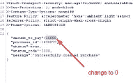
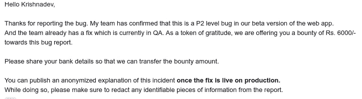

# Bug bounty:使用响应操作绕过支付

> 原文：<https://infosecwriteups.com/bug-bounty-response-manipulation-leading-to-payment-bypass-cb5fde360b1a?source=collection_archive---------0----------------------->

嗨，朋友们，

是我 Krishnadev P Melevila，在我的第一个账户接管博客之后，我带着一个新的响应操作错误回来了。

不认识我的，请搜索谷歌“[克里希纳德夫·P·梅勒维拉](https://www.google.com/search?q=Krishnadev+P+Melevila&oq=krish&aqs=chrome.1.69i60j69i59j69i57j69i60l2j69i61j69i60j69i65.2006j0j1&sourceid=chrome&ie=UTF-8)”或“[诺迪斯塔信息技术公司创始人](https://www.google.com/search?q=Founder+of+Nodeista+Infotech&oq=Founder+of+Nodeista+Infotech&aqs=chrome..69i57.16229j0j9&sourceid=chrome&ie=UTF-8)”

所以让我们开始吧，

照片由[靶](https://unsplash.com/@arget?utm_source=unsplash&utm_medium=referral&utm_content=creditCopyText)在 [Unsplash](https://unsplash.com/s/photos/hacker?utm_source=unsplash&utm_medium=referral&utm_content=creditCopyText) 上拍摄

根据计划政策，我不能透露网站身份。所以我提到的网站名称为 example.com

该漏洞允许攻击者在响应被发送到支付网关之前操纵响应，并绕过整个支付系统。

这主要是支付系统配置不当造成的。

这个错误对公司的经济造成了严重的损害。所以他们认为这是 P2 病毒。

从攻击者的角度再现的步骤:

*   选择任意一个包，点击 buy now，截取服务器的响应。

*   根据服务器的响应，将 *amount_to_pay* 参数值更改为 0。
*   然后将请求转发到浏览器，看看神奇之处…

所以这样一来，我们就可以利用这个 bug 免费买到所有的东西了。

摘要和时间表

报道时间:IST 时间 7 月 23 日下午 2 点 02 分

第一次回应:IST 时间 7 月 23 日下午 04:05

审判时间:2021 年 7 月 24 日上午 10 点，IST

悬赏时间:2021 年 7 月 26 日下午 4 点 50 分，IST

我的 Instagram 句柄: [@krishnadev_p_melevila](https://instagram.com/krishnadev_p_melevila)