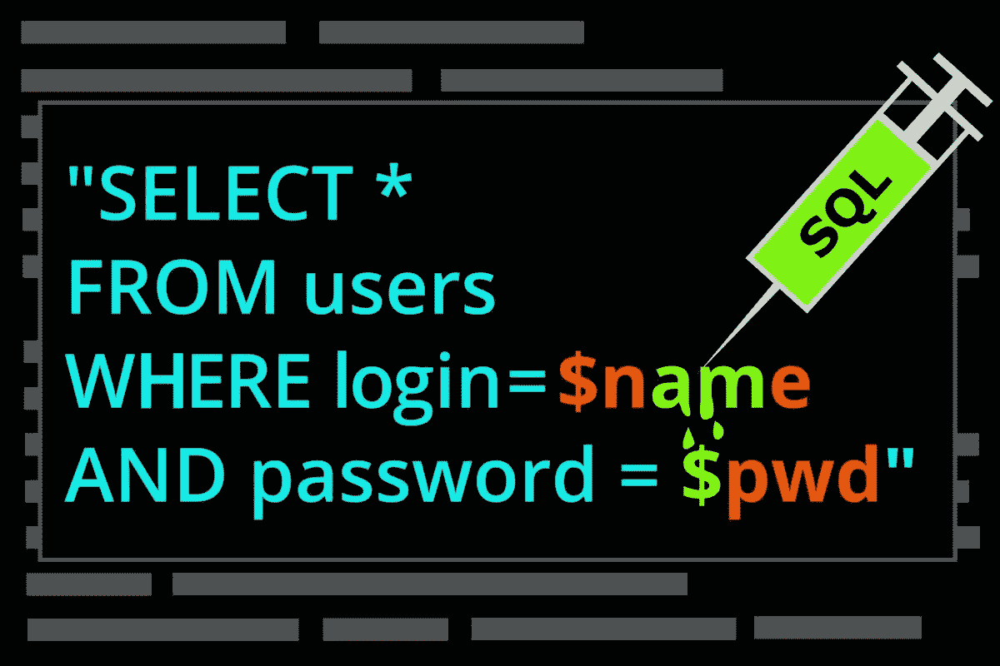

# 错误奖励提示，同步攻击，SSRF，SQL 注入，CPU 漏洞，RCE，等等…

> 原文：<https://infosecwriteups.com/bug-bounty-tips-desync-attacks-ssrf-sql-injection-vulnerabilities-in-cpu-rce-and-much-more-f4d43635dd23?source=collection_archive---------2----------------------->

嘿👋

欢迎来到#IWWeekly20，这是一份每周一期的时事通讯，将信息安全的精华直接发送到您的收件箱。

对于那些来自印度的人，祝 75 周年独立日快乐🤗🥳

记住，不要把这一天当成节日！虔诚地为你的信息安全目标而努力。因为工作是唯一能书写你通往自由✈️的车票的东西

回到主题，这里是我们本周的精选:5 篇文章，4 个线程，3 个视频，2 个 Github repos 和工具，1 个工作提醒，帮助你最大限度地从这份简讯中受益，并在你的职业生涯中向前迈出一大步。

激动吗？让我们开始吧👇

# 📝5 篇信息安全文章

**#1 了解如何通过** [**浏览器驱动的同步攻击**](https://portswigger.net/research/browser-powered-desync-attacks) **将跨域请求与服务器缺陷结合起来毒害浏览器连接池、安装后门、释放同步蠕虫。由** [**詹姆斯·凯特尔**](https://twitter.com/albinowax) **。**

**#2** [**通过包含一个经常被忽略的特殊 DNS 节点**](https://www.securesystems.de/blog/enhancing-subdomain-enumeration-ents-and-noerror/) **来增强子域枚举——ENTs 和 NOERROR。**

**#3** [**访问 CVE-2022–27925**](https://www.volexity.com/blog/2022/08/10/mass-exploitation-of-unauthenticated-zimbra-rce-cve-2022-27925/)**在**[**Zimbra Collaboration Suite**](https://www.zimbra.com/downloads/zimbra-collaboration/)**【ZCS】电子邮件服务器中使用的同一个端点(mboximport)时绕过身份验证，使得该漏洞的严重性明显更为严重。**

**# 4**[**@ Vimanari**](https://medium.com/@anti.kimono)**分享他们如何从 Shodan** **发现一个未经认证的属于财富 500 强公司的 Jenkins 仪表盘导致 RCE。**

**# 5**[**Linux 内核垃圾收集的量子状态 CVE-2021–0920(第一部分)**](https://googleprojectzero.blogspot.com/2022/08/the-quantum-state-of-linux-kernel.html?m=1) **深入探讨了一个野外 Android 漏洞，一个名叫 Wintego 的监控供应商能够远程锁定三星设备。**

# 🧵4 趋势线程

**#1 查看**[**@ rez 0**](https://twitter.com/rez0__/)**关于他的**[**h1–702 事件**](https://twitter.com/rez0__/status/1557363266829123585?t=ZgLgSc2Z9vskrwIIcI6UJA&s=19) **的技术要点。**

**#2 漏了一些来自**[**Intigrity**](https://twitter.com/intigriti)**的# bugbountytips 线程的 bug 赏金提示？**[**@ Nithin R**](https://twitter.com/thebinarybot/)**通过 Intigriti** **分享他的** [**5 个个人喜爱的小技巧。**](https://twitter.com/thebinarybot/status/1556874676223512576)

**# 3**[**@ Abhishek Meena**](https://twitter.com/Aacle_)**如果搜索一些** [**免费实验室来提升你的 pentest/ctf 技能**](https://twitter.com/Aacle_/status/1556891615457071109?t=VlQwE3A0AATaWx8UusEz1g&s=19) **的话，这个新线程对你可能很有价值。**

**#4 区块链&智能合约安全—** [**安全区分 EOA 与智能合约**](https://twitter.com/cyberboyIndia/status/1557754988549402624?t=Vl8qvNHYGdoPdaeVdsFUYA&s=19)**by**[**【shasha NK**](https://twitter.com/cyberboyIndia/)**。**

# 📽️ 3 有见地的视频

**# 1**[**Gregxsunday**](https://twitter.com/gregxsunday)**越过一个** [**被忽略的参数导致 Dropbox bug bounty 中的一个关键的 SSRF**](https://youtu.be/sMk5ajkJO5o) **。**

**# 2**[**live overflow**](https://twitter.com/LiveOverflow)**解释了 CPU 缓存和无序执行等概念，以及这些概念如何在 CPU****中引入一系列** [**漏洞。**](https://youtu.be/x_R1DeZxGc0)

**#3** [**代码评审 vs .动态测试**](https://youtu.be/e0X8xPl4YDk) **由**[**live overflow**](https://twitter.com/LiveOverflow)**与《我的世界》一起讲解。**

# ⚒️2 Github 库和工具

**#1** [**Logsensor 是一个强大的工具**](https://github.com/Mr-Robert0/Logsensor) **通过**[**@ Mr _ Robert20**](https://twitter.com/Mr_Robert20)**发现登录面板并扫描它们是否为 SQL 注入。**

**#2** [**Medusa 是一个框架**](https://github.com/Ch0pin/medusa) **，它自动化了**[**@ ch0 pin**](https://twitter.com/ch0pin)**对 Android 应用程序进行动态分析时所实践的过程和技术。**

# 💰1 个工作警报

网飞应用安全工程师、appsec 审查和评估的远程职位空缺。

# 💸和我们一起做广告💸

我们希望与来自世界各地的惊人的信息安全、笔式测试和道德黑客团队、品牌和公司合作。如果这听起来像你， [**点击这里**](https://docs.google.com/forms/d/e/1FAIpQLSfb_v6aVoJUpKBcrEV7HgoZ8FL20QWUFDTWTkxZjQHp5UEhiA/viewform) 与我们合作。

这星期就这些了。希望你喜欢这些令人难以置信的发现，并从今天的时事通讯中学到一些新东西。

**在我们说再见之前……**

如果你觉得这篇时事通讯很有趣，并且知道其他人也会感兴趣，如果你能把它转发给他们，我们将不胜感激📨

如果您有问题、评论或反馈，请回复此邮件或在 Twitter [@InfoSecComm](https://twitter.com/InfoSecComm) 上告诉我们。

下周再见。

很多爱

编辑团队，

[信息安全报道](https://infosecwriteups.com/)

*这份简讯是我们与“神奇大使”合作制作的。*

*资源贡献者:* [*比马尔·k·萨胡*](https://twitter.com/srb1mal)*[*尼基尔·梅马内*](https://twitter.com/NikhilMemane09)*[*西达尔特*](https://twitter.com/illucist_)*[*维奈·库马尔*](https://twitter.com/R007_BR34K3R)*[*普拉莫德·库马尔·普拉丹*](https://twitter.com/NinjaFurry5)****

***通迅格式由:* [*尼辛 R*](https://twitter.com/thebinarybot) ， [*维奈库马尔*](https://twitter.com/R007_BR34K3R) *，* [*哈迪克辛格*](https://twitter.com/Kxddah?t=_Ghby7u5rNBfUxzzjEZUUw&s=09) *和* [*西达尔特*](https://twitter.com/illucist_) *。***

**如果您希望加入我们的大使频道并为时事通讯投稿，请在 Twitter 上用您的 discord 用户名向我们发送 DM。**