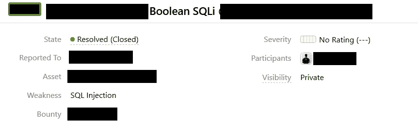
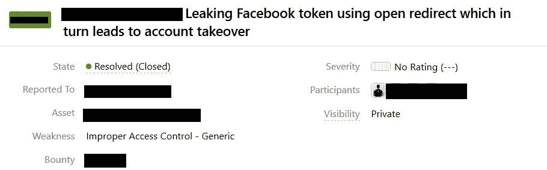
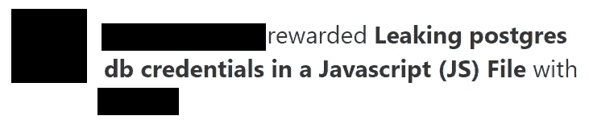
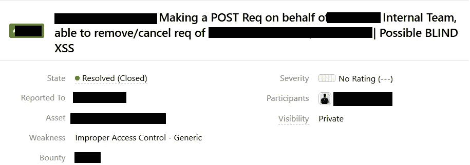

# Bug Bounty —提示/技巧/ JS (JavaScript 文件)

> 原文：<https://infosecwriteups.com/bug-bounty-tips-tricks-js-javascript-files-bdde412ea49d?source=collection_archive---------0----------------------->

这一切都始于 8 月份，当时我联系了 [Gerben Javado](https://twitter.com/gerben_javado) 询问一个问题，是的，这是一个基本的问题，但那天与他的一次快速聊天给了我一些寻找漏洞的信心，当时他指向他的博客帖子[力争上游一个漏洞奖励计划](https://gerbenjavado.com/the-race-to-the-top-of-a-bug-bounty-program)，并让我寻找那个特定程序中的漏洞。

游戏开始了，我从来不知道我会很快扭转局面，成为该计划的领导者。在 6 个月的时间里，我学会了很多技巧和诀窍，以及如何阅读 JS(这对我来说是最重要的)。

分享就是关心:)现在直奔主题。

**侦察？**

侦察侦察侦察

每个人都知道侦查以及如何去做，最重要的是你可以在侦查技术中增加什么来发现更多的漏洞:

第一，你会在 Twitter、脸书、LinkedIn 等网站上搜索端点吗？？不，不要问我如何，这里是>如果你知道一个端点返回 403，因为它是一个管理端点，但你有没有想过知道正确的目录和参数有时可以把 403 变成 200(由于配置错误)，然后变成一个 SQLi？；)

社交媒体平台上发现的端点

^^特定终点结果

第二，CSP 接头？有人吗？它有一个子域，我扫描了 IP 范围，发现了一个有趣的，给了我完全的管理权限[该报告已经公开；)].哇哦！

第三，谷歌，请给我所有有“[www.domain.com/{directory}/{directory](http://www.domain.com/{directory}/{directory)}”>的结果，不，我没有使用 site:domain.com inurl:，我只是使用双引号，正如提到的“[www.domain.com/{directory}/{directory](http://www.domain.com/{directory}/{directory)}”，这可能是大多数时候皮塔，但如果你想要更多的错误，那么让我们这样做。您可以根据公司经常使用的端点来修改您的搜索。如果你幸运的话，你可以找到一些东西来帮助你…

她是一位很好的女士，在她的博客中有公司的端点，点击后会重定向到她自己的商业网站。她可能在她的个人资料中有一些额外的特权，允许她这样做。

第四——不要去寻找第四，要有创造力；)

**哦我的 JS 文件；)我越来越爱你了！**

有很好的工具可以在 JS 文件中寻找端点，比如 JS Parser(来自 [Ben](https://twitter.com/NahamSec) 和 [Brett](https://twitter.com/bbuerhaus) )，Linkfinder(来自 [Gerben Javado](https://twitter.com/gerben_javado) )，这些都是很好的工具，但是没有什么能像手动搜索那样好，是的，这些也是 PITA，但是如果你想要更多的 bug，你必须这样做；)

手动搜索的几个例子:

我爱你 JS:)

是的，你没看错^^。

我现在更加爱你了；)

JS 在大多数时候会让你找到一些确定的东西，最近我在访问一个公司的内部主机时，发现从他们的网络之外是无法访问的。真的吗？不，让我们启动 Nmap，看看能不能找到开放的端口。超级，后来发现它有开放的 Jenkins 实例运行在端口 8080 wowwww 酷是时候执行一些 cmd，aaannnndddddd 使用 Groovy 脚本我能够在服务器上执行 cmd。呜哇！

我的一些报告(关于 JS)已经发表在我的[hackerone.com/prateek_0490](https://hackerone.com/prateek_0490)H1 个人资料[上了。](http://hackerone.com/prateek_0490)

我要感谢 [HackerOne](https://hackerone.com) 和 [BugCrowd](https://bugcrowd.com) 以及所有其他运营 BBP 的公司，他们为我们提供了实现这一目标的机会。

是的，我已经并且正在尽我的一份力量让互联网变得更安全:)

有问题吗？在[推特](https://twitter.com/prateek_0490)推特>推特[https://twitter.com/prateek_0490](https://twitter.com/prateek_0490)上打我