# 2021 年的捕虫之旅

> 原文：<https://infosecwriteups.com/bug-hunting-journey-of-2021-1fa60b28d949?source=collection_archive---------0----------------------->

嘿，大家好，

我希望每个人都有一个愉快的黑客年，我今年没有分享任何文章，所以我想我应该写一篇文章，在那里我将讨论我今年主要在 *Hackerone* 平台上发现的大多数错误。所有的 bug 都是在打嗝、浏览器和大脑的帮助下人工发现的

这将是类似的博客，就像我以前已经做过的:

[](https://sudhanshur705.medium.com/bug-hunting-journey-of-2019-95e5190aca7c) [## 2019 年的捕虫之旅

### 嘿，大家好，

sudhanshur705.medium.com](https://sudhanshur705.medium.com/bug-hunting-journey-of-2019-95e5190aca7c) 

今年，我不再使用任何脚本来查找 bug，而是完全依靠我的手工黑客技能来查找 bug。我没有去追子域，而是直接去追主应用程序。

因此，你可以说，今年我没有走得更远，而是更深入地了解了目标。

我不得不在我的方法上做许多改变，因为以前我只是使用脚本，从终端进行黑客攻击，现在我必须浏览目标，了解它是如何工作的，然后尝试破解它。

我不会说谎，我当时用的是 *Burpsuite 破解版*，是的，你没听错，是 LarryLau 那个。我做的第一件事就是把破解版倒掉，只用社区版。

我现在意识到，我真的不需要它，但我不知道为什么我会使用它，因为我开始做 bug 狩猎，可能是因为我从 youtube 等网站上获得的任何*视频概念验证/教程*也在使用破解版本，所以我一直认为要擅长 bug 狩猎，你需要 *BurpSuite pro* 。

***我决定转储破解版是因为* :**

你可能已经知道他了:

[](https://in.linkedin.com/in/rootxharsh) [## Harsh Jaiswal - Bug bounty 参与者- HackerOne | LinkedIn

### 查看 Harsh Jaiswal 在世界上最大的职业社区 LinkedIn 上的个人资料。Harsh 列出了 4 项工作…

in.linkedin.com](https://in.linkedin.com/in/rootxharsh) 

Harsh 非常擅长发现服务器端的 bug，如果你看过他的视频 POC，你可能会注意到他使用的是 Burp 社区版本，这改变了我的想法，你不需要这个专业工具来发现 bug，你只需要积累正确的技能和经验。

有一条来自 s0md3v 的推文(我找不到了:(现在)，他在那里跟别人说，你不要用破解版。Portswigger 为社区、实验室(网络安全学院)、研究论文等做了很多事情，都是免费的，所以你不应该以这种方式背叛他们。使用社区版本，它有你需要的所有东西。

一路走来，我可以免费访问这些令人敬畏的网站来提高我的技能:

这是我从@zseano 发起的 CTF 挑战赛中赢得的:)

[](https://www.bugbountyhunter.com/) [## 成为 bug 赏金猎人-了解 web 应用程序漏洞以及如何在…

### 新的或有经验的，了解各种漏洞类型的定制 web 应用程序的挑战基于真实的错误…

www.bugbountyhunter.com](https://www.bugbountyhunter.com/) 

感谢 Snyff 和 Codingo 的慷慨捐赠。

[](https://pentesterlab.com/) [## PentesterLab:学习 Web 渗透测试:正确的方法

### 例如，我们在 JSON Web Token (JWT)上面临十几个挑战，因为 JWT 引入了非常有趣的漏洞…

pentesterlab.com](https://pentesterlab.com/) 

## 现在开始研究虫子

刚开始的时候很难，因为我是新手，要处理很多信息丰富的报告。我的报告没有显示出任何影响，所以它们都被关闭了。但是我一直在提交

在那段时间，我看到了一些披露的报告，来自:

[](https://hackerone.com/logitech?type=team) [## 罗技- Bug 赏金计划| HackerOne

### 罗技 Bug Bounty 计划在 HackerOne 上寻求黑客社区的帮助，以使罗技更加安全…

hackerone.com](https://hackerone.com/logitech?type=team) [](https://hackerone.com/automattic) [## 自动虫赏金程序|黑客龙

### Automattic Bug Bounty 计划在 HackerOne 上寻求黑客社区的帮助，以使 automatic 更加安全…

hackerone.com](https://hackerone.com/automattic) 

所以我想我应该试一试，看看被披露的错误是否真的得到了修复，或者我是否可以绕过现有的保护措施。

我在 streamlabs.com 呆了很长时间，这在罗技 bbp 的资助范围内:

[](https://streamlabs.com/) [## Streamlabs | #1 面向实时流媒体和游戏玩家的免费工具集

### Twitch、YouTube 和脸书最受欢迎的流媒体平台。基于云，并被 70%的 Twitch 使用。与…一起成长

streamlabs.com](https://streamlabs.com/) 

起初我很犹豫要不要猎取它们，因为*细流实验室*非常受欢迎，但我还是尝试了

找到一个 ***存储的 xss*** ，这真的很容易找到:)，这是一种自我 xss，因为这个页面只能从我的仪表板上查看。后来，我发现我们可以邀请其他用户加入我们的仪表板，所以我在报告中添加了这一点

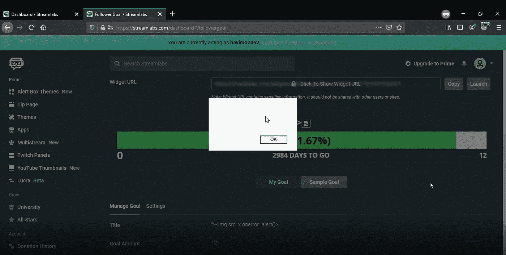[](https://hackerone.com/reports/1049012) [## 罗技在 HackerOne 上披露:存储 XSS 在...

### 嘿，我在下面的目标设置页面中发现了一个存储的 xss 漏洞。```…

hackerone.com](https://hackerone.com/reports/1049012) 

然后我发现了一个 ***csrf vuln*** 影响了大部分端点，

虽然在请求中有一个 *csrf 头*，但是它根本没有被服务器验证，所以在测试应用程序时，我只是移除了这个头，瞧，它仍然工作。但是有一个问题， *Content-Type* 头被正确验证，所以它必须被设置为`application/json` ，所以我不能创建 *csrf poc* ，因为它将触发 CORS 飞行前请求。

所以我检查了所有的端点，找到了一个接受`text/plain`的端点

[](https://hackerone.com/reports/1049360) [## 罗技在 HackerOne 上披露:CSRF 在改变用户...

### 嘿，我发现,“API/V6/viewer-portal/viewer-settings/donation _ settings”端点容易受到…

hackerone.com](https://hackerone.com/reports/1049360) 

要为`JSON`请求创建一个 CSRF poc，我们需要添加一个额外的填充。在下面的截图中，你可以看到我添加了一个额外的*键，值*对(高亮部分),这将确保*请求体*是有效的 json 数据

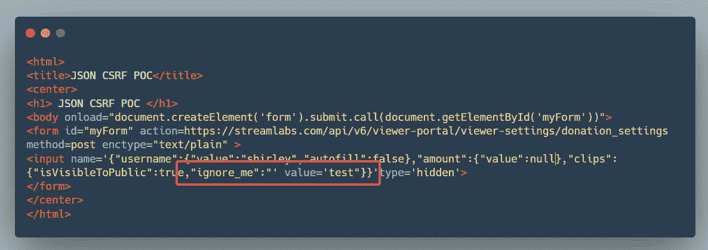

如果您想了解更多关于 JSON CSRF 概念验证的信息，请阅读 Geekboy 的这篇文章:

[](https://www.geekboy.ninja/blog/tag/json-csrf/) [## 极客|安全研究员

### 对于第一种情况，在某些情况下，服务器可能会因为额外的数据填充而拒绝请求，但是…

www.geekboy.ninja](https://www.geekboy.ninja/blog/tag/json-csrf/) 

在此期间，我发现了罗技的最后一个 bug， **Streamlab** 提供了许多只有 *Prime 会员*才能使用的功能。

所有突出显示的端点都需要 *Prime 订阅*。

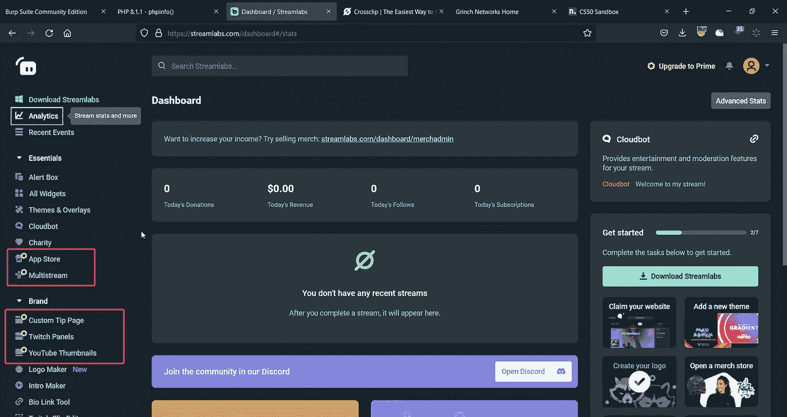

在浏览不同的请求/响应时，我发现这个端点非常有趣:

```
[https://streamlabs.com/api/v5/user/prime/subscription](https://streamlabs.com/api/v5/user/prime/subscription)**Reponse**:{
  "is_active": false,
  "is_pending": false,
  "is_past_due": false,
  "is_canceled": false,
  "is_pro": false,
  "type": "",
  "free_trial_claimed": false,
  "hibernate_claimed": false,
  "free_trial_eligible": false,
  "hibernate_eligible": false,
  "cooldown_eligible": false,
  "cooldown_seconds_past": null
}
```

一切都被设置为 false，所以我决定使用*打嗝的匹配和替换*规则将响应体中出现的所有 false 替换为 true

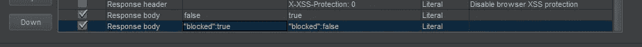

打嗝匹配和替换

```
**Type**: Response Body 
**Match**: false 
**Replace**: true
```

我只是好奇，想看看应用程序是否真的依赖*客户端验证*来检查用户是否有 Prime 订阅。

令我惊讶的是，它真的起作用了。

Prime 订阅最有趣的部分是你可以得到免费的东西，比如 t 恤、鼠标等等

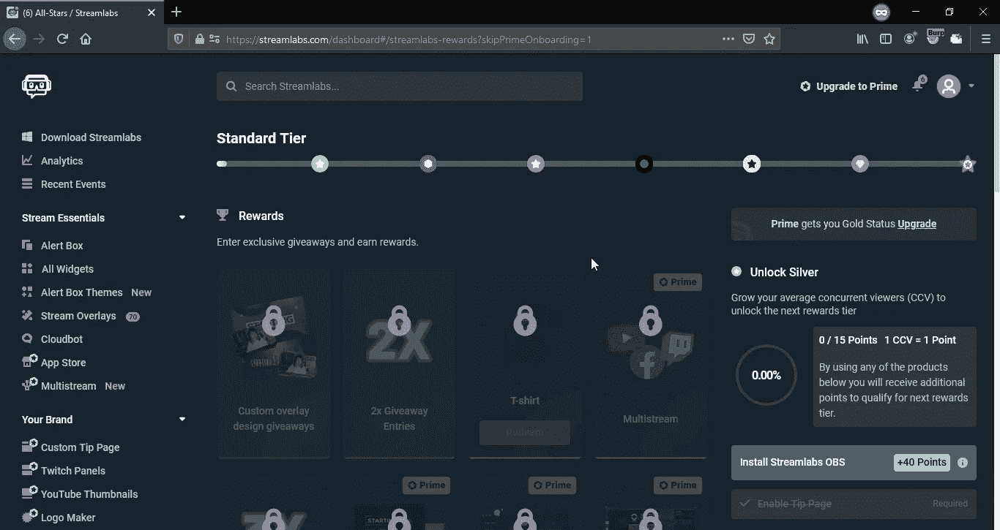

在应用匹配和替换规则之前

现在看看应用匹配和替换规则后的屏幕截图:

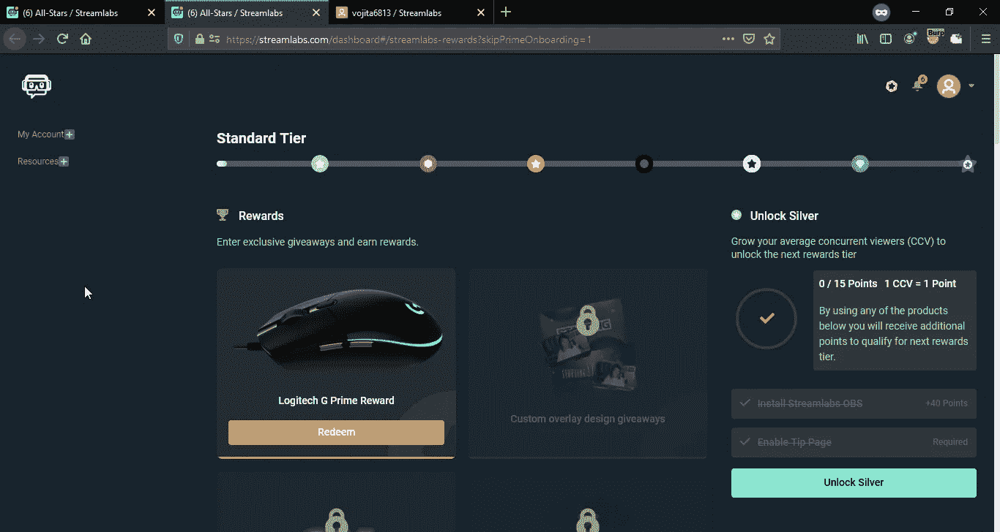

为了实际确认它是否工作，我点击了 ***确认*** 按钮，它要求输入一个电子邮件地址:

这是我在收件箱中收到的确切电子邮件:

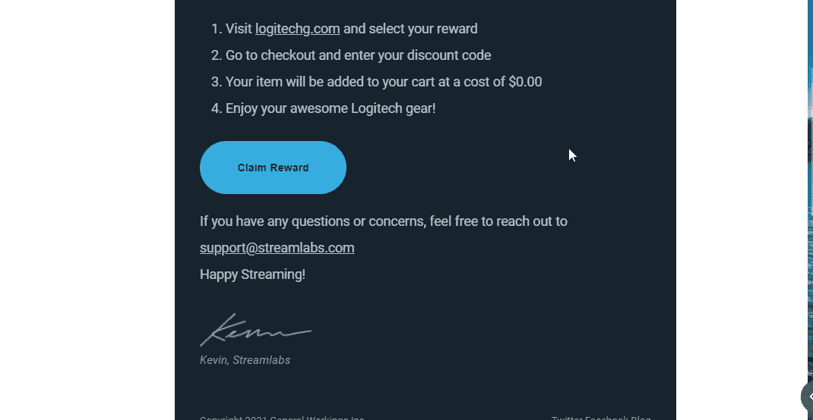

免费购买罗技鼠标的优惠券代码

*我告诉他们这个影响:*

通过创建 1000 个帐户，我可以获得 1000 份礼物，礼物是一个罗技游戏鼠标，平均价格约为 30 美元。因此，1000 个罗技游戏鼠标的成本将是 30 * 1000 = 30，000 美元。我可以免费得到这一切

这可能导致公司的财务损失，但他们仍然降低了严重性:(

[](https://hackerone.com/reports/1070510) [## 罗技在 HackerOne 上披露:操纵响应导致...

### Heyy 团队，我发现了一个很酷的 bug，它允许我免费访问 streamlabs 的主要功能。这里是 api…

hackerone.com](https://hackerone.com/reports/1070510) 

我参加了 h1-ctf，这是在今年的最后一周，所以我能够得到许多免费邀请私人节目。我决定更多地关注私有程序，因为我有更好的机会在那里找到有效的 bug。

因为我发现的大部分错误都在私人程序中，所以大部分东西都会以**编辑**的形式出现。

## BUG: XSS 导致账户被接管

我从几个月前开始的一个项目开始，它完全是新的，没有太多的提交，响应时间非常有吸引力，所以我决定尝试一下。

在这个网站上四处逛了一会儿后，我现在对这个应用程序的工作原理及其提供的所有功能有了一些了解。该应用程序基本上类似于 ***TryHackme*** 平台。

我查看了 cookie 政策:

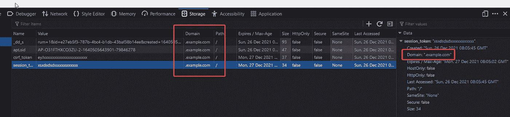

你可以看到 cookie 的范围被设置为`.example.com`

这意味着所有的子域也将拥有与`example.com`相同的 cookie，所以如果我能够在一个子域上找到 xss，这将允许我轻松地窃取受害者的 cookie。这个应用程序有趣的地方在于，所有易受攻击的挑战都托管在`example.com`的子域上

假设有一个 xss 挑战赛，那么它将被托管在一个子域`xss-challenge.example.com`

所以我使用了`xss-challenge.example.com`子域(已经有一个 xss 漏洞)来证明通过 xss 窃取其他用户的会话 cookies 是可能的。我告诉他们将 cookies 的范围更改为一个域，或者使用一些沙盒域来主持挑战。

该问题已被分类并奖励为`HIGH`严重性漏洞:)

## ***进入下一个节目，……..***

该程序已有 2-3 年历史，提交率很高，排名第一的黑客的声誉为 *1500+*

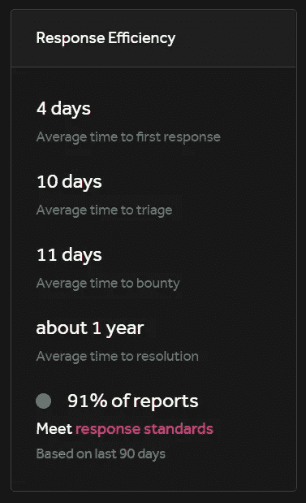

看看这个程序的统计数据，你可以肯定地说，得到一个 bug 的副本的机会非常高，因为他们平均要花 *1 年来修复*一个问题，我仍然决定试试这个程序。

## BUG:多重 CSRF

发现了一个 ***csrf 漏洞*** ，它允许我更改受害者的登录电子邮件地址。这很容易导致帐户接管漏洞。我很快报告了该漏洞，正如所料，它是重复的。

然后我发现了更多的 *csrf* 漏洞，比如*更改申请人的名字*以及许多其他低严重性 *csrf* 漏洞。我决定不报告它们，因为它们可能已经被报告过了(*因为我已经重复了一次高严重性 csrf vuln* )，我不想在它们上面浪费时间。

几天后，当我在同一个目标上没有发现任何其他错误时，我想他妈的，我会报告那些低严重性的错误，看看会发生什么。

在晚上和第二天早上，当我检查我的邮件时，这些报告中有一些活动，我想是的，所有这些都因为重复而被关闭，我已经知道了，但当我打开邮件时，我发现所有这些都被筛选并得到了奖励，这是我完全没有想到的。

我已经报告了 4-5 个 csrf 错误，所以我决定寻找更多类似的错误。识别这些易受攻击的请求非常容易，因为其中没有 csrf 令牌

总的来说，我能够找到大约 10 个 csrf 错误，没有重复的，都得到了奖励。那时我很有动力去寻找更多的项目。

## BUG: IDOR

然后，我检查了范围中提到的其他域，在一个应用程序中，我可以看到大多数基于 ***GET*** 的请求中都有参数`company_id`。所以我测试了他们的 IDOR vuln，很快就发现了一个泄露了一些受害者公司信息的 IDOR，我报告了这个 IDOR，它被作为重复关闭:(

之前我特别提到过，只有基于 *GET 的请求*才有那个`comapny_id`参数，基于 ***POST*** 的请求(比如更改个人资料设置、公司设置)没有这个参数

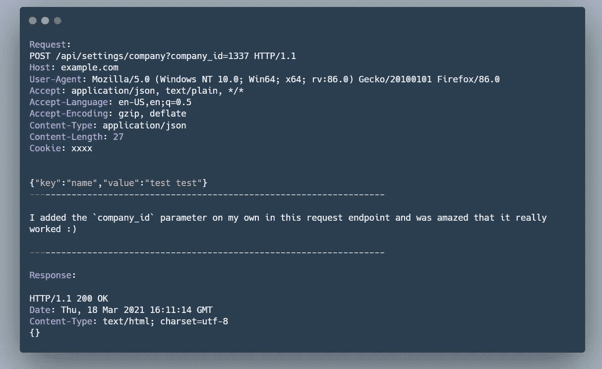

虽然 *GET Based IDOR* report 得到了副本，但这个没有。这是审判和奖励为`High`严重性。

如果你正在寻找一个收集的 IDOR bytes 签出这个网站:

[](https://book.hacktricks.xyz/pentesting-web/idor) [## 伊多尔

### 清单-本地 Windows 权限提升

book.hacktricks.xyz](https://book.hacktricks.xyz/pentesting-web/idor) 

## 错误:通过 SVG 文件上传和 2 个旁路存储 XSS

现在我要告诉你一个我感觉被欺骗的经历，是的，这经常发生，不是所有的节目都好，所以确保你选择了正确的一个:)

我通过文件附件上传在这个程序中发现了一个存储的 xss 错误，它基本上是一个松弛型应用程序。

上传的文件存储在 s3 桶中，例如:`xmessenger-attachments.s3.amazonaws.com`，

同样上传的文件也可以从目标`attachments.example.com`的子域访问

我上传了一个 svg 文件，内容如下:

上传文件的 url 是这样的:

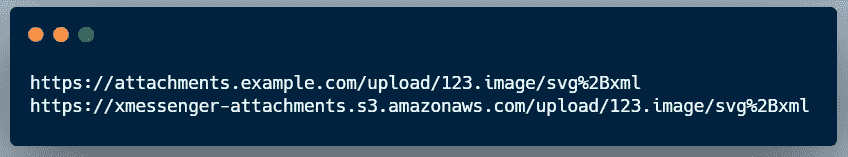

我在目标的一个子域上有一个 xss，如果你不是急性子，我在文章的开始就讲过这个:)

我检查了 *cookie 范围策略*，在这里也发现了同样的事情`.example.com`，这次在 cookie 中有一个 *jwt 令牌*，它在所有 api 端点和其他子域中用于认证目的。

与此同时，我检查了*更改密码请求*，发现它不需要当前密码*。*

这一次，我发现了一些东西，可以轻松地让我改变受害者的密码，并接管他们的帐户。

我在报告中特别提到了这一点:

```
We can create a javascript code which will first steal the victim's jwt token , then sends a request to the change password endpoint using the stolen jwt token, which will eventually allows us to takeover the victim's account. If you need a actual POC for this let me know, I am not providing it along the report as it will take time
```

该计划的响应时间很长，所以我在提交报告后几个小时内就收到了响应，结果是这样的:

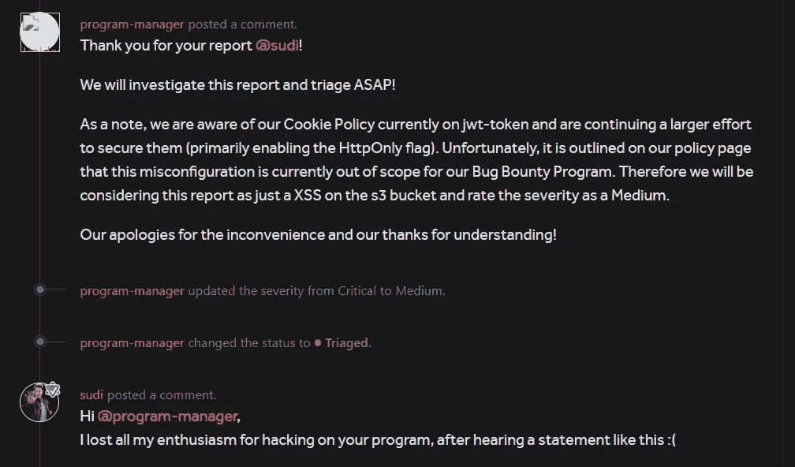

这种情况来来回回发生了 2-3 次，然后我什么也没说，因为他们每次都告诉我相同的答案，他们已经知道 cookie 政策，并正在尽最大努力保护它们。它被奖励为一个`Medium`的严重程度，这有点糟糕，因为影响远高于此。

顺便说一句，猜猜我刚刚检查了什么，即使他们不断努力，饼干的政策仍然是一样的。

大约一周后，问题得到了解决。

我当时只是想检查一下修复，发现了一个非常简单的旁路:)

这是上传附件的请求

```
POST /graphql HTTP/2
Host: x.example.com
User-Agent: Mozilla/5.0 (Windows NT 10.0; Win64; x64; rv:91.0) Gecko/20100101 Firefox/91.0
Authorization: Bearer Redacted
Content-Type: application/json
Content-Length: 59{
  "operationName": "uploadFile",
  "variables": {
    "fileType": "image/svg+xml",
    "cId": "1490072"
  },
  "query": "mutation uploadFile($cId: ID!, $fileType: String!) {\n  uploadFile(cId: $cId, fileType: $fileType)\n}\n"
} 
```

修复后，如果文件的`Content-Type`是`image/svg+xml`，应用程序不接受该文件，所以为了绕过它，我尝试了不同的*内容类型*的文件，如`image/svg , text/html`等，我发现`text/xml`是允许的，xss 弹出窗口再次出现。

程序启用了 ***复检*** ，但他们在第一份报告中没有要求我这样做，所以我提交了一份新报告。

他们确认了搭桥手术，我再次获得了相同数额的奖金。

由于 ***已解决*** ，再次应用了新的修复，报告关闭。这一次也没有要求 ***重新测试*** 。

激发我打嗝检查修复，现在随着`image/svg+xml`它也不接受`text/xml`。在幕后，他们可能有一个白名单过滤器，只接受少数`content-type`，如`text/plain`和其他常见的。

[](https://github.com/BlackFan/content-type-research/blob/master/XSS.md) [## master black fan/content-type-research/XSS . MD

### 内容型研究。在 GitHub 上创建一个帐户，为 black fan/内容类型研究的发展做出贡献。

github.com](https://github.com/BlackFan/content-type-research/blob/master/XSS.md) 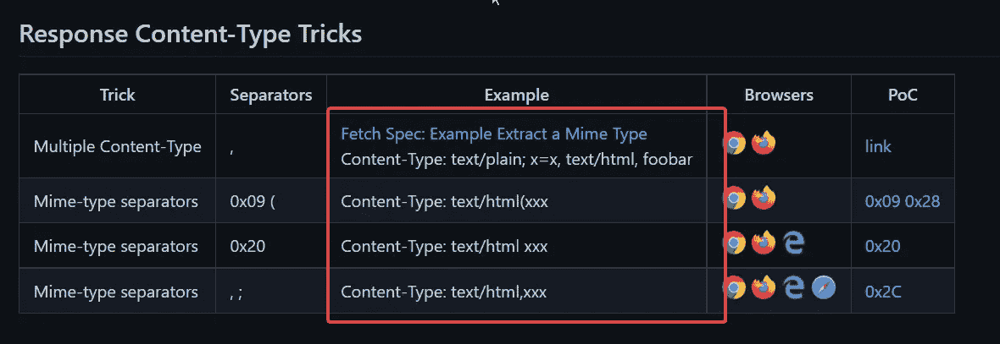

`fileType:text/html(xxx`、`fileType:text/html,xxx`等

我尝试了所有这些方法，看看应用程序是否允许它们中的任何一个，但是没有一个有效。

然后我得出结论，应用程序从**上传文件的扩展名**中验证了*内容类型*:如果我上传一个文件名为`test.txt`的文件，那么 ***文件类型*** 参数值将是*上传请求*中的`text/plain`。于是我上传了`xss.svg`文件，并将 ***文件类型*** 参数值从`image/svg+xml` ( *不允许*)改为`image/png` ( *允许*)，文件上传成功

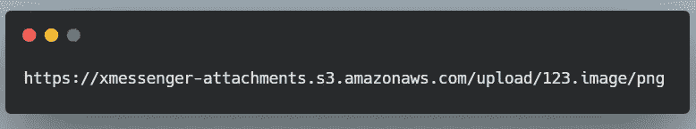

上传文件的 Url

```
HTTP/2 200 OK
**Content-Type: image/svg+xml**
Content-Length: 416
Date: Mon, 27 Dec 2021 05:14:36 GMT
Last-Modified: Wed, 01 Sep 2021 04:52:51 GMT
**Content-Disposition: inline; filename="xss2.svg"**
Accept-Ranges: bytes
Server: AmazonS3<?xml version="1.0" standalone="no"?>
<!DOCTYPE svg PUBLIC "-//W3C//DTD SVG 1.1//EN" "[http://www.w3.org/Graphics/SVG/1.1/DTD/svg11.dtd](http://www.w3.org/Graphics/SVG/1.1/DTD/svg11.dtd)">
<svg version="1.1" baseProfile="full" ae nr" href="http://www.w3.org/2000/svg" rel="noopener ugc nofollow" target="_blank">http://www.w3.org/2000/svg" width="240px" height="240px">
   <polygon id="triangle" points="0,0 0,50 50,0" fill="#009900" stroke="#004400"/>
   <script type="text/javascript">
      alert(document.cookie);
   </script>
</svg>
```

做了一个新的报告，他们验证了旁路，并奖励了我(金额与之前的相同)。

而且这次他们要求复试:)

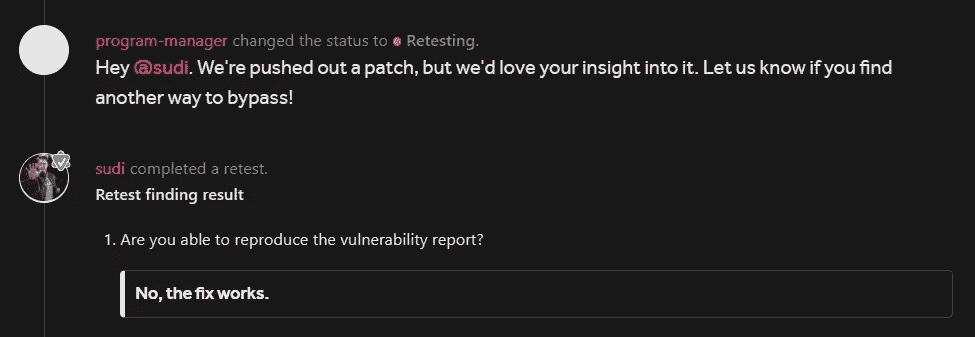

我确认了他们的修复，发现这次没有旁路，他们这次做得很好。但是等等，故事并没有就此结束。

***故事的转折来了。***

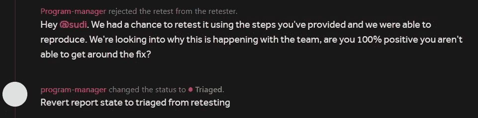

所以我再次检查了这个 bug，这一次它是可复制的，我根本不相信，我告诉他们是的，我只是试着复制它，发现它仍然在那里。遗憾的是，我没有任何用于 ***复试*** 的视频概念验证，所以我无法证明在我检查之前这是不可重现的。

一周后，他们推出了一个补丁，当我检查时，我可以看到*上传请求*中的差异:

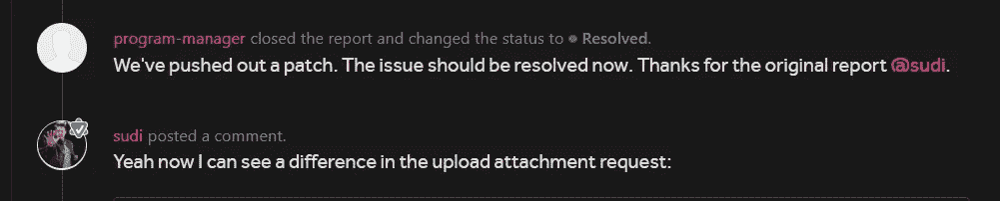

```
POST /graphql HTTP/2
Host: x.example.com
User-Agent: Mozilla/5.0 (Windows NT 10.0; Win64; x64; rv:91.0) Gecko/20100101 Firefox/91.0
Authorization: Bearer Redacted
Content-Type: application/json
Content-Length: 59{
  "operationName": "uploadFile",
  "variables": {
    "fileType": "image/svg+xml",
    **"fileName":"xss2.svg",**
    "cId": "1490072"
  },
  "query": "mutation uploadFile($cId: ID!, $fileType: String!) {\n  uploadFile(cId: $cId, fileType: $fileType)\n}\n"
}
```

正文中增加了一个新参数`fileName`。现在应用程序正在验证文件名*和文件`content-type`。*

在上面的截图中，你可以看到 ***复试*** 被拒绝，所以我告诉他们，我没有得到 ***复试*** 的 50 美元，因为它被拒绝了。这是他们的回答:

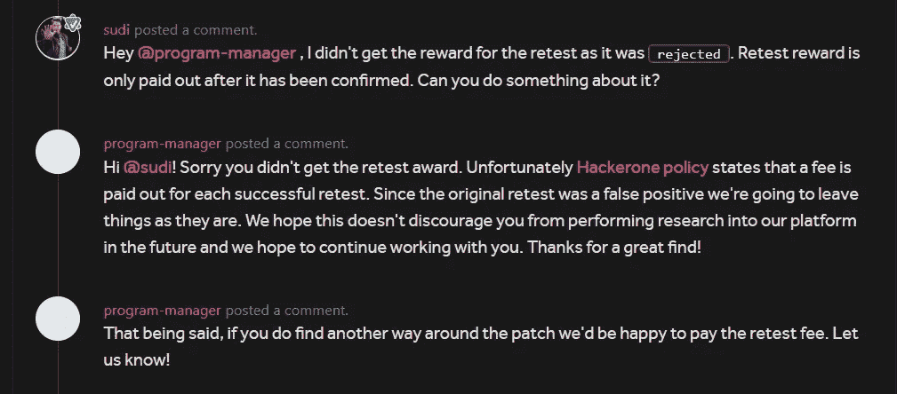

就在那时，我决定再也不黑他们的程序了，顺便说一句，黑客仍然显示我在复试中赚了 50 美元，这有点可笑。

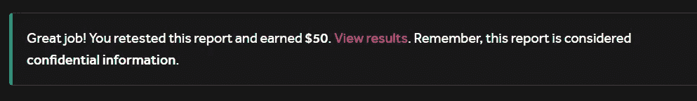

> 永远要小心像这样的程序，在 Frans Rosen 的一次演讲中，他告诉我们，当开始入侵一个新程序时，他只发送几个低悬的错误报告，实际上是为了发现这个程序是否值得他花费时间。他不想把宝贵的时间花在一个他们不尊重黑客，不把安全当回事的程序上。

## **BUG:通过 api 端点泄露私有注释**

我现在要讲的这个 bug 真的非常简单，没有太大的影响，但是仍然相对容易找到。

这是一个已经运行了 4-5 年的项目，所以它不希望如此容易地找到这样的东西。该应用程序是一个文件共享平台，用户可以上传文件并与其他用户共享。

有一个功能允许任何用户为他们的文件设置密码，如果任何人想访问它，他们需要提供密码。除了文件之外，所有者还可以发送一条注释，只有当最终用户提供正确的密码时，他们才可以看到。

所以我拿起共享链接，在我的浏览器中打开它，检查加载该 url 后发出的所有请求，第一个请求是向`/api`端点发出的。

```
[https://example.com/api/file/v1/info?hash=xxxxxxxxxxxxxxxxx](https://example.com/api/file/v1/info?hash=xxxxxxxxxxxxxxxxx)
```

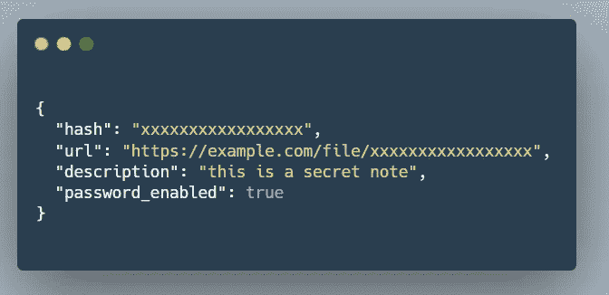

在响应中，您可以看到一个`description`字段，其中包含随文件一起附加的注释，这不应该在响应中公开。

我想这是不可能发生的，我又在匿名窗口打开了同一个网址，并在打嗝监测请求。发现了同样的反应。

然后我决定报告它，我有一种强烈的感觉，这可能已经被报告了，因为它是如此明显，你只需要加载 url 并观察响应，很容易的错误，对不对？

好吧，没有其他人报告说它被归类并奖励为一个`LOW` 严重性漏洞，甚至在报告它几个小时后就被修复了。

## 错误:只需知道电子邮件地址就可以禁用任何用户的帐户

现在准备好，我要讲一个非常有趣的 bug，它很容易发现，但也有很大的影响

很久以前我被邀请参加这个项目，但在那段时间里我没有发现任何有趣的事情，有人透露了他们的发现，是关于在主示波器上发现的一个 ***全文阅读 ssrf*** bug。我真的被这个 bug 惊呆了，所以我决定花更多的时间在这个程序上，看看我能找到什么。

当你入侵一个新程序时，你可以设定一些目标，比如我会尽最大努力提交这个程序的至少一个有效的 bug，即使你没有发现任何 bug 也没关系。一些目标很难，并且具有非常好的安全态势。继续尝试一些不同的项目，比如社交媒体网站、B2B 应用程序、零售网站等等，找到最适合你的。

回到 bug，…

我有点喜欢寻找*不适当的访问控制*、*权限提升*错误，要找到这样的错误，你需要更深入地挖掘应用程序，了解不同的用户角色是如何定义的，只有管理员的权限才能执行什么操作，等等

我测试的应用程序是一个*商家门户*，店主可以在那里控制他们的零售店。我们也可以邀请其他用户加入我们的*商家门户。*

因此，我通过输入*电子邮件地址*邀请了另一个用户，邀请电子邮件被发送到该用户的电子邮件地址，现在被邀请的用户可以访问商家门户并根据其`Role`执行操作

访问控制设置得非常强大，我在任何端点都找不到任何错误配置。

回到管理员界面，我注意到我们可以执行一些操作，比如更改被邀请用户的*用户名等*

我将名称改为其他名称，然后访问被邀请用户的个人资料，更改成功完成。那一刻我意识到当我邀请用户时，收到了一封邀请邮件，上面有 ***邀请确认链接*** ，我正确地记得我没有点击它。

如果你还没有弄明白，我来告诉你这里出了什么问题。应用程序不验证*被邀请用户*是否确实确认了*邀请请求*。*邀请用户*直接添加到*商家门户。*

只要知道一些人的*电子邮件地址*，我就可以邀请他们到我的*商家门户*，然后可以更改他们的 ***用户名(名，姓)*** ，根本不需要任何用户交互。

我尽快提交了这个，几个小时后，我发现我完全错过了一些东西。我能做的不仅仅是改变被邀请用户的用户名。我可以*在他们的 acc 上启用 2fa，禁用登录*

被邀请的*用户* ***将永远无法登录*** 到他的账户，直到我将他从我的*商家门户*中移除

我发给他们的确切答复，包括进一步的细节:

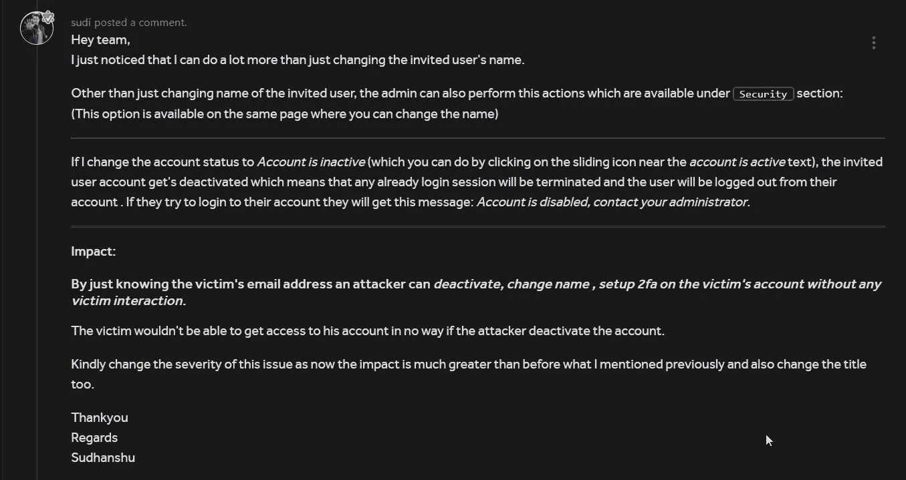

几天后，我收到了报告的以下更新:

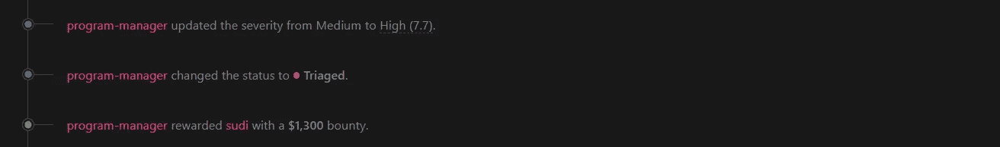

很快升级了:)

还有一个我想测试的范围，但是提供的凭证不起作用，所以在同一个报告中，我问他们是否可以研究这个问题。他们在几个小时内回复了新的一对信用记录，我现在准备看看另一个范围。

这是一个与*商家门户*完全不同的应用程序

在查看它的所有功能时，我注意到了一个我已经在*商家门户*中见过的类似的`User Management`端点

我决定在这个端点上也检查同样的错误，结果成功了！！！！！！！！！

唯一的问题是，除了更改受害者的名字(*名，姓*)之外，我不能执行任何其他操作。其他选项如*启用 2fa，禁用登录*在这里不起作用。

由于这是一个与我已经报告的问题非常相似的问题，我决定询问*项目经理*我应该做什么来提交一份新的报告(因为两个应用程序可能共享相同的代码库，所以只需要一次修复)。

`program-manager`告诉我写一份新的报告，然后他们会核实。

然后他们也因为这篇报道而受到奖励:)

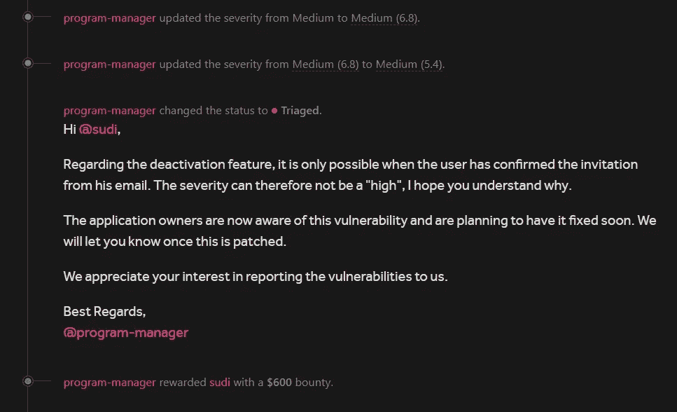

我真的很喜欢参与这个项目，因为他们反应非常快，`program-manager`也非常好。

## ***BUG: CSRF 在邀请用户动作中***

这是一个相当新的私人项目，在 2-3 个月前启动，但是有很多人提交了申请，看起来非常活跃。和以前一样，这个应用程序也是一个*商业门户*。

我花了很少的时间来理解应用程序，然后开始处理请求。在诸如( ***POST、PUT、DELETE*** )的状态更改请求中，有许多自定义头与`X-CSRF-Token`头一起使用。


看到如此多的自定义标题以及`X-Nonce`和`X-CSRF-Token`，任何人都不会费心去寻找 CSRF 错误，对吗？

我删除了`X-CSRF-Token`并转发了请求，仍然成功。然后我想他们肯定会验证其他的*自定义标题*。我一个接一个地删除了*自定义标题*，但是请求仍然成功。哇，所以他们甚至没有验证这些头。

然后，我需要确认最后一件事，应用程序是否接受`text/plain`作为请求主体的`Content-Type`，它成功了:)

我创建了一个 poc 并验证了它，然后提交了报告，再次怀疑它可能会重复，因为这很容易找到。

这是一个站点范围的 csrf 问题，它影响了所有端点，最敏感的端点是我在上面的 ***邀请用户操作、*** 中显示的那个端点，因此我在报告中以它为例来演示其影响。

第二天，我收到了团队的回复，我没想到会是这样的回复。看到他们对这份报告的反应，我非常惊讶:

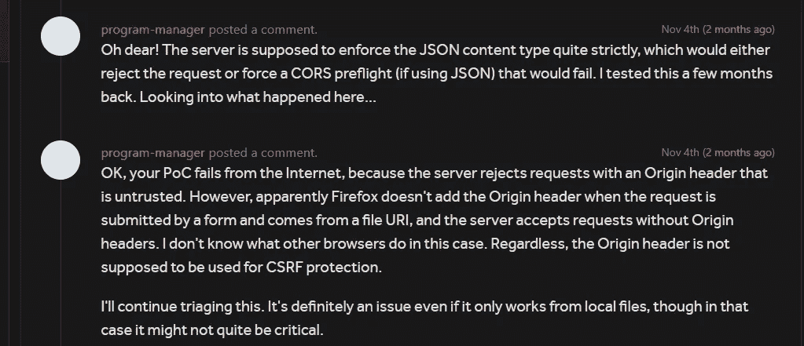

我会解释他第二次回复的`program-manager`是什么意思，以确认 csrf 的 bug。我创建了一个`csrf.html`文件，并将 *csrf poc 代码*保存在那里

以下内容类似于您在*细流实验室的 csrf* 概念验证案例中看到的内容

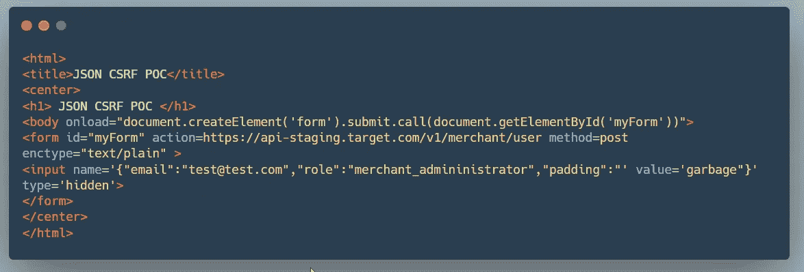

我刚刚在我的浏览器中打开了`csrf.html`文件，所以 url 类似于`file:///Directory/csrf.html`，在 ***Firefox*** 中，如果请求是从`file` URI 发出的，没有*来源*头被发送。如果你在 Chrome 等其他浏览器中尝试同样的操作，你会注意到发送了`Origin: null`头。

服务器接受没有`Origin` 头的请求

如果你读过我几天前分享的这篇文章，你可能已经知道如何处理`Origin`头。

[](/story-of-a-weird-csrf-bug-bde1129c106e) [## 一只奇怪的 CSRF 虫子的故事

### 嘿，大家好，

infosecwriteups.com](/story-of-a-weird-csrf-bug-bde1129c106e) 

我使用相同的技巧`iframe` *数据 uri* 创建了一个 poc，并使用现在工作的 poc 更新了报告。

很快`program-manager`验证了这份报告


我同意他们的推理，甚至没有想到会有这么多，所以我真的很感激他们。。

## **BUG:通过打开重定向窃取 vitcim 的 access _ token**

每个 bug 猎人都应该做的一件事是在 **Hackerone** 上阅读关于*黑客攻击*的公开报道

 [## 哈克龙

### 编辑描述

hackerone.com](https://hackerone.com/hacktivity) 

如果你想更进一步，那就试着重现这个错误，确认它是否真的被修复了。

这里有一个图表来解释我想说的:

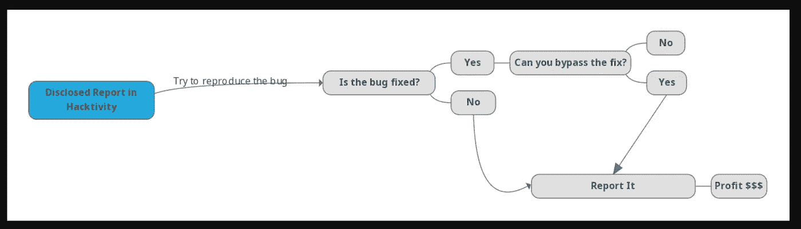

下面是图表的一个示例:

一份报告在*黑客事件*中被披露

[](https://hackerone.com/reports/1178239) [## 罗技在 HackerOne 上披露:通过开放协议接管会话...

### 摘要:嗨，罗技团队，在 streamlabs.com 的端点…

hacker one . com rff](https://hackerone.com/reports/1178239) 

从报告中，我了解了一个端点:

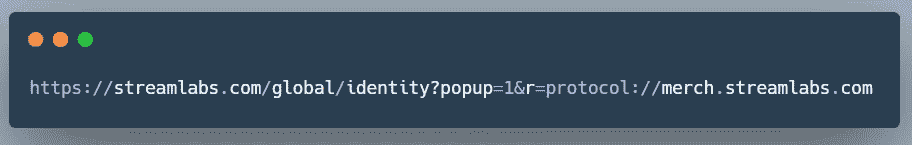

攻击者控制了 url 的`protocol`部分，他们将其描述为*开放协议重定向*而不是*开放重定向*，因为他们没有对 url 的完全控制。只是`protocol`部分。

修复后，`protocol`被验证，现在它只接受 http & https。我不确定记者是否试图通过`javascript:`将*开放协议重定向*升级到 xss，因为他们对协议部分 xss 可能有完全的控制权。

只有`streamlabs.com`子域被列入白名单，如果我尝试使用任何其他网址，如`example.com`，将会抛出一个错误。我也尝试了一些变化`xstreamlabs.com`、`streamlabs.co.in`等，看看它是否有效。

由于什么都不工作，我只是想在 *wayback machine* 中搜索这个端点，看看我是否能找到任何其他也在白名单中的域。

[](https://github.com/lc/gau) [## GitHub - lc/gau:从 AlienVault 的开放威胁交换、Wayback 机器和…

### getallurls (gau)从 AlienVault 的开放威胁交换、Wayback Machine 和 Common Crawl 中获取已知的 URL

github.com](https://github.com/lc/gau) 

```
https://streamlabs.com/global/identity?r=https://darthvapes.tv https://streamlabs.com/global/identity?r=https://dragynslair.live/ https://streamlabs.com/global/identity?r=https://franmg.net/merch https://streamlabs.com/global/identity?r=https://itzyony2.com https://streamlabs.com/global/identity?r=https://lmgtwitch.com https://streamlabs.com/global/identity?r=https://maitresharinganv1.com https://streamlabs.com/global/identity?r=https://themavshow.tv https://streamlabs.com/global/identity?r=https://veterangamertv.com https://streamlabs.com/global/identity?r=https://www.koopatroop.com https://streamlabs.com/global/identity?r=https://www.lokenplays.com https://streamlabs.com/global/identity?r=https://yagurlbubblezl4d.com
```

由此，我能够找到更多的白名单域:

```
dragynslair.live 
darthvapes.tv 
nixxiom.tv
```

如果一个经过验证的用户访问这个 url，他的`access_token` 将被发送到`dragynslair.live`域:[https://streamlabs.com/global/identity?r = https://dragynslair . live/](https://streamlabs.com/global/identity?r=https://dragynslair.live/)

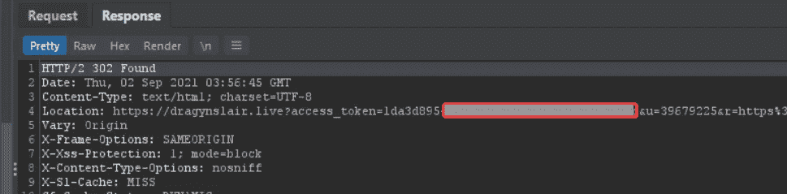

这个特殊域名最有趣的地方在于它可以注册

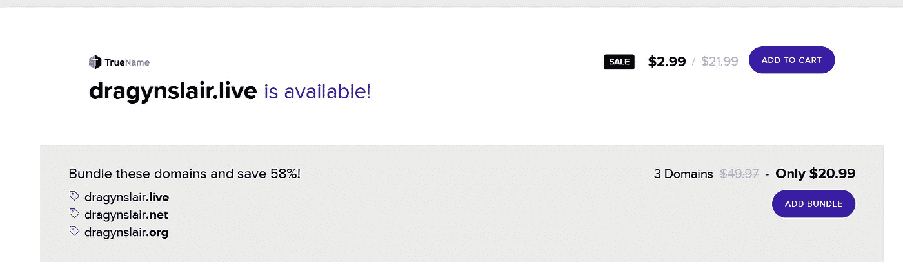

为了证明我的声明，我在我的`/ect/hosts`文件中为`dragynslair.live`添加了一个条目，这将允许我在不实际购买域名的情况下确认它

在这个截图中，你可以看到`access_token`被发送到我的服务器。

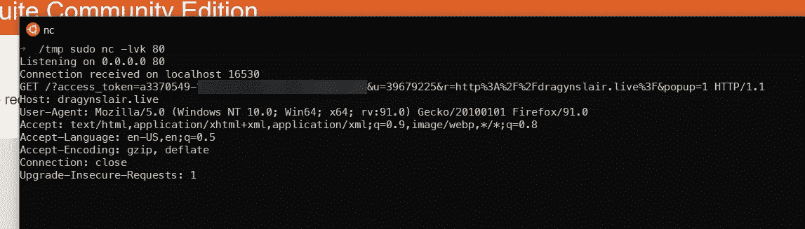

`access_token`可用于以下端点:

 [## /授权

### 使用 Streamlabs API，您可以访问用户的 Streamlabs 帐户的各个方面，甚至触发自定义警报…

dev.streamlabs.com](https://dev.streamlabs.com/reference) 

团队就像上次一样降低了严重性，没有任何解释，根据我过去在这个项目中的经验，我已经知道这将会发生

## 错误:XSS 过滤器旁路

在该计划中明确提到，如果您发现任何 *waf* 绕过 eg，如 *xss* ，他们将视报告为`HIGH`严重性，并给予相应奖励。

这个应用程序有很多功能，所以我能够找到一个有趣的端点，在那里输入被传递到`window.location`接收器。

过滤器的工作方式是这样的:如果我输入`javascript:alert()`，它会像这样结束

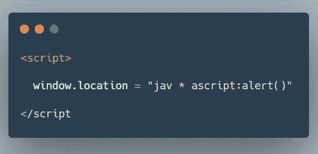

我试过大写的`JAVASCRIPT`，混合大写和小写的`JaVaSCript`，但是同样的事情发生了。

然后我在***Portswigger XSS cheat sheet***上查找更多方法:

[](https://portswigger.net/web-security/cross-site-scripting/cheat-sheet) [## 跨站点脚本(XSS)备忘单- 2021 版|网络安全学院

### 这个跨站点脚本(XSS)备忘单包含许多可以帮助你绕过 WAFs 和过滤器的向量。你可以…

portswigger.net](https://portswigger.net/web-security/cross-site-scripting/cheat-sheet) 

```
j&#x61vascript:alert(1)
&#X6A;avascript:alert(1)
javascript&colon;alert(1)
java&Tab;script:alert(1)
java&NewLine;script:alert(1)
javascript&colon;alert&lpar;1&rpar;.............
```

然后我开始寻找其他博客，偶然发现有效载荷中有*十六进制转义序列*，这对我的目标有效，我可以绕过过滤器

`*\x61*` *代表一个*

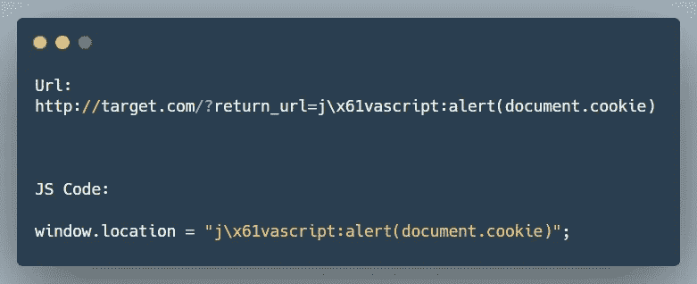

它被归类并奖励为`High`严重性漏洞。

## **BUG** :存储 XSS

我将讨论最后一个严重程度最高的错误，也是迄今为止我得到的最高奖励。

这是一个超级新的节目，我可以说我是最先被邀请的人之一。

我已经从另一个新程序那里得到了非常糟糕的体验，我在那里提交了许多错误，例如*存储的 xss，csrf，访问控制错误*甚至一个 bxss 在他们的管理面板中触发。他们开始一个接一个地关闭报告，因为*信息&副本*声明 *csrf、访问控制、xss 错误*是**站点范围的**，所以他们将只奖励第一个突出问题的报告。

我也和同一个项目的其他人谈过，他们都说了同样的话`site-wide`，他们的报告也因为重复而被关闭。几个月过去了，他们甚至没有支付任何有效的错误的奖励。

对我来说，不要过多参与新项目是一个很好的教训。

回到新的私人程序，由于过去的经验，我很犹豫要不要在这个程序上打猎，但我还是尝试了，这个应用程序类似于 Twitch，我们可以在那里做流媒体。

用户资料是公开的，我们可以添加任何 *spotify 嵌入代码*，然后将显示给其他用户。

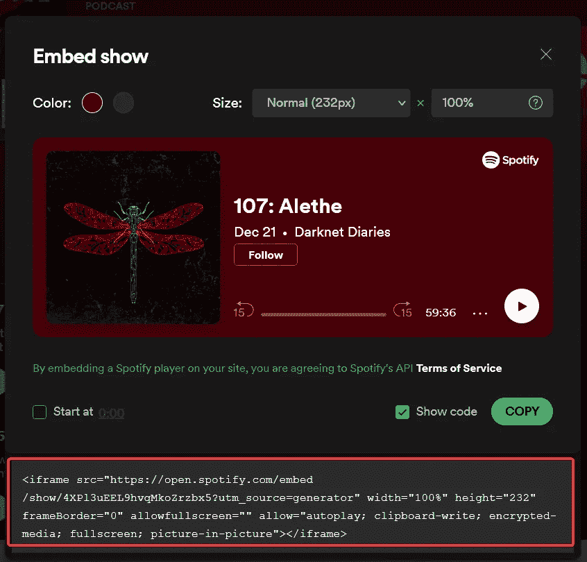

在上面的截图中，你可以看到一个嵌入代码的例子，顺便说一句，如果你在开始听这个可怕的播客之前从未听说过***【Darknet Diaries】***。相信我，你会喜欢的:)

[](https://darknetdiaries.com/) [## 黑暗网络日记-来自互联网黑暗面的真实故事。

### 一个播客，讲述来自互联网黑暗面的真实故事。

darknetdiaries.com](https://darknetdiaries.com/) 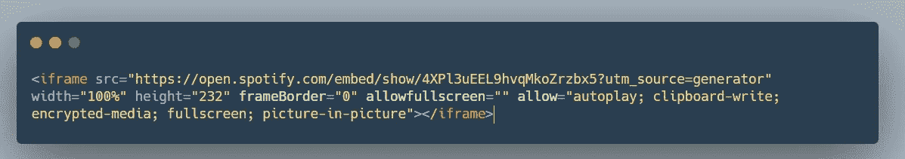

应用程序将这个 *iframe 代码*嵌入到用户的配置文件中，我开始测试是否可以利用这个功能，并向其中添加我自己的任意代码。

我首先从一个简单的有效载荷``开始，错误返回了无效的 ***Spotify 嵌入代码，*** 然后我尝试了各种其他标签，但似乎只允许使用 frame。

所以我开始玩 src 属性，如果我能把它改成`src=javascript:alert()`，我会有一个容易的 xss 错误，但是收到了同样的错误，不是有效的 ***Spotify 嵌入代码。***

我想过使用`srcdoc`属性，但是也没成功

[](https://developer.mozilla.org/en-US/docs/Web/HTML/Element/iframe#attr-srcdoc) [## :内嵌框架元素- HTML:超文本标记语言| MDN

### HTML 元素表示嵌套的浏览上下文，将另一个 HTML 页面嵌入到当前页面中。每个嵌入式…

developer.mozilla.org](https://developer.mozilla.org/en-US/docs/Web/HTML/Element/iframe#attr-srcdoc) 

过了一段时间，我想为什么不在事件处理器上添加一个*来触发 src 加载，我将这个*属性*添加到嵌入代码`onload=alert()`*

而且成功了！！我可以看到 xss 弹出窗口，这个 xss 在我的公共配置文件中。因此，如果任何其他用户访问我的网站，xss 将被触发。

我很快提交了这个问题，等待他们的回应。当处理这样的新程序时，确保你不要浪费时间尽快报告错误，以确保你不会重复，我已经从其他一些程序中学到了这个教训。

他们的响应时间真的很快，他们把这个 xss 奖励为`HIGH`严重性漏洞。

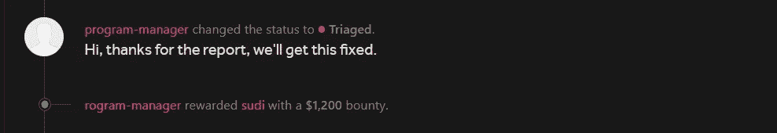

我环顾四周，注意到该应用程序允许用户通过谷歌/脸书登录，然后我还找到了我们可以*添加/删除谷歌/Facebook 帐户的设置，*

所以我在想，利用 xss 漏洞，我可以很容易地接管受害者的帐户，就像我在一些文章中看到的那样。

我向他们解释了这一点，他们证实了我的说法

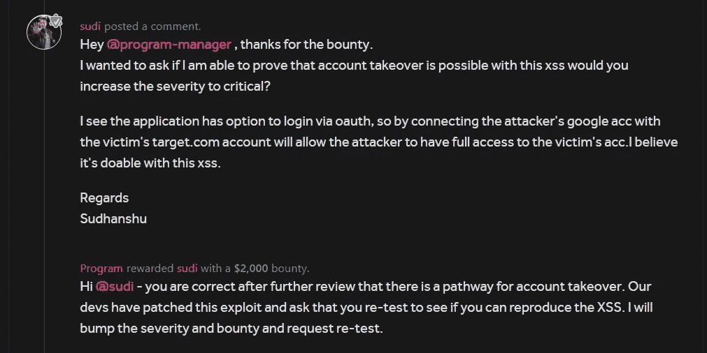

他们总共奖励了我 3200 美元的`Critical`

这是我得到的最高奖励，所以我真的很开心。

今年我开始玩 ctf 只是为了网络挑战，你会得到挑战的源代码，因为我不擅长源代码审查，做这个 CTF 挑战让我克服了我的弱点。此外，挑战作者通常会使用一些你想在其他地方找到的观察技术。

所以如果你想提高你的网络黑客技能，开始玩一些有高评分的 CTF 吧。

您可以从这里了解即将推出的 CTF:

 [## CTFtime.org/关于 CTF 的一切(夺旗)

### 捕捉旗帜，CTF 队，CTF 评级，CTF 档案馆，CTF 报道

ctftime.org](https://ctftime.org/event/list/upcoming) 

我知道这真的是一篇很长的文章，我希望你在读完这篇长文章后不会感到无聊，并从中学到一两件事。

就这些，非常感谢你一直读到最后。希望你会喜欢它。

祝 2022 年好运:)

大家好