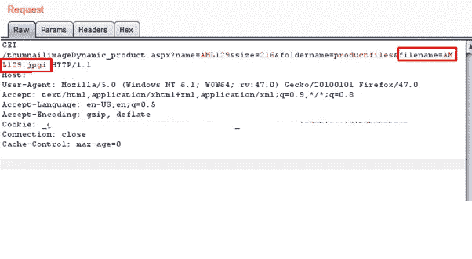
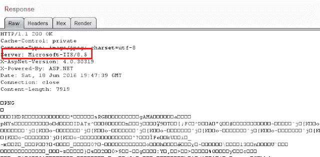
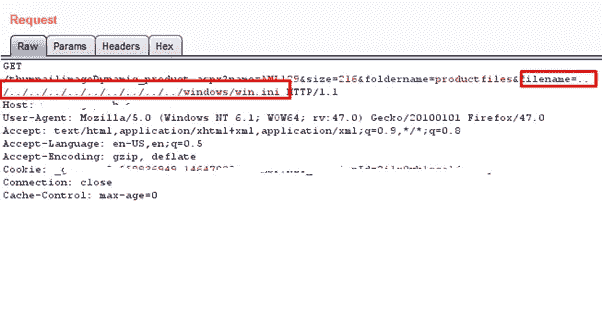
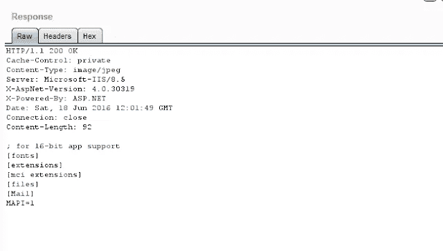
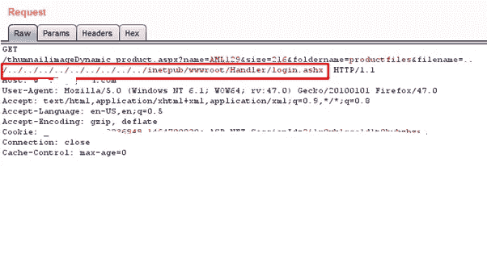
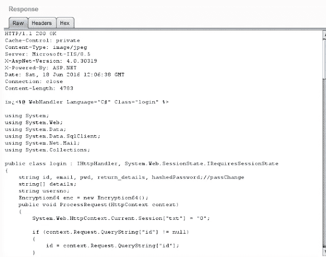
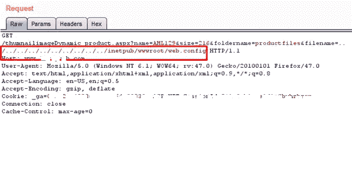
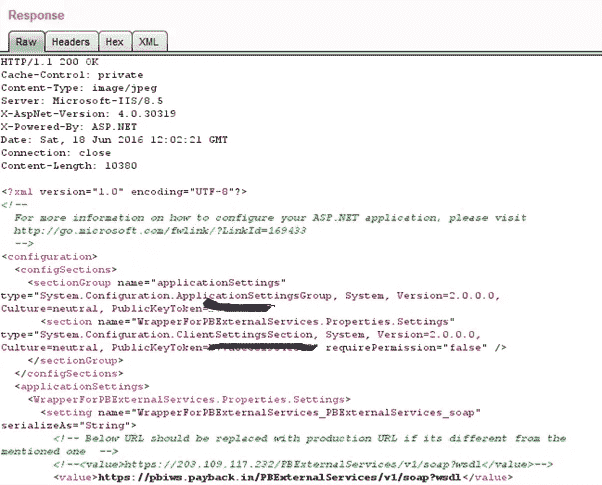
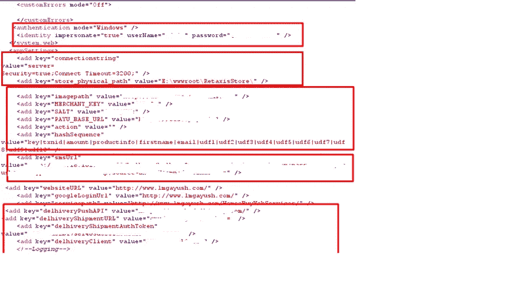

# # bug bounty——印度最大的电商医疗保健公司 API 密匙泄露，源代码泄露。

> 原文：<https://infosecwriteups.com/bugbounty-api-keys-leakage-source-code-disclosure-in-indias-largest-e-commerce-health-care-c75967392c7e?source=collection_archive---------0----------------------->

嗨伙计们，

回到一个长期悬而未决的漏洞，我发现在我的 bug 赏金猎人，虽然一个迟到的博客，但我发现它值得分享。我在印度最大的在线健康平台网站 ***发现了这个漏洞。***

> 通过这个漏洞，我能够读取应用程序的源代码、敏感文件，如 webconfig，在那里我获得了邮件服务器、sms、支付网关等的 API 密钥，此外，我还能够使用这些邮件服务器密钥从他们的企业邮件服务器发送邮件，甚至能够使用 sms 密钥向他们的客户发送 sms。让我们看看我是如何做到的—

用于发现此漏洞的技术是路径遍历攻击。

易受攻击的 URL

我是在上面截图显示的 URL 和参数中发现这个漏洞的。

上述 URL HTTP 请求的响应如下-

易受攻击的请求响应

如果你看上面的截图，你会看到 HTTP 头“服务器”。由此我分析出微软-IIS web 服务器正在使用中。所以我试着打开 WIN。路径遍历攻击。

路径遍历 atatck

我得到了如下的回应-

HTTP 响应

这就是 WIN 的内容。INI 文件。因此，我确认存在本地文件包含漏洞。所以我尝试升级这个漏洞，并继续阅读一些应用程序的源代码—

登录页面源代码请求

因为我知道这是一个 IIS 服务器，所以我很清楚应用程序目录看起来像什么，我试着阅读登录页面的源代码，正如我所料，我得到了下面的响应—

登录页面源代码

**同样，我能够下载任何页面的应用程序的完整源代码。现在到了关键的方面，web.config 文件如下-**

Web 配置文件包含

当我看到上述请求的回复时，:D 脸上露出了灿烂的笑容

***所有敏感的 APIs key 都暴露了！-邮件服务器 API 密钥、IIS 服务器管理凭证、SMS API 密钥、支付网关密钥，这是非常重要的。我可以用这些键来发送邮件，给用户发送短信，支付操作等等。***

*报告详细信息-*

2016 年 6 月 19 日—向相关公司报告了错误。

2016 年 7 月 11 日—错误被标记为已修复。

2016 年 7 月 11 日—重新测试并确认了修复。

2016 年 8 月 1 日—由公司授予。

感谢阅读！

~逻辑炸弹([https://twitter.com/logicbomb_1](https://twitter.com/logicbomb_1))