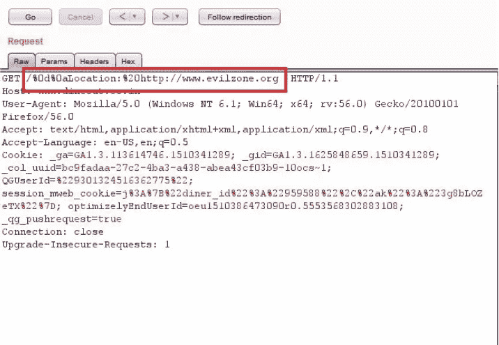
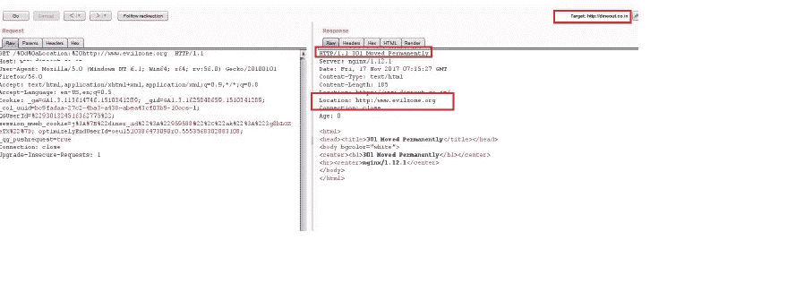
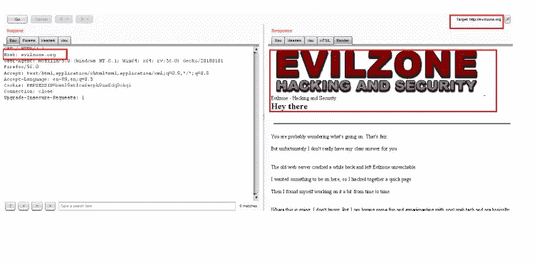

# # bug bounty——开发 CRLF 注射罐可以获得丰厚的赏金

> 原文：<https://infosecwriteups.com/bugbounty-exploiting-crlf-injection-can-lands-into-a-nice-bounty-159525a9cb62?source=collection_archive---------0----------------------->

嗨伙计们，

又有了一个博客，这次我将分享我开发 CRLF 注射液的经历，以及它如何让我获得丰厚的回报。

> CRLF 注入漏洞是一种 web 应用程序漏洞，它是由于用户输入的数据在没有适当隔离的情况下直接传递到响应头字段(如位置、Set-Cookie 等)而发生的，这可能导致各种形式的安全漏洞。安全漏洞包括 XSS、缓存中毒、基于缓存的篡改、页面注入等。

这是印度一家在线食品配送公司在搜索他们网站的安全漏洞时发现的。在他们的主页中，有几个输入被反映到 HTTP 头中。经过一番摆弄，我发现不可打印的控制字符没有按照它们应该的方式进行编码，这让我尝试了 CRLF，我试图添加“位置”头，看看它是否被重定向。下面是概念证明—

CRLF 注射 HTTP 头

现在，服务器通过在响应中注入 CRLF 字符来响应此请求，您会发现“Location”http 标头已在 http 响应中设置为值“http://www . EVI zone . org ”,通过以下屏幕快照中的 CRLF 有效负载注入

CRLF 注射液

并且成功重定向到攻击者的站点-“evil zone . org”。

通过 CRLF 注入成功重定向

***CRLF 注入的影响各不相同，也包括跨站脚本对信息泄露的所有影响。它还可以取消某些安全限制，如受害者浏览器中的 XSS 过滤器和同源策略，使他们容易受到恶意攻击。***

*缓解技术-*

CRLF 注入的一个简单解决方案是在 CRLF 字符进入报头之前对其进行消毒，或者对数据进行编码，以防止 CRLF 序列进入报头。

*报告详情-*

2017 年 11 月 11 日—向相关公司报告了错误。

2017 年 12 月 6 日—错误被标记为已修复。

2017 年 12 月 13 日—重新测试并确认了修复。

2017 年 12 月 20 日—由公司授予(250 美元)。

感谢阅读！

~逻辑炸弹([https://twitter.com/logicbomb_1](https://twitter.com/logicbomb_1))