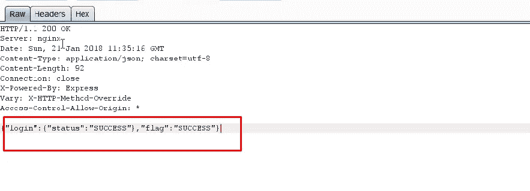

# # bug bounty——我如何用你钱包里的钱在印度最大的汽车运输公司预订出租车！

> 原文：<https://infosecwriteups.com/bugbounty-how-i-could-book-cab-using-your-wallet-money-in-indias-largest-auto-transportation-e0c4252ca1a3?source=collection_archive---------1----------------------->

嗨伙计们，

所以，我在寻找 bug 赏金的过程中发现了一个更好的方法，这就是 ***印度最大的在线汽车运输公司*** 。如题，我可以用受害者钱包里的钱为自己预定出租车。:D。让我们来看看整个场景—

> 我的目标是他们的网络应用程序，而不是 android 应用程序，这是我故意的。原因很明显，因为公司更关心他们的 android 应用程序而不是网站，只是因为客户流量总是更多地用于移动应用程序，所以他们总是有更多的机会出现漏洞，而安全关注较少。

我访问了他们的网站，输入了提货地点和目的地，然后看到了输入手机号码进行动态口令确认的页面

认证所需的手机号码

OTP 验证

看到 OTP 验证时，猎人首先想到的是“如何绕过它”。我试图强行使用它，但在连续错误的尝试后，应用程序被设置了一些阻塞。捕获原始 HTTP 请求进行分析，但没有任何帮助。根据我之前的调查，我意识到了一件事，应用程序开发人员有时会忽略服务器端的验证，而完全依赖于客户端。

让我们在这里尝试同样的事情。我输入了我的测试手机号码，将正确的动态口令放入框中，并保存了它的成功响应—

HTTP 成功响应

如你所见，这里没有会话管理，因此我唯一要做的就是跳过 OTP 验证。现在我输入了受害者的手机号码，输入了错误的动态口令，下面是 HTTP 响应

错误的 OTP HTTP 响应

我试图通过捕获错误的 OTP HTTP 响应并将其替换为正确 OTP 的 HTTP 响应来绕过它，并转发它，当我这样做时，我得到了下面的页面—

乘坐成功预订

**受害者的手机号码成功预订了我的车！！！**但是事情并没有到此为止。由于几乎所有的出租车/汽车在线平台都有自己的钱包，如果你没有选择其他支付方式，钱会自动从钱包中扣除，这里也发生了同样的情况，钱会从受害者的钱包中扣除，因此**我可以用他钱包里的钱用他的手机号码预订出租车。**:)

*报告详情-*

2018 年 2 月 3 日—向相关公司报告了错误。

2018 年 2 月 3 日—错误被标记为已修复。

2018 年 2 月 3 日—重新测试并确认修复。

2018 年 2 月 9 日—公司奖励。

感谢阅读！

~逻辑炸弹([https://twitter.com/logicbomb_1](https://twitter.com/logicbomb_1))