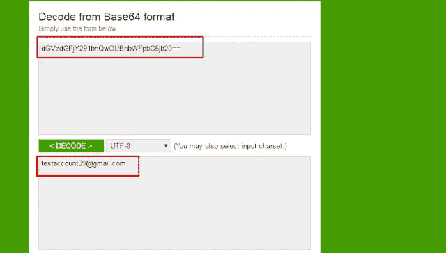
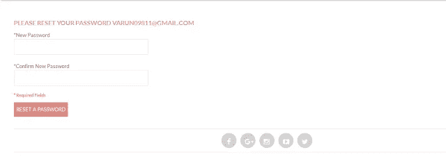

# #BugBounty —“让我重置您的密码并登录到您的帐户”—我如何通过重置密码功能危害任何用户帐户

> 原文：<https://infosecwriteups.com/bugbounty-how-i-was-able-to-compromise-any-user-account-via-reset-password-functionality-a11bb5f863b3?source=collection_archive---------0----------------------->

嗨伙计们，

另一个有趣的博客解释了我不久前在印度的一家移动钱包公司发现的一个有趣的漏洞。

> 要登录任何在线网站，我们需要一个用户名，可以是用户注册的邮件 id 和密码，如果他不记得自己的密码，有一个重置密码功能来帮助。在研究该功能的漏洞时，我发现了一个逻辑缺陷，我可以重置任何用户密码，并使用相同的密码登录以接管任何用户的帐户。

现在让我们开始解释-

1.  当我点击账户“testaccount09@gmail.com”的重置密码功能时，我收到一封邮件，上面写着“要重置密码，请点击下面的链接”，链接是这样的

*。_________.com/account/resetpassword？id = 296417&token = dgvzdgfjy 291 bnqwoubnwfpbc 5 JB 20 =&vit = mjaxni 8 xmc 8 ynq = =*

2.这里,“id”是与用户帐户相关联的标识号,“token”是用户的 base64 解码的注册邮件 ID，这里是“testaccount 09 @ Gmail . com”,“vit”是 base64 解码的时间戳，在这种情况下其值是“2016/10/25”

3.通过进一步研究，我发现时间戳参数是重置密码链接的到期日期，它比用户单击重置密码选项的时间提前了 2 天。

4.这是危及用户帐户的一步。通过同一页面上的用户枚举，我找到了一个有效的用户帐户，为其生成了忘记密码链接，现在开始查找正确的重置密码链接的任务，我替换了用户的邮件 id 并将其编码为 base64，并将时间戳值保持在当前日期之前 2 天。

受害者邮件 id—varun09811@gmail.com

Base64 编码值(Parameter = token)—dmfydw 4 watgxmubnbwfpbc 5 JB 20 =

时间戳值(参数= vit) — MjAxNi8xMC8yNQ=

5.这里的另一部分是找到与特定用户邮件 id 相关联的“id”。由于这是一个 6 位数的代码，所以我尝试了暴力破解(幸运的是没有设置速率限制)，过了一会儿，我找到了与受害者邮件 id 相关联的正确 id，恰好是 id=254346。(没错，这是很费时间的事情)。

6.所以被篡改的网址看起来像-

[。_________.com/account/resetpassword/？id = 254346&](http://www._________.com/account/resetpassword/?id=254346&)token = dmfydw 4 wotgxmubnbwfpbc 5 JB 20 =&vit = mjaxni 8 xmc 8 ynq =

**我在浏览器中加载链接，出现“设置新密码”**

新密码集页面

我重设了他的密码，并成功登录了他的账户。我有完全的权限进入他的账户，可以使用他钱包里的钱，更改注册的手机号码和一切！

我向相关企业报告了这一漏洞，他们很快在 2 天内修补了漏洞。我感谢公司的小小心意:)

感谢阅读！

~逻辑炸弹(【https://twitter.com/logicbomb_1】T2