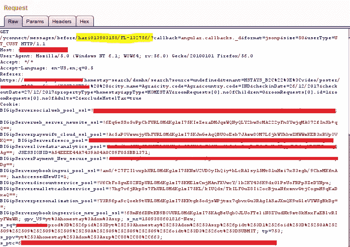
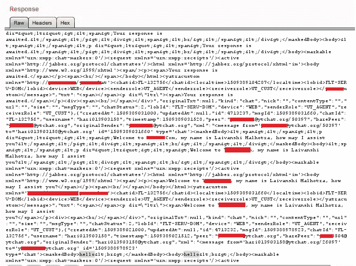
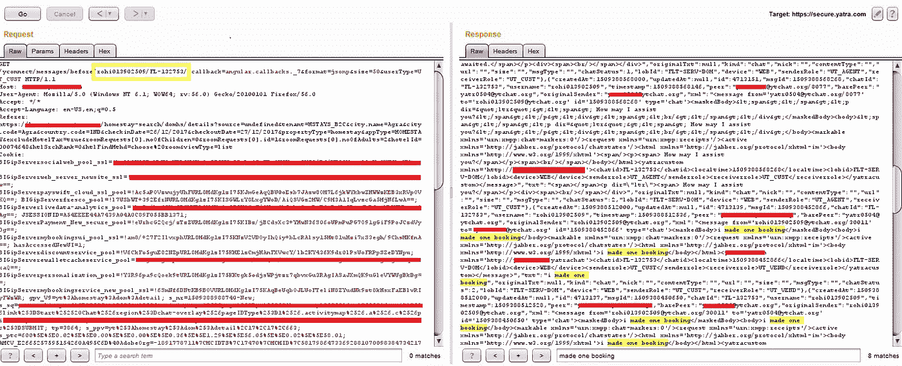

# # bug bounty——我是如何在印度在线旅游门户网站上阅读用户聊天记录的

> 原文：<https://infosecwriteups.com/bugbounty-how-i-was-able-to-read-chat-of-users-in-an-online-travel-portal-c55a1787f999?source=collection_archive---------3----------------------->

嗨伙计们，

在进行常规的 bug 搜索时，我遇到了一个有趣的 IDOR 漏洞，它可以帮助我阅读在线旅游公司客户支持团队的用户的完整聊天记录。

在浏览一家公司的网站时，我发现了一个在线聊天论坛，它允许客户与支持团队在线聊天，询问有关预订、付款、退款等问题。那骗我提取用户敏感数据的:)。我首先想到的是“我如何能阅读其他用户的聊天记录”,于是我开始寻找答案。当触发在线聊天功能时，它会发出以下 HTTP 请求—

聊天请求

对上述请求的响应是聊天过程中交换的对话消息—

聊天回复

黄色标记的值(在聊天请求图片中)是我必须使用的。在遍历更多内容时，我意识到第一个值(即 hari013903158)是客户 id，第二个值 FL-132756 是聊天 id，进一步分析发现它是递增的。现在我知道该怎么做了，:D。

但是有一个障碍“如何找到有效的客户 id ”,在本例中是一个 13 位的字母数字 id。我回到登录页面，个人资料部分，看看它是否能有所帮助，但没有任何帮助。接下来是“救援”中的“博客区”——旅行者的博客页面，人们在这里分享他们的旅行故事。我开了一个博客来阅读(不是为了阅读；) )是由一个用户发布的，就这么简单，我可以在 URL 本身看到用户 id。唷！值得欢呼的事情！现在我复制了那个用户 id，在“聊天请求”中替换它，使用 burp 工具强制使用聊天 id 和…我仍然什么也没得到。可能是用户从未与支持团队进行过在线聊天。:/ .Race 仍然没有完成，所以我又打开了 10-20 个博客，做了同样的事情，下面是一个特定用户 id 的请求-响应。☺

用户的聊天记录

我可以访问那个用户的全部聊天记录。

*报告详情* -

2017 年 11 月 9 日—向相关公司报告了错误。

2017 年 11 月 29 日—错误被标记为已修复。

2017 年 11 月 30 日—重新测试并确认了修复。

2017 年 12 月 21 日—获得奖励和名人堂。

这都是关于这个有趣的发现。☺

谢谢！

~逻辑炸弹(【https://twitter.com/logicbomb_1】T2