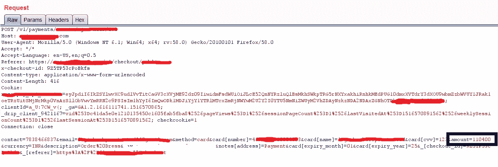
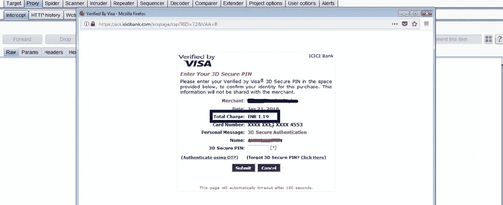
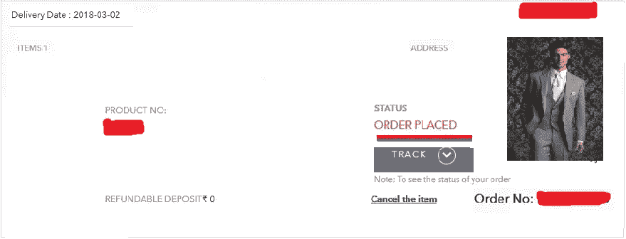

# #BugBounty —“我是如何免费购物的！”-支付价格操纵

> 原文：<https://infosecwriteups.com/bugbounty-how-i-was-able-to-shop-for-free-payment-price-manipulation-b29355a8e68e?source=collection_archive---------0----------------------->

嗨伙计们，

在我最近的 bug 赏金猎人中，我遇到了一个关键但简单的漏洞。这是支付价格操纵，通过它我可以以最低的成本购买任何产品。所以，让我们看看整个漏洞是什么-

我必须买一套结婚礼服去参加一个婚礼，所以我上网，在那里我遇到了一个受欢迎的印度购物网站，并开始了我的搜寻。几天来，我一直在寻找支付网关中的一些 bug，这来得正是时候。所以我在请求到达支付网关之前捕捉到了它—

注意**金额**参数携带要支付的金额，此处为“Rs。1104.00”(INR)，我毫不犹豫地篡改了价格值，输入“119”，意思是 1.19 (INR)，然后转发 HTTP 请求。接下来，我被重定向到银行支付页面，如下图所示

哇哦！最后一个奖项是“1.19”，我脸上挂着灿烂的笑容，然后我进一步得到这个—

订单已成功下单

***订单成功下单，我只花了 1.19 印度卢比就买了 1104.00 印度卢比*** :D .如此简单却又如此严重的漏洞，当服务器没有验证奖品时就会发生这种情况。令人惊讶的是，如此简单的漏洞仍然存在，开发者错过了奖品的验证。可以采取一些安全措施来防止此类攻击—

> 总是由服务器确认奖品。
> 
> 从 db 拉奖，检查是否是同一个奖。
> 
> 不要在 http 请求中发送金额，而只发送产品 id。

感谢阅读！这就是这个有趣的发现。☺

~逻辑炸弹([https://twitter.com/logicbomb_1](https://twitter.com/logicbomb_1))([https://www.reddit.com/user/logicbomb_1/](https://www.reddit.com/user/logicbomb_1/))