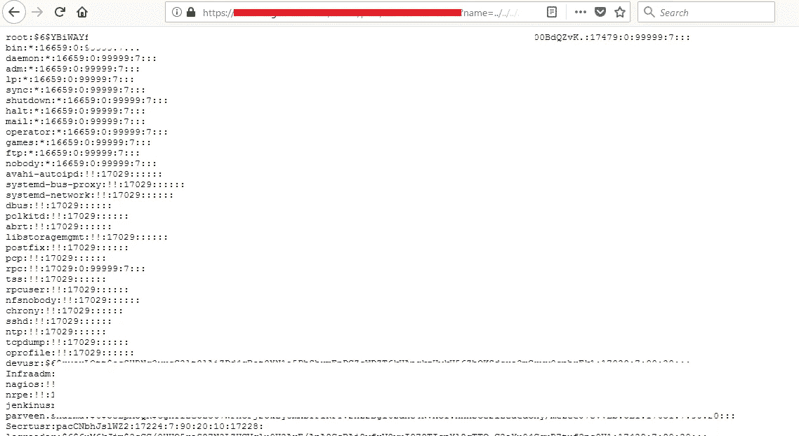
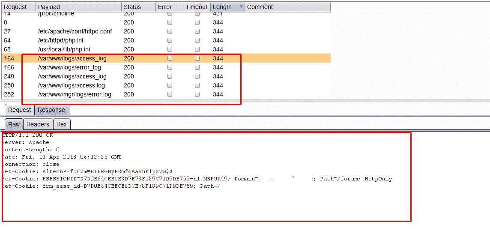
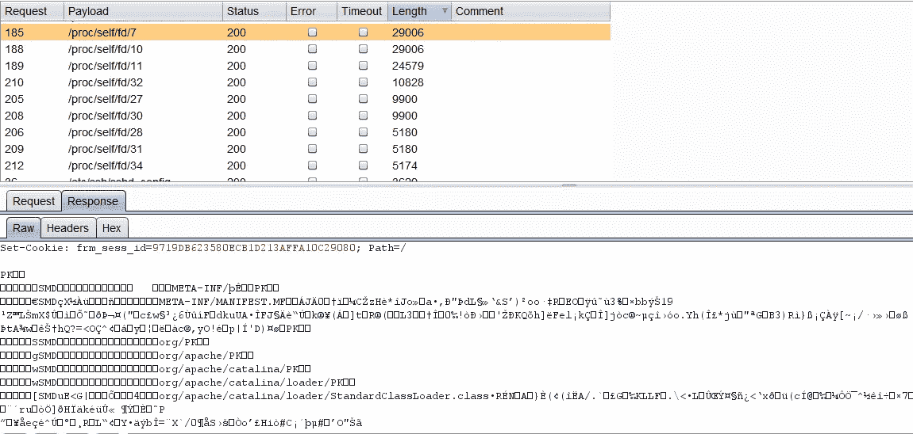
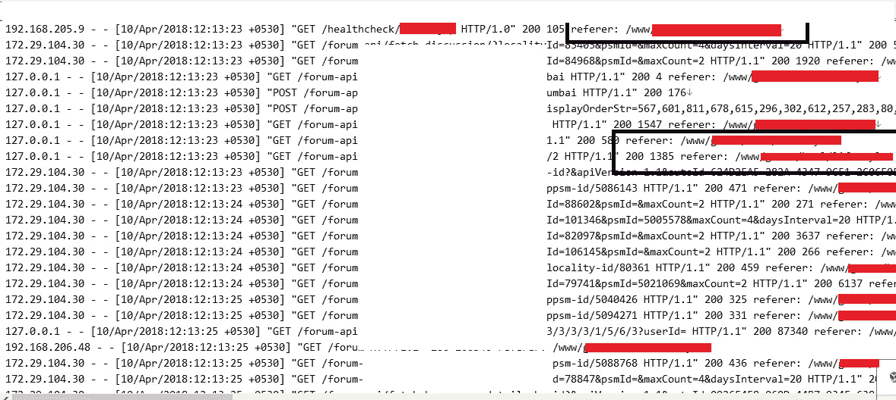
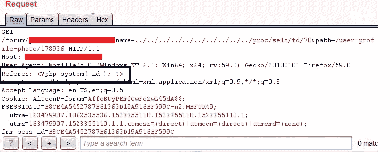
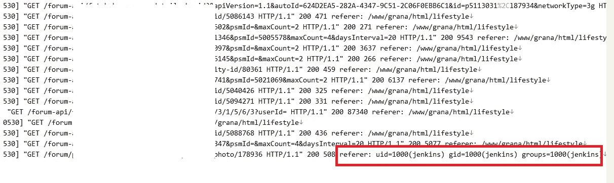

# #BugBounty —“从 LFI 到 RCE 的旅程！！!"-我是如何在印度最受欢迎的房地产买卖公司之一买到同样的东西的。

> 原文：<https://infosecwriteups.com/bugbounty-journey-from-lfi-to-rce-how-a69afe5a0899?source=collection_archive---------0----------------------->

嗨伙计们，

这篇博客是关于我如何在印度的一家房地产买卖公司从本地文件包含(LFI)获得远程代码执行(RCE)的。让我们看看完整的场景是什么-

> 作为一名 bugbounty hunter，我认为最重要的事情是我们尝试或遵循的利用漏洞的方法，这最终会导致漏洞产生更大的影响，我在这里也提到了这一点。

在搜索漏洞的时候，我在目标站点-【https://www.victimsite.com/forum/attachment-serve? 找到了 LFI 名称=../../../../../../../../../../etc/shadow &路径 =。如您所见，参数“name”易受 LFI 攻击。

LFI/etc/shadow

我被证实 LFI 在那里，所以现在我的目标是升级到 RCE。在此之前，我看过很多关于如何从 LFI 得到 RCE 的文章，这篇文章在这里帮了我一点忙——[https://medium . com/@ p 4c 3 n0g 3/lfi-to-rce-via-access-log-injection-88684351 e7c 0](https://medium.com/@p4c3n0g3/lfi-to-rce-via-access-log-injection-88684351e7c0)。现在的想法是访问一些文件可能是日志文件，可以提供一些用户控制器输入(为了运行一些命令)。

所以我试着读取访问日志，错误日志，不同的位置来访问它们。

访问日志响应

但似乎我得到 LFI 的用户没有访问日志文件的权限。我做了一些阅读和研究，发现“/proc/self/fd”提供了访问日志和各种其他系统相关文件的符号快捷方式。所以我试着阅读那些搜索访问日志-

/proc/self 文件

我在/proc/self/fd/{number}上运行入侵者，其中一个 fd 文件让我可以访问访问日志——

访问日志文件

这里引起我注意的是“referer”标题，因为我知道它是在用户控制输入下的。是时候执行一些命令了。我在 HTTP 请求中添加了“referer”头，将其值设置为 system(id)并转发它-

LFI 到 RCE

还有欢快的回应:)

RCE 的回应

这就是我如何从本地文件包含(LFI)获得远程代码执行(RCE)！:)

*报告详情-*

2018 年 4 月 13 日—向相关公司报告了错误。

2018 年 4 月 16 日—错误被标记为已修复。

2018 年 4 月 16 日—重新测试并确认了修复

奖励进行中。

感谢阅读！

~逻辑炸弹([https://twitter.com/logicbomb_1](https://twitter.com/logicbomb_1))