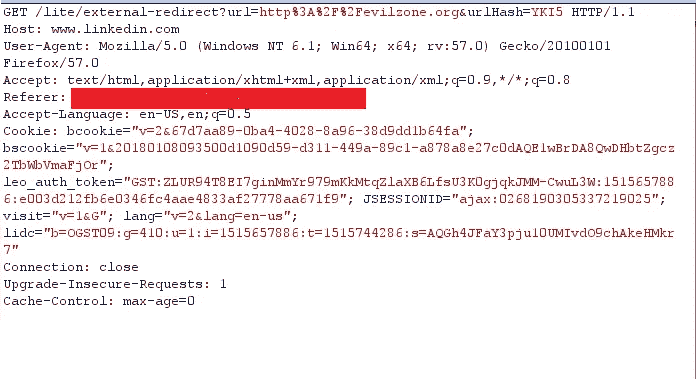
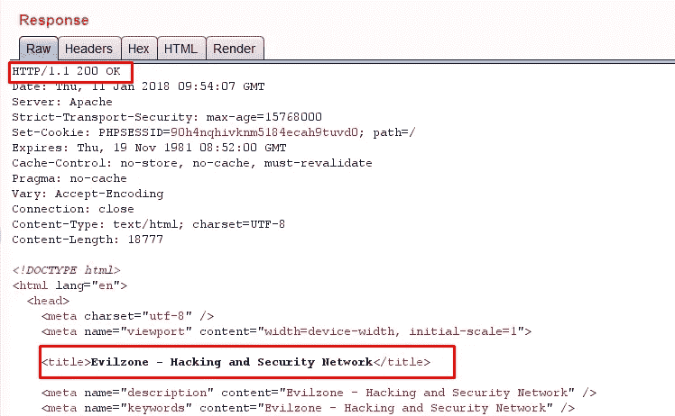

# # bug bounty @ linked ln-我是如何绕过开放重定向保护的

> 原文：<https://infosecwriteups.com/bugbounty-linkedln-how-i-was-able-to-bypass-open-redirection-protection-2e143eb36941?source=collection_archive---------1----------------------->

嗨伙计们，

在这里，我将讨论几个月前我在 Linkedln 中发现的一个很好的漏洞。在讨论这个漏洞之前，让我简单介绍一下开放重定向-

> 当应用程序以不安全的方式将用户可控制的数据合并到重定向的目标中时，就会出现开放重定向漏洞。攻击者可以在应用程序中构建一个 URL，导致重定向到任意外部域。一个易受攻击的网站链接的例子可能是这样的:[http://xyz.com/login.html?vulparam = https://XYZ . com/next](https://www.example.com/login.html?RelayState=http%3A%2F%2Fexample.com%2Fnext)
> 
> 在此示例中，“vulparam”参数指示成功登录后将用户发送到哪里。如果网站不验证“vulparam”参数值以确保目标网页是合法的和预期的，攻击者可以操纵该参数将受害者发送到攻击者精心制作的虚假页面: [https://xyzcom/login.html？vulparam=http](https://www.example.com/login.html?RelayState=http%3A%2F%2FEvilWebsite.com) ://evil.com

但是绕过 Linkedln 开放重定向并不容易。易受攻击的 URL 是—

【https://www.linkedin.com/lite/external-redirect? URL = http://evil zone . org&URL hash = yk i5

Linkedln 确实对开放重定向有一些很好的保护，因为我无法使用一些常见的技术来绕过它，比如

url=../evilzone.org，url= ///evilzone.org，URL = ///www.linkedln.com@www.evilzone.org/%2f%2e%2e

现在，简单地将“url”值更改为任何恶意站点在这里都不起作用。正如您所看到的，有一个额外的参数“urlHash ”,它看起来像是用户被重定向到的 url 的某个哈希值，因此如果“urlHash”值是“URL”的实际有效哈希值，那么只有成功的重定向才会发生。有一件事是清楚的，直到现在基本的技术不会做任何好的事情，然后我回到原始请求来寻求一些帮助—

打开重定向原始请求

该请求包括“referer”字段，该字段指示用户所在的最后一个页面(即他们单击链接的页面)，我突然想到——“改变 referer 标头值并查看验证是否有效怎么样？”。所以我很快跳进它，并改变了一些其他领域的头值和[脸掌]仍然没有运气。:/ .

让我们再试一次，我搜索了 LinkedIn android app referer，找到了下面的链接-[https://github.com/snowplow/referer-parser/issues/131](https://github.com/snowplow/referer-parser/issues/131)，看到 LinkedIn android referer 值为“*Android-app://com . LinkedIn . Android*”。我在“referer”标题字段中使用了 referer 值，其余部分如下图:D 所示

成功的重定向和耶最后我设法绕过 LinkedIn 的开放重定向保护:)

*报告详情-*

2017 年 11 月 11 日—向相关公司报告了错误。

2017 年 12 月 7 日—错误被标记为已修复。

2017 年 12 月 21 日—重新测试并确认了修复。

感谢阅读！

~逻辑炸弹([https://twitter.com/logicbomb_1](https://twitter.com/logicbomb_1))