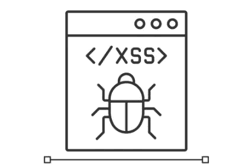
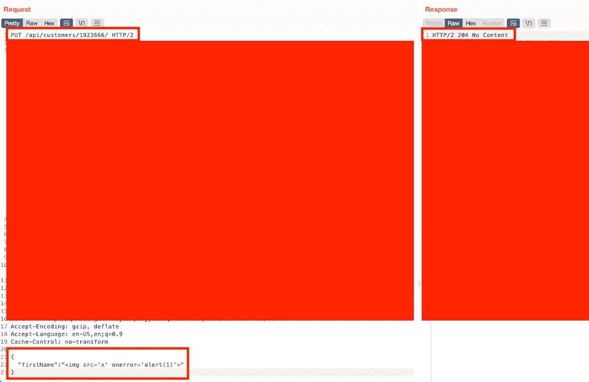
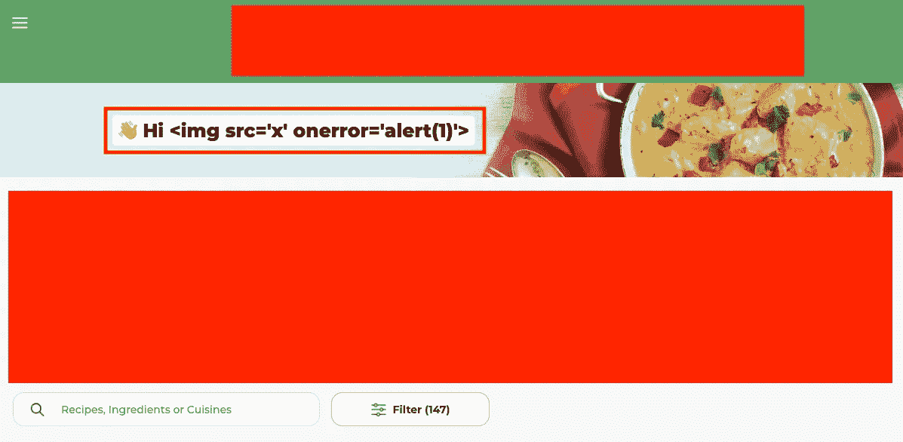
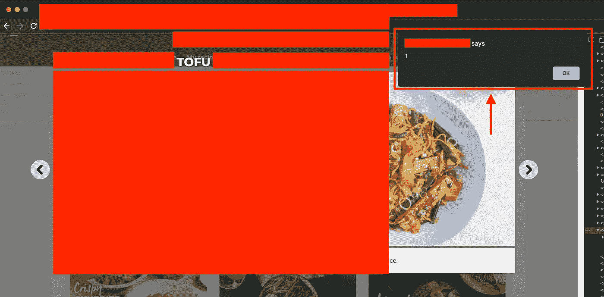

# [BugBounty]找到储存的 XSS 的提示

> 原文：<https://infosecwriteups.com/bugbounty-tips-to-find-stored-xss-9995814d353f?source=collection_archive---------0----------------------->



# 介绍

今天，我想分享一些简单快捷的方法来找到存储的 XSS(跨站点脚本)漏洞，以及我在 [HackerOne](https://hackerone.com/) 私人程序中报告的 2 个存储的 XSS 漏洞。

对于任何不熟悉 AppSec 或 Bug Bounty 的人来说，当应用程序接收到用户输入的数据，并将该数据保存在应用程序后来的 HTTP 响应中，并以不安全的方式呈现该数据时，就会发生存储 XSS(也称为持久 XSS)。例如，如果允许用户在 web 应用程序的注释部分输入任何数据，她可以在易受攻击的注释部分插入一个 XSS 负载，比如`<script>alert('XSS')</script>`。如果 web 应用程序按原样保存不受信任的用户提供的 XSS 有效负载，并且不进行任何清理就呈现它，则该有效负载将在访问受影响页面的任何其他用户的浏览器上执行。

# 1.寻找不同的渲染区域

很多时候，我试图使用手动方法来寻找 XSS 或 HTML 注入漏洞。例如，如果有一个用户输入字段，比如 profile 页面的用户名字段，我注入一个简单的有效负载，比如`<h1>test</h1>`，并检查应用程序中不同的呈现页面。如果幸运的话，你可以通过这种方式找到一个储存的 XSS。这是因为对于一个复杂的应用程序，开发人员很难对每个呈现页面强制执行相同的数据清理。

对于我的第一个存储的 XSS 例子，我用这个简单的方法获得了 1000 美元的奖金。目标应用程序是一个复杂的网络设备监控工具。在测试应用程序时，我发现用户输入字段“Device Name”在呈现时没有对 JavaScript 有效载荷(`<p onmouseover="alert(document.cookie)">payload</p>`)进行编码。


接下来，我开始寻找不同的渲染页面，这些页面将显示更新的设备名称，以查看它们如何显示注入的有效载荷。大多数页面都得到了适当的开发，它们仍然将注入的有效负载呈现为字符串值；然而，我发现一个显示**用户活动日志的区域**没有清理有效载荷，而是执行了 XSS 有效载荷。


# 2.通过 API 请求绕过数据清理

我找到的下一个存储的 XSS 是通过使用一个 API 请求发现的，该请求绕过 GUI 环境中的数据清理来注入 XSS 有效负载。受影响的应用程序是一个网站，用户可以在那里分享他们的食物食谱，并与其他用户进行评论。用户可以在注册过程中设置她的名字和姓氏，输入字段也只允许名字和姓氏使用字母数字字符。一旦设置了名称，用户就不能在个人资料页面中修改它们了(但是如果需要，用户可以更新电子邮件)。

当我进一步枚举用户配置文件信息的 API 端点时，我能够找到一个在`/api/customers/<Customer ID>`端点更新电子邮件的`PUT`请求:

```
PUT /api/customers/11119999/ HTTP/2 
Host: <REDACTED> ...snip... { 
    "email":"newEmail@email.com" 
}
```

所以我在想，如果我试图使用这个 API 来更改用户的名字或姓氏，我可能已经注入了一个 XSS 有效载荷，会怎么样呢？原来是我可以:)所以我注入了下面的 API 请求，将`email`改为`firstName`，应用程序用`204 No Content`响应:

```
PUT /api/customers/11119999/ HTTP/2 
Host: <REDACTED>...snip...{ 
    "firstName":"" 
}
```

> **204 无内容** —服务器已经完成请求，但是不需要返回实体主体，并且可能想要返回更新的元信息。



当我转到主页时，我可以看到我的名字现在已经成功地更改为 XSS 有效载荷，但是在那里它被视为一个字符串值。



但是你还记得我们第一个寻找不同渲染区域的方法吗？:)对，所以我的下一步是寻找显示用户名字的不同呈现页面。我发现用户可以对一个食谱发表评论，它会显示用户名字的评论。所以，我认为这可能是一个很好的地点来检查储存的 XSS。


一旦我把评论留给了评论，并重新访问了同一个菜谱，XSS 的有效负载就被执行了。



这个有效负载是为任何访问过这个菜谱的用户执行的，这个发现被程序归类为关键。

# 最终想法！

当做一个 Bug 赏金的时候，自动脚本或者扫描器不会永远是你的朋友。有时候，做一些手工测试来发现一些简单的问题会更好。感谢阅读！