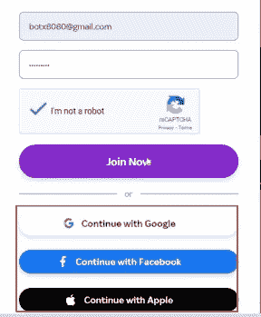
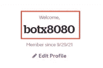
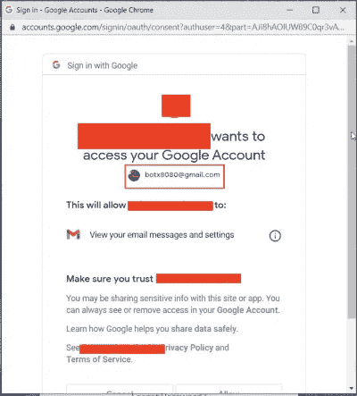
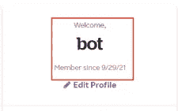
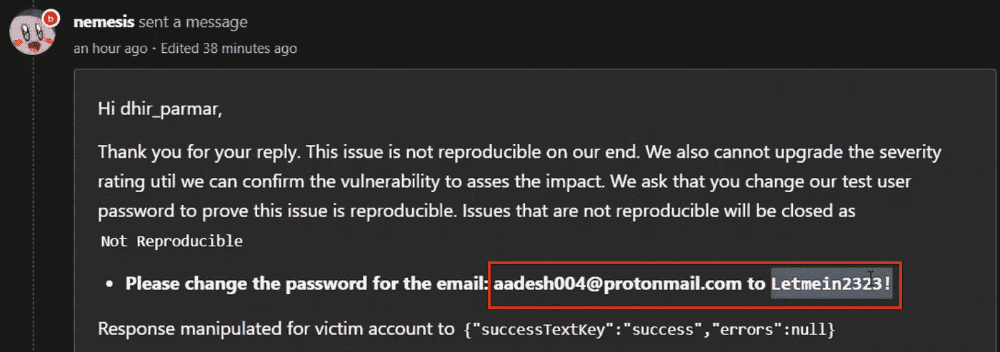
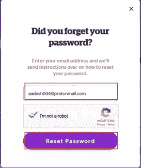
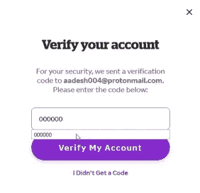
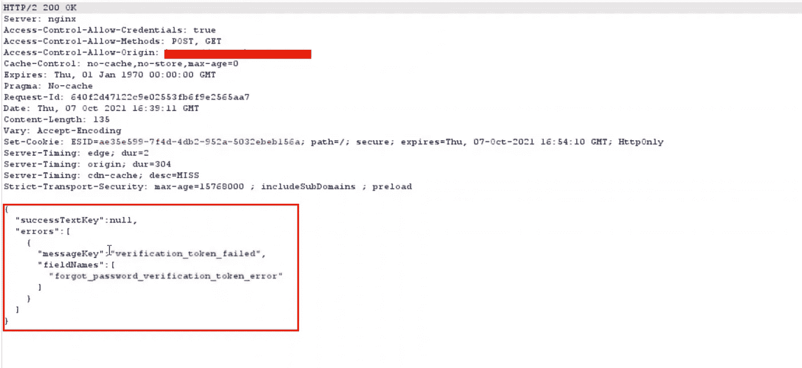
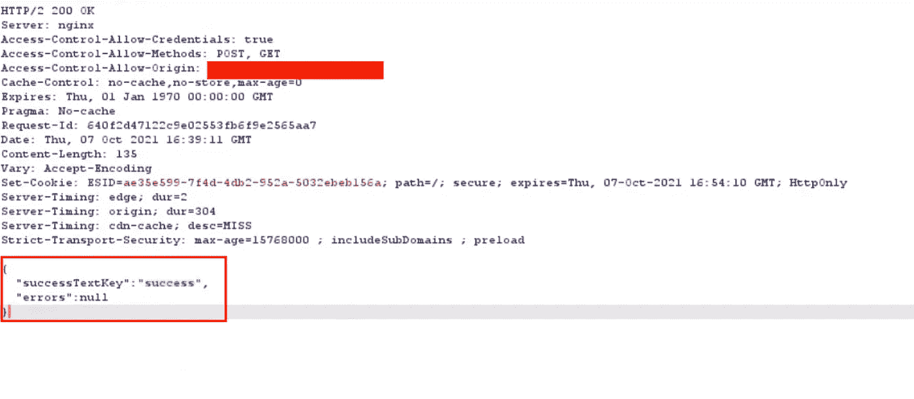
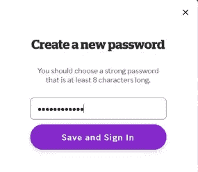

# bug crowd——多种错误配置的故事！！❌

> 原文：<https://infosecwriteups.com/bugcrowd-tale-of-multiple-misconfigurations-cb5b98f09302?source=collection_archive---------1----------------------->

欢迎阅读这篇新文章。这篇文章是关于在一个域上发现的错误配置的故事。因为这是一个私人项目，就叫它 redacted.com 吧，你想知道怎么做吗？？

应用程序的范围很大，但是从正常的子域扫描和所有那些花哨的侦察开始，我决定开始测试主应用程序。这个 web 应用程序是一个简单的电子商务网站，有很多交易可以抢！；)

我通常会尝试检查此类网站的各种业务逻辑漏洞，但这次我的眼睛捕捉到了认证机制。

所以第一件事就是创建一个帐户！但是我注意到的是 OAuth 机制。完美是时候检查各种 OAuth 漏洞了！！

电子邮件注册

所以我使用了来自 [Pentest Book](https://pentestbook.six2dez.com/enumeration/webservices/oauth#bugs) 的漂亮方法和我的第二个虚拟账户，开始检查 OAuth 漏洞，但是没有发现任何漏洞！

但是嘿！！基本的漏洞检查被遗忘了。我立即尝试用我的第一个虚拟账户创建一个 OAuth 账户，然后嘣，我用同一个电子邮件 ID 创建了两个账户。

使用电子邮件注册创建的帐户

使用同一电子邮件进行 OAUTH 登录

帐户接管前的 Oauth 配置错误

为了总结整个程序，执行了以下步骤:

1.  访问网站并点击注册。
2.  使用未注册的受害者电子邮件创建一个账户(比如 test@gmail.com 的
3.  使用 OAuth 机制和同一个 OAuth 帐户创建另一个帐户。

**影响:**
使用电子邮件和密码创建的帐户应该失效，但并没有失效，这意味着攻击者仍然可以使用他在使用电子邮件创建帐户时使用的凭据登录，从而导致帐户被预接管。

> ***完美！我抓到一个，我们去找更多的！这一次我的眼睛捕捉到了忘记密码的功能。***

***密码重置机制如下:***

1.  用户输入他的电子邮件。
2.  生成一个 6 位数的动态口令，并发送到用户的电子邮件中
3.  用户设置新密码。

太好了，让我们尝试绕过认证，看看我们是否能改变受害者的密码。因此，我输入了我的电子邮件并请求了一个动态口令，输入了错误的动态口令，捕获了响应并试图操纵响应，但没有成功。

但是我注意到应用程序正在使用 ajax 执行密码重置。

**AJAX** **通过在后台与服务器交换少量数据，允许网页异步更新。**

所以我是这样做的:

1.  转到登录页面，点击忘记密码
2.  输入攻击者的电子邮件地址(例如，我的电子邮件地址是 attacker@gmail.com)
3.  现在输入在 attacker@gmail.com 上收到的正确的 OTP，捕获响应并保存它。
4.  您将被重定向到设置新密码页面，但 DONT 再次设置密码，转到登录页面，然后单击忘记密码
5.  输入受害者的电子邮件，即 victim@gmail.com(在我们的案例中是 aadesh004@protonmail.com)

输入受害者电子邮件

6.输入随机 OTP，即 000000，使用 burp 拦截请求，并对该请求执行拦截>响应

输入随机 OTP

7.在响应中，将响应操作为:{"successTextKey":"success "，" errors":null}

生成的响应

响应操作

8.转发请求，您将被重定向到设置新密码。这一次设置密码和 boom 帐户接管。

设置新密码

账户接管

我们希望你喜欢这篇文章！一定要让我们知道你关于错误配置的故事！

狩猎愉快！

**作者:**

瓦伊巴夫·拉哈尼:【https://www.linkedin.com/in/vaibhav-lakhani】T4

[迪尔·帕尔马](https://www.linkedin.com/in/dhir-parmar-925b171a4):[https://www.linkedin.com/in/dhir-parmar-925b171a4](https://www.linkedin.com/in/dhir-parmar-925b171a4)

## 来自 Infosec 的报道:Infosec 每天都有很多内容，很难跟上。[加入我们的每周简讯](https://weekly.infosecwriteups.com/)以 5 篇文章、4 个线程、3 个视频、2 个 GitHub Repos 和工具以及 1 个工作提醒的形式免费获取所有最新的 Infosec 趋势！